# Quizploit

**Category:** Binary Exploitation
**Difficulty:** Easy
**Author:** Aditya Sudhansu

---

## Challenge Description

The challenge presents an ELF binary analysis quiz.

Instead of exploiting the binary directly, the goal is to analyze the provided C source code and compiled ELF binary, then answer 13 questions correctly to retrieve the flag.

The quiz asks about:

* ELF architecture
* Linking type
* Stripping status
* Buffer size
* Input size
* Buffer overflow vulnerability
* Enabled binary protections
* NX bypass technique
* Address of the `win()` function

---

## Source Code Overview

The provided C source code contains three functions:

```c
void win(){
        system("cat flag.txt");
}

void vuln(){
        char buffer[0x15] = {0};
        fprintf(stdout, "\nEnter payload: ");
        fgets(buffer, 0x90, stdin);
}

void main(){
        vuln();
}
```

The most important part is inside `vuln()`:

```c
char buffer[0x15] = {0};
fgets(buffer, 0x90, stdin);
```

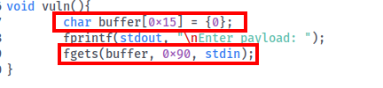

The buffer is only `0x15` bytes, but `fgets()` is allowed to read up to `0x90` bytes. This creates a buffer overflow condition.

---

## ELF Information

To answer the first questions, I used the `file` command:

```bash
file vuln
```

The output showed that the binary is:

```text
ELF 64-bit
dynamically linked
not stripped
```

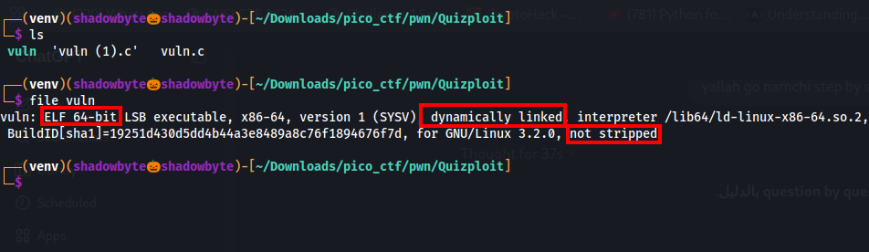

Therefore:

```text
Architecture: 64-bit
Linking: dynamically linked
Stripped: not stripped
```

---

## Buffer Overflow Analysis

The vulnerable function is:

```c
void vuln(){
        char buffer[0x15] = {0};
        fprintf(stdout, "\nEnter payload: ");
        fgets(buffer, 0x90, stdin);
}
```

The buffer size is:

```text
0x15 bytes
```

The input size passed to `fgets()` is:

```text
0x90 bytes
```

Since `0x90` is greater than `0x15`, the program can write more data than the buffer can hold.

This means the binary contains a buffer overflow vulnerability.

---

## External Reference: Buffer Overflow

According to CWE-120, a classic buffer overflow occurs when input is copied into a buffer without verifying that the input size is smaller than the destination buffer size.

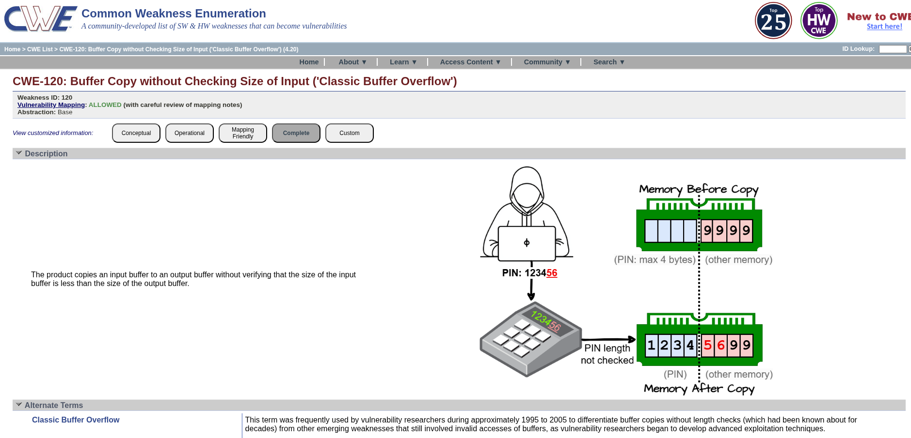

This matches the challenge source code:

```text
Destination buffer size: 0x15
Input size:              0x90
```

The impact of such a vulnerability can include memory corruption and unauthorized code execution.

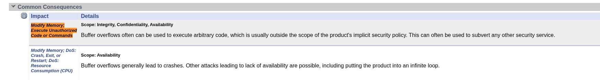

I also used a general buffer overflow reference to explain the concept.

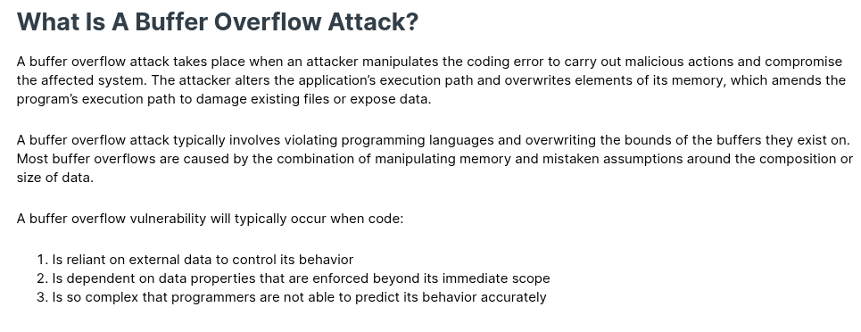

---

## Calculating Possible Overflow Size

The quiz asks how many bytes of overflow are possible.

The calculation is:

```text
input size - buffer size
```

So:

```text
0x90 - 0x15 = 0x7b
```

Using a hexadecimal calculator:

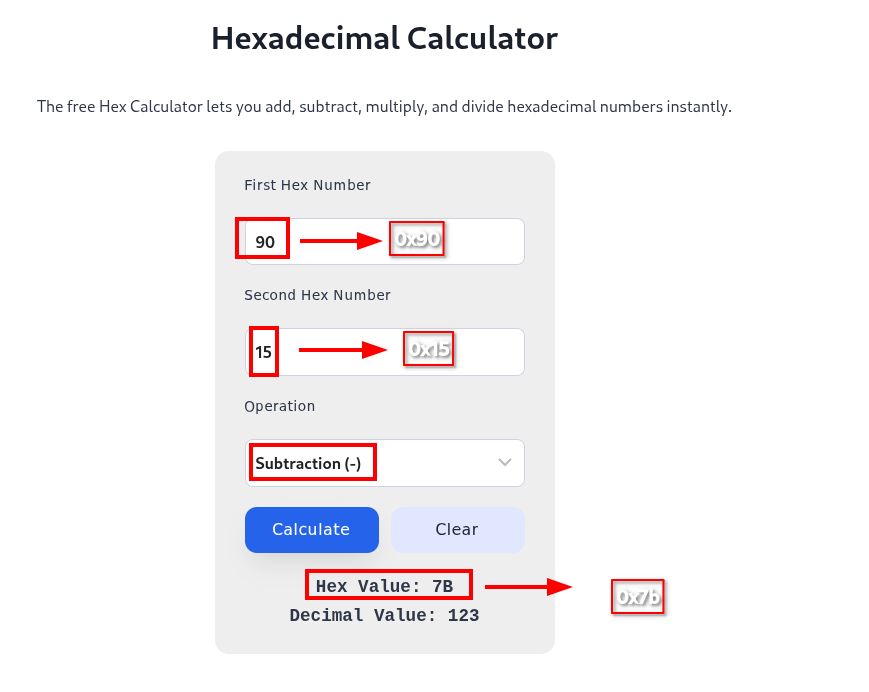

Therefore, the possible overflow size is:

```text
0x7b bytes
```

---

## Uncalled Function

The source code contains a `win()` function:

```c
void win(){
        system("cat flag.txt");
}
```

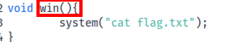

However, `main()` only calls `vuln()`:

```c
void main(){
        vuln();
}
```

There is no normal call to `win()` anywhere in the program.

Therefore, the uncalled function is:

```text
win
```

This is a common CTF pattern: a vulnerable function exists, and a hidden `win()` function can be reached by controlling execution flow.

---

## Binary Protections

To inspect the binary protections, I used `checksec`:

```bash
checksec --file=./vuln
```

The output showed:

```text
NX: NX enabled
```

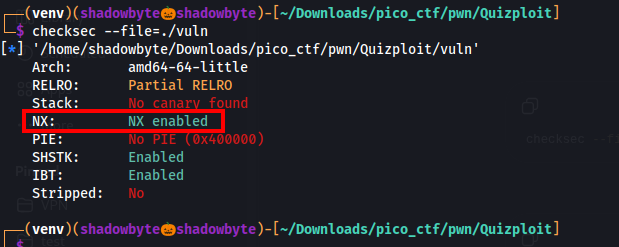

Therefore, the enabled protection asked by the quiz is:

```text
NX
```

NX means that certain memory regions, such as the stack, are marked as non-executable.

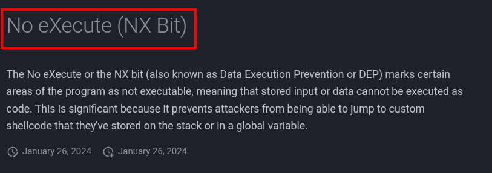

Because NX is enabled, injected shellcode on the stack cannot be executed directly.

---

## NX Bypass Technique

Since NX prevents executing injected shellcode from the stack, the correct bypass technique is Return-Oriented Programming.

Return-Oriented Programming, or ROP, reuses existing executable code snippets called gadgets instead of injecting new shellcode.

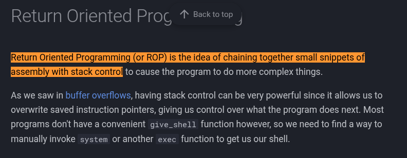

Another reference explains that ROP works by controlling the stack and chaining existing code snippets.

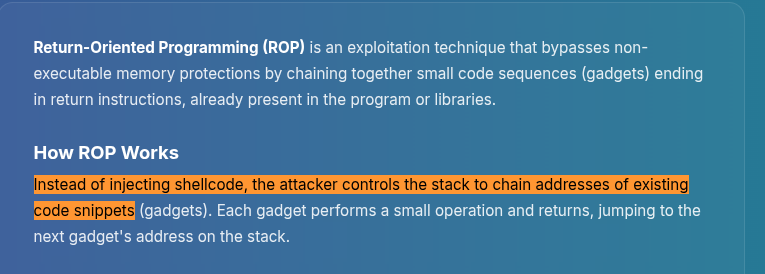

Therefore, the exploitation technique that could bypass NX is:

```text
ROP
```

---

## Finding the Address of `win()`

To find the address of `win()`, I used `objdump`:

```bash
objdump -d ./vuln | grep -A5 '<win>'
```

The output showed:

```text
0000000000401176 <win>:
```

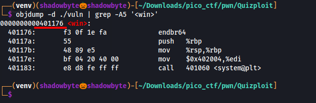

Therefore, the address of `win()` is:

```text
0x401176
```

---

## Final Answers

| Question | Evidence                                        | Answer            |
| -------- | ----------------------------------------------- | ----------------- |
| `0x1`    | `file vuln` shows `ELF 64-bit`                  | `64-bit`          |
| `0x2`    | `file vuln` shows `dynamically linked`          | `dynamic`         |
| `0x3`    | `file vuln` shows `not stripped`                | `not stripped`    |
| `0x4`    | `char buffer[0x15]`                             | `0x15`            |
| `0x5`    | `fgets(buffer, 0x90, stdin)`                    | `0x90`            |
| `0x6`    | input size `0x90` > buffer size `0x15`          | `yes`             |
| `0x7`    | vulnerable C function used for input            | `fgets`           |
| `0x8`    | `win()` exists but is never called              | `win`             |
| `0x9`    | oversized input into small buffer               | `buffer overflow` |
| `0xa`    | `0x90 - 0x15`                                   | `0x7b`            |
| `0xb`    | `checksec` shows `NX enabled`                   | `NX`              |
| `0xc`    | NX prevents stack shellcode, ROP reuses gadgets | `ROP`             |
| `0xd`    | `objdump` shows `0000000000401176 <win>`        | `0x401176`        |

---

## Remote Interaction

After collecting all answers, I connected to the remote service:

```bash
nc lonely-island.picoctf.net 51631
```

Then I answered the 13 questions in order.

```text
64-bit
dynamic
not stripped
0x15
0x90
yes
fgets
win
buffer overflow
0x7b
NX
ROP
0x401176
```

After answering all questions correctly, the service returned the flag.

---

## Tools Used

```text
file
checksec
objdump
Hex calculator
Source code review
CWE-120 reference
NX / ROP references
netcat
```

---

## Key Takeaways

* `file` is useful for quickly identifying ELF architecture, linking type, and stripping status.
* Source code review can reveal buffer sizes and unsafe input handling.
* A buffer overflow exists when the program can write more data than the destination buffer can hold.
* `checksec` helps identify binary protections such as NX.
* NX prevents executing shellcode directly from the stack.
* ROP can bypass NX by reusing existing executable code snippets.
* `objdump` can be used to find function addresses such as `win()`.

---

## Final Flag

```text
picoCTF{...REDACTED...}
```
