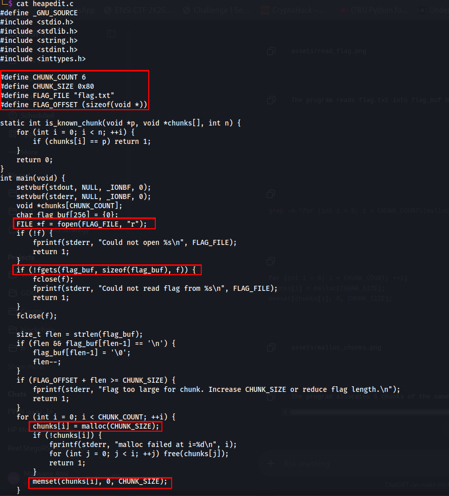
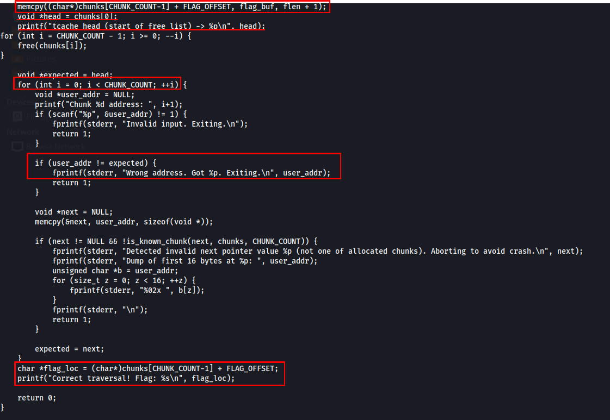
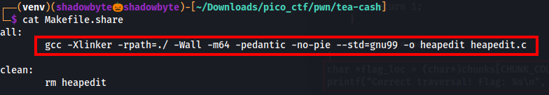
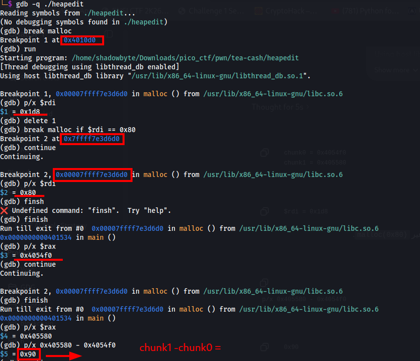
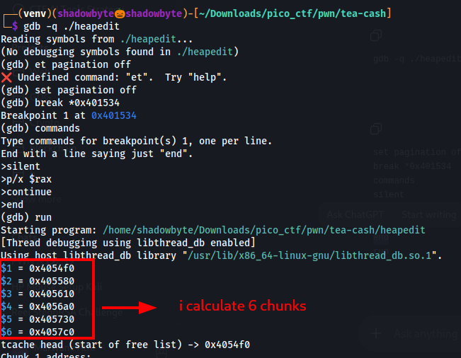
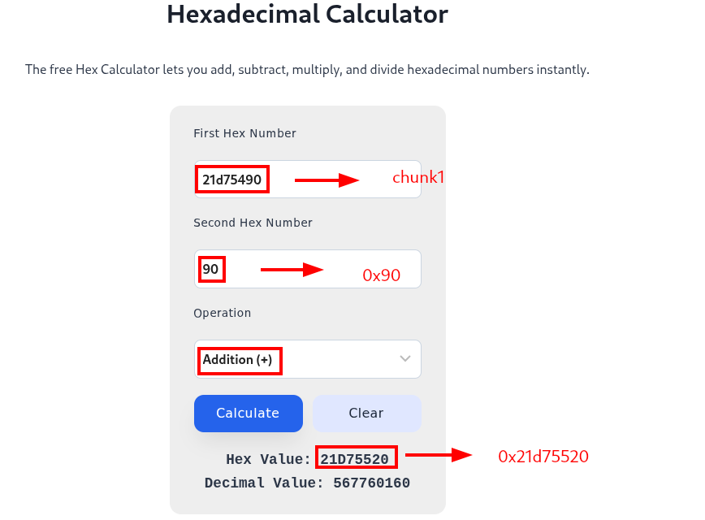
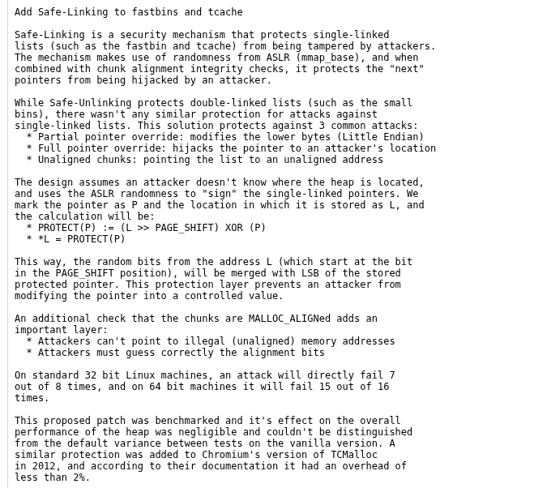
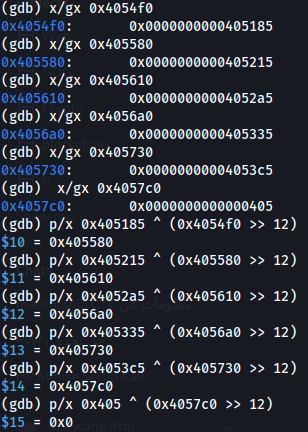
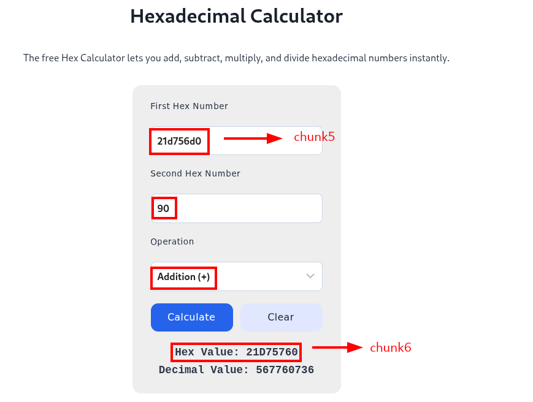
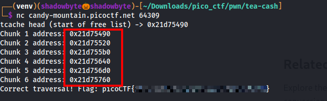

# tea-cash

**Category:** Binary Exploitation
**Difficulty:** Medium
**Author:** Aditya Sudhansu

---

## Challenge Description

The challenge gives us a mysterious cash register that stores secrets in memory.

```text
You’ve stumbled upon a mysterious cash register that doesn’t keep money —
it keeps secrets in memory. Traverse the free list and find all the free chunks
to get to the flag.
```

The hint mentions GLIBC `tcache`, so the goal is not a classic buffer overflow.
Instead, we need to understand how freed heap chunks are linked together inside the tcache free list.

---

## Source Code Analysis

The source code defines several important constants:

```c
#define CHUNK_COUNT 6
#define CHUNK_SIZE 0x80
#define FLAG_FILE "flag.txt"
#define FLAG_OFFSET (sizeof(void *))
```



The program uses:

```c
CHUNK_COUNT = 6
CHUNK_SIZE  = 0x80
```

So it allocates six heap chunks, each with a requested user size of `0x80`.

The program also opens `flag.txt` and reads the flag into `flag_buf`:

```c
FILE *f = fopen(FLAG_FILE, "r");
fgets(flag_buf, sizeof(flag_buf), f);
```

After that, it allocates the six chunks:

```c
for (int i = 0; i < CHUNK_COUNT; ++i) {
    chunks[i] = malloc(CHUNK_SIZE);
    memset(chunks[i], 0, CHUNK_SIZE);
}
```

The flag is copied into the last allocated chunk:

```c
memcpy((char*)chunks[CHUNK_COUNT-1] + FLAG_OFFSET, flag_buf, flen + 1);
```

Since `CHUNK_COUNT` is `6`, the flag is stored inside:

```text
chunks[5] + FLAG_OFFSET
```

---

## Traversal Logic

The key part of the challenge is the free list logic.

```c
void *head = chunks[0];
printf("tcache head (start of free list) -> %p\n", head);

for (int i = CHUNK_COUNT - 1; i >= 0; --i) {
    free(chunks[i]);
}
```



The program first stores:

```c
head = chunks[0];
```

Then it frees the chunks in reverse order:

```text
free(chunks[5])
free(chunks[4])
free(chunks[3])
free(chunks[2])
free(chunks[1])
free(chunks[0])
```

Since tcache uses a LIFO singly-linked list, the last freed chunk becomes the head of the free list.

Therefore, the expected tcache list is:

```text
chunks[0] -> chunks[1] -> chunks[2] -> chunks[3] -> chunks[4] -> chunks[5] -> NULL
```

The program then asks the user to enter each chunk address.

```c
void *expected = head;

for (int i = 0; i < CHUNK_COUNT; ++i) {
    void *user_addr = NULL;
    printf("Chunk %d address: ", i+1);
    scanf("%p", &user_addr);

    if (user_addr != expected) {
        fprintf(stderr, "Wrong address. Got %p. Exiting.\n", user_addr);
        return 1;
    }

    void *next = NULL;
    memcpy(&next, user_addr, sizeof(void *));
    expected = next;
}
```

The program starts with `expected = head`, checks the address we provide, then reads the first pointer stored inside the freed chunk to find the next expected chunk.

If all six addresses are correct, it prints the flag:

```c
char *flag_loc = (char*)chunks[CHUNK_COUNT-1] + FLAG_OFFSET;
printf("Correct traversal! Flag: %s\n", flag_loc);
```

---

## Makefile Review

The provided Makefile shows the compilation flags:

```makefile
gcc -Xlinker -rpath=./ -Wall -m64 -pedantic -no-pie --std=gnu99 -o heapedit heapedit.c
```



Important flags:

```text
-m64      -> 64-bit binary
-no-pie   -> non-PIE binary
-rpath=./ -> use local shared library path
```

For this challenge, the important concept is heap behavior rather than code address randomization.

---

## Finding the Chunk Layout with GDB

To understand the heap layout, I used GDB and stopped only on `malloc(0x80)` calls.

At first, a normal `break malloc` caught other internal libc allocations.
So I used a conditional breakpoint:

```gdb
break malloc if $rdi == 0x80
```

On x86_64 Linux, the first argument to `malloc(size)` is passed in `rdi`.

After stopping at `malloc(0x80)`, I used:

```gdb
finish
p/x $rax
```

`$rax` contains the return value of `malloc`, which is the user pointer returned to the program.



The first two chunk addresses were:

```text
chunk0 = 0x4054f0
chunk1 = 0x405580
```

Then I calculated the difference:

```gdb
p/x 0x405580 - 0x4054f0
```

The result was:

```text
0x90
```

This confirms that the user pointers are separated by `0x90`.

The requested size is `0x80`, and the extra `0x10` corresponds to heap chunk metadata/alignment.

```text
0x80 + 0x10 = 0x90
```

---

## Calculating the Six Chunks

Using GDB, I printed all six chunk addresses returned by the six `malloc(0x80)` calls.



The six chunks were:

```text
chunk0 = 0x4054f0
chunk1 = 0x405580
chunk2 = 0x405610
chunk3 = 0x4056a0
chunk4 = 0x405730
chunk5 = 0x4057c0
```

The program also printed:

```text
tcache head (start of free list) -> 0x4054f0
```

This matches `chunks[0]`.

---

## Inspecting Freed Tcache Pointers

After the chunks were freed, I inspected the first 8 bytes of each freed chunk:

```gdb
x/gx 0x4054f0
x/gx 0x405580
x/gx 0x405610
x/gx 0x4056a0
x/gx 0x405730
x/gx 0x4057c0
```



The values did not appear as raw next pointers.

For example:

```text
0x4054f0: 0x405185
```

I expected the first chunk to point to:

```text
0x405580
```

but the stored value was different.

This happens because my local GLIBC uses Safe-Linking.

---

## Safe-Linking Reference

GLIBC Safe-Linking protects singly-linked lists such as fastbins and tcache by encoding their `next` pointers.

Official GLIBC Safe-Linking commit:

```text
https://sourceware.org/legacy-ml/glibc-cvs/current/069221.html
```

The commit explains that Safe-Linking protects singly-linked lists such as fastbins and tcache, and uses the following idea:

```text
PROTECT(P) := (L >> PAGE_SHIFT) XOR (P)
*L = PROTECT(P)
```



In other words, the stored tcache pointer is encoded.
To recover the real next pointer locally, I used:

```text
real_next = stored_value ^ (chunk_address >> 12)
```

---

## Decoding the Tcache List

Using the Safe-Linking formula, I decoded the stored pointers in GDB:

```gdb
p/x 0x405185 ^ (0x4054f0 >> 12)
p/x 0x405215 ^ (0x405580 >> 12)
p/x 0x4052a5 ^ (0x405610 >> 12)
p/x 0x405335 ^ (0x4056a0 >> 12)
p/x 0x4053c5 ^ (0x405730 >> 12)
p/x 0x405 ^ (0x4057c0 >> 12)
```



The decoded results were:

```text
0x405580
0x405610
0x4056a0
0x405730
0x4057c0
0x0
```

So the decoded free list is:

```text
0x4054f0 -> 0x405580 -> 0x405610 -> 0x4056a0 -> 0x405730 -> 0x4057c0 -> NULL
```

This confirms the expected traversal:

```text
chunks[0] -> chunks[1] -> chunks[2] -> chunks[3] -> chunks[4] -> chunks[5]
```

---

## Remote Exploitation Strategy

The remote program prints the tcache head:

```text
tcache head (start of free list) -> HEAD
```

Since the chunks are allocated consecutively with a spacing of `0x90`, the six addresses can be calculated as:

```text
chunk0 = HEAD
chunk1 = HEAD + 0x90
chunk2 = HEAD + 0x120
chunk3 = HEAD + 0x1b0
chunk4 = HEAD + 0x240
chunk5 = HEAD + 0x2d0
```

The program asks for:

```text
Chunk 1 address:
Chunk 2 address:
Chunk 3 address:
Chunk 4 address:
Chunk 5 address:
Chunk 6 address:
```

So the addresses must be entered in allocation order:

```text
chunk0
chunk1
chunk2
chunk3
chunk4
chunk5
```

---

## Manual Hex Calculation

On the remote instance, the leaked head was:

```text
0x21d75490
```

I used a hexadecimal calculator to add `0x90` repeatedly.



Example:

```text
0x21d75490 + 0x90 = 0x21d75520
```

Continuing this calculation gives the six addresses:

```text
Chunk 1 = 0x21d75490
Chunk 2 = 0x21d75520
Chunk 3 = 0x21d755b0
Chunk 4 = 0x21d75640
Chunk 5 = 0x21d756d0
Chunk 6 = 0x21d75760
```

---

## Getting the Flag

I connected to the remote service:

```bash
nc candy-mountain.picoctf.net 64309
```

Then I entered the six chunk addresses in order:

```text
0x21d75490
0x21d75520
0x21d755b0
0x21d75640
0x21d756d0
0x21d75760
```



The program accepted the traversal and printed the flag:

```text
Correct traversal! Flag: picoCTF{...}
```

---

## Solution Summary

```text
1. Read the source code.
2. Identify CHUNK_COUNT = 6 and CHUNK_SIZE = 0x80.
3. Notice that the flag is copied into chunks[5] + FLAG_OFFSET.
4. Notice that the program leaks chunks[0] as the tcache head.
5. Observe that chunks are freed from chunks[5] down to chunks[0].
6. Since tcache is LIFO, the free list becomes:
   chunks[0] -> chunks[1] -> chunks[2] -> chunks[3] -> chunks[4] -> chunks[5]
7. Use GDB to confirm that consecutive chunks are separated by 0x90.
8. Observe Safe-Linking locally and decode the tcache pointers.
9. On the remote service, take the leaked tcache head.
10. Add 0x90 repeatedly to compute all six chunk addresses.
11. Enter all six addresses in order.
12. Receive the flag.
```

---

## Resources

* GLIBC Safe-Linking commit:
  https://sourceware.org/legacy-ml/glibc-cvs/current/069221.html

* GLIBC Safe-Linking mirror with diff:
  https://git.zx2c4.com/glibc/commit/?id=a1a486d70ebcc47a686ff5846875eacad0940e41

* CTF Wiki — tcache attacks:
  https://ctf-wiki.org/en/pwn/linux/user-mode/heap/ptmalloc2/tcache-attack/

---

## Tools Used

```text
GDB
Hexadecimal calculator
Source code review
Netcat
GLIBC Safe-Linking reference
```

---

## Key Takeaways

* Tcache free lists are singly linked lists.
* Freed tcache chunks store a `next` pointer in the user-data area.
* Tcache uses LIFO behavior.
* If chunks of the same size are allocated consecutively, their user pointers often have a constant spacing.
* For a `malloc(0x80)` request on this setup, the user pointers were separated by `0x90`.
* Newer GLIBC versions use Safe-Linking to encode tcache next pointers.
* Safe-Linking can be decoded locally with:

```text
real_next = stored_value ^ (chunk_address >> 12)
```

* The challenge can be solved by calculating the six chunk addresses from the leaked head and entering them in the correct free-list order.

---

## Final Flag

```text
picoCTF{...REDACTED...}
```
