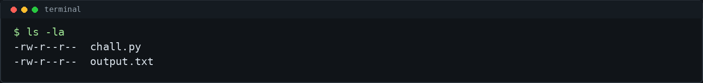
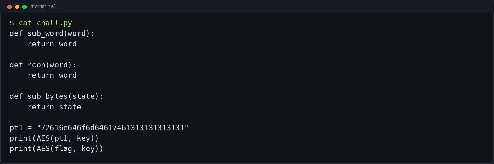
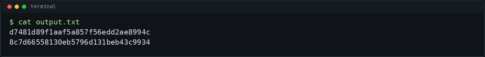
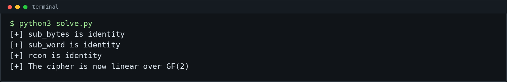
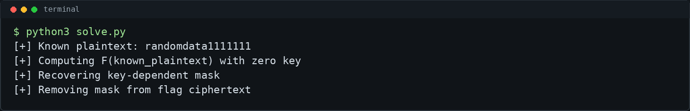
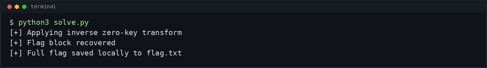
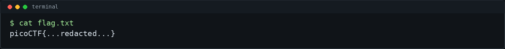

# Black Cobra Pepper - picoCTF 2026 Writeup

## Challenge Metadata

- **Category:** Cryptography
- **Difficulty:** Medium
- **Authors:** Philip Thayer & Cayden Liao
- **Description:** "i like peppers. (change!)"
- **Hints:**
  1. Does this remind you of any other popular encryption?
  2. What purpose does the s-box serve?
- **Given files:**
  - `chall.py`
  - `output.txt`

## 1. Challenge Overview

Black Cobra Pepper is a CTF/lab cryptography challenge built around a custom AES-like block cipher. The source code strongly resembles AES: it has round keys, `SubBytes`, `ShiftRows`, `MixColumns`, and a key schedule.

The important difference is that the nonlinear AES pieces have been removed. Because of that, this challenge is not an attack on real AES. It is an attack on a weakened AES-like implementation where the S-box behavior has been replaced with identity functions.

## 2. Given Files

The challenge gives us the encryption program and an output file with two ciphertext blocks:



- `chall.py` contains the custom cipher.
- `output.txt` contains:
  - the encryption of a known plaintext block
  - the encryption of the flag block

The known plaintext is hardcoded in the source:

```text
72616e646f6d64617461313131313131
```

That hex decodes to:

```text
randomdata1111111
```

## 3. Source Code Analysis

The most important lines are the identity functions:



```python
def sub_word(word):
    return word

def rcon(word):
    return word

def sub_bytes(state):
    return state
```

The program then prints:

```python
print(AES(pt1, key))
print(AES(flag, key))
```

So we have one known plaintext/ciphertext pair and one target ciphertext encrypted under the same key.

## 4. AES-Like Structure

The cipher follows the general shape of AES:

```text
AddRoundKey
SubBytes
ShiftRows
MixColumns
round key generation
```

The output values are:



In real AES, these operations are carefully combined. `ShiftRows` and `MixColumns` spread byte influence across the block, while `SubBytes` provides nonlinearity through the S-box.

## 5. The Missing S-Box Problem

The S-box is the part of AES that prevents the whole cipher from being represented as a simple linear transformation. In this challenge, `sub_bytes(state)` returns the state unchanged:

```python
def sub_bytes(state):
    return state
```

The key schedule also loses important nonlinear behavior:

```python
def sub_word(word):
    return word

def rcon(word):
    return word
```

That means both encryption rounds and round-key generation are missing the nonlinear components that real AES relies on.



## 6. Why the Cipher Becomes Linear

After removing the S-box behavior, the remaining operations are linear over GF(2):

- XOR in `AddRoundKey` is linear.
- `ShiftRows` only permutes bytes.
- `MixColumns` is a linear matrix operation over the AES finite field.
- The modified key schedule is also linear because `sub_word` and `rcon` are identity functions.

So encryption can be viewed as:

```text
ciphertext = F(plaintext) XOR mask
```

Here, `F` is the zero-key version of the cipher's linear round transformation, and `mask` is the key-dependent part. We do not need to recover the original AES key.

## 7. Known Plaintext Attack

The same key is used for both printed ciphertexts:

```text
C_known = F(P_known) XOR mask
C_flag  = F(P_flag)  XOR mask
```

Because `P_known` and `C_known` are known, we can recover the mask:

```text
mask = C_known XOR F(P_known)
```

Then we remove that mask from the flag ciphertext:

```text
F(P_flag) = C_flag XOR mask
```



## 8. Recovering the Flag

Once we have `F(P_flag)`, we apply the inverse of the zero-key transform:

```text
P_flag = F_inverse(C_flag XOR mask)
```

The inverse transform reverses the final `ShiftRows`, then reverses the 9 main rounds with inverse `MixColumns` and inverse `ShiftRows`.



The solver saves the full recovered flag locally to `flag.txt`, which is ignored by Git. Public writeups and screenshots stay redacted.

## 9. Final Exploit Script

The included [`solve.py`](solve.py) script:

- finds `output.txt`, `output`, or a `.txt` file containing two 32-hex-character ciphertext lines
- uses the known plaintext `randomdata1111111`
- reimplements the zero-key linear transform `F`
- recovers the key-dependent mask from the known plaintext/ciphertext pair
- removes that mask from the flag ciphertext
- applies the inverse zero-key transform
- saves the full flag locally to `flag.txt`
- prints only `picoCTF{...redacted...}` by default

Run it in redacted mode:

```bash
python3 solve.py
```

To print the full flag locally:

```bash
python3 solve.py --show-flag
```

## 10. Commands Used

```bash
ls -la
cat chall.py
cat output.txt
python3 solve.py
python3 solve.py --show-flag
./solve.sh
```

The attack in short:

```text
Known:
P1 = randomdata1111111
C1 = encryption of P1
C2 = encryption of flag

Because the cipher is linear:
C1 = F(P1) XOR mask
C2 = F(flag) XOR mask

Therefore:
mask = C1 XOR F(P1)
F(flag) = C2 XOR mask
flag = F_inverse(C2 XOR mask)
```

## 11. Final Flag

```text
picoCTF{...redacted...}
```



## 12. Lessons Learned

- This does not break real AES.
- The challenge breaks because this custom AES-like cipher removed the S-box behavior.
- In real AES, the S-box provides essential nonlinearity.
- XOR, `ShiftRows`, and `MixColumns` alone are not enough to resist linear attacks.
- A known plaintext/ciphertext pair can cancel the reused key-dependent mask in this weakened construction.
- Public CTF writeups should redact flags and avoid publishing sensitive local outputs.
