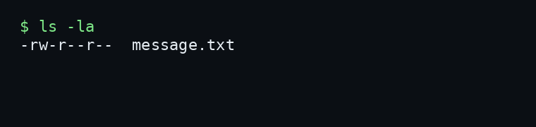
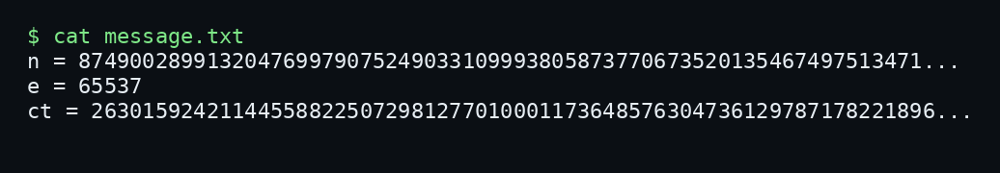
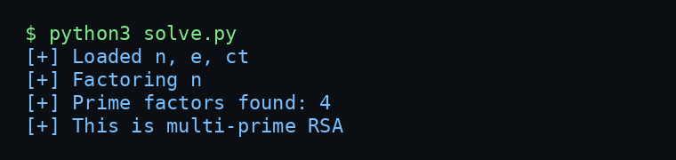
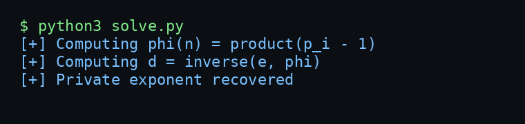
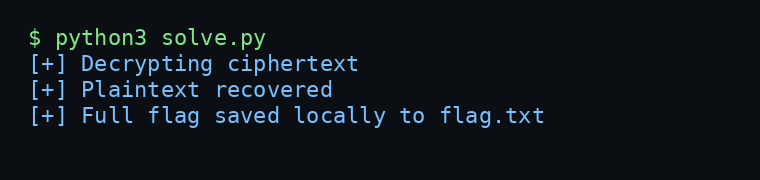
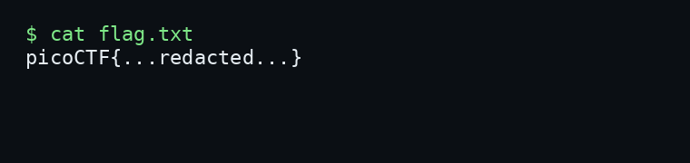

# ClusterRSA - picoCTF 2026 Writeup

## Challenge Metadata

| Field | Value |
| --- | --- |
| Category | Cryptography |
| Difficulty | Medium |
| Author | Yahaya Meddy |
| Description | A message has been encrypted using RSA, but this time something feels... more crowded than usual. Can you decrypt it? |
| Hints | 1. RSA usually means two primes... but what if someone got greedy?<br>2. Prime factors decomposition |
| Given files | `message.txt` |

## 1. Challenge Overview

ClusterRSA is an RSA challenge from a CTF/lab environment. The public file gives a modulus `n`, public exponent `e`, and ciphertext `ct`.

The important clue is in the wording and hints. RSA commonly uses a modulus made from two primes, but this challenge is "more crowded" and asks us to think about prime factor decomposition. That points to multi-prime RSA.



## 2. Given Files

The challenge provides one file:

- `message.txt`, containing the public RSA values `n`, `e`, and `ct`.

The goal is to recover the plaintext message from those public values.



## 3. First Look

The file contains:

```text
n = 8749002899132047699790752490331099938058737706735201354674975134719667510377522805717156720453193651
e = 65537
ct = 2630159242114455882250729812770100011736485763047361297871782218963814793905003742546116295910618429
```

The public exponent `65537` is normal for RSA, so the exponent itself is not the issue. The modulus is the interesting part.

## 4. Why This RSA Is Different

RSA itself is not broken here. The weakness is the structure of the modulus and the fact that it can be factored in this CTF challenge.

In standard textbook RSA, the modulus is usually:

```text
n = p * q
```

where `p` and `q` are two large primes. The private key depends on:

```text
phi(n) = (p - 1) * (q - 1)
```

Here, factoring `n` shows that it is not built from only two primes.

## 5. Multi-Prime RSA

For a multi-prime RSA modulus:

```text
n = p1 * p2 * p3 * ... * pk
```

The Euler totient is:

```text
phi(n) = product(p_i - 1)
```

More generally, if a prime appears with exponent `a`, the term is:

```text
(p - 1) * p^(a - 1)
```

In this challenge, each prime factor appears once, so `phi(n)` is just the product of each factor minus one.

## 6. Factoring the Modulus

The hint says "Prime factors decomposition", so the first real step is factoring `n`.



Factoring finds four prime factors. That confirms this is multi-prime RSA, not the usual two-prime setup.

## 7. Computing phi(n)

Once all prime factors are known, computing `phi(n)` is straightforward:

```python
phi = 1
for p, exp in factors.items():
    phi *= (p - 1) * (p ** (exp - 1))
```

For this challenge, there are four distinct primes, so the formula becomes:

```text
phi(n) = (p1 - 1) * (p2 - 1) * (p3 - 1) * (p4 - 1)
```

## 8. Recovering the Private Exponent

After computing `phi(n)`, the private exponent is recovered with the modular inverse:

```text
d = e^(-1) mod phi(n)
```

In Python:

```python
d = mod_inverse(e, phi)
```



The full private exponent is intentionally not shown in this writeup.

## 9. Decrypting the Ciphertext

With `d` recovered, decryption is normal RSA:

```text
m = c^d mod n
```

In Python:

```python
m = pow(ct, d, n)
```

The result is a plaintext integer, so the last step is converting it back to bytes:

```python
flag = m.to_bytes((m.bit_length() + 7) // 8, "big")
```



## 10. Final Exploit Script

The included `solve.py` script:

- Parses `message.txt`.
- Factors `n` with `sympy.factorint`.
- Falls back to the known factor list if factoring is unavailable or times out.
- Computes `phi(n)` for all prime factors.
- Recovers `d`.
- Decrypts `ct`.
- Saves the full flag locally to `flag.txt`.
- Prints only a redacted flag by default.

Run:

```bash
python3 solve.py
```

To print the full flag locally:

```bash
python3 solve.py --show-flag
```

The full flag should not be committed or published.

## 11. Commands Used

```bash
ls -la
cat message.txt
python3 solve.py
python3 solve.py --show-flag
./solve.sh
```

The same commands are also recorded in `commands.txt`.

## 12. Final Flag



```text
picoCTF{...redacted...}
```

The full flag is intentionally not published in this writeup.

## 13. Lessons Learned

- RSA itself was not broken in this challenge.
- The weakness was that the modulus could be factored.
- Standard RSA often uses two primes, but RSA can be built from more than two primes.
- For multi-prime RSA, `phi(n)` must include every prime factor.
- Once all prime factors of `n` are known, recovering `d` and decrypting are standard RSA steps.
- Public CTF writeups should redact full flags and private key material.
