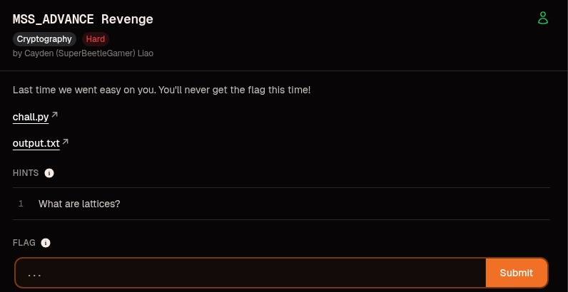
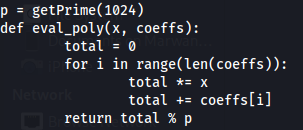
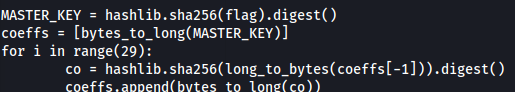
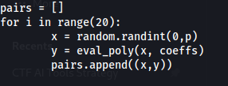
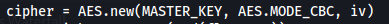
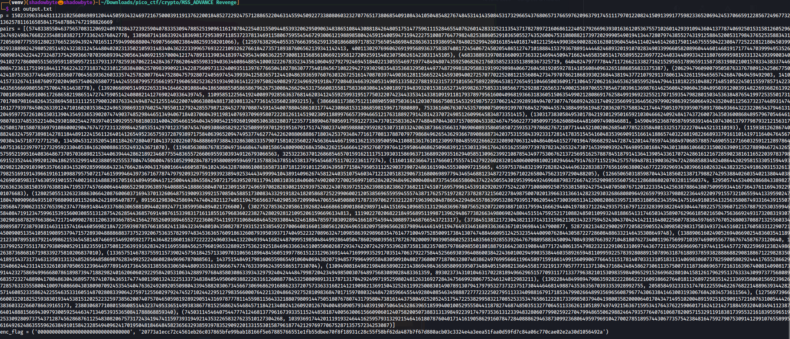
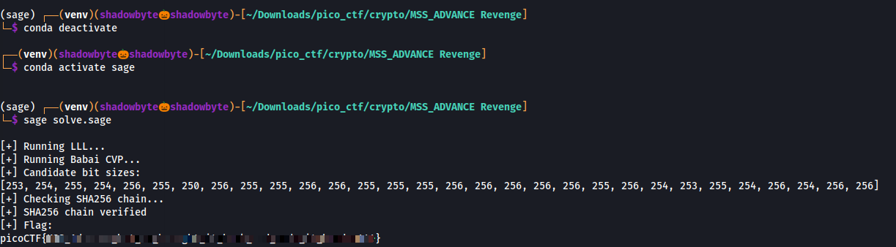

# MSS_ADVANCE Revenge

**Category:** Cryptography  
**Difficulty:** Hard  
**Author:** Cayden (SuperBeetleGamer) Liao

## Challenge Description

Last time we went easy on you. You'll never get the flag this time!

The challenge provides:

- `chall.py`
- `output.txt`

Hint:

> What are lattices?



---

# Initial Analysis

Opening `chall.py`, we immediately notice that a large prime modulus is generated:



```python
p = getPrime(1024)

def eval_poly(x, coeffs):
    total = 0

    for i in range(len(coeffs)):
        total *= x
        total += coeffs[i]

    return total % p
```

This function evaluates a polynomial modulo a 1024-bit prime.

The challenge revolves around recovering the hidden polynomial coefficients used to generate the provided points.

---

# Understanding The Coefficients

The next interesting section is the coefficient generation:



```python
MASTER_KEY = hashlib.sha256(flag).digest()

coeffs = [bytes_to_long(MASTER_KEY)]

for i in range(29):
    co = hashlib.sha256(long_to_bytes(coeffs[-1])).digest()
    coeffs.append(bytes_to_long(co))
```

The polynomial contains 30 coefficients.

The first coefficient is directly derived from the flag:

```text
c0 = MASTER_KEY
```

The remaining coefficients are generated through a SHA256 chain:

```text
c1 = SHA256(c0)
c2 = SHA256(c1)
...
c29 = SHA256(c28)
```

Since every coefficient originates from SHA256, every coefficient is approximately 256 bits long.

This observation becomes extremely important later.

---

# Why Interpolation Doesn't Work

The challenge only generates 20 polynomial evaluations:



```python
pairs = []

for i in range(20):
    x = random.randint(0,p)
    y = eval_poly(x, coeffs)
    pairs.append((x,y))
```

The polynomial degree is:

```text
29
```

A degree-29 polynomial normally requires:

```text
30 points
```

for unique reconstruction.

However, only:

```text
20 points
```

are provided.

Therefore traditional polynomial interpolation is impossible.

At this point, we need to exploit some additional structure hidden inside the coefficients.

---

# AES Encryption

The flag is encrypted using AES-CBC:



```python
cipher = AES.new(MASTER_KEY, AES.MODE_CBC, iv)
```

Recovering the first polynomial coefficient immediately recovers the AES key.

This means our real objective is not recovering the whole polynomial for its own sake.

Instead, we want:

```text
c0 = MASTER_KEY
```

because once we obtain it, decrypting the ciphertext becomes trivial.

---

# Inspecting output.txt

The challenge provides the modulus, polynomial evaluations and ciphertext:



We receive:

- A 1024-bit prime modulus
- 20 polynomial evaluations
- AES-CBC encrypted flag

Nothing else is leaked.

At first glance this seems insufficient.

---

# The Key Observation

Even though infinitely many degree-29 polynomials satisfy 20 equations modulo p, the coefficients are not random.

Every coefficient comes from SHA256.

Therefore:

```text
Coefficient size ≈ 2^256
```

while:

```text
p ≈ 2^1024
```

The coefficients are extremely small compared to the modulus.

This transforms the challenge into a lattice problem.

---

# Lattice Attack

We build the linear system:

```text
A × C = Y (mod p)
```

where:

```text
C = [c0,c1,c2,...,c29]
```

contains the unknown coefficients.

The system contains:

```text
20 equations
30 unknowns
```

which means many modular solutions exist.

However, only one solution consists entirely of small 256-bit coefficients.

Using:

- LLL reduction
- Babai's Closest Vector Algorithm

we recover the shortest valid solution.

The recovered coefficients perfectly satisfy the SHA256 chain, confirming that the solution is correct.

---

# Recovering MASTER_KEY

Once the lattice attack succeeds:

```text
c0 = bytes_to_long(MASTER_KEY)
```

Therefore:

```python
MASTER_KEY = long_to_bytes(c0)
```

and the AES key is fully recovered.

---

# Decrypting The Flag

Using the recovered key:

```python
cipher = AES.new(MASTER_KEY, AES.MODE_CBC, iv)
flag = unpad(cipher.decrypt(ciphertext), 16)
```

the ciphertext decrypts successfully.

---

# Exploit



```bash
sage solve.sage
```

Output:

```text
[+] Running LLL...
[+] Running Babai CVP...
[+] SHA256 chain verified
[+] Flag:
picoCTF{...}
```

The lattice attack successfully recovers the hidden polynomial and reveals the AES key.

---

# Flag

```text
picoCTF{....redacted....}
```

---

# Lessons Learned

- Polynomial interpolation is not always sufficient.
- Small coefficients leak structure.
- LLL remains one of the most powerful tools in cryptanalysis.
- AES was never broken directly.
- The weakness came from the mathematical construction surrounding the key.

---

# Final Thoughts

This challenge combines polynomial reconstruction, modular arithmetic, lattice reduction and AES decryption into a single attack.

The intended trick is realizing that although there are too few points for interpolation, the coefficients are extremely small compared to the modulus.

This hidden property allows lattice techniques to recover the entire polynomial and ultimately reveal the flag.
