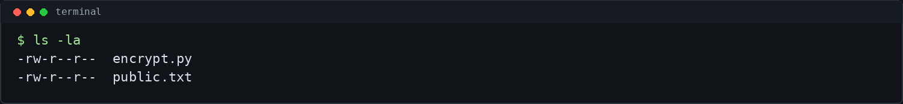
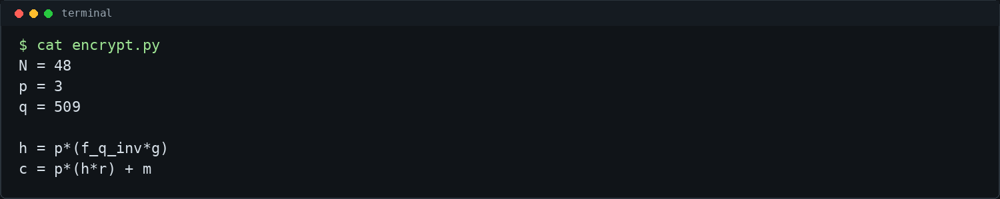
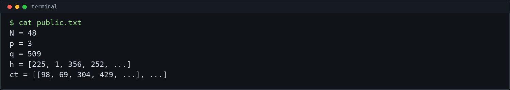
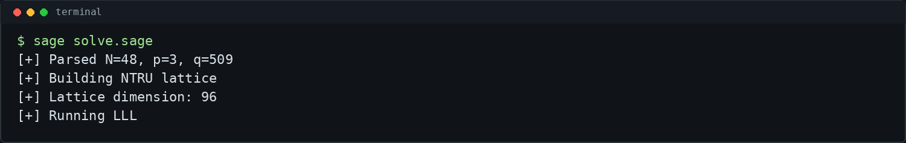
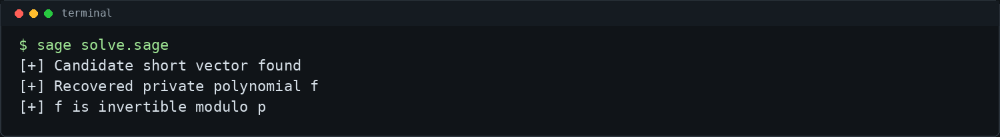
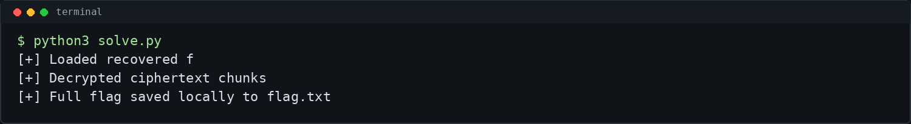

# Not TRUe - picoCTF 2026 Writeup

## Challenge Metadata

| Field | Value |
| --- | --- |
| Category | Cryptography |
| Difficulty | Medium |
| Author | ishaanharry |
| Description | "no. no. that's Not TRUe. that's impossible!" |
| Hints | 1. This is a lattice based cryptosystem. Is there a lattice attack that allows you to compute the private key given the public information? |
| Given files | `encrypt.py`, `public.txt` |

## 1. Challenge Overview

Not TRUe is a CTF/lab cryptography challenge built around a small NTRU-like lattice cryptosystem. The public data contains the system parameters, a public polynomial `h`, and encrypted message chunks.

The important detail is that the private polynomials are very small. In a correctly sized NTRU setting, recovering those private polynomials from the public key should be hard. Here, the toy parameters are small enough that LLL can recover a short vector from the NTRU lattice.



## 2. Given Files

The challenge provides:

- `encrypt.py` - the key generation and encryption code.
- `public.txt` - the public parameters, public key, and ciphertext chunks.

The included solver scripts expect `public.txt` in the same directory. The full recovered flag is saved only to local ignored files.

## 3. Source Code Analysis

The source defines:

```python
N = 48
p = 3
q = 509
```

The private polynomials `f` and `g` are generated with coefficients in `{-1, 0, 1}`. The random encryption polynomial `r` is generated the same way.

The public key is:

```text
h = p * f_q_inv * g mod q
```

Encryption is:

```text
c = p * (h * r) + m mod q
```

The flag is converted into binary, split into chunks of length `N`, and each chunk is encrypted as a polynomial.



## 4. Understanding the NTRU-like Scheme

This construction is inspired by NTRU. NTRU works over a polynomial ring, commonly with multiplication reduced modulo a polynomial such as `x^N - 1`.

The public key hides the private polynomials using the relation:

```text
h = p * f_q_inv * g mod q
```

If we multiply both sides by `f`, the inverse disappears:

```text
f*h = p*g mod q
```

So the public key gives a modular relation between two unknown small polynomials.



## 5. The Weakness: Small Ternary Private Polynomials

NTRU security relies on finding the relevant short vector being hard for properly chosen parameters. This challenge uses:

```text
N = 48
q = 509
```

Those values are small. Also, `f` and `g` are ternary, so their coefficients are only `-1`, `0`, or `1`. That means the vector formed from `(f, p*g)` is much shorter than typical lattice basis vectors.

This does not mean all NTRU is broken. It means this small-parameter CTF instance is vulnerable to a standard lattice attack.

## 6. NTRU Lattice Key Recovery

To recover the private key, we build a lattice from the public polynomial `h`. Let `H` be the circulant matrix representing multiplication by `h` modulo `x^N - 1`.

One useful basis is:

```text
[ I   H  ]
[ 0  qI  ]
```

Vectors in this lattice have the form:

```text
(u, u*H + q*v)
```

When `u = f`, the second half can be reduced to the centered representative of `f*h mod q`, which equals `p*g`. Therefore:

```text
(f, p*g)
```

is a short lattice vector.

LLL finds short vectors in a lattice. With these toy parameters, the short vector corresponding to the private key is small enough to recover.



## 7. Recovering the Private Key

The Sage solver parses `public.txt`, builds the NTRU lattice, runs LLL, and inspects the reduced basis for candidate short vectors.

A valid candidate `f` must:

- have very small coefficients, usually ternary;
- be invertible modulo `p`;
- decrypt the ciphertext into binary message coefficients;
- produce plaintext with the expected picoCTF flag prefix.

When a valid private polynomial is found, the solver writes it to local `recovered_f.txt`. That file is ignored by Git.



## 8. Decrypting the Ciphertext

Once `f` is recovered, decryption follows the normal NTRU-style process.

For each ciphertext polynomial `c`:

```text
a = f*c mod q
```

Then center the coefficients of `a` around `[-q/2, q/2]` and reduce them modulo `p`. The random term disappears modulo `p`, leaving:

```text
a = f*m mod p
```

Finally, multiply by the inverse of `f` modulo `p`:

```text
m = f_p_inv * a mod p
```

The recovered message coefficients are bits. Concatenating those bits and converting them back into bytes gives the flag.



## 9. Final Exploit Script

Run the full solver:

```bash
./solve.sh
```

The wrapper runs:

```bash
sage solve.sage
python3 solve.py
```

If `sage` is not already on the `PATH`, `solve.sh` also tries to activate a local conda environment named `sage`.

The Sage script performs the lattice attack and saves local recovery files. The Python script prints only a redacted result by default.

To print the full flag locally after solving:

```bash
python3 solve.py --show-flag
```

Do not use that output in public screenshots or writeups.

## 10. Commands Used

```bash
ls -la
cat encrypt.py
cat public.txt
sage solve.sage
python3 solve.py
./solve.sh
```

Short command reference:

```bash
# Parse public parameters
cat public.txt

# Recover private polynomial using an NTRU lattice attack
sage solve.sage

# Decrypt ciphertext chunks and print redacted result
python3 solve.py
```

The attack flow is:

```text
public h + small ternary f,g -> NTRU lattice -> recover f -> decrypt ciphertext
```

## 11. Final Flag

```text
picoCTF{...redacted...}
```

The full flag is intentionally not published in this writeup.


## 12. Lessons Learned

- NTRU-style systems rely on carefully selected parameters.
- Small ternary private polynomials create very short lattice vectors.
- The relation `f*h = p*g mod q` exposes a target vector in the NTRU lattice.
- LLL can recover that vector for this small CTF instance.
- After recovering `f`, decryption is straightforward.
- Public CTF writeups should redact flags and avoid committing local recovery files.
