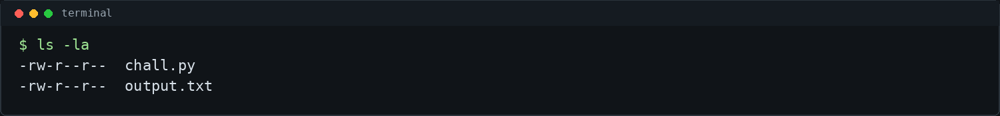
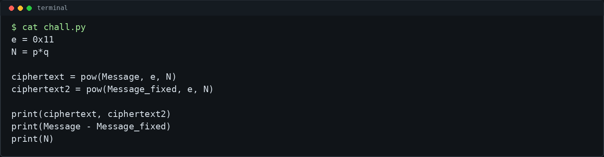
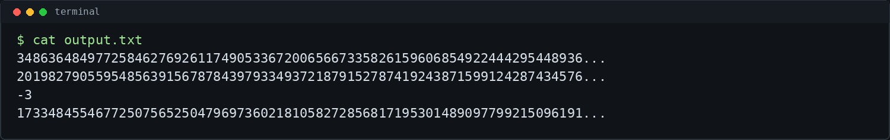
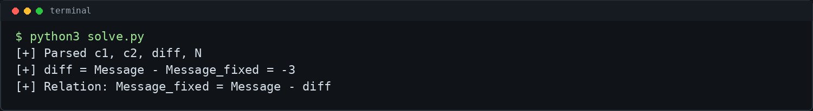
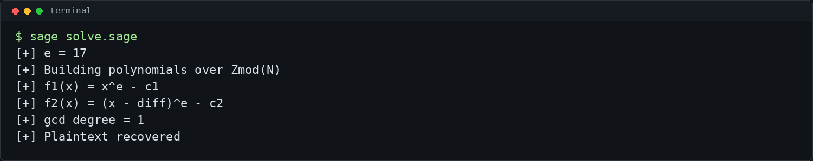

# Related Messages - picoCTF 2026 Writeup

## Challenge Metadata

| Field | Value |
| --- | --- |
| Category | Cryptography |
| Difficulty | Medium |
| Author | Philip Thayer |
| Description | Oops! I have a typo in my first message so i sent it again! I used RSA twice so this is secure right? |
| Hints | 1. How are the two messages related?<br>2. Franklin Reiter _______ _______ attack. |
| Given files | `chall.py`, `output.txt` |

## 1. Challenge Overview

Related Messages is an RSA challenge from a CTF/lab environment. We are given two ciphertexts produced with the same RSA modulus `N` and the same public exponent `e`.

RSA itself is not broken here. The weakness is that two related plaintext messages were encrypted under the same modulus, and the program leaks the exact difference between those plaintext integers.



## 2. Given Files

The challenge provides:

- `chall.py`, which shows how the RSA values were generated.
- `output.txt`, which contains the two ciphertexts, the plaintext difference, and the shared modulus.

The goal is to recover the original plaintext message and convert it back to bytes.

## 3. Source Code Analysis

The important lines from `chall.py` are:



The script encrypts two messages:

```python
ciphertext = pow(Message, e, N)
ciphertext2 = pow(Message_fixed, e, N)
```

Then it prints:

- `ciphertext`
- `ciphertext2`
- `Message - Message_fixed`
- `N`

That printed difference is the key leak.

## 4. RSA Setup

The public exponent is:

```text
e = 0x11 = 17
```

The modulus is generated normally:

```text
N = p * q
```

The ciphertexts are standard RSA encryptions:

```text
c1 = Message^e mod N
c2 = Message_fixed^e mod N
```

The values in `output.txt` are large RSA integers:



## 5. How the Messages Are Related

The program prints:

```text
diff = Message - Message_fixed
```

For the provided output:

```text
diff = -3
```

So:

```text
Message_fixed = Message - diff
Message_fixed = Message + 3
```

If we let:

```text
x = Message
```

then the second message is:

```text
x - diff
```



## 6. Franklin-Reiter Related Message Attack

Franklin-Reiter applies when related plaintexts are encrypted with the same RSA modulus and the same exponent. The relation does not need to reveal the messages directly. It only needs to let us write both messages as polynomials in the same unknown.

Here:

```text
c1 = m^e mod N
c2 = (m - diff)^e mod N
```

So we build two polynomials over `Zmod(N)`:

```text
f1(x) = x^e - c1
f2(x) = (x - diff)^e - c2
```

Both polynomials have the same root:

```text
x = m
```

Taking the polynomial GCD reveals the shared linear factor:

```text
gcd(f1, f2) = x - m
```

This is the Franklin-Reiter related message attack.



## 7. Recovering the Plaintext

Once the GCD is linear, it has the form:

```text
g(x) = a*x + b
```

The root is:

```text
m = -b / a mod N
```

After recovering `m`, the integer is converted back to bytes. The included Sage script saves the recovered integer to `recovered_m.txt` and saves the full flag locally to `flag.txt`. Both files are ignored by Git.

## 8. Final Exploit Script

The main solver is `solve.sage`:

```bash
sage solve.sage
```

It automatically parses `output.txt`, builds the polynomials, computes their GCD, recovers the plaintext integer, and writes local recovery files.

The helper script `solve.py` prints only a redacted flag by default:

```bash
python3 solve.py
```

To print the full flag locally after solving, use:

```bash
python3 solve.py --show-flag
```

Do not publish that output in screenshots or public writeups.

## 9. Commands Used

```bash
ls -la
cat chall.py
cat output.txt
sage solve.sage
python3 solve.py
./solve.sh
```

Short reference:

```bash
# Parse RSA values
cat output.txt

# Run Franklin-Reiter related message attack with SageMath
sage solve.sage

# Print redacted result / save flag locally
python3 solve.py
```

## 10. Final Flag

```text
picoCTF{...redacted...}
```

The full flag is intentionally not published in this writeup.


## 11. Lessons Learned

- RSA was not broken in general.
- Reusing the same modulus for related plaintext messages can be dangerous.
- A known linear relation between plaintexts can be enough to recover the message.
- Franklin-Reiter turns the relation into a shared-root polynomial problem.
- The polynomial GCD over `Zmod(N)` reveals the plaintext as a linear factor.
- Public CTF writeups should redact recovered flags and avoid committing local secret outputs.
