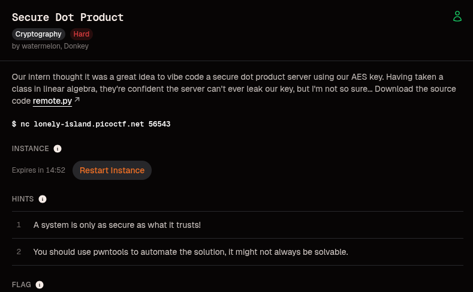
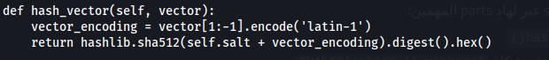
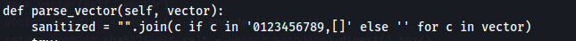
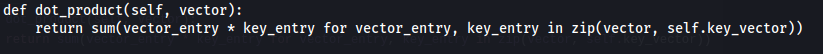
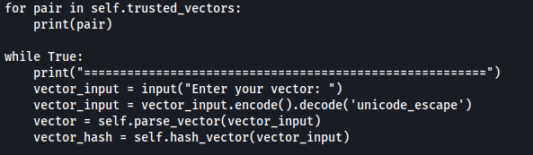
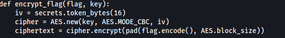
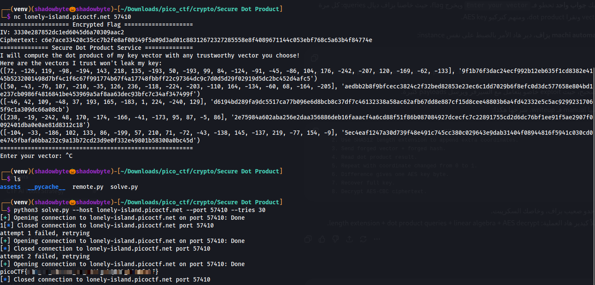

# Secure Dot Product

**Category:** Cryptography
**Difficulty:** Hard

## Description

The challenge provides an AES-CBC encrypted flag and a service that computes a dot product between user-supplied vectors and the AES key.

The AES key is internally stored as a vector of 32 bytes. If we can recover this key, we can decrypt the flag.



---

## Source Code Analysis

The service first generates a random AES key, encrypts the flag using AES-CBC, then exposes a dot product service.

```python
key = secrets.token_bytes(KEY_SIZE)
iv, ciphertext = encrypt_flag(flag, key)
```

The encryption routine is straightforward:



The key part of the challenge is the `SecureDotProductService`. It stores the AES key as a list of integers:

```python
self.key_vector = [byte for byte in key]
```

Then it generates five trusted vectors:

```python
trusted_vectors.append((vector, self.hash_vector(str(vector))))
```

These trusted vectors are printed to the user together with their hashes.

---

## Trusted Vector Authentication

Each trusted vector is authenticated using the following function:



The server computes:

```text
SHA512(salt || vector_encoding)
```

where `salt` is a secret 256-byte random value.

At first glance, this looks safe because the attacker does not know the salt. However, this is not HMAC. It is a raw Merkle-Damgard hash construction with a secret prefix.

That detail is very important.

---

## The Bug

The core issue is that the application hashes one representation of the input but parses another one.

For hashing, the service uses the raw input between brackets:

```python
vector_encoding = vector[1:-1].encode('latin-1')
```

For parsing, the service sanitizes the input and keeps only digits, commas, and brackets:



This means the data used for validation is not exactly the same as the data used for computation.

So the service does something dangerous:

```text
validate(raw_input)
compute(parse(sanitized_input))
```

This mismatch makes it possible to pass the hash check while making the parser interpret extra coordinates.

---

## SHA512 Length Extension

The service authenticates trusted vectors using:

```text
SHA512(secret || message)
```

This construction is vulnerable to a length extension attack.

If we know:

```text
SHA512(secret || message)
```

and we know the length of `secret || message`, we can compute:

```text
SHA512(secret || message || padding || extra)
```

without knowing the secret.

In this challenge:

```text
secret = salt
message = vector_encoding
```

Since the salt size is fixed at 256 bytes, we know the secret length.

So from a trusted vector and its hash, we can forge a new valid hash for:

```text
original_vector || SHA512_padding || extra_coordinates
```

---

## Forging Trusted Vectors

The service prints trusted vectors and hashes:



During interaction, the server asks for:

```text
Enter your vector:
Enter its salted hash:
```

The check is supposed to prevent untrusted input, but length extension lets us create valid hashes for modified inputs.

A forged vector conceptually looks like this:

```text
[trusted_vector || SHA512_PADDING || ,0,0,1,0,0]
```

The hash verification accepts it because it is a valid SHA512 length extension.

Then the parser removes invalid padding bytes and keeps useful characters such as digits and commas. As a result, the added coordinates become part of the parsed vector.

This gives us controlled extra dimensions in the dot product.

---

## Dot Product Oracle

The dangerous oracle is here:



The function computes:

```text
sum(vector[i] * key[i])
```

So every accepted query gives us a linear equation involving bytes of the AES key.

This is the real leak.

If we can control some coordinates of the vector, then we can isolate parts of the key.

For example, compare these two queries:

```text
trusted_vector + [0,0,0,0]
trusted_vector + [0,1,0,0]
```

The difference between both outputs is one AES key byte:

```text
result_2 - result_1 = key_byte
```

Repeating this with different positions leaks key bytes.

---

## Recovering the AES Key

The exploit uses the shortest trusted vector first.

Why?

Because if the trusted vector is short, there are more remaining positions up to 32 bytes. Those remaining positions are easier to control using the forged suffix.

The exploit:

1. Sorts trusted vectors by length.
2. Uses SHA512 length extension to append controlled suffixes.
3. Queries the dot product service with zero suffixes.
4. Flips one coordinate at a time to `1`.
5. Uses output differences to recover key bytes.
6. Uses the remaining trusted vectors as linear equations.
7. Solves the system to recover the full 32-byte AES key.

Some instances may not be solvable immediately because the random trusted vectors may not form a full-rank linear system. This is why the solve script retries.

---

## Decrypting the Flag

After recovering the full AES key, decrypting the flag is simple AES-CBC decryption:

```python
cipher = AES.new(key, AES.MODE_CBC, iv)
plaintext = unpad(cipher.decrypt(ciphertext), AES.block_size)
```

Since the IV and ciphertext are printed by the server, the recovered key is the only missing piece.

---

## Exploit

Run the solver against the remote instance:

```bash
python3 solve.py --host lonely-island.picoctf.net --port 52025
```



Output:

```text
attempt 1 failed, retrying
picoCTF{n0t_so_s3cure_.x_w1th_sh@512_b940fabf}
```

---

## Flag

```text
picoCTF{....redacted....}
```

---

## Why This Works

The challenge combines two weaknesses:

1. **Bad message authentication**

```text
SHA512(secret || message)
```

should not be used as a MAC. HMAC should be used instead.

2. **Parser and validator mismatch**

The hash check validates the raw vector string, while the parser sanitizes and interprets a different version of the input.

Together, these issues allow us to forge trusted vectors and turn the dot product function into a key-recovery oracle.

---

## Lessons Learned

* Do not use `SHA512(secret || message)` for authentication.
* Use HMAC for message authentication.
* Never validate one representation of data and parse another.
* Cryptographic keys must never be exposed through linear operations.
* Dot product oracles can leak secrets if the attacker controls the vector.
* Randomness does not save a design if the underlying validation logic is flawed.

---

## Final Thoughts

This was a very nice cryptography challenge because it combines hash length extension, parser inconsistency, and linear algebra.

The service tried to protect the AES key using trusted vectors, but the trust mechanism itself was broken. Once we could forge trusted vectors, the dot product outputs became enough to recover the entire AES key and decrypt the flag.
