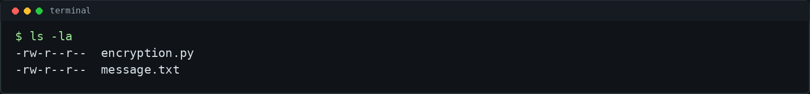
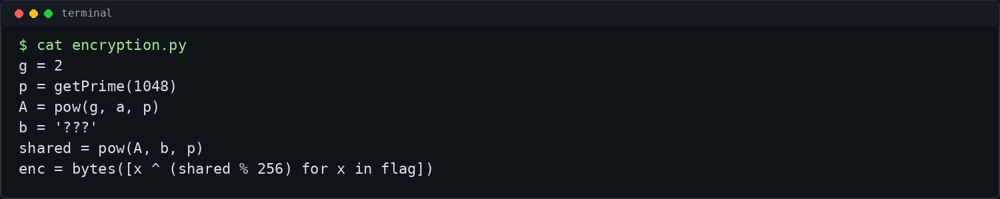
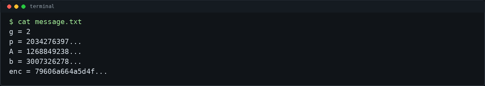
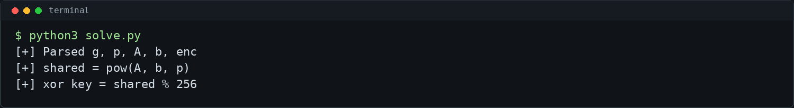
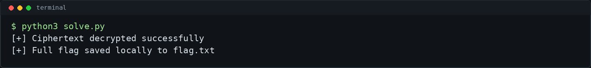

# Shared Secrets - picoCTF 2026 Writeup

## Challenge Metadata

- **Category:** Cryptography
- **Difficulty:** Easy
- **Author:** Yahaya Meddy
- **Description:** "A message was encrypted using a shared secret... but it looks like one side of the exchange leaked something. Can you piece together the secret and get the flag?"
- **Hints:**
  1. What do you get if you combine a public key with a known private one?

## 1. Challenge Overview

Shared Secrets is a CTF/lab cryptography challenge based on a Diffie-Hellman style key exchange. The encryption itself is not a standard cipher. Instead, the flag bytes are XORed with one byte derived from the shared secret.

The important weakness is not Diffie-Hellman itself. The challenge leaks the client private value `b`. Since the server public key `A` is also provided, we can compute the same shared secret that the original program used and reverse the XOR encryption.

## 2. Given Files

The challenge provides a Python source file and a message file:



- `encryption.py` - shows how the key exchange and XOR encryption work
- `message.txt` - contains the public values, the leaked private value, and the ciphertext

## 3. Source Code Analysis

The source code defines public Diffie-Hellman parameters `g` and `p`. The server chooses a private value `a` and publishes:

```python
A = pow(g, a, p)
```

The client has a private value `b`, and the shared secret is computed with:

```python
shared = pow(A, b, p)
```

The final encryption step XORs every flag byte with the lowest byte of the shared secret:

```python
enc = bytes([x ^ (shared % 256) for x in flag])
```



## 4. Understanding the Key Exchange

In a normal Diffie-Hellman exchange:

- `g` and `p` are public parameters.
- `a` is the server private key.
- `A = g^a mod p` is the server public key.
- `b` is the client private key.
- `B = g^b mod p` is the client public key.

Both sides can compute the same shared secret. From the client side, the formula is:

```python
shared = pow(A, b, p)
```

This works because `A` already contains the server side contribution, and `b` applies the client side contribution.

## 5. The Leak

The message file leaks the values needed for the client-side computation:



The leaked values include:

- `g`
- `p`
- `A`
- `b`
- `enc`

The critical leak is `b`. With `b` known, there is no need to brute-force Diffie-Hellman, recover `a`, or solve a discrete logarithm.

## 6. Recovering the Shared Secret

Since `A`, `b`, and `p` are all known, the shared secret can be recomputed directly:

```python
shared = pow(A, b, p)
```

The XOR key is only one byte:

```python
key = shared % 256
```



## 7. Decrypting the Message

The ciphertext is stored as hex in `enc`. After converting it back to bytes, each byte is XORed with the same key:

```python
flag = bytes([c ^ key for c in bytes.fromhex(enc)])
```

The solver writes the full local flag to `flag.txt`, but the public writeup keeps the flag redacted.




## 8. Commands Used

```bash
ls -la
cat encryption.py
cat message.txt
python3 solve.py
```

Minimal manual solve:

```bash
python3 - <<'PY'
import re

with open("message.txt", "r", encoding="utf-8") as f:
    data = f.read()

values = {}
for line in data.splitlines():
    if "=" in line:
        k, v = line.split("=", 1)
        values[k.strip()] = v.strip()

p = int(values["p"])
A = int(values["A"])
b = int(values["b"])
enc = bytes.fromhex(values["enc"])

shared = pow(A, b, p)
key = shared % 256
flag = bytes([c ^ key for c in enc])

print(flag.decode())
PY
```

The formula is:

```text
shared = pow(A, b, p)
key = shared % 256
flag = enc XOR key
```

## 9. Final Flag

```text
picoCTF{...redacted...}
```

## 10. Lessons Learned

- Diffie-Hellman depends on private values staying private.
- If one side's private value leaks, the shared secret can be recomputed from the other side's public key.
- The intended solve path is leaked `b` plus public `A`, not brute force or discrete logarithms.
- XOR with a repeated single-byte key is easy to reverse once the key byte is known.
- Public CTF writeups should avoid exposing the full flag.
