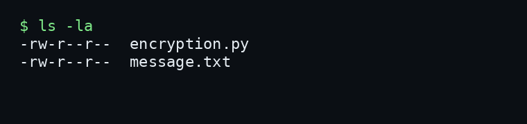
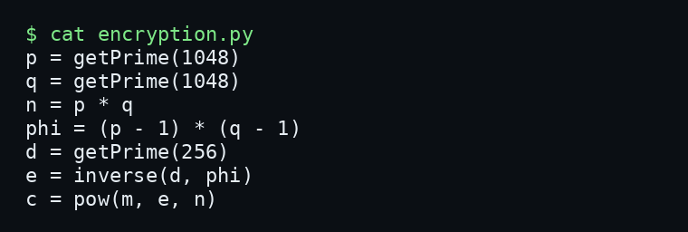
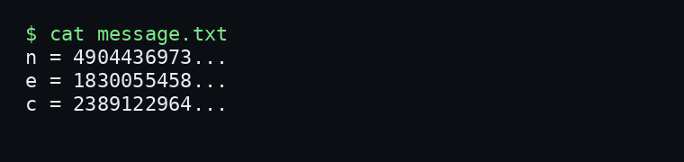
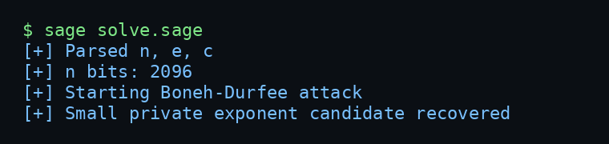
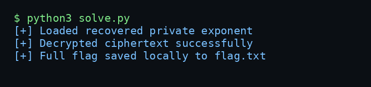

# Small Trouble - picoCTF 2026 Writeup

## Challenge Metadata

| Field | Value |
| --- | --- |
| Category | Cryptography |
| Difficulty | Medium |
| Author | Yahaya Meddy |
| Description | Everything seems secure; strong numbers, familiar parameters but something small might ruin it all. Can you recover the message? |
| Hints | This might be a job for Boneh-Durfee. |

## 1. Challenge Overview

Small Trouble is an RSA challenge from a CTF/lab environment. At first glance the parameters look strong: the modulus is large, the primes are large, and the public exponent is not obviously weak.

The issue is not RSA itself. The problem is the way the private exponent `d` is generated. In RSA, `d` must remain secret, but it also needs to be large enough to avoid known small private exponent attacks.



## 2. Given Files

The challenge gives two files:

- `encryption.py`, which shows how the RSA key and ciphertext were generated.
- `message.txt`, which provides the public values `n`, `e`, and `c`.

The goal is to recover the plaintext message from the public values.

## 3. Source Code Analysis

The important lines from `encryption.py` are:



The primes `p` and `q` are each 1048 bits, so the RSA modulus `n = p * q` is about 2096 bits. That size is not the weakness.

The weak line is:

```python
d = getPrime(256)
```

That means the private exponent is only 256 bits. For a 2096-bit modulus, this is much too small.

## 4. RSA Setup

The script uses standard RSA relationships:

```text
n = p * q
phi(n) = (p - 1) * (q - 1)
e*d ≡ 1 mod phi(n)
c = m^e mod n
```

The public file contains:



Since `n`, `e`, and `c` are public, recovering the message depends on recovering the private exponent `d`.

## 5. The Weakness: Small Private Exponent

RSA is not broken here. The implementation made a bad key-generation choice.

Boneh-Durfee attacks RSA when the private exponent is sufficiently small compared to the modulus. In this challenge:

- `p` and `q` are 1048-bit primes.
- `n` is about 2096 bits.
- `d` is generated as a 256-bit prime.

So `d` is small relative to `n`, which makes the private key recoverable with a lattice-based small-root attack.

## 6. Boneh-Durfee Attack

Boneh-Durfee starts from the RSA private exponent equation:

```text
e*d - k*phi(n) = 1
```

Because:

```text
phi(n) = n - (p + q) + 1
```

the problem can be modeled as a small-root polynomial problem. A lattice is built from shifted versions of that polynomial, LLL is applied, and Coppersmith-style small-root recovery is used to recover the hidden private exponent.



The included `solve.sage` script parses the public values automatically and tries several reasonable parameter sets around `delta = 0.26` to `0.292`.

## 7. Recovering the Private Key

Run:

```bash
sage solve.sage
```

If successful, the script writes the recovered private exponent to:

```text
recovered_d.txt
```

That file is intentionally ignored by Git because it contains private key material.

## 8. Decrypting the Ciphertext

Once `d` is recovered, decryption is normal RSA:

```python
m = pow(c, d, n)
```

The integer plaintext is then converted back to bytes. The helper script saves the full local flag to `flag.txt`, but only prints a redacted flag by default.




## 9. Commands Used

```bash
ls -la
cat encryption.py
cat message.txt
sage solve.sage
python3 solve.py
./solve.sh
```

Short reference:

```bash
# Parse public RSA values
cat message.txt

# Run Boneh-Durfee attack with SageMath
sage solve.sage

# Decrypt with recovered d
python3 solve.py
```

## 10. Final Flag

```text
picoCTF{...redacted...}
```

The full flag is intentionally not published in this writeup.

## 11. Lessons Learned

- RSA itself was not the issue.
- Strong primes do not help if the private exponent is chosen poorly.
- A very small `d` can make RSA vulnerable to Boneh-Durfee style attacks.
- After `d` is recovered, decryption is ordinary RSA.
- In public CTF writeups, recovered flags and private key material should be redacted.
