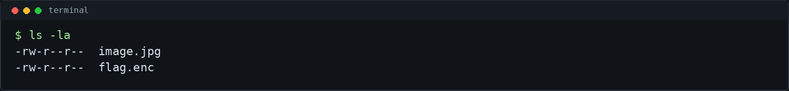
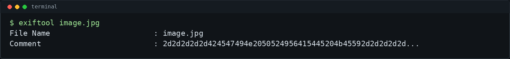
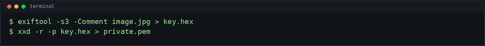
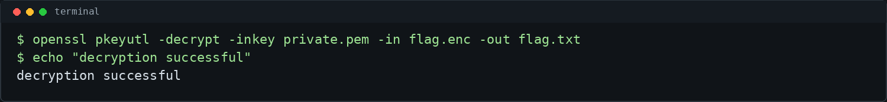
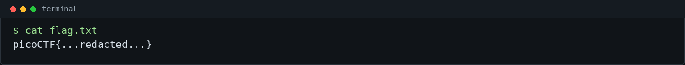

# StegoRSA - picoCTF 2026 Writeup

## Challenge Metadata

- **Category:** Cryptography
- **Difficulty:** Easy
- **Author:** Yahaya Meddy
- **Description:** "A message has been encrypted using RSA. The public key is gone... but someone might have been careless with the private key. Can you recover it and decrypt the message?"
- **Hints:**
  1. Metadata can tell you more than you expect.
  2. Hex can be turned back into a key file.

## 1. Challenge Overview

StegoRSA is a CTF/lab challenge that combines a small steganography clue with a standard RSA decryption workflow. The encrypted flag is protected with RSA, but the public key is missing. Instead of trying to brute-force RSA or search for another copy of the key, the intended path is to inspect the provided image for hidden metadata.

The important discovery is that the image metadata contains a hex-encoded RSA private key. Once the hex string is converted back into a PEM key file, `openssl` can use that private key to decrypt the encrypted flag.

## 2. Given Files

The challenge provides an image and an encrypted file:



- `image.jpg` - the image that contains useful metadata
- `flag.enc` - the RSA-encrypted flag

## 3. First Look

A good first step in file-based CTF challenges is to identify the files and inspect basic metadata. The image looks like the obvious place to investigate because the challenge hints mention metadata.

Useful first-look commands include:

```bash
ls -la
file image.jpg
exiftool image.jpg
```

## 4. Metadata Analysis

Running `exiftool` on the image reveals a suspicious `Comment` field. The value is a long hexadecimal string.



The prefix of the hex is a strong clue. For example, the bytes `2d2d2d2d2d` decode to `-----`, which commonly appears at the start of PEM files such as private keys.

## 5. Recovering the RSA Private Key

The metadata comment can be extracted directly with `exiftool`. After saving the hex string into `key.hex`, `xxd` can reverse the hex encoding and rebuild the PEM private key.



```bash
exiftool -s3 -Comment image.jpg > key.hex
xxd -r -p key.hex > private.pem
```

Checking the beginning of the recovered file confirms that it is a private key:


Only the header should be needed for confirmation. The full private key is not shown here because this is a public writeup.

## 6. Decrypting the Flag

With the private key recovered, the encrypted file can be decrypted using `openssl pkeyutl`.



```bash
openssl pkeyutl -decrypt -inkey private.pem -in flag.enc -out flag.txt
```

The decrypted flag is saved locally in `flag.txt`. For the public writeup, the flag is redacted:



## 7. Why This Works

RSA encryption with a public key can be reversed with the matching private key. The challenge removes the public key, but that does not matter for decryption once the private key is recovered.

The mistake in this challenge is storing the private key inside image metadata. Metadata fields are often overlooked, but tools like `exiftool` can expose them quickly. The `Comment` field stores the private key as hex text, so converting the hex back into bytes restores the original PEM file.

## 8. Commands Used

```bash
ls -la
file image.jpg
exiftool image.jpg
exiftool -s3 -Comment image.jpg > key.hex
xxd -r -p key.hex > private.pem
head private.pem
openssl pkeyutl -decrypt -inkey private.pem -in flag.enc -out flag.txt
cat flag.txt
```

## 9. Final Flag

```text
picoCTF{...redacted...}
```

## 10. Lessons Learned

- Always inspect file metadata in CTF/lab challenges when hints mention hidden information.
- Hex-encoded data can often be restored with `xxd -r -p`.
- A recovered RSA private key is enough to decrypt data encrypted for the matching key pair.
- Do not store private keys in metadata or other hidden-looking locations in real systems.
- Public writeups should avoid exposing full flags and private key material.
