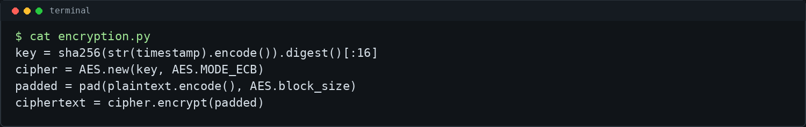
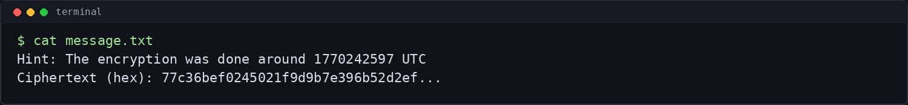
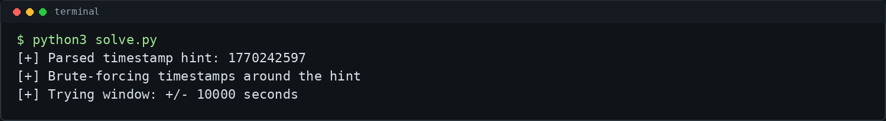
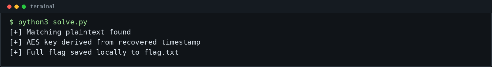

# Timestamped Secrets - picoCTF 2026 Writeup

## Challenge Metadata

- **Category:** Cryptography
- **Difficulty:** Medium
- **Author:** Yahaya Meddy
- **Description:** "Someone encrypted a message using AES in ECB mode but they weren’t very careful with their key. Turns out it’s derived from something as simple as the current time! Can you uncover the key and decrypt the flag?"
- **Hints:**
  1. `encryption.py` is a redacted example of the program.

## 1. Challenge Overview

Timestamped Secrets is a CTF/lab cryptography challenge about weak key generation. The encrypted message was protected with AES, but the AES key was not generated from a random secret. Instead, it was derived from the Unix timestamp at the time of encryption.

AES itself is not broken here. The mistake is using predictable time data as the source of key material. Since the message file leaks an approximate encryption time, we can try timestamps around that value until the decrypted plaintext looks like a picoCTF flag.

## 2. Given Files

The challenge provides a redacted source file and a message file:


- `encryption.py` - shows how the timestamp-based key is derived and how AES-ECB is used
- `message.txt` - gives an approximate timestamp and the ciphertext in hex

## 3. Source Code Analysis

The important lines from the redacted encryption program are:

```python
key = sha256(str(timestamp).encode()).digest()[:16]
cipher = AES.new(key, AES.MODE_ECB)
padded = pad(plaintext.encode(), AES.block_size)
ciphertext = cipher.encrypt(padded)
```



The plaintext is padded to an AES block boundary, encrypted with AES in ECB mode, and written as hex. The key is the first 16 bytes of a SHA-256 digest of the timestamp string.

## 4. Weak Key Derivation

The key derivation formula is:

```python
key = sha256(str(timestamp).encode()).digest()[:16]
```

This produces a valid 128-bit AES key, but the key is only as strong as the secret used to derive it. Unix timestamps are predictable. If an attacker knows the approximate time when encryption happened, the number of possible keys becomes small.

The message file gives exactly that kind of leak:



Because the encryption was done around `1770242597` UTC, we do not need to search the full AES key space. We only need to test timestamps near that value.

## 5. Timestamp Brute Force

The solver uses a default window of `+/- 10000` seconds around the leaked timestamp. For each candidate timestamp, it repeats the same key derivation:

```python
key = sha256(str(ts).encode()).digest()[:16]
```

Then it decrypts the ciphertext and tries to remove PKCS#7 padding. Most wrong timestamps produce invalid padding or unreadable plaintext. The correct timestamp produces a plaintext beginning with:

```text
picoCTF{
```



## 6. AES-ECB Decryption

After recovering the timestamp-derived key, the ciphertext can be decrypted with AES-ECB:

```python
plaintext = AES.new(key, AES.MODE_ECB).decrypt(ciphertext)
plaintext = unpad(plaintext, AES.block_size)
```

ECB mode is not recommended for secure encryption because it leaks patterns across equal plaintext blocks. In this challenge, however, ECB is not the main weakness. The practical break comes from the predictable timestamp-based key.



## 7. Final Exploit Script

The included [`solve.py`](solve.py) script:

- finds the challenge message file automatically when possible
- parses the approximate timestamp and ciphertext hex
- brute-forces timestamps around the hint
- derives each candidate AES key using SHA-256
- decrypts with AES-ECB and checks for `picoCTF{`
- saves the full flag locally to `flag.txt`
- prints only `picoCTF{...redacted...}` by default

Run it in redacted mode:

```bash
python3 solve.py
```

To print the full flag locally:

```bash
python3 solve.py --show-flag
```

The full flag is intentionally not included in this public writeup.

## 8. Commands Used

```bash
ls -la
cat encryption.py
cat message.txt
python3 solve.py
python3 solve.py --show-flag
```

Minimal manual solve:

```bash
python3 - <<'PY'
import re
from hashlib import sha256
from Crypto.Cipher import AES
from Crypto.Util.Padding import unpad

with open("message.txt", "r", encoding="utf-8") as f:
    data = f.read()

timestamp = int(re.search(r"around (\d+) UTC", data).group(1))
ct_hex = re.search(r"Ciphertext \(hex\):\s*([0-9a-fA-F]+)", data).group(1)
ciphertext = bytes.fromhex(ct_hex)

for ts in range(timestamp - 10000, timestamp + 10001):
    key = sha256(str(ts).encode()).digest()[:16]
    cipher = AES.new(key, AES.MODE_ECB)
    try:
        pt = unpad(cipher.decrypt(ciphertext), AES.block_size)
    except ValueError:
        continue

    if pt.startswith(b"picoCTF{"):
        print(pt.decode())
        print("timestamp =", ts)
        break
PY
```

The formula is:

```text
key = sha256(str(timestamp).encode()).digest()[:16]
plaintext = AES_ECB_decrypt(ciphertext, key)
timestamp is brute-forced around the leaked hint.
```

## 9. Final Flag

```text
picoCTF{...redacted...}
```


## 10. Lessons Learned

- AES was not attacked directly and is not broken by this challenge.
- Key material must come from high-entropy secret randomness, not predictable values like the current time.
- Unix timestamps are easy to guess when an approximate event time is known.
- A leaked timestamp hint can reduce the search space to a small brute-force window.
- ECB mode should be avoided in real systems, but the timestamp-derived key is the critical flaw here.
- Public CTF writeups should redact flags and avoid publishing sensitive local outputs.
