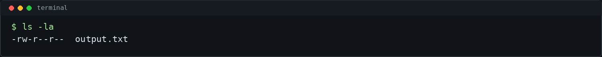
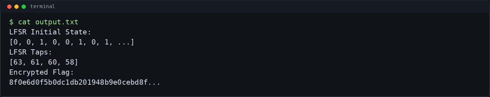
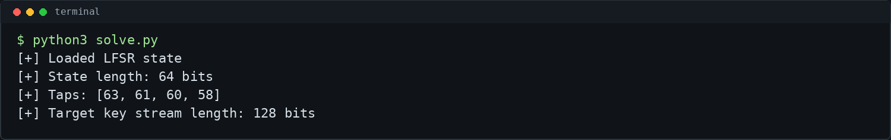
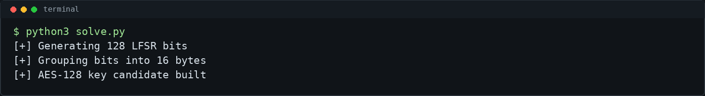
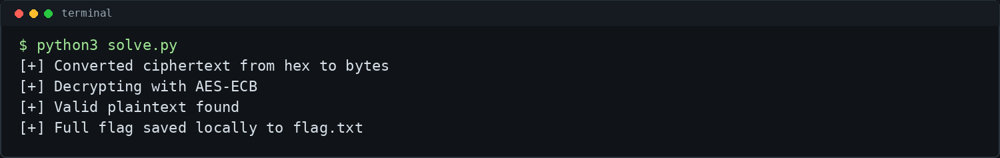

# cryptomaze - picoCTF 2026 Writeup

## Challenge Metadata

- **Category:** Cryptography
- **Difficulty:** Medium
- **Author:** Sabine Gisagara
- **Description:** "In this challenge, you are tasked with recovering a hidden flag that has been encrypted using a combination of Linear Feedback Shift Register (LFSR) and AES encryption. The LFSR is used to derive a key for AES encryption, making it crucial to understand its workings to decrypt the message."
- **Hints:**
  1. Use the LFSR's initial state and taps to generate a 128-bit sequence.
  2. Convert this 128-bit sequence into a 16-byte AES key by grouping bits into 8-bit chunks.
  3. Decrypt the flag using AES in ECB mode.
  4. Convert the encrypted flag from hex to bytes before decrypting.
- **Given files:** `output.txt`

## 1. Challenge Overview

`cryptomaze` is a CTF/lab cryptography challenge about weak key derivation. The flag is encrypted with AES, but the AES key is not stored directly. Instead, the key is generated from a Linear Feedback Shift Register.

AES itself is not broken here. The weakness is that the LFSR parameters are public, so the AES key stream can be reconstructed and converted back into the 16-byte AES-128 key.

## 2. Given Files

The challenge gives one output file:



- `output.txt` - contains the LFSR initial state, the LFSR tap positions, and the encrypted flag as hexadecimal text

## 3. Output Analysis

The output file contains three important values:



The initial state is the starting register content. The taps tell us which state positions are XORed to produce the feedback bit. The encrypted flag is a hex string, so it must be converted to bytes before AES decryption.

## 4. Understanding the LFSR

An LFSR keeps a fixed-size state and updates it one bit at a time. For this challenge, the feedback bit is computed from the public tap positions:

```text
feedback = XOR(state[tap] for tap in taps)
```

Each update shifts the register and inserts the feedback bit. The generated output bits are used as key material.

Because LFSR conventions can differ, the included solver tries the common choices automatically:

- output before shift or after shift
- output from the left or right side of the state
- shift left or shift right
- taps interpreted directly or mirrored from the opposite side



## 5. Deriving the AES Key

AES-128 requires a 16-byte key. Since 1 byte is 8 bits, the solver generates exactly 128 bits from the LFSR:

```text
16 bytes * 8 bits = 128 bits
```

Those bits are grouped into 16 chunks of 8 bits. Each chunk is converted into one byte:

```text
key = bits_to_bytes(lfsr_output_bits[:128])
```



The result is an AES-128 key candidate. The solver tests each candidate by decrypting the ciphertext and checking for the expected picoCTF flag prefix.

## 6. AES-ECB Decryption

The ciphertext is provided as hexadecimal text, so the first step is:

```python
ciphertext = bytes.fromhex(ct_hex)
```

Then the recovered key is used with AES in ECB mode:

```python
plaintext = AES_ECB_decrypt(ciphertext, key)
```

If PKCS#7 padding is present, the solver removes it. A successful plaintext is recognized by the normal picoCTF flag format.



## 7. Final Exploit Script

The included [`solve.py`](solve.py) script:

- finds `output.txt`, `output`, or another matching `.txt` challenge file automatically
- parses the LFSR initial state, taps, and ciphertext
- tries common LFSR output and shift conventions
- generates 128 LFSR bits for each convention
- converts the bits into a 16-byte AES key candidate
- decrypts with AES-ECB
- removes PKCS#7 padding when present
- saves the full flag locally to `flag.txt`
- prints only the redacted flag by default

Run the solver in redacted mode:

```bash
python3 solve.py
```

To print the full flag locally:

```bash
python3 solve.py --show-flag
```

The full flag is intentionally not included in this public writeup.

## 8. Commands Used

```bash
ls -la
cat output.txt
python3 solve.py
python3 solve.py --show-flag
./solve.sh
```

See [`commands.txt`](commands.txt) for the manual solving commands and a compact Python one-liner style solve block.

## 9. Final Flag

```text
picoCTF{...redacted...}
```


## 10. Lessons Learned

- AES was not attacked directly and is not broken by this challenge.
- The practical weakness is reconstructing the AES key from public LFSR parameters.
- AES-128 needs exactly 16 bytes of key material, which is why the solver generates 128 LFSR bits.
- Hex-encoded ciphertext must be converted to bytes before block cipher decryption.
- CTF writeups should avoid publishing full flags, local paths, usernames, hostnames, and other environment details.
