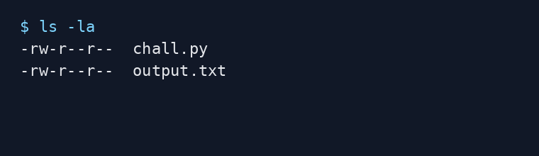
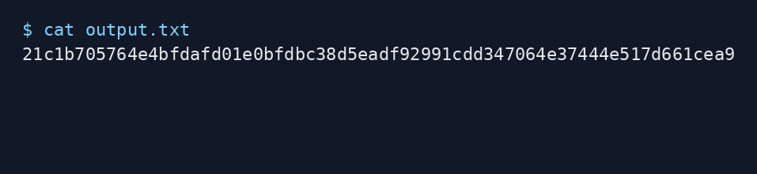
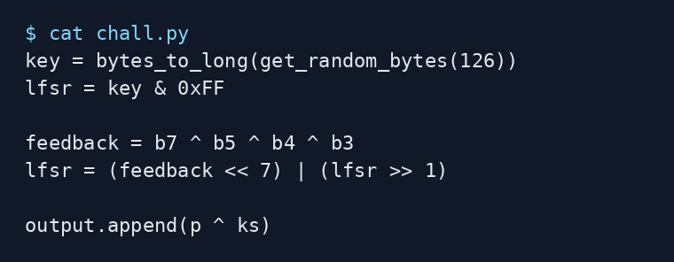
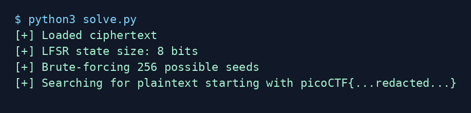
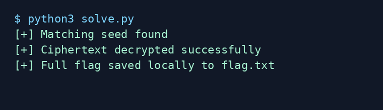
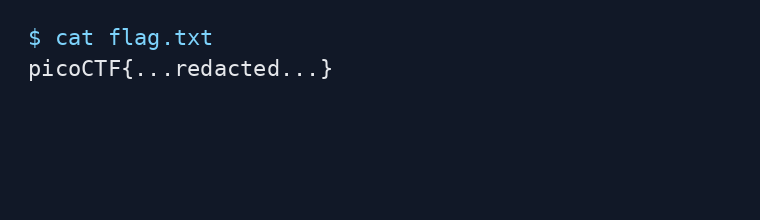

# shift registers - picoCTF 2026 Writeup

## Challenge Metadata

| Field | Value |
| --- | --- |
| Category | Cryptography |
| Difficulty | Medium |
| Author | Philip Thayer |
| Description | I learned about lfsr today in school so i decided to implement it in my program. It must be safe right? |
| Given files | `chall.py`, `output.txt` |

## 1. Challenge Overview

This picoCTF 2026 challenge is a CTF/lab cryptography exercise built around a stream cipher made from a linear feedback shift register, or LFSR. The program encrypts the flag by generating one keystream byte per plaintext byte, then XORing the plaintext with that keystream.

The important question is not whether the random key source is large. The important question is how much of that key is actually used by the encryption routine.



## 2. Given Files

The challenge provides two files:

- `chall.py`: the encryption source code
- `output.txt`: the hex-encoded ciphertext

The ciphertext is the only encrypted output we need to attack. Since this is a CTF flag, the plaintext format is known to begin with `picoCTF{...redacted...}`, which gives us a reliable way to recognize the correct decryption without publishing the real flag.



## 3. Source Code Analysis

The source generates a large random integer:

```python
key = bytes_to_long(get_random_bytes(126))
```

At first glance, this looks like a large key. However, the LFSR state is initialized like this:

```python
lfsr = key & 0xFF
```

That line keeps only the lowest 8 bits of the generated key. Everything else is discarded before encryption begins.

The encryption loop then steps the LFSR before each plaintext byte and uses the new 8-bit LFSR value as the keystream byte:

```python
lfsr = steplfsr(lfsr)
ks = lfsr
output.append(p ^ ks)
```



## 4. Understanding the LFSR

The LFSR update uses four tapped bits:

- bit 7
- bit 5
- bit 4
- bit 3

The feedback bit is calculated as:

```python
feedback = b7 ^ b5 ^ b4 ^ b3
```

Then the register shifts right by one bit and inserts the feedback bit at the top:

```python
lfsr = (feedback << 7) | (lfsr >> 1)
```

LFSRs are linear systems. They can be useful in some engineering contexts, but they should not be used directly as secure stream ciphers. In this challenge, the implementation is especially weak because the entire internal state is only one byte.

## 5. The Weakness: Only 8 Bits of State

The program calls `get_random_bytes(126)`, but the encryption only uses:

```python
key & 0xFF
```

That reduces the effective key space to:

```text
2^8 = 256 possible states
```

So even though the generated key is large, the real LFSR state is tiny. The problem is the truncation to 8 bits, not the randomness source itself.

## 6. Brute-Forcing the Initial State

Since there are only 256 possible starting states, the attack is direct:

1. Read the ciphertext from `output.txt`.
2. Try every possible seed from `0` to `255`.
3. For each seed, step the LFSR exactly like the challenge.
4. XOR each ciphertext byte with the current LFSR byte.
5. Check whether the plaintext begins with the known redacted flag format.

The decryption formula is:

```text
plaintext_byte = ciphertext_byte XOR lfsr_state
```



## 7. Decrypting the Ciphertext

For each candidate seed, the solver regenerates the keystream byte-by-byte. The correct seed produces readable plaintext beginning with the expected CTF flag prefix.

The full recovered flag is saved locally to `flag.txt` by the solver, but this repository intentionally does not commit `flag.txt` or any unredacted flag output.



## 8. Final Exploit Script

The final exploit is included in [`solve.py`](solve.py). It:

- detects `output.txt`, `output`, or a `.txt` file containing hex ciphertext
- parses the ciphertext
- implements the same `steplfsr(lfsr)` function
- brute-forces all 256 seeds
- checks for the expected CTF flag prefix
- saves the full flag locally to `flag.txt`
- prints a redacted flag by default

Run it in redacted mode:

```bash
python3 solve.py
```

To print the full flag locally:

```bash
python3 solve.py --show-flag
```

The public writeup and screenshots remain redacted.

## 9. Commands Used

The manual commands are documented in [`commands.txt`](commands.txt):

```bash
ls -la
cat chall.py
cat output.txt
python3 solve.py
python3 solve.py --show-flag
./solve.sh
```

The shell wrapper runs the solver in redacted mode by default:

```bash
./solve.sh
```

## 10. Final Flag

```text
picoCTF{...redacted...}
```



## 11. Lessons Learned

- A large generated key does not help if the implementation truncates it before use.
- This implementation has only 256 possible initial LFSR states.
- Known plaintext structure, such as a CTF flag format, makes it easy to identify the correct decryption.
- LFSRs are linear and should not be used directly as secure stream ciphers.
- In CTF writeups, keep the solving method public but avoid committing unredacted flags.
