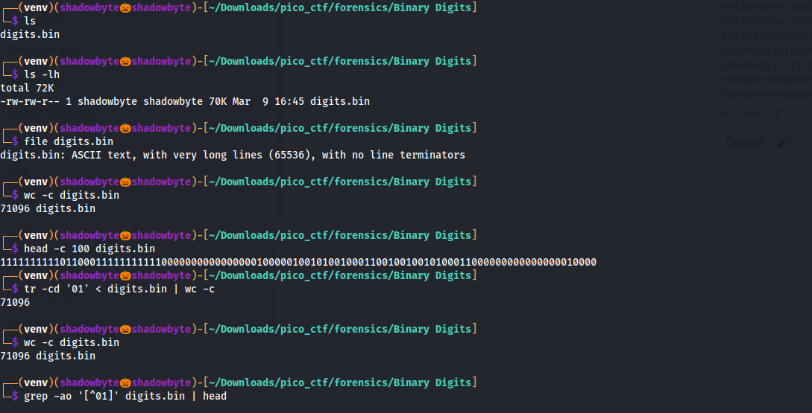
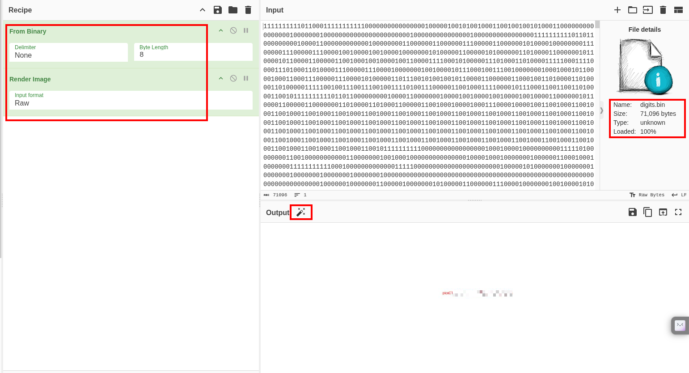

# Binary Digits

**Category:** Forensics
**Difficulty:** Easy
**Author:** Yahaya Meddy

---

## Challenge Description

The challenge provides a file named `digits.bin`.

The description says that the file looks like a long sequence of `1`s and `0`s, but it may contain something meaningful.

The goal is to recover the hidden data and extract the flag.

---

## Initial Triage

I started by checking the file type and size:

```bash
ls -lh
file digits.bin
wc -c digits.bin
head -c 100 digits.bin
```



The file command showed:

```text
digits.bin: ASCII text, with very long lines, with no line terminators
```

The file size was:

```text
71096 bytes
```

The first bytes looked like a long sequence of binary digits:

```text
1111111111011000111111111110000000000000000100000100101001000110...
```

This suggested that the file was not a normal binary file yet, but rather an ASCII representation of binary data.

---

## Verifying the Bitstream

To confirm that the file only contained `0` and `1`, I checked how many characters were valid binary digits:

```bash
tr -cd '01' < digits.bin | wc -c
wc -c digits.bin
```

Both commands returned the same size:

```text
71096
```

Then I checked if there were any characters other than `0` or `1`:

```bash
grep -ao '[^01]' digits.bin | head
```

This returned no output.

That confirmed that the file was entirely made of binary digits.

So the correct approach was to group the digits into 8-bit chunks and convert each chunk into a byte.

---

## Converting Binary Digits to Bytes

Since I wanted to keep the analysis tool-based, I used **CyberChef**.

The recipe was:

```text
From Binary
```

With the following settings:

```text
Delimiter: None
Byte Length: 8
```

I also used:

```text
Render Image
```

to preview the recovered data as an image.



CyberChef successfully interpreted the `0` and `1` characters as binary bytes.

After conversion, the output rendered as an image and the flag became visible.

---

## Why This Works

The original file was not raw binary data.

Instead, it stored the binary representation of another file using ASCII characters.

For example, a byte such as:

```text
11111111
```

represents:

```text
0xff
```

By converting every 8 bits into one byte, the original hidden file can be reconstructed.

In this case, the recovered file was an image containing the flag.

---

## Solution Summary

```text
1. Inspect the file with file, ls, wc, and head.
2. Notice that the file is ASCII text made of 0s and 1s.
3. Confirm that the entire file contains only binary digits.
4. Use CyberChef with From Binary.
5. Set delimiter to None and byte length to 8.
6. Render the recovered output as an image.
7. Read the flag from the recovered image.
```

---

## Tools Used

```text
file
ls
wc
head
tr
grep
CyberChef
```

---

## Key Takeaways

* A file containing only `0` and `1` characters may be a bitstream.
* ASCII binary digits must be converted back into raw bytes.
* Every 8 bits can represent one byte.
* CyberChef is useful for quick forensic conversions.
* Rendering the recovered data can reveal hidden images or embedded content.

---

## Final Flag

```text
picoCTF{...REDACTED...}
```
