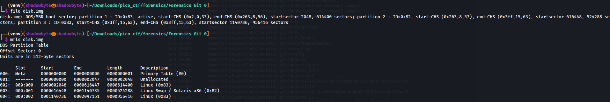
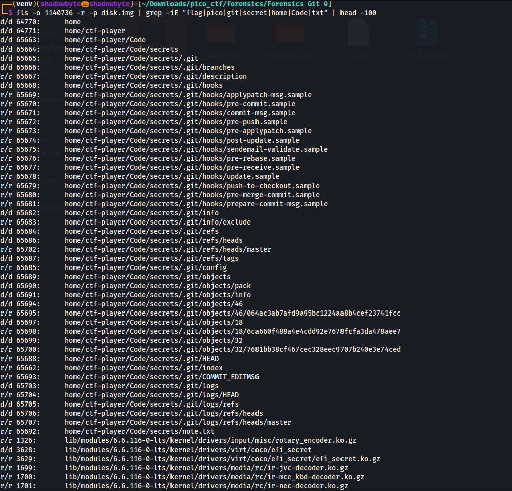
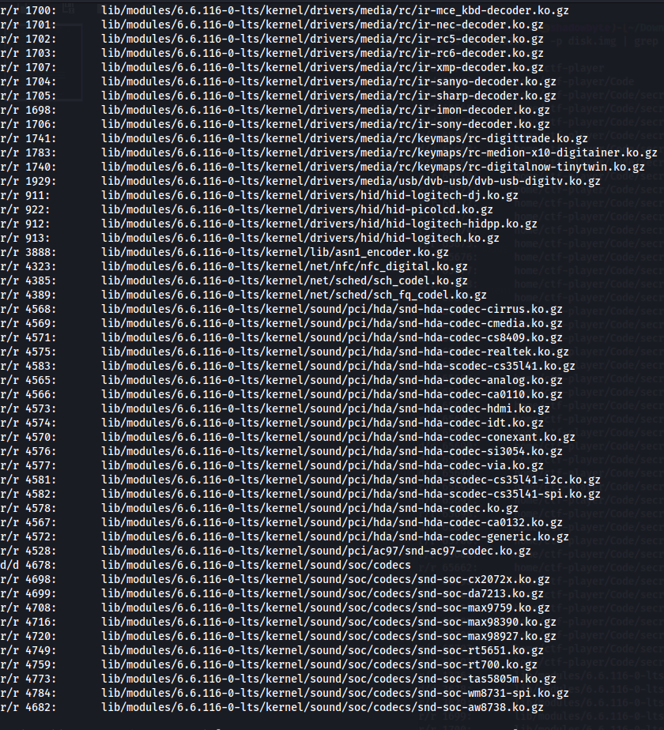
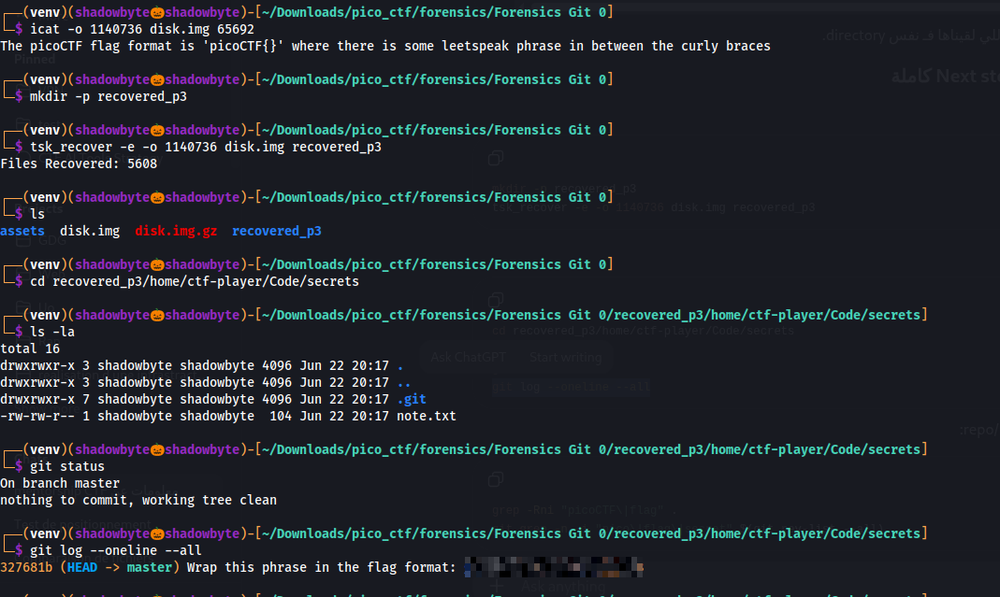

# Forensics Git 0

**Category:** Forensics
**Difficulty:** Medium
**Author:** LT "syreal" Jones

---

## Challenge Description

The challenge provides a disk image and asks us to find the flag.

The hint says:

```text
How can you extract the directory from the disk image?
```

This suggests that the flag is stored somewhere inside a directory in the filesystem, and that we need to recover or extract that directory from the disk image.

---

## Disk Image Inspection

I started by checking the type of the provided disk image:

```bash
file disk.img
```

Then I inspected the partition table with:

```bash
mmls disk.img
```



The image was a DOS/MBR disk image with multiple partitions.

The important Linux partitions were:

````text
Partition 1: start a DOS/MBR disk image with multiple partitions.

The important Linux partitions were:

```text
Partition 1: start sector 2048
Partition 3: start sector 1140736
````

Since the image contains a partition table, SleuthKit commands need to be used with the correct offset.

---

## Searching the Filesystem

I searched the filesystem in the third Linux partition using `fls`:

```bash
fls -o 1140736 -r -p disk.img | grep -iE "flag|pico|git|secret|home|Code|txt" | head -100
```



The output revealed a suspicious directory:

```text
home/ctf-player/Code/secrets
```

It also contained a Git repository:

```text
home/ctf-player/Code/secrets/.git
```

and a note file:

```text
home/ctf-player/Code/secrets/note.txt
```



The interesting file was:

```text
r/r 65692: home/ctf-player/Code/secrets/note.txt
```

The inode number of `note.txt` was:

```text
65692
```

---

## Extracting the Note File

I used `icat` to extract the content of `note.txt` directly from the disk image:

```bash
icat -o 1140736 disk.img 65692
```

The output was:

```text
The picoCTF flag format is 'picoCTF{}' where there is some leetspeak phrase in between the curly braces
```

This was not the flag itself.
Instead, it was a clue telling us that the actual flag content is a leetspeak phrase that must be wrapped inside:

```text
picoCTF{}
```

---

## Recovering the Directory

Since the hint suggested extracting the directory, I recovered the partition contents using `tsk_recover`:

```bash
mkdir -p recovered_p3
tsk_recover -e -o 1140736 disk.img recovered_p3
```

The recovery succeeded:

```text
Files Recovered: 5608
```

Then I entered the recovered directory:

```bash
cd recovered_p3/home/ctf-player/Code/secrets
```

Listing the directory showed:

```bash
ls -la
```

```text
.git
note.txt
```



---

## Inspecting the Git Repository

The recovered directory contained a valid Git repository, so I checked its status:

```bash
git status
```

The repository was clean:

```text
On branch master
nothing to commit, working tree clean
```

Then I inspected the commit history:

```bash
git log --oneline --all
```

The log revealed the important commit message:

```text
Wrap this phrase in the flag format: <leetspeak_phrase>
```

This matched the content of `note.txt`, which explained that the flag should be built by wrapping the leetspeak phrase inside `picoCTF{}`.

---

## Recovering the Flag

The commit message gave the flag content, while `note.txt` explained the required format.

So the final flag is:

```text
picoCTF{<leetspeak_phrase>}
```

The actual phrase is the one shown in the `git log` output.

---

## Investigation Summary

```text
1. Checked disk.img with file.
2. Used mmls to inspect the partition table.
3. Identified the useful Linux partition at start sector 1140736.
4. Used fls with the correct offset to search the filesystem.
5. Found home/ctf-player/Code/secrets.
6. Found note.txt and extracted it with icat.
7. The note explained the flag format.
8. Recovered the directory using tsk_recover.
9. Entered the recovered Git repository.
10. Used git status to confirm the repo was valid.
11. Used git log --oneline --all.
12. Found the leetspeak phrase in the commit message.
13. Wrapped the phrase in picoCTF{} to obtain the flag.
```

---

## Tools Used

```text
file
mmls
fls
icat
tsk_recover
ls
git status
git log
```

---

## Key Takeaways

* Disk images with partition tables require offset-aware analysis.
* `mmls` helps identify partition start sectors.
* `fls` can locate files and directories inside a filesystem image.
* `icat` can extract a file directly using its inode.
* `tsk_recover` can recover full directories from a disk image.
* Git commit messages can contain important forensic clues.
* Sometimes a file provides the format, while the Git history provides the missing content.

---

## Final Flag

```text
picoCTF{...REDACTED...}
```
