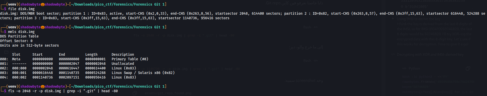
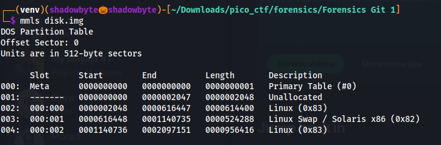
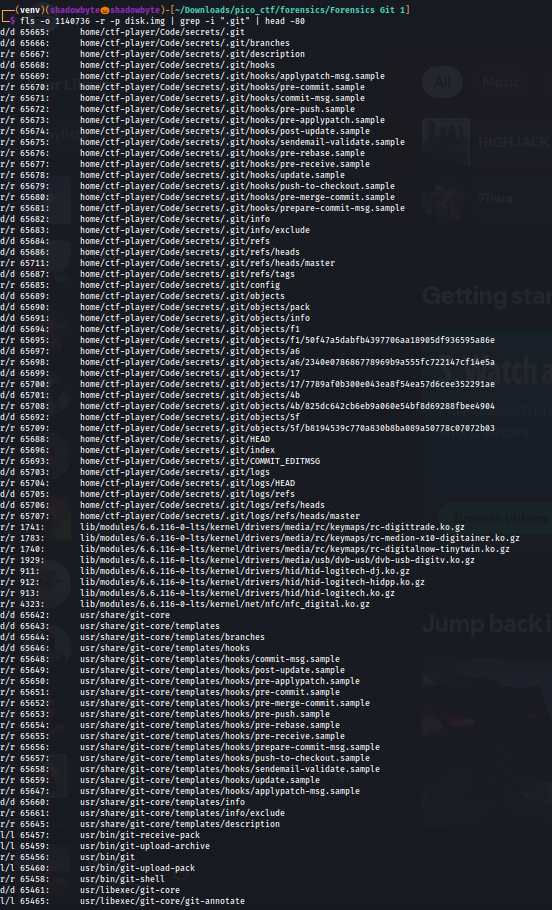
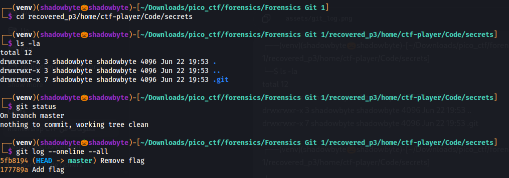
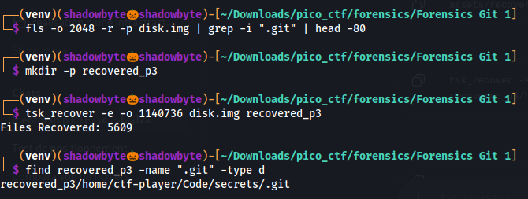
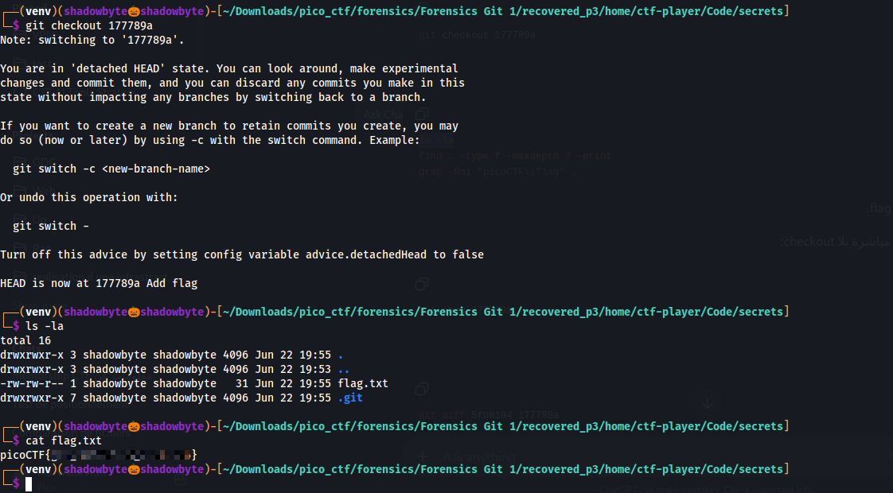

# Forensics Git 1

**Category:** Forensics
**Difficulty:** Medium
**Author:** LT "syreal" Jones

---

## Challenge Description

The challenge provides a disk image and asks us to find the flag.

The hint says:

```text
How can you checkout the files of a previous commit?
```

This suggests that the flag was present in an older Git commit, then removed later.
The goal is to recover the Git repository from the disk image, inspect the commit history, and checkout the commit that still contains the flag.

---

## Disk Image Inspection

I started by checking the type of the provided image:

```bash
file disk.img
```



The output showed that `disk.img` is a DOS/MBR disk image containing multiple partitions.

Since the image contains a partition table, filesystem tools such as `fls` must be used with the correct partition offset.

---

## Partition Table Analysis

To identify the partitions, I used `mmls`:

```bash
mmls disk.img
```



The output showed the following important partitions:

```text
Partition 1: Linux, start sector 2048
Partition 2: Linux Swap, start sector 616448
Partition 3: Linux, start sector 1140736
```

The useful Linux filesystem partitions were:

```text
2048
1140736
```

So I checked both of them for a Git repository.

---

## Searching for the Git Repository

First, I searched the first Linux partition:

```bash
fls -o 2048 -r -p disk.img | grep -i ".git" | head -80
```



This did not reveal the target repository.

Then I searched the third Linux partition:

```bash
fls -o 1140736 -r -p disk.img | grep -i ".git" | head -80
```



This revealed the Git repository:

```text
home/ctf-player/Code/secrets/.git
```

Important entries included:

```text
.git
.git/objects
.git/HEAD
.git/refs/heads/master
.git/logs/refs/heads/master
```

This confirmed that the repository was located in the third Linux partition, starting at sector `1140736`.

---

## Recovering the Repository

I recovered the files from the third partition using `tsk_recover`:

```bash
mkdir -p recovered_p3
tsk_recover -e -o 1140736 disk.img recovered_p3
```

Then I confirmed that the Git repository was recovered:

```bash
find recovered_p3 -name ".git" -type d
```



The recovered repository was found at:

```text
recovered_p3/home/ctf-player/Code/secrets/.git
```

I entered the repository directory:

```bash
cd recovered_p3/home/ctf-player/Code/secrets
```

---

## Inspecting the Git Repository

I checked the repository status:

```bash
git status
```

The repository was valid and clean:

```text
On branch master
nothing to commit, working tree clean
```

Then I inspected the commit history:

```bash
git log --oneline --all
```

The log showed two commits:

```text
5fb8194 Remove flag
177789a Add flag
```

This immediately matched the challenge hint.

The latest commit removed the flag, while the previous commit added it.
Therefore, the flag should still exist in commit:

```text
177789a
```

---

## Checking Out the Previous Commit

To recover the file from the commit where the flag existed, I checked out the previous commit:

```bash
git checkout 177789a
```

Git switched to a detached HEAD state, which is expected when checking out an old commit.

After checking out the commit, I listed the files:

```bash
ls -la
```

A file named `flag.txt` appeared.

Then I read it:

```bash
cat flag.txt
```



The flag was successfully recovered from the previous commit.

---

## Investigation Summary

```text
1. Checked disk.img with file.
2. Identified it as a DOS/MBR disk image with multiple partitions.
3. Used mmls to list partition offsets.
4. Checked partition 1 at offset 2048, but no target Git repo was found.
5. Checked partition 3 at offset 1140736 and found home/ctf-player/Code/secrets/.git.
6. Recovered the partition with tsk_recover.
7. Entered the recovered Git repository.
8. Used git status to confirm the repository was valid.
9. Used git log --oneline --all to inspect history.
10. Found two commits:
    - Add flag
    - Remove flag
11. Checked out the older commit that added the flag.
12. Read flag.txt and recovered the flag.
```

---

## Tools Used

```text
file
mmls
fls
tsk_recover
find
git status
git log
git checkout
cat
```

---

## Key Takeaways

* Disk images with partition tables require offset-aware forensic analysis.
* `mmls` is useful for finding partition start sectors.
* `fls` can locate Git repositories inside filesystem images.
* `tsk_recover` can recover files from a disk image.
* Git history can preserve deleted files.
* If a file was removed in the latest commit, checking out an older commit can recover it.
* Commit messages such as `Add flag` and `Remove flag` are strong forensic clues.

---

## Final Flag

```text
picoCTF{...REDACTED...}
```
