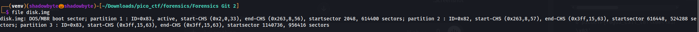
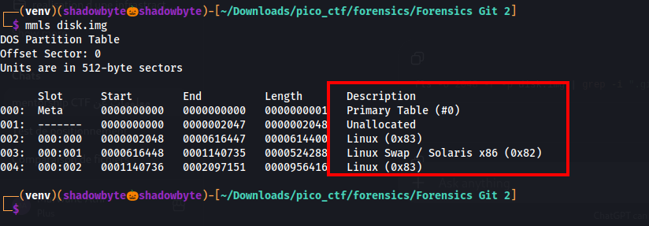
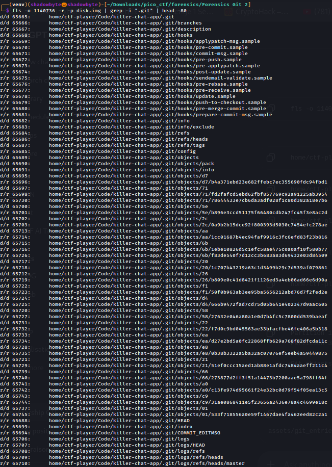
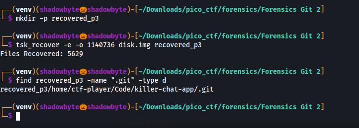
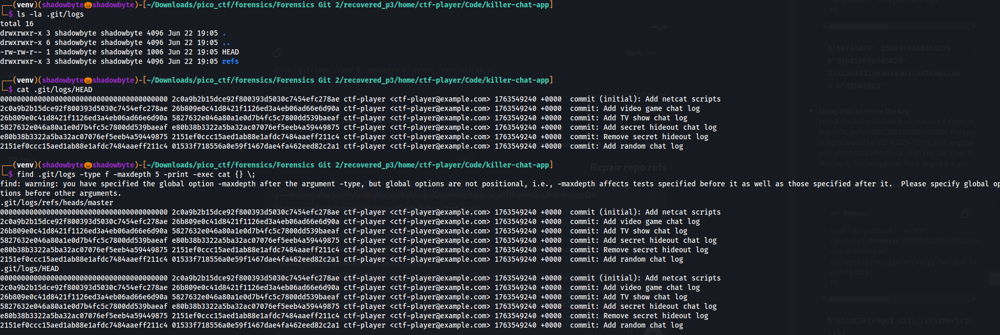
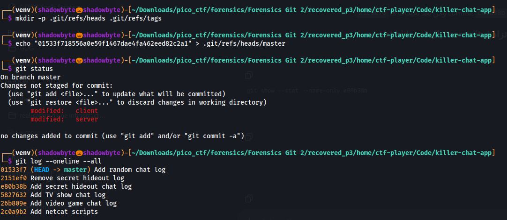
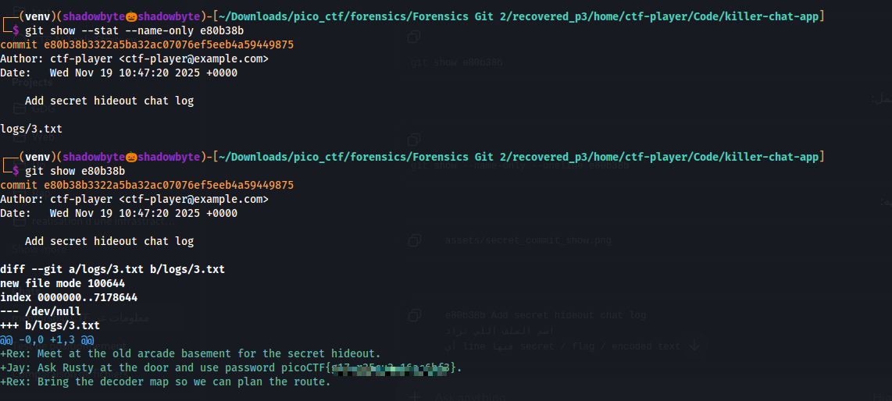

# Forensics Git 2

**Category:** Forensics
**Difficulty:** Medium
**Author:** LT "syreal" Jones

---

## Challenge Description

The challenge provides a disk image and asks us to recover a deleted Git repository.

The hint says:

```text
We think the deletion was interrupted before any git objects were touched
```

This means the attacker probably deleted or damaged some repository metadata, but the Git objects themselves may still be recoverable.

The goal is to recover the repository, repair it if necessary, inspect the Git history, and recover the flag.

---

## Disk Image Inspection

I started by checking the disk image type:

```bash
file disk.img
```



The output showed that the file was a DOS/MBR disk image with multiple partitions:

```text
disk.img: DOS/MBR boot sector
```

Since image with multiple partitions:

```text
disk.img: DOS/MBR boot sector
```

Since the image contained partitions, I could not directly run filesystem tools on `disk.img` without identifying the correct partition offset.

---

## Partition Table Analysis

I used `mmls` to list the partition table:

```bash
mmls disk.img
```



The output showed two Linux partitions and one swap partition:

```text
Linux partition 1 start sector: 2048
Linux swap partition start sector: 616448
Linux partition 3 start sector: 1140736
```

The likely filesystem partitions were:

```text
2048
1140736
```

So I checked both of them using SleuthKit.

---

## Searching for the Git Repository

First, I searched the first Linux partition:

```bash
fls -o 2048 -r -p disk.img | grep -i ".git" | head -80
```


This did not reveal the target Git repository.

Then I searched the third Linux partition:

```bash
fls -o 1140736 -r -p disk.img | grep -i ".git" | head -80
```



This revealed the repository path:

```text
home/ctf-player/Code/killer-chat-app/.git
```

Important recovered Git entries included:

```text
.git
.git/objects
.git/HEAD
.git/index
.git/logs/refs/heads/master
```

This matched the hint: the Git object database was still present.

---

## Recovering Files from the Correct Partition

Since the repository was located in the partition starting at sector `1140736`, I recovered files from that partition using `tsk_recover`:

```bash
mkdir -p recovered_p3
tsk_recover -e -o 1140736 disk.img recovered_p3
```

Then I confirmed that the `.git` directory was recovered:

```bash
find recovered_p3 -name ".git" -type d
```



The recovered repository was found at:

```text
recovered_p3/home/ctf-player/Code/killer-chat-app/.git
```

---

## Broken Git Repository

After entering the recovered project directory:

```bash
cd recovered_p3/home/ctf-player/Code/killer-chat-app
```

I listed the files:

```bash
ls -la
```

The project contained:

```text
client
server
logs
.git
```

However, running `git status` initially failed because the repository was incomplete.
The `.git/HEAD` file existed, but the `.git/refs` directory was missing.

The `HEAD` file pointed to:

```text
ref: refs/heads/master
```

But the target reference file did not exist:

```text
.git/refs/heads/master
```

So Git could not resolve the current branch.

---

## Inspecting Git Logs

Because the hint said the Git objects were probably not touched, I inspected the Git reflogs:

```bash
cat .git/logs/HEAD
```

I also checked the branch log:

```bash
cat .git/logs/refs/heads/master
```



The logs revealed the full commit history:

```text
2c0a9b2 Add netcat scripts
26b809e Add video game chat log
5827632 Add TV show chat log
e80b38b Add secret hideout chat log
2151ef0 Remove secret hideout log
01533f7 Add random chat log
```

The suspicious commits were:

```text
e80b38b Add secret hideout chat log
2151ef0 Remove secret hideout log
```

The commit `e80b38b` added a secret hideout chat log, and the next commit removed it.
This strongly suggested that the flag was hidden in the removed chat log.

---

## Repairing the Git References

The latest commit hash from the logs was:

```text
01533f718556a0e59f1467dae4fa462eed82c2a1
```

I recreated the missing Git reference:

```bash
mkdir -p .git/refs/heads .git/refs/tags
echo "01533f718556a0e59f1467dae4fa462eed82c2a1" > .git/refs/heads/master
```

Then I checked the repository again:

```bash
git status
git log --oneline --all
```



The Git history was now readable:

```text
01533f7 Add random chat log
2151ef0 Remove secret hideout log
e80b38b Add secret hideout chat log
5827632 Add TV show chat log
26b809e Add video game chat log
2c0a9b2 Add netcat scripts
```

The repository was successfully repaired enough to inspect its history.

---

## Recovering the Deleted Secret Log

I inspected the suspicious commit:

```bash
git show --stat --name-only e80b38b
```

This showed that the commit added:

```text
logs/3.txt
```

Then I displayed the full commit content:

```bash
git show e80b38b
```



The commit added a file named:

```text
logs/3.txt
```

Inside the diff, the chat log contained a message revealing the flag.

The important part was:

```text
Jay: Ask Rusty at the door and use password picoCTF{...}
```

So the flag was recovered from the deleted Git commit.

---

## Investigation Summary

```text
1. Checked disk.img and found it was a DOS/MBR disk image.
2. Used mmls to identify partition offsets.
3. Checked partition 1 at offset 2048, but no target Git repo was found.
4. Checked partition 3 at offset 1140736 and found killer-chat-app/.git.
5. Recovered the partition using tsk_recover.
6. Found the recovered Git repository.
7. Discovered that .git/refs was missing.
8. Used .git/logs/HEAD and .git/logs/refs/heads/master to recover commit history.
9. Recreated .git/refs/heads/master using the latest commit hash.
10. Restored Git functionality enough to view the commit history.
11. Identified the suspicious commit: Add secret hideout chat log.
12. Used git show on that commit.
13. Recovered the flag from logs/3.txt.
```

---

## Tools Used

```text
file
mmls
fls
tsk_recover
find
cat
git status
git log
git show
```

---

## Key Takeaways

* Disk images with partition tables require offset-aware analysis.
* `mmls` helps identify partition start sectors.
* `fls` can locate filesystem artifacts such as `.git`.
* `tsk_recover` can recover deleted files from a disk image.
* Git repositories can still be recoverable even if some metadata is missing.
* `.git/logs/HEAD` and branch reflogs can be used to reconstruct missing refs.
* Deleted files may still exist inside Git history.
* Suspicious commit messages are useful forensic clues.

---

## Final Flag

```text
picoCTF{...REDACTED...}
```
