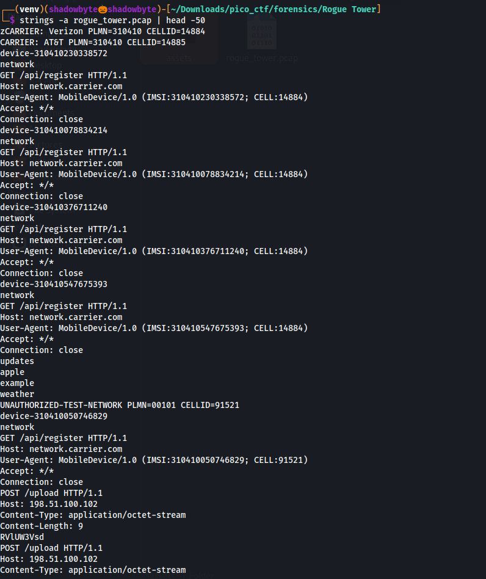
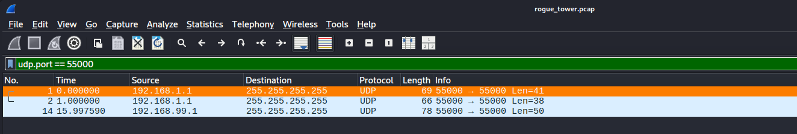
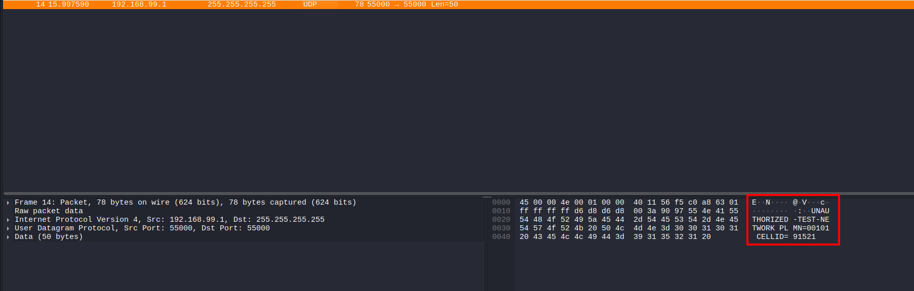
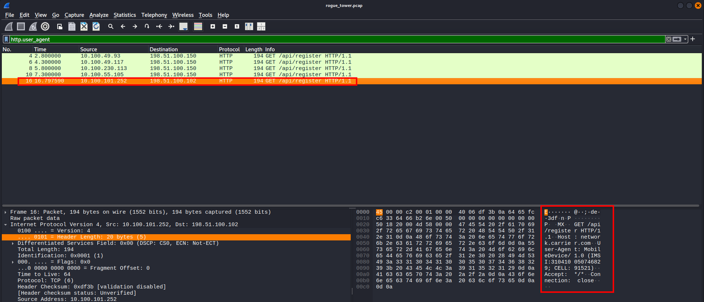
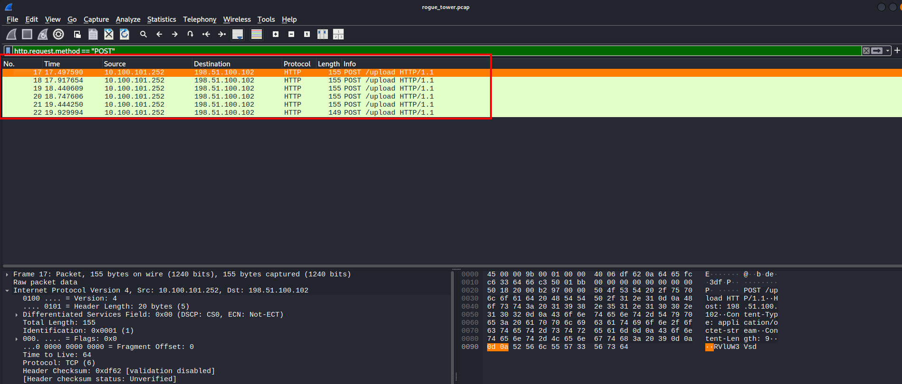
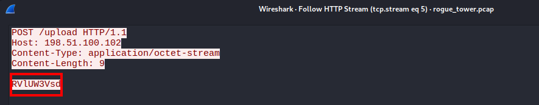
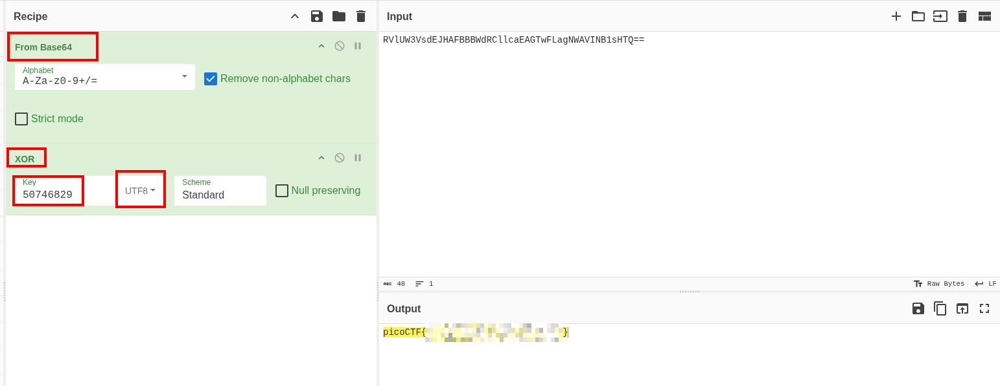

# Rogue Tower

**Category:** Forensics
**Difficulty:** Medium
**Author:** Samuel Dinesh

---

## Challenge Description

A suspicious cell tower was detected in the network.
The goal is to analyze the network traffic capture, identify the rogue tower, find the compromised device, and recover the exfiltrated flag.

The hints were:

```text
1. Look for unauthorized test network broadcasts on UDP port 55000
2. Find the device that connected to the rogue tower by checking HTTP User-Agent headers
3. The encryption key is derived from the victim device's IMSI
4. The exfiltrated data is split across multiple HTTP POST requests
```

---

## Initial Triage

I started by checking the capture with `strings` to quickly identify readable network artifacts:

```bash
strings -a rogue_tower.pcap | head -50
```



The output revealed several useful pieces of information:

```text
CARRIER: Verizon PLMN=310410 CELLID=14884
CARRIER: AT&T PLMN=310410 CELLID=14885
GET /api/register HTTP/1.1
User-Agent: MobileDevice/1.0 (IMSI:...; CELL:...)
UNAUTHORIZED-TEST-NETWORK PLMN=00101 CELLID=91521
```

The interesting entry was:

```text
UNAUTHORIZED-TEST-NETWORK PLMN=00101 CELLID=91521
```

This matched the first hint and suggested that `CELLID=91521` was the rogue tower.

---

## Finding the Rogue Tower Broadcast

I opened the PCAP in Wireshark and filtered UDP traffic on port `55000`:

```text
udp.port == 55000
```



The filter showed multiple UDP broadcasts.

The suspicious one was sent from:

```text
192.168.99.1 → 255.255.255.255
```

Inspecting the packet data revealed the rogue tower broadcast:



The broadcast contained:

```text
UNAUTHORIZED-TEST-NETWORK PLMN=00101 CELLID=91521
```

So the rogue tower details were:

```text
Network: UNAUTHORIZED-TEST-NETWORK
PLMN:    00101
CELLID:  91521
```

---

## Identifying the Victim Device

The next hint said to check HTTP User-Agent headers.

In Wireshark, I filtered HTTP User-Agent traffic:

```text
http.user_agent
```



Most devices were connected to legitimate cells, but one device registered with the rogue cell:

```http
GET /api/register HTTP/1.1
Host: network.carrier.com
User-Agent: MobileDevice/1.0 (IMSI:310410050746829; CELL:91521)
```

This device matched the rogue `CELLID=91521`.

Therefore, the victim information was:

```text
Victim IP:   10.100.101.252
Victim IMSI: 310410050746829
Rogue CELL:  91521
```

The exfiltration server was:

```text
198.51.100.102
```

---

## Finding the Exfiltrated Data

The final hint said that the exfiltrated data was split across multiple HTTP POST requests.

I filtered HTTP POST requests in Wireshark:

```text
http.request.method == "POST"
```



This showed six POST requests from the victim device:

```text
10.100.101.252 → 198.51.100.102
POST /upload HTTP/1.1
```

Each POST request contained a small fragment of data.

By following the HTTP streams and collecting the payloads in packet order, I reconstructed the full exfiltrated string.

Example HTTP stream fragment:



After joining all fragments, I got:

```text
RVlUW3VsdEJHAFBBBWdRCllcaEAGTwFLagNWAVINB1sHTQ==
```

This looked like Base64-encoded encrypted data.

---

## Deriving the Encryption Key

The hint said:

```text
The encryption key is derived from the victim device's IMSI
```

The victim IMSI was:

```text
310410050746829
```

The key was derived from the last 8 digits of the IMSI:

```text
IMSI: 310410050746829
Key:  50746829
```

---

## Decrypting the Flag

I used CyberChef to decode and decrypt the exfiltrated data.

The recipe was:

```text
From Base64
XOR
```

The XOR key was:

```text
50746829
```

The key format was set to:

```text
UTF8
```



CyberChef successfully decrypted the data and revealed the flag:

```text
picoCTF{r0gu3_c3ll_t0w3r_3a5d55b2}
```

---

## Investigation Summary

```text
1. Performed initial triage using strings.
2. Found carrier and network broadcast information.
3. Filtered UDP traffic on port 55000.
4. Identified the rogue tower:
   UNAUTHORIZED-TEST-NETWORK PLMN=00101 CELLID=91521
5. Checked HTTP User-Agent headers.
6. Found the victim device connected to CELLID 91521.
7. Extracted the victim IMSI: 310410050746829.
8. Filtered HTTP POST requests.
9. Collected six POST /upload fragments.
10. Reassembled the exfiltrated Base64 string.
11. Derived the XOR key from the last 8 digits of the IMSI.
12. Decrypted the data with CyberChef.
13. Recovered the flag.
```

---

## Tools Used

```text
strings
Wireshark
Display filters
Follow HTTP Stream
CyberChef
Base64 decoding
XOR decoding
```

---

## Key Takeaways

* UDP broadcast traffic can reveal rogue network advertisements.
* Wireshark filters are useful for narrowing down suspicious traffic quickly.
* HTTP User-Agent headers can leak sensitive device identifiers such as IMSI and cell ID.
* Exfiltrated data may be split across multiple HTTP requests.
* Reassembling fragments in packet order is important.
* If encryption keys are derived from identifiers, leaked metadata can become critical evidence.
* CyberChef is useful for decoding and decrypting forensic artifacts quickly.

---

## Final Flag

```text
picoCTF{r0gu3_c3ll_t0w3r_3a5d55b2}
```
