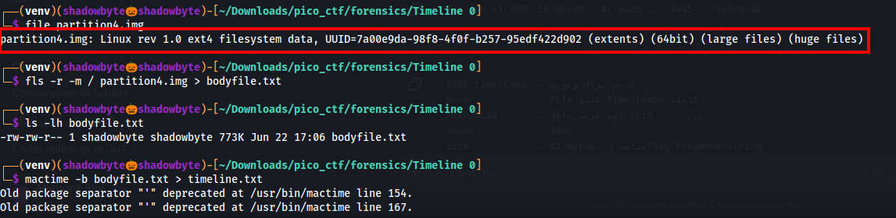
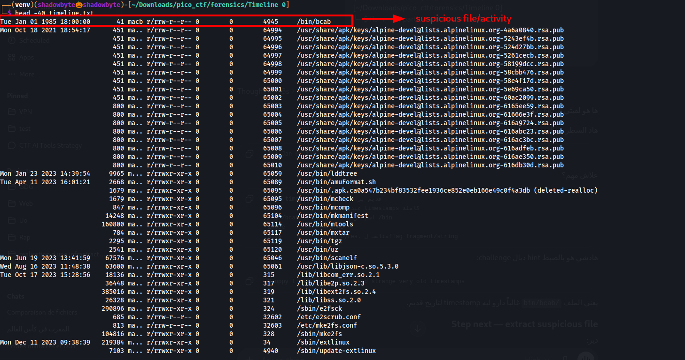
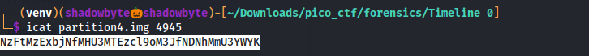
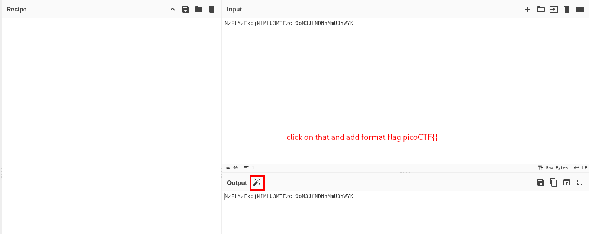

# Timeline 0

**Category:** Forensics
**Difficulty:** Medium
**Author:** LT "syreal" Jones

---

## Challenge Description

The challenge provides a Linux disk image and asks us to find hidden information inside it.

The hints are:

```text
1. Create a Sleuthkit MAC timeline!
2. Sloppy timestomping can yield strange (very old) timestamps
```

The goal is to analyze filesystem timestamps, find suspicious timestomping activity, recover the hidden content, and wrap it in the picoCT find suspicious timestomping activity, recover the hidden content, and wrap it in the picoCTF flag format.

---

## Initial File Inspection

I started by checking the provided disk image:

```bash
file partition4.img
```



The output showed:

```text
partition4.img: Linux rev 1.0 ext4 filesystem data
```

So the file is an ext4 filesystem image.

Since this is a forensic disk image, I used SleuthKit tools instead of mounting it directly.

---

## Creating the SleuthKit Bodyfile

To create a timeline, I first generated a SleuthKit bodyfile with `fls`:

```bash
fls -r -m / partition4.img > bodyfile.txt
```

Explanation:

```text
fls              lists files and directories from the filesystem image
-r               recursive listing
-m /             uses / as the mount point prefix
bodyfile.txt     output file used by mactime
```

After running the command, `bodyfile.txt` was successfully created.

---

## Creating the MAC Timeline

Next, I converted the bodyfile into a MAC timeline:

```bash
mactime -b bodyfile.txt > timeline.txt
```

Then I inspected the beginning of the timeline:

```bash
head -40 timeline.txt
```



The first entry immediately looked suspicious:

```text
Tue Jan 01 1985 18:00:00       41 macb r/rrw-r--r-- 0 0 4945 /bin/bcab
```

This matched the hint about sloppy timestomping.

The timestamp `Jan 01 1985` is extremely old compared to the rest of the filesystem activity, which starts mostly around 2021 and later.

---

## Suspicious File Identification

The suspicious entry was:

```text
/bin/bcab
```

Important details:

```text
Timestamp:  Tue Jan 01 1985 18:00:00
Flags:      macb
Size:       41 bytes
Inode:      4945
Path:       /bin/bcab
```

This file stood out because:

```text
1. The timestamp is strangely old.
2. The file name is unusual for /bin.
3. The size is small enough to contain a hidden string.
4. The macb flags show a full timestamp entry.
5. It appears before normal system files in the timeline.
```

Because of that, I decided to extract the file using its inode.

---

## Extracting the Suspicious File

The inode of `/bin/bcab` was:

```text
4945
```

I extracted it with `icat`:

```bash
icat partition4.img 4945
```



The output was:

```text
NzFtMzExbjNfMHU3MTEzc19oM3JfNDNhMmU3YWYK
```

The string looked like Base64.

---

## Decoding the Hidden Data

I decoded the extracted string using CyberChef.



The decoded value was:

```text
```

The challenge says to wrap what we find in the picoCTF flag format.

Therefore, the final flag is:

```text
picoCTF{use_your_brain}
```

---

## Investigation Summary

```text
1. Identified partition4.img as an ext4 filesystem image.
2. Generated a SleuthKit bodyfile using fls.
3. Created a MAC timeline with mactime.
4. Checked the beginning of the timeline for old timestamps.
5. Found a suspicious file /bin/bcab with a very old timestamp: Jan 01 1985.
6. Noted its inode number: 4945.
7. Extracted the file content using icat.
8. Found a Base64-encoded string.
9. Decoded the string.
10. Wrapped the decoded text in picoCTF{}.
```

---

## Tools Used

```text
file
fls
mactime
head
icat
CyberChef
Base64 decoder
```

---

## Key Takeaways

* MAC timeline analysis is useful for detecting suspicious filesystem activity.
* Timestomping can be detected by looking for abnormal timestamps.
* A very old timestamp can be a strong indicator of tampering.
* SleuthKit tools such as `fls`, `mactime`, and `icat` are useful for disk image forensics.
* Small suspicious files should be extracted and inspected.
* Encoded strings such as Base64 are common in CTF forensics challenges.

---

## Final Flag

```text
picoCTF{use_your_brain}
```
