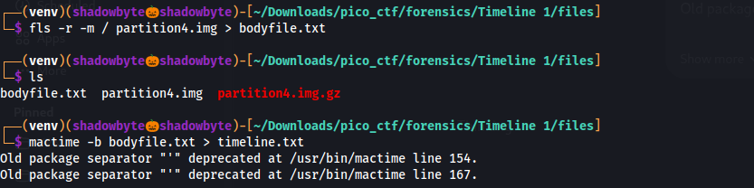
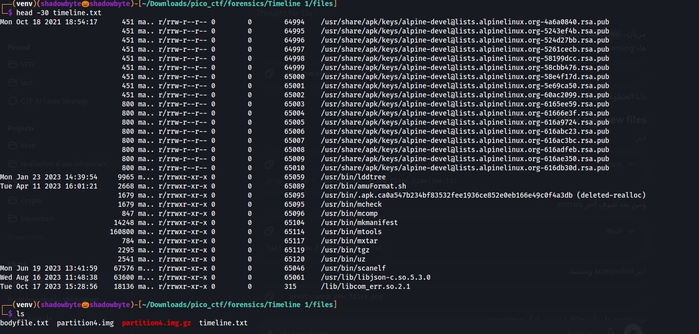
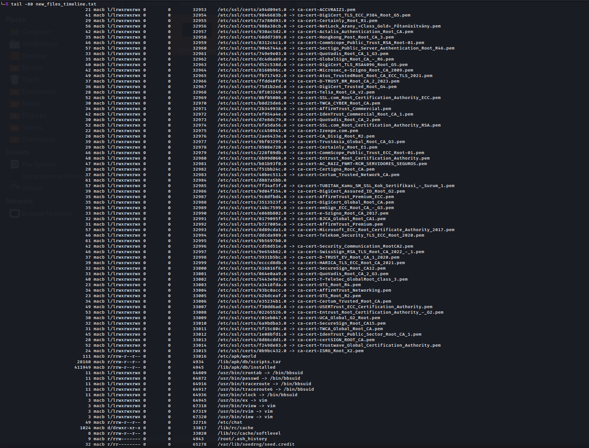
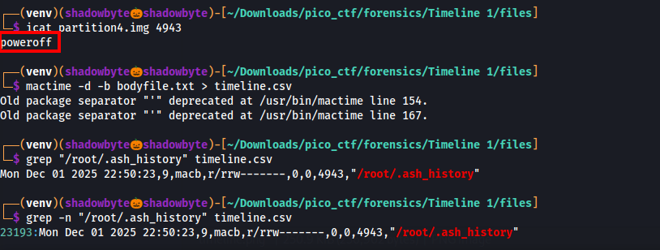
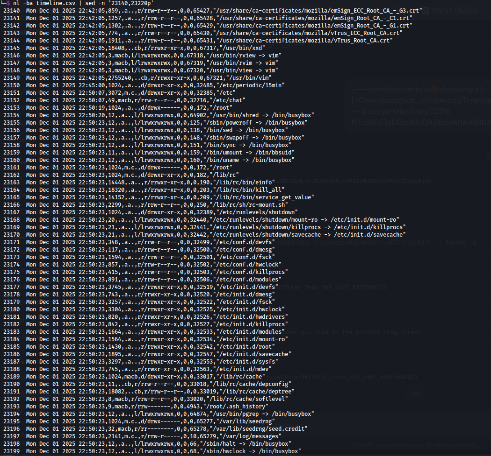
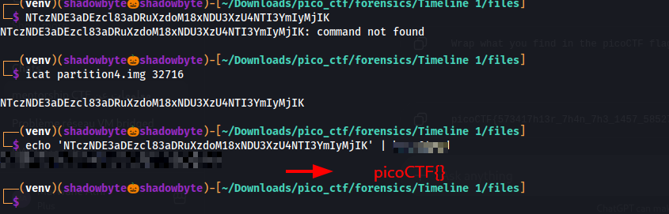

# Timeline 1

**Category:** Forensics
**Difficulty:** Medium
**Author:** LT "syreal" Jones

---

## Challenge Description

The challenge provides a Linux disk image and asks us to find hidden information inside it.

The hints point us toward timeline analysis:

```text
1. Create a Sleuthkit MAC timeline!
2. Look at recent timestamps
3. Pay close attention to timestamps near an anti-forensic action
4. Filter only new files by grepping for macb
```

The goal is to identify suspicious file activity from the filesystem timeline and recover the flag.

---

## Initial File Inspection

The provided file was an ext4 filesystem image:

```bash
file partition4.img
```

The output showed:

```text
partition4.img: Linux rev 1.0 ext4 filesystem data
```

Since this is a filesystem image, I did not mount it directly.
Instead, I used SleuthKit tools to analyze it forensically.

---

## Creating a SleuthKit Bodyfile

To build a timeline, I first generated a SleuthKit bodyfile using `fls`:

```bash
fls -r -m / partition4.img > bodyfile.txt
```



Explanation of the command:

```text
fls              lists files and directories from the filesystem image
-r               recursively lists directories
-m /             prefixes paths with /
bodyfile.txt     output file used later by mactime
```

This created `bodyfile.txt`, which contains filesystem metadata in a format that `mactime` can process.

---

## Creating the MAC Timeline

Next, I converted the bodyfile into a MAC timeline:

```bash
mactime -b bodyfile.txt > timeline.txt
```



The timeline includes file activity based on:

```text
M = Modified time
A = Accessed time
C = Changed time
B = Birth/Created time
```

The warnings from `mactime` were not important for solving the challenge:

```text
Old package separator "'" deprecated
```

The timeline was still generated correctly.

---

## Filtering Newly Created Files

The hint said:

```text
Filter only new files by grepping for macb
```

So I filtered the timeline for entries with `macb`:

```bash
grep " macb " timeline.txt > new_files_timeline.txt
```


The `macb` flag means the file has all four timestamp fields present in that timeline entry.
For this challenge, this helped reduce the noise and focus on newly created files.

Then I inspected the end of the filtered timeline:

```bash
tail -80 new_files_timeline.txt
```



At this stage, most entries were normal system files.
However, one interesting file appeared:

```text
/root/.ash_history
```

This file is useful because it can reveal commands executed by the root user.

---

## Extracting Root Shell History

From the timeline, `/root/.ash_history` had inode `4943`.

I extracted it using `icat`:

```bash
icat partition4.img 4943
```



The output was:

```text
poweroff
```

This tells us that the last recorded shell command was `poweroff`.

This is important because the hints mention looking near an anti-forensic action.
A shutdown right after suspicious activity can indicate that someone tried to stop the system after hiding or deleting evidence.

---

## Creating a CSV Timeline

To make the timestamp analysis easier, I generated a CSV-style timeline:

```bash
mactime -d -b bodyfile.txt > timeline.csv
```

Then I searched for `/root/.ash_history`:

```bash
grep "/root/.ash_history" timeline.csv
```

The result was:

```text
Mon Dec 01 2025 22:50:23,9,macb,r/rrw-------,0,0,4943,"/root/.ash_history"
```

So the relevant time was:

```text
Mon Dec 01 2025 22:50:23
```

I then inspected timeline entries around that time:

```bash
nl -ba timeline.csv | sed -n '23140,23220p'
```



This part of the timeline showed several important events:

```text
Mon Dec 01 2025 22:50:20  /usr/bin/shred -> /bin/busybox
Mon Dec 01 2025 22:50:23  /sbin/poweroff -> /bin/busybox
Mon Dec 01 2025 22:50:23  /root/.ash_history
```

The access to `shred` is suspicious because `shred` is commonly used to destroy file contents.

Close to this same time window, one file stood out:

```text
Mon Dec 01 2025 22:50:07,49,macb,r/rrw-r--r--,0,0,32716,"/etc/chat"
```

This file was interesting because:

```text
1. It appeared very close to the shutdown time.
2. It had macb timestamps.
3. It was only 49 bytes.
4. The path /etc/chat looked unusual.
5. It appeared shortly before shred and poweroff activity.
```

So I decided to extract it.

---

## Extracting the Suspicious File

The suspicious file `/etc/chat` had inode:

```text
32716
```

I extracted it with:

```bash
icat partition4.img 32716
```

The output was:

```text
NTczNDE3aDEzcl83aDRuXzdoM18xNDU3XzU4NTI3YmIyMjIK
```

This looked like Base64.

I decoded it using:

```bash
echo 'NTczNDE3aDEzcl83aDRuXzdoM18xNDU3XzU4NTI3YmIyMjIK' | base64 -d
```



The decoded value was:

```text
573417h13r_7h4n_7h3_1457_58527bb222
```

The challenge description says to wrap what we find in the picoCTF flag format.

Therefore, the flag is:

```text
picoCTF{573417h13r_7h4n_7h3_1457_58527bb222}
```

---

## Investigation Summary

```text
1. Identified partition4.img as an ext4 filesystem image.
2. Used fls to generate a SleuthKit bodyfile.
3. Used mactime to create a MAC timeline.
4. Filtered new files with grep " macb ".
5. Found /root/.ash_history and extracted it with icat.
6. The shell history contained poweroff.
7. Generated a CSV timeline to inspect nearby timestamps.
8. Found /usr/bin/shred accessed shortly before shutdown.
9. Noticed suspicious file /etc/chat near the same timestamp.
10. Extracted /etc/chat using inode 32716.
11. Found a Base64 string.
12. Decoded it and wrapped the result in picoCTF{}.
```

---

## Tools Used

```text
file
fls
mactime
grep
tail
nl
sed
icat
base64
```

---

## Key Takeaways

* MAC timelines are powerful for forensic investigation.
* `fls` and `mactime` can reveal file creation, modification, access, and metadata change times.
* Filtering for `macb` can help identify newly created files.
* Shell history files such as `.ash_history` can reveal important user actions.
* Anti-forensic tools like `shred` should be treated as strong indicators of suspicious activity.
* Files created shortly before shutdown or anti-forensic actions deserve closer inspection.
* `icat` can recover file content directly from a filesystem image using inode numbers.

---

## Final Flag

```text
picoCTF{use_your_br4in}
```
