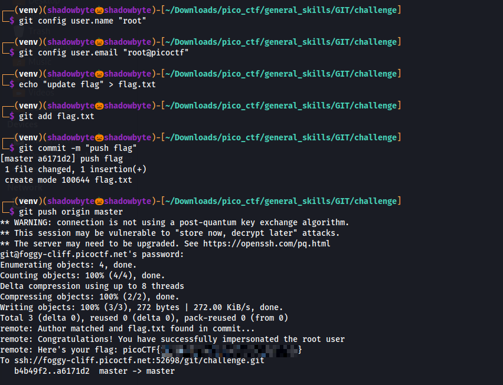

# MY GIT

**Category:** General Skills
**Difficulty:** Easy
**Author:** Darkraicg492

---

## Challenge Description

The challenge provides access to a custom Git server and asks us to retrieve the flag.

We are given the following clone command:

```bash
git clone ssh://git@foggy-cliff.picoctf.net:52698/git/challenge.git
```

The password is also provided:

```text
e38a0906
```

The challenge hint says:

```text
How do you specify your Git username and email?
```

This suggests that the Git server checks the identity of the user who makes the commit.

---

## Cloning the Repository

I started by cloning the remote Git repository:

```bash
git clone ssh://git@foggy-cliff.picoctf.net:52698/git/challenge.git
```

When prompted to trust the host, I answered:

```text
yes
```

Then I entered the provided password.

After cloning, I entered the repository:

```bash
cd challenge
```

I listed the files:

```bash
ls
```

The repository contained:

```text
README.md
```

I opened the README:

```bash
cat README.md
```


The README contained the key instruction:

```text
Only flag.txt pushed by root:root@picoctf will be updated with the flag.
```

This means that the server expects a commit containing `flag.txt`, but the commit author must be:

```text
root <root@picoctf>
```

---

## Configuring the Git Identity

Git allows us to configure the commit author name and email locally inside a repository.

So I set the local Git username to:

```bash
git config user.name "root"
```

Then I set the local Git email to:

```bash
git config user.email "root@picoctf"
```

These settings only affect this repository, which is safer than changing the global Git configuration.

---

## Creating and Committing `flag.txt`

The README said that `flag.txt` must be pushed.

So I created the file:

```bash
echo "update flag" > flag.txt
```

Then I staged it:

```bash
git add flag.txt
```

After that, I committed it:

```bash
git commit -m "push flag"
```

The commit was created successfully:

```text
[master a6171d2] push flag
1 file changed, 1 insertion(+)
create mode 100644 flag.txt
```

---

## Pushing to the Remote Server

Next, I pushed the commit to the remote repository:

```bash
git push origin master
```

After entering the password, the remote server accepted the push.



The server output confirmed that the author matched:

```text
remote: Author matched and flag.txt found in commit...
remote: Congratulations! You have successfully impersonated the root user
```

Then it printed the flag:

```text
remote: Here's your flag: picoCTF{1mp3rs0n4t4_g17_345y_02a39618}
```

---

## Why This Works

The server checks the Git commit metadata, specifically the commit author identity.

By setting:

```bash
git config user.name "root"
git config user.email "root@picoctf"
```

the commit appears to have been made by:

```text
root <root@picoctf>
```

Since the repository rules required `flag.txt` to be pushed by `root:root@picoctf`, the server-side hook accepted the commit and returned the flag.

---

## Full Command Sequence

```bash
git clone ssh://git@foggy-cliff.picoctf.net:52698/git/challenge.git

cd challenge

cat README.md

git config user.name "root"
git config user.email "root@picoctf"

echo "update flag" > flag.txt
git add flag.txt
git commit -m "push flag"

git push origin master
```

---

## Investigation Summary

```text
1. Cloned the challenge repository using SSH.
2. Read README.md.
3. Found that flag.txt must be pushed by root:root@picoctf.
4. Configured the local Git username as root.
5. Configured the local Git email as root@picoctf.
6. Created flag.txt.
7. Added and committed the file.
8. Pushed the commit to the remote server.
9. The server verified the author and returned the flag.
```

---

## Tools Used

```text
git clone
git config
git add
git commit
git push
cat
```

---

## Key Takeaways

* Git commits contain author metadata.
* The author name and email can be configured locally with `git config`.
* Server-side Git hooks can inspect commits and enforce custom rules.
* In this challenge, impersonating the expected Git identity was enough to trigger the flag.

---

## Final Flag

```text
picoCTF{1mp3rs0n4t4_g17_345y_02a39618}
```
