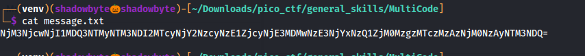
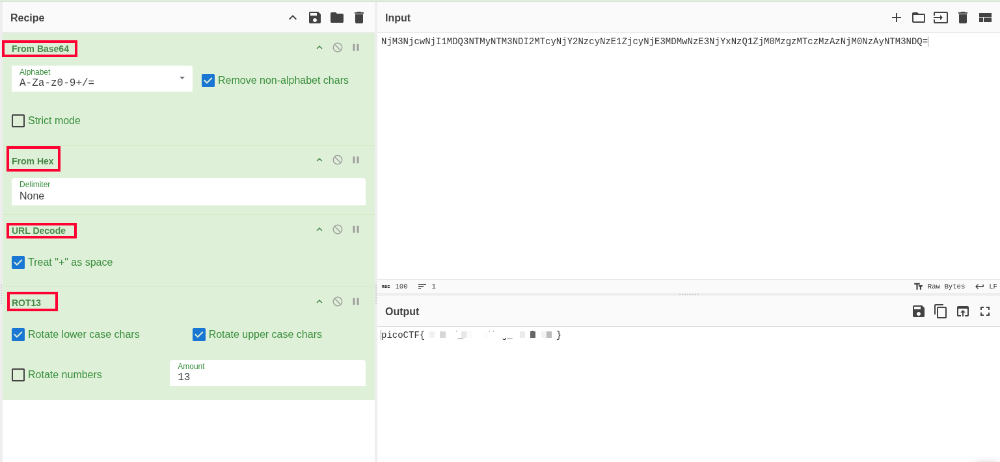

# MultiCode

**Category:** General Skills
**Difficulty:** Easy
**Author:** Yahaya Meddy

---

## Challenge Description

The challenge provides an encoded message and asks us to recover the hidden flag.

The description says that there is no encryption involved, only multiple layers of common encodings.

The hints mention several possible encoding layers:

```text
ROT13
URL encoding
Hex
Base64
```

So the goal is to identify the correct decoding order and peel back each layer until the flag appears.

---

## Reading the Message

I started by displaying the content of the downloaded message file:

```bash
cat message.txt
```



The file contained a long encoded string:

```text
NjM3NjcwNjI1MDQ3NTMyNTM3NDI2MTcyNjY2NzcyNzE1ZjcyNjE3MDMwNzE3NjYxNzQ1ZjM0MzgzMTczMzAzNjM0NzAyNTM3NDQ=
```

The string ends with `=`, which is a common sign of Base64 padding.

So the first layer is likely Base64.

---

## Step 1 — Base64 Decoding

I opened CyberChef and used the operation:

```text
From Base64
```

After decoding the Base64 layer, the output became:

```text
637670625047532537426172666772715f72617030717661745f3438317330363470253744
```

This output only contains hexadecimal characters:

```text
0-9
a-f
```

So the next layer is Hex.

---

## Step 2 — Hex Decoding

I added the second CyberChef operation:

```text
From Hex
```

The recipe became:

```text
From Base64
From Hex
```

After this step, the output became:

```text
cvpbPGS%7Barfgrq_rap0qvat_481s064p%7D
```

This output contains `%7B` and `%7D`, which are URL-encoded characters.

Specifically:

```text
%7B = {
%7D = }
```

So the next layer is URL encoding.

---

## Step 3 — URL Decoding

I added the third operation:

```text
URL Decode
```

The recipe became:

```text
From Base64
From Hex
URL Decode
```

After URL decoding, the output became:

```text
cvpbPGS{arfgrq_rap0qvat_481s064p}
```

This looks like a picoCTF flag, but the letters are shifted.

For example:

```text
cvpbPGS
```

looks like an encoded version of:

```text
picoCTF
```

This indicates ROT13.

---

## Step 4 — ROT13 Decoding

I added the final operation:

```text
ROT13
```

The complete CyberChef recipe was:

```text
From Base64
From Hex
URL Decode
ROT13
```



After applying ROT13, the final flag appeared.

---

## Correct Decoding Order

The correct order of decoding layers was:

```text
1. From Base64
2. From Hex
3. URL Decode
4. ROT13
```

---

## Investigation Summary

```text
1. Read the encoded message from message.txt.
2. Identified the first layer as Base64 because of the format and padding.
3. Decoded Base64 and obtained a hexadecimal string.
4. Decoded the Hex layer and obtained a URL-encoded string.
5. URL decoded the string and obtained a ROT13-looking flag.
6. Applied ROT13.
7. Recovered the final picoCTF flag.
```

---

## Tools Used

```text
cat
CyberChef
Base64 decoding
Hex decoding
URL decoding
ROT13
```

---

## Key Takeaways

* Encoded data often has recognizable patterns.
* Base64 strings often contain `A-Z`, `a-z`, `0-9`, `+`, `/`, and may end with `=`.
* Hex strings usually contain only `0-9` and `a-f`.
* URL encoding often uses `%xx` format, such as `%7B` and `%7D`.
* ROT13 is a simple letter rotation where applying ROT13 again restores the original text.
* CyberChef is useful for chaining multiple decoding operations in one place.

---

## Final Flag

```text
picoCTF{use_your_brain!!!}
```
