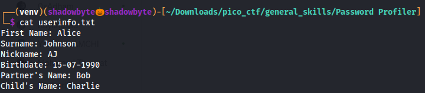
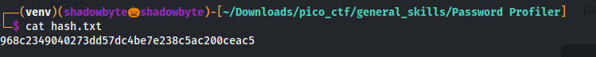
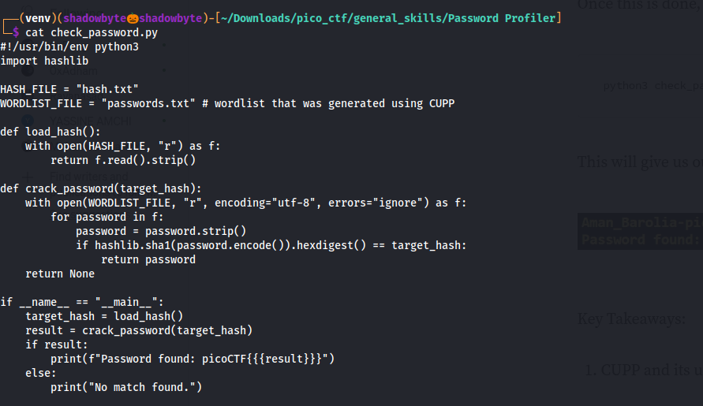
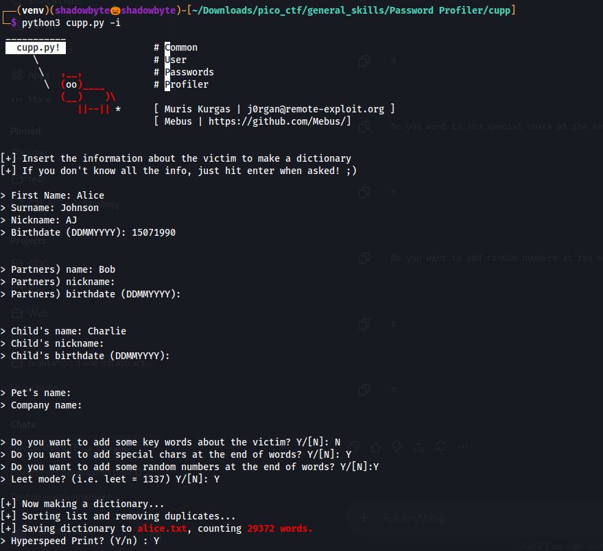
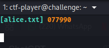
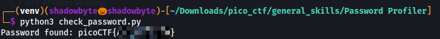

# Password Profiler

**Category:** General Skills
**Difficulty:** Easy
**Author:** Yahaya Meddy

---

## Challenge Description

The challenge provides a SHA-1 hash instead of the original password.
We are also given personal information about the target and a script that checks generated passwords against the hash.

The goal is to use OSINT-style information to generate a custom password list, then recover the original password by matching its SHA-1 hash.

The hint suggests using **CUPP**, a tool for generating personalized wordlists from information about a target.

---

## Given Files

The challenge provides three important files:

```text
userinfo.txt
hash.txt
check_password.py
```

The `userinfo.txt` file contains personal details about the target:

```text
First Name: Alice
Surname: Johnson
Nickname: AJ
Birthdate: 15-07-1990
Partner's Name: Bob
Child's Name: Charlie
```



The `hash.txt` file contains the SHA-1 hash:

```text
968c2349040273dd57dc4be7e238c5ac200ceac5
```



---

## Understanding the Password Checker

I opened the provided Python script:

```bash
cat check_password.py
```



The script defines:

```python
HASH_FILE = "hash.txt"
WORDLIST_FILE = "passwords.txt"
```

It loads the target hash from `hash.txt`, then reads passwords from `passwords.txt`.

For every candidate password, it calculates:

```python
hashlib.sha1(password.encode()).hexdigest()
```

If the generated SHA-1 hash matches the target hash, the script prints:

```text
Password found: picoCTF{password}
```

So the main task is to generate a good `passwords.txt` wordlist.

---

## Generating a Custom Wordlist with CUPP

I used CUPP in interactive mode:

```bash
python3 cupp.py -i
```

CUPP asks for information about the victim.

I entered the information from `userinfo.txt`:

```text
First Name: Alice
Surname: Johnson
Nickname: AJ
Birthdate (DDMMYYYY): 15071990

Partner's name: Bob
Partner's nickname:
Partner's birthdate:

Child's name: Charlie
Child's nickname:
Child's birthdate:

Pet's name:
Company name:
```

For additional keywords, I selected `N` because no extra information was provided.

For wordlist mutations, I selected useful options:

```text
Add special chars: Y
Add random numbers: Y
Leet mode: Y
```



CUPP generated a custom dictionary named:

```text
alice.txt
```

The output showed that the generated wordlist contained many candidate passwords.



---

## Preparing the Wordlist

The checker script expects the wordlist to be named:

```text
passwords.txt
```

So I copied or renamed the CUPP output:

```bash
cp cupp/alice.txt passwords.txt
```

or, if already inside the CUPP directory:

```bash
cp alice.txt ../passwords.txt
```

This makes the generated CUPP wordlist available to `check_password.py`.

---

## Cracking the Hash

After preparing the wordlist, I ran the provided script:

```bash
python3 check_password.py
```

The script tested each password candidate by hashing it with SHA-1 and comparing it to the hash in `hash.txt`.

The script found the matching password and printed the flag.



---

## Full Command Sequence

```bash
cat userinfo.txt
cat hash.txt
cat check_password.py

git clone https://github.com/Mebus/cupp.git
cd cupp
python3 cupp.py -i

cp alice.txt ../passwords.txt
cd ..

python3 check_password.py
```

---

## Investigation Summary

```text
1. Read userinfo.txt to collect personal details about the target.
2. Read hash.txt to get the SHA-1 hash.
3. Inspected check_password.py to understand the expected wordlist file name.
4. Used CUPP to generate a custom password list from the OSINT information.
5. Saved the generated wordlist as passwords.txt.
6. Ran check_password.py.
7. The script hashed each candidate with SHA-1 and compared it to the target hash.
8. A matching password was found.
9. The password was printed inside the picoCTF flag format.
```

---

## Tools Used

```text
cat
CUPP
Python
SHA-1
```

---

## Key Takeaways

* Personal information can be used to generate targeted password lists.
* CUPP is useful for creating custom dictionaries from OSINT data.
* SHA-1 hashes are one-way, so the password must be recovered by testing candidates.
* The checker script compares each generated candidate against the given hash.
* The correct password was found because it appeared in the CUPP-generated wordlist.

---

## Final Flag

```text
picoCTF{Aj_15901990}
```
