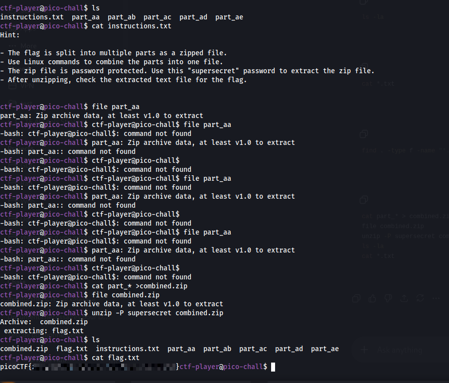

# Piece by Piece

**Category:** General Skills
**Difficulty:** Easy
**Author:** Yahaya Meddy

---

## Challenge Description

The challenge gives SSH access to a remote machine and says that multiple file parts are available in the home directory.

The goal is to combine these parts, extract the resulting archive, and read the final text file containing the flag.

SSH access:

```bash
ssh -p 52824 ctf-player@dolphin-cove.picoctf.net
```

Password:

```text
6abf4a82
```

---

## Connecting to the Server

At first, the SSH command must be written with the port using the `-p` option:

```bash
ssh -p 52824 ctf-player@dolphin-cove.picoctf.net
```

After logging in, I listed the files in the home directory:

```bash
ls
```

The directory contained:

```text
instructions.txt
part_aa
part_ab
part_ac
part_ad
part_ae
```

---

## Reading the Instructions

I opened the instructions file:

```bash
cat instructions.txt
```

The instructions explained the process:

```text
The flag is split into multiple parts as a zipped file.
Use Linux commands to combine the parts into one file.
The zip file is password protected.
Use this "supersecret" password to extract the zip file.
After unzipping, check the extracted text file for the flag.
```

This tells us that the `part_*` files are pieces of one zip archive.

---

## Checking the File Type

I checked the first part using:

```bash
file part_aa
```

The output showed:

```text
part_aa: Zip archive data, at least v1.0 to extract
```

This confirmed that the parts belong to a zip archive.

---

## Combining the Parts

The files were named in order:

```text
part_aa
part_ab
part_ac
part_ad
part_ae
```

Because of this naming format, using `part_*` combines them in the correct alphabetical order.

I combined all parts into one zip file:

```bash
cat part_* > combined.zip
```

Then I checked the combined file:

```bash
file combined.zip
```

The output confirmed that it was a zip archive:

```text
combined.zip: Zip archive data, at least v1.0 to extract
```

---

## Extracting the Zip File

The instructions gave the password:

```text
supersecret
```

So I extracted the archive using:

```bash
unzip -P supersecret combined.zip
```

The archive extracted a file named:

```text
flag.txt
```

---

## Reading the Flag

After extraction, I listed the files again:

```bash
ls
```

The directory now contained:

```text
combined.zip
flag.txt
instructions.txt
part_aa
part_ab
part_ac
part_ad
part_ae
```

Finally, I read the flag file:

```bash
cat flag.txt
```



The flag was successfully recovered.

---

## Full Command Sequence

```bash
ssh -p 52824 ctf-player@dolphin-cove.picoctf.net

ls
cat instructions.txt

file part_aa

cat part_* > combined.zip
file combined.zip

unzip -P supersecret combined.zip

ls
cat flag.txt
```

---

## Investigation Summary

```text
1. Connected to the remote server using SSH.
2. Listed the files in the home directory.
3. Found multiple parts named part_aa to part_ae.
4. Read instructions.txt.
5. Learned that the parts form a password-protected zip archive.
6. Verified the file type with file part_aa.
7. Combined all parts using cat part_* > combined.zip.
8. Verified the combined file was a zip archive.
9. Extracted it with the password supersecret.
10. Read flag.txt and recovered the flag.
```

---

## Tools Used

```text
ssh
ls
cat
file
unzip
```

---

## Key Takeaways

* Split files can be recombined using `cat` if their order is known.
* Filenames such as `part_aa`, `part_ab`, `part_ac` are naturally ordered alphabetically.
* The `file` command helps verify the type of a recovered file.
* Password-protected zip archives can be extracted with `unzip -P`.
* Always read instruction files first in General Skills challenges.

---

## Final Flag

```text
picoCTF{...REDACTED...}
```
