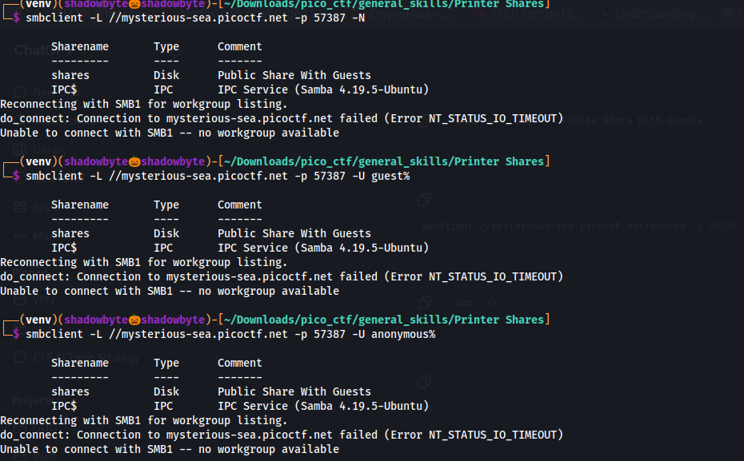
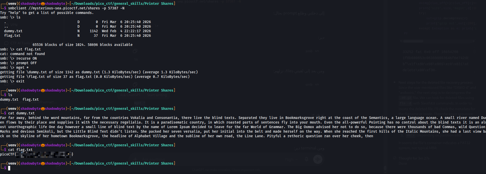

# Printer Shares

**Category:** General Skills
**Difficulty:** Easy
**Author:** Janice He

---

## Challenge Description

The challenge describes a file that was accidentally sent to a network printer.
The goal is to retrieve the file from the print server.

The service is running on the following host and port:

```bash
mysterious-sea.picoctf.net 57387
```

The hints mention SMB:

```text
1. Knowing how SMB protocol works would be helpful.
2. smbclient and smbutil are good tools.
```

This suggests that the print server exposes SMB shares, and the flag may be stored inside one of them.

---

## Checking the Open Port

First, I checked whether the provided port was open using `nc`:

```bash
nc -vz mysterious-sea.picoctf.net 57387
```

The result showed that the port was open:

```text
mysterious-sea.picoctf.net [3.130.79.223] 57387 (?) open
```

So the service was reachable.

---

## Enumerating SMB Shares

Since the hints pointed to SMB, I used `smbclient` to list available shares:

```bash
smbclient -L //mysterious-sea.picoctf.net -p 57387 -N
```

The option `-L` lists available shares, `-p` specifies the custom port, and `-N` attempts anonymous access without a password.

The output revealed the following shares:

```text
Sharename       Type      Comment
---------       ----      -------
shares          Disk      Public Share With Guests
IPC$            IPC       IPC Service (Samba 4.19.5-Ubuntu)
```



The important share was:

```text
shares
```

The SMB1 workgroup timeout was not important here.
The actual SMB share listing succeeded, and the accessible share was clearly visible.

---

## Connecting to the Public Share

I connected to the `shares` share anonymously:

```bash
smbclient //mysterious-sea.picoctf.net/shares -p 57387 -N
```

After connecting, I received an interactive SMB prompt:

```text
smb: \>
```

I listed the files with:

```smb
ls
```

The share contained two files:

```text
dummy.txt
flag.txt
```

The file `flag.txt` was clearly the target.

---

## Downloading the Files

The SMB prompt does not support normal Linux commands like `cat`, so trying:

```smb
cat flag.txt
```

does not work.

Instead, I used SMB commands to download the files:

```smb
recurse ON
prompt OFF
mget *
```

This downloaded both files locally:

```text
getting file \dummy.txt of size 1142 as dummy.txt
getting file \flag.txt of size 37 as flag.txt
```

Then I exited the SMB session:

```smb
exit
```

---

## Reading the Flag Locally

After downloading the files, I listed the local directory:

```bash
ls
```

The files were present:

```text
dummy.txt
flag.txt
```

I checked the dummy file first:

```bash
cat dummy.txt
```

It only contained filler text.

Then I read the flag file:

```bash
cat flag.txt
```



The flag was successfully recovered.

---

## Full Command Sequence

```bash
nc -vz mysterious-sea.picoctf.net 57387

smbclient -L //mysterious-sea.picoctf.net -p 57387 -N

smbclient //mysterious-sea.picoctf.net/shares -p 57387 -N
```

Inside the SMB shell:

```smb
ls
recurse ON
prompt OFF
mget *
exit
```

Back in the Linux terminal:

```bash
ls
cat dummy.txt
cat flag.txt
```

---

## Investigation Summary

```text
1. Checked that the provided port was open using nc.
2. Used smbclient to enumerate SMB shares.
3. Found a public guest share named shares.
4. Connected to the shares SMB share anonymously.
5. Listed the share contents and found dummy.txt and flag.txt.
6. Used mget to download the files from SMB.
7. Read flag.txt locally.
8. Recovered the flag.
```

---

## Tools Used

```text
nc
smbclient
ls
cat
```

---

## Key Takeaways

* SMB shares can be enumerated using `smbclient -L`.
* A custom SMB port can be specified using `-p`.
* Anonymous access can be attempted with `-N`.
* Inside `smbclient`, normal shell commands like `cat` do not work.
* Files should be downloaded using `get` or `mget`, then read locally.
* Public SMB shares may expose sensitive files if permissions are misconfigured.

---

## Final Flag

```text
picoCTF{...REDACTED...}
```
