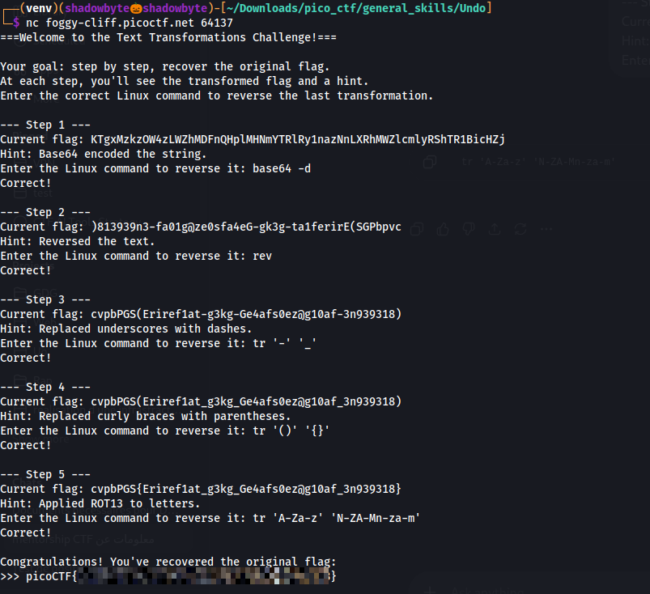

# Undo

**Category:** General Skills
**Difficulty:** Easy
**Author:** Yahaya Meddy

---

## Challenge Description

The challenge gives a transformed flag and asks us to recover the original one step by step.

At each step, the server provides:

```text
1. The current transformed flag
2. A hint about the transformation used
3. A prompt asking for the Linux command that reverses it
```

The main tool needed for this challenge is `tr`, which is commonly used for character translation and replacement in Linux.

---

## Connecting to the Challenge

I connected to the remote instance using `nc`:

```bash
nc foggy-cliff.picoctf.net 64137
```

The server started the text transformation challenge:

```text
===Welcome to the Text Transformations Challenge!===

Your goal: step by step, recover the original flag.
At each step, you'll see the transformed flag and a hint.
Enter the correct Linux command to reverse the last transformation.
```

---

## Step 1 — Base64 Decode

The first hint was:

```text
Base64 encoded the string.
```

To reverse Base64 encoding, I used:

```bash
base64 -d
```

The server accepted the command and moved to the next step.

---

## Step 2 — Reverse the Text

The second hint was:

```text
Reversed the text.
```

To reverse a line of text in Linux, I used:

```bash
rev
```

This restored the string order.

---

## Step 3 — Replace Dashes with Underscores

The third hint was:

```text
Replaced underscores with dashes.
```

So the reverse operation is to replace `-` back with `_`.

I used:

```bash
tr '-' '_'
```

This converted the dashes back into underscores.

---

## Step 4 — Restore Curly Braces

The fourth hint was:

```text
Replaced curly braces with parentheses.
```

The current flag had parentheses instead of curly braces, so I replaced:

```text
(  →  {
)  →  }
```

The command was:

```bash
tr '()' '{}'
```

This restored the correct picoCTF flag format structure.

---

## Step 5 — Reverse ROT13

The final hint was:

```text
Applied ROT13 to letters.
```

ROT13 is symmetric, meaning applying ROT13 again reverses it.

I used:

```bash
tr 'A-Za-z' 'N-ZA-Mn-za-m'
```

After this final transformation, the server printed the recovered original flag.



---

## Full Command Sequence

The complete sequence of commands entered was:

```bash
base64 -d
rev
tr '-' '_'
tr '()' '{}'
tr 'A-Za-z' 'N-ZA-Mn-za-m'
```

---

## Investigation Summary

```text
1. Connected to the remote challenge using nc.
2. Decoded the first transformation with base64 -d.
3. Reversed the text using rev.
4. Replaced dashes with underscores using tr.
5. Replaced parentheses with curly braces using tr.
6. Applied ROT13 again using tr to recover the original flag.
```

---

## Tools Used

```text
nc
base64
rev
tr
```

---

## Key Takeaways

* `base64 -d` decodes Base64-encoded strings.
* `rev` reverses text line by line.
* `tr` can replace characters directly.
* ROT13 can be reversed by applying ROT13 again.
* Reading each hint carefully makes the challenge straightforward.

---

## Final Flag

```text
picoCTF{...REDACTED...}
```
