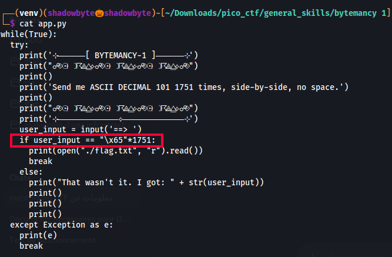
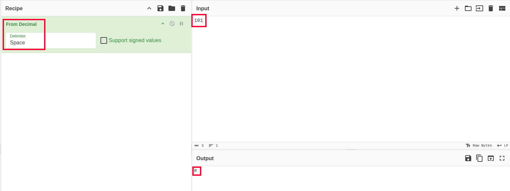
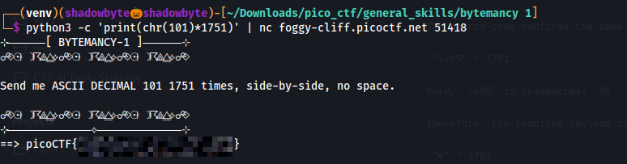

# bytemancy 1

**Category:** General Skills
**Difficulty:** Easy
**Author:** LT "syreal" Jones

---

## Challenge Description

The challenge asks us to send the correct bytes to a remote program.

When connecting to the service, it displays:

```text
Send me ASCII DECIMAL 101 1751 times, side-by-side, no space.
```

The hint says:

```text
No copy-pasta, please - use Python!
```

This means we should generate the required input programmatically instead of typing or copying a long string manually.

---

## Source Code Analysis

I started by reading the provided source code:

```bash
cat app.py
```



The important condition is:

```python
if user_input == "\x65"*1751:
```

This tells us exactly what the program expects:

```text
"\x65" repeated 1751 times
```

So the goal is to understand what byte `\x65` represents.

---

## Understanding ASCII Decimal 101

The challenge message says:

```text
ASCII DECIMAL 101
```

To verify what ASCII decimal `101` represents, I used CyberChef with:

```text
Recipe: From Decimal
Input: 101
Delimiter: Space
```



CyberChef decoded decimal `101` into:

```text
e
```

So:

```text
ASCII decimal 101 = e
```

---

## Confirming `\x65`

The source code uses:

```python
"\x65"
```

Here, `65` is hexadecimal.

To confirm that hexadecimal `65` is also the character `e`, I used CyberChef again:

```text
Recipe: From Hex
Input: 65
```


The output was:

```text
e
```

So both parts match:

```text
101 decimal = 0x65 hex = e
```

Therefore, the required input is:

```text
e repeated 1751 times
```

Not:

```text
101 repeated 1751 times
```

---

## Building the Payload

Typing `e` manually 1751 times would be slow and error-prone.

Instead, I used Python to generate the payload:

```bash
python3 -c 'print(chr(101)*1751)'
```

Here:

```text
chr(101) = e
```

and:

```text
chr(101) * 1751
```

generates exactly 1751 copies of the character `e`.

---

## Sending the Payload

I piped the generated payload directly into the remote service:

```bash
python3 -c 'print(chr(101)*1751)' | nc foggy-cliff.picoctf.net 51418
```



The server accepted the input and printed the flag.

---

## Full Command

```bash
python3 -c 'print(chr(101)*1751)' | nc foggy-cliff.picoctf.net 51418
```

---

## Investigation Summary

```text
1. Read the challenge source code.
2. Found that the program checks for "\x65" repeated 1751 times.
3. Verified that ASCII decimal 101 equals the character e.
4. Verified that hexadecimal 65 also equals the character e.
5. Generated the required payload using Python.
6. Sent the payload to the remote service with netcat.
7. Recovered the flag.
```

---

## Tools Used

```text
cat
CyberChef
Python
netcat
```

---

## Key Takeaways

* ASCII decimal values can be converted into characters.
* `101` in ASCII decimal represents `e`.
* `\x65` is hexadecimal notation for the same character.
* Python is useful for generating long repeated inputs accurately.
* Avoid manual copy-paste when exact byte counts are required.

---

## Final Flag

```text
picoCTF{...REDACTED...}
```
