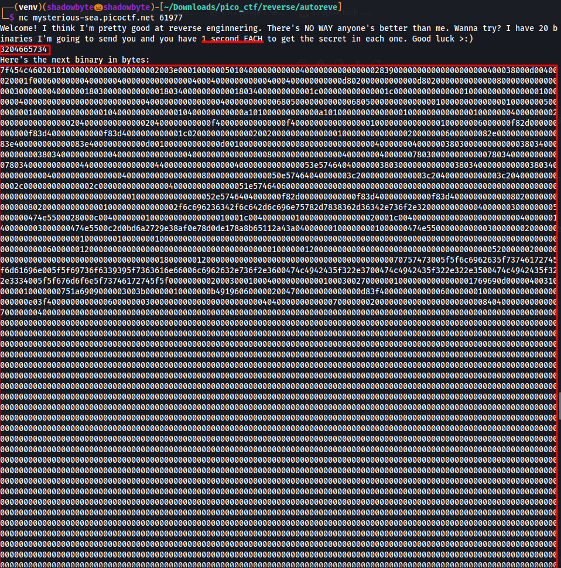
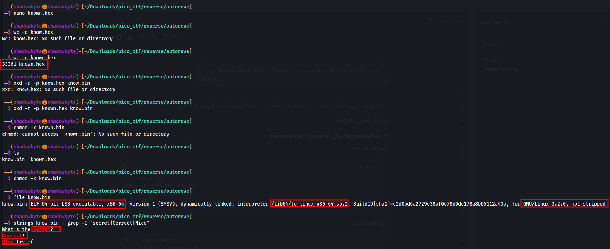
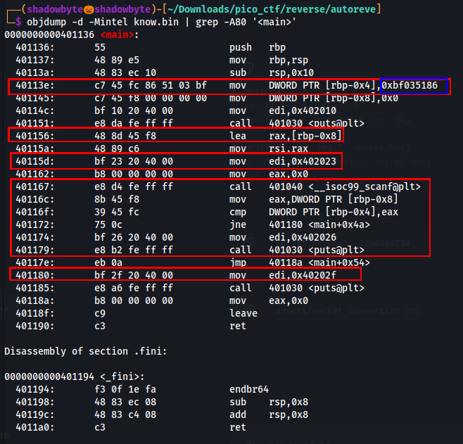
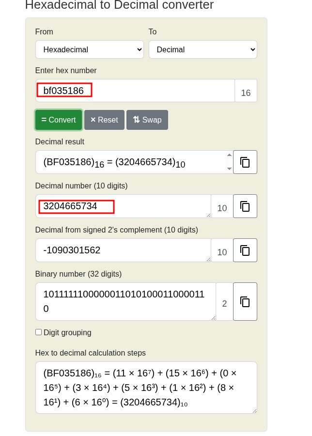
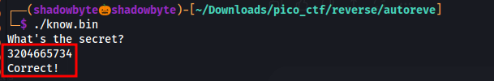
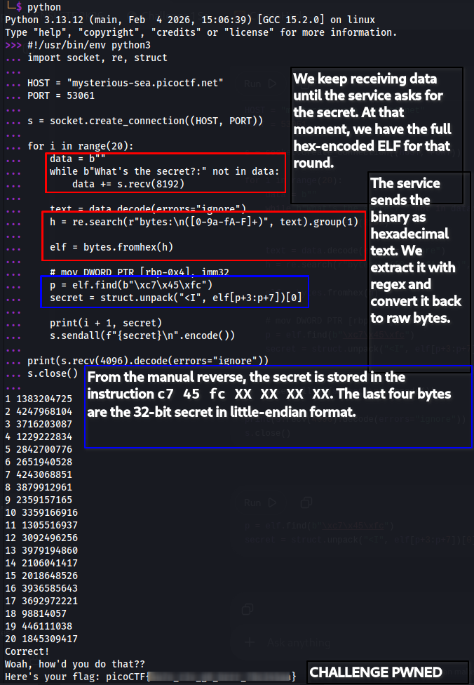

# Autorev

**Category:** Reverse Engineering
**Difficulty:** Medium

---

## Challenge Description

The challenge gives us a remote service:

```bash
nc mysterious-sea.picoctf.net 61977
```

The service claims that it will send 20 binaries, and for each one we have only 1 second to find the secret.

```text
Welcome! I think I'm pretty good at reverse enginnering.
There's NO WAY anyone's better than me. Wanna try?
I have 20 binaries I'm going to send you and you have 1 second EACH
to get the secret in each one. Good luck >:)
```

For every round, the server sends a long hexadecimal blob representing an ELF binary, then asks:

```text
What's the secret?:
```



At first, this looks impossible to solve manually because we have to reverse 20 binaries under a strict time limit.
So the idea is:

```text
Reverse one binary manually → understand the pattern → automate the extraction
```

---

## Reconstructing the ELF Binary

The server sends the binary as hexadecimal text.

The blob starts with:

```text
7f454c46
```

This is the ELF magic header:

```text
7f 45 4c 46 = ELF
```

So I copied one full hex blob into a file:

```bash
nano known.hex
```

Then I converted it back into a real binary:

```bash
xxd -r -p known.hex know.bin
chmod +x know.bin
```

I checked the file type:

```bash
file know.bin
```

Output:

```text
know.bin: ELF 64-bit LSB executable, x86-64, dynamically linked, not stripped
```

Then I checked the strings:

```bash
strings know.bin | grep -E "secret|Correct|Nice"
```

Output:

```text
What's the secret?
Correct!
Nice try :(
```



This confirms that the hex blob is a real executable which asks for a secret and checks our input.

---

## Manual Reverse Engineering

Now that we have a real ELF binary, I disassembled the `main` function:

```bash
objdump -d -Mintel know.bin | grep -A80 '<main>'
```

The important part is:

```asm
40113e: c7 45 fc 86 51 03 bf    mov DWORD PTR [rbp-0x4],0xbf035186
```

This instruction stores a hardcoded 32-bit value inside a local variable.

In C-like logic, it is basically:

```c
secret = 0xbf035186;
```

Then the program reads user input:

```asm
401167: call 401040 <__isoc99_scanf@plt>
```

After that, it compares our input with the stored secret:

```asm
40116c: mov eax,DWORD PTR [rbp-0x8]
40116f: cmp DWORD PTR [rbp-0x4],eax
401172: jne 401180 <main+0x4a>
```

So the program logic is:

```c
if (input == secret)
    puts("Correct!");
else
    puts("Nice try :(");
```



The binary is not doing any complex obfuscation.
The secret is just stored as an immediate value in the `main` function.

Challenge almost hacked.

---

## Understanding the Secret Value

From the disassembly, the hardcoded value is:

```text
0xbf035186
```

The raw instruction bytes are:

```text
c7 45 fc 86 51 03 bf
```

The first three bytes:

```text
c7 45 fc
```

represent the instruction pattern:

```asm
mov DWORD PTR [rbp-0x4], imm32
```

The last four bytes are the immediate value:

```text
86 51 03 bf
```

Because the architecture is x86-64, integers are stored in little-endian format.

So:

```text
86 51 03 bf
```

represents:

```text
0xbf035186
```

Converting it from hexadecimal to decimal gives:

```text
3204665734
```



---

## Local Test

To make sure the extracted value is correct, I ran the reconstructed binary locally:

```bash
./know.bin
```

When it asked for the secret, I entered:

```text
3204665734
```

Output:

```text
What's the secret?
3204665734
Correct!
```



This proves that the value extracted from the disassembly is the correct secret for that binary.

---

## Why Automation Is Needed

The manual method works, but the challenge sends:

```text
20 binaries
1 second each
```

So doing this manually is impossible.

But after reversing one sample, we know the pattern:

```text
c7 45 fc XX XX XX XX
```

The last four bytes are always the secret as a little-endian 32-bit integer.

So the automation only has to:

1. Receive the hex-encoded ELF.
2. Convert it to bytes.
3. Search for the instruction pattern `c7 45 fc`.
4. Extract the next 4 bytes.
5. Convert them from little-endian to decimal.
6. Send the answer back.

---

## Exploit Script

```python
#!/usr/bin/env python3
import socket, re, struct

HOST = "mysterious-sea.picoctf.net"
PORT = 53061

s = socket.create_connection((HOST, PORT))

for i in range(20):
    data = b""
    while b"What's the secret?:" not in data:
        data += s.recv(8192)

    text = data.decode(errors="ignore")
    h = re.search(r"bytes:\n([0-9a-fA-F]+)", text).group(1)

    elf = bytes.fromhex(h)

    # mov DWORD PTR [rbp-0x4], imm32
    p = elf.find(b"\xc7\x45\xfc")
    secret = struct.unpack("<I", elf[p+3:p+7])[0]

    print(i + 1, secret)
    s.sendall(f"{secret}\n".encode())

print(s.recv(4096).decode(errors="ignore"))
s.close()
```

The most important part is:

```python
p = elf.find(b"\xc7\x45\xfc")
secret = struct.unpack("<I", elf[p+3:p+7])[0]
```

This searches for the instruction pattern found during manual reversing and extracts the secret.

---

## Running the Exploit

```bash
python3 solve.py
```

Output:

```text
1 1383204725
2 4247968104
3 3716203087
...
20 1845309417
Correct!
Woah, how'd you do that??
Here's your flag: picoCTF{...}
```



Challenge hacked.

---

## Flag

```text
picoCTF{....redacted....}
```

---

## Key Takeaways

* The server sends real ELF binaries encoded as hexadecimal text.
* Each binary contains a hardcoded secret.
* The secret is stored using this instruction pattern:

```asm
mov DWORD PTR [rbp-0x4], imm32
```

* In raw bytes, this appears as:

```text
c7 45 fc XX XX XX XX
```

* The `XX XX XX XX` bytes are the secret in little-endian format.
* After solving one binary manually, the rest can be automated.
* The time limit is the real challenge, not the reverse engineering difficulty.

---

## Final Thoughts

This was a nice speed-reversing challenge.

The manual reverse engineering part was simple: find the immediate value, convert it to decimal, and test it locally.

The real trick was noticing that all binaries follow the same structure. Once the pattern was identified, a small Python script was enough to automatically extract the secret from each ELF and beat the one-second limit.

Pwned.
