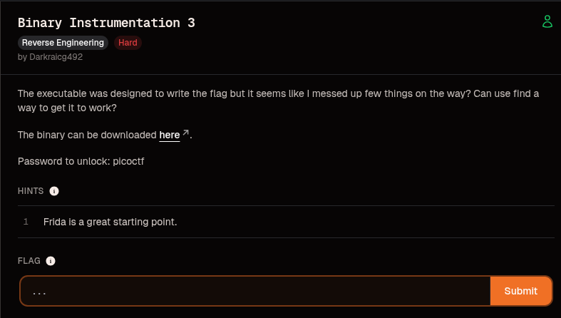
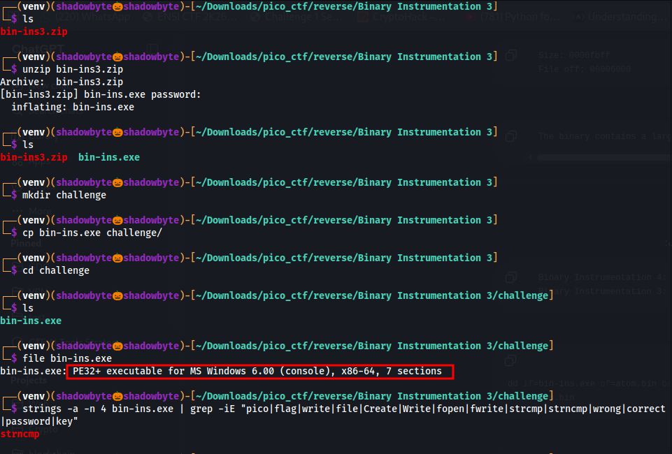
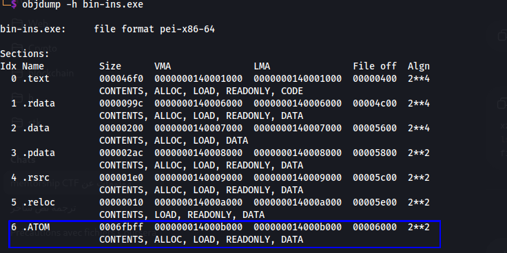
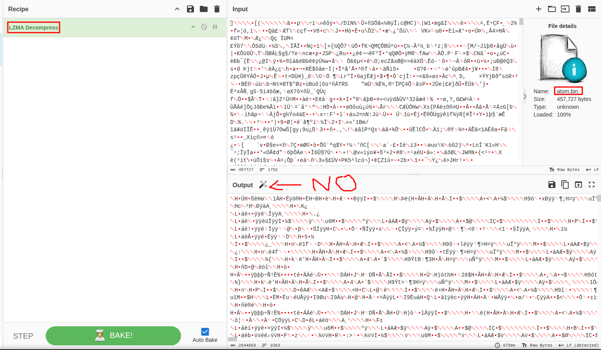
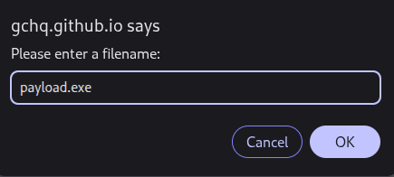
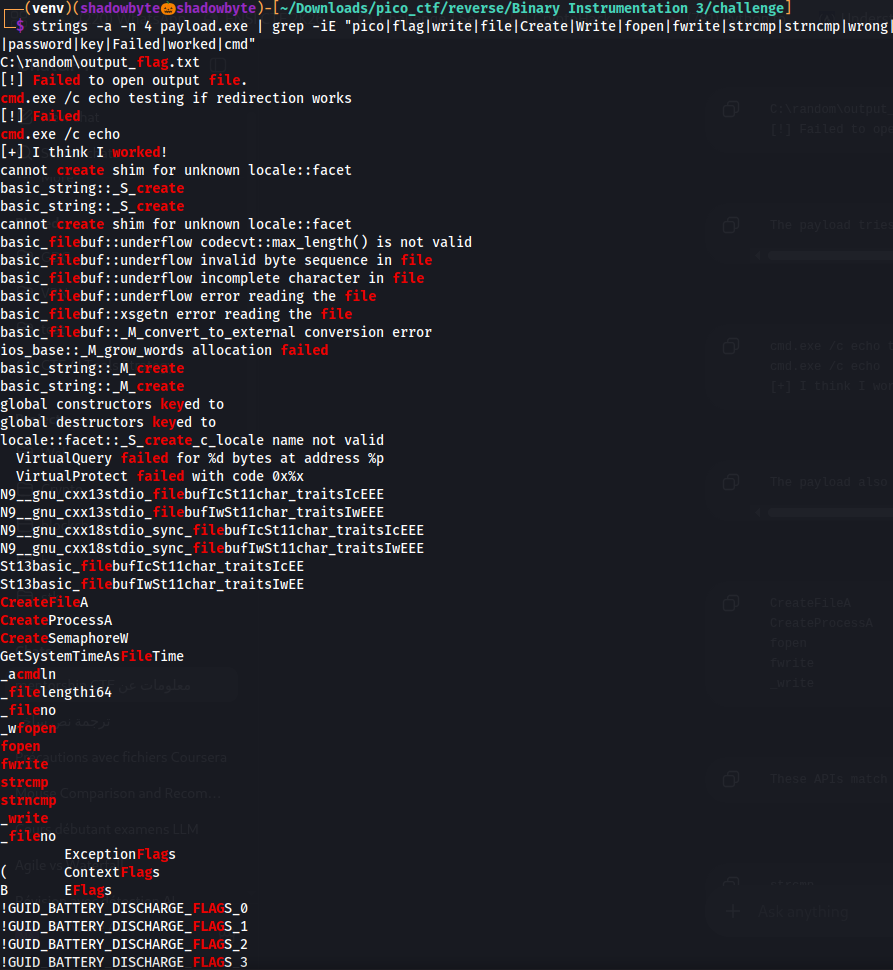
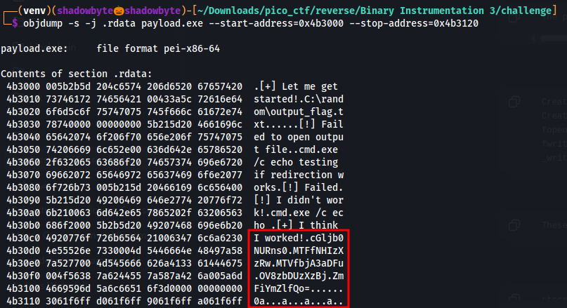
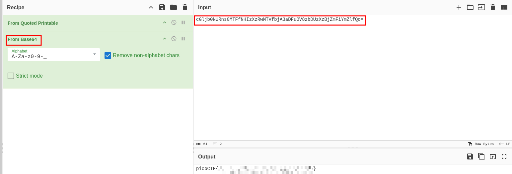

# Binary Instrumentation 3

**Category:** Reverse Engineering  
**Difficulty:** Hard  
**Author:** Darkraicg492  

---

## Challenge Description

The challenge gives us a Windows executable and says that it was designed to write the flag, but something was messed up.

> The executable was designed to write the flag but it seems like I messed up few things on the way? Can you find a way to get it to work?

The hint says:

```text
Frida is a great starting point.
```

This suggests that the binary may use Windows APIs at runtime, and that hooking functions such as file-writing or process-creation APIs could reveal useful information.

---



## Initial Extraction and Recon

The archive was protected with the password:

```text
picoctf
```

I extracted the binary and moved it into a dedicated working directory:

```bash
unzip bin-ins3.zip
mkdir challenge
cp bin-ins.exe challenge/
cd challenge
```

Then I checked the file type:

```bash
file bin-ins.exe
```

Output:

```text
bin-ins.exe: PE32+ executable for MS Windows 6.00 (console), x86-64, 7 sections
```

So the binary is a 64-bit Windows PE executable.

I also searched for interesting strings:

```bash
strings -a -n 4 bin-ins.exe | grep -iE "pico|flag|write|file|Create|Write|fopen|fwrite|strcmp|strncmp|wrong|correct|password|key"
```

The only useful string found in the original binary was:

```text
strncmp
```



At this point, the original executable did not reveal much. This usually means that the real logic is either packed, embedded, or generated at runtime.

---

## Section Analysis

I listed the PE sections:

```bash
objdump -h bin-ins.exe
```



The binary contains normal PE sections such as:

```text
.text
.rdata
.data
.pdata
.rsrc
.reloc
```

However, one section stands out:

```text
.ATOM
```

The important values are:

```text
Section name: .ATOM
Size:        0x6fbff
File offset: 0x6000
```

The `.ATOM` section is unusually large compared to the other sections, so it is likely storing an embedded payload.

---

## Extracting the `.ATOM` Section

Using the `.ATOM` file offset and size, I extracted it into a separate file:

```bash
dd if=bin-ins.exe of=atom.bin bs=1 skip=$((0x6000)) count=$((0x6fbff)) status=progress
```

Then I checked the extracted file:

```bash
file atom.bin
```

The extracted section was LZMA-compressed data.

So the original executable is basically a wrapper that stores compressed data in its `.ATOM` section.

---

## Decompressing the Embedded Payload

I first tried using CyberChef with the operation:

```text
LZMA Decompress
```



The output looked like raw binary data, which is expected for a decompressed executable.

When saving from CyberChef, it is important to save the raw output itself, not a file-type report.



After saving the decompressed output as `payload.exe`, I verified it:

```bash
file payload.exe
xxd -l 16 payload.exe
```

The output confirmed that the file was a valid PE executable:

```text
payload.exe: PE32+ executable for MS Windows 5.02 (console), x86-64, 17 sections
```

The first bytes were:

```text
4d 5a
```

`4d 5a` is `MZ`, the standard signature of a Windows executable.

So the extraction chain is:

```text
bin-ins.exe
    -> .ATOM section
        -> atom.bin
            -> LZMA decompress
                -> payload.exe
```

---

## Payload Strings Analysis

After extracting the real payload, I searched for useful strings:

```bash
strings -a -n 4 payload.exe | grep -iE "pico|flag|write|file|Create|Write|fopen|fwrite|strcmp|strncmp|wrong|correct|password|key|Failed|worked|cmd"
```



Important strings appeared:

```text
C:\random\output_flag.txt
[!] Failed to open output file.
cmd.exe /c echo testing if redirection works
[!] Failed
cmd.exe /c echo
[+] I think I worked!
CreateFileA
CreateProcessA
fopen
fwrite
strcmp
strncmp
_write
_ZL9flagParts
```

These strings reveal the actual behavior of the payload.

The program tries to write to:

```text
C:\random\output_flag.txt
```

but that path likely does not exist, explaining the failure message:

```text
[!] Failed to open output file.
```

It also uses command execution:

```text
cmd.exe /c echo
```

and imports file-writing related APIs such as:

```text
CreateFileA
CreateProcessA
fopen
fwrite
_write
```

The most important symbol is:

```text
_ZL9flagParts
```

This strongly suggests that the flag is stored in multiple parts inside the binary.

The payload strings confirm the file-writing behavior and the presence of APIs such as `CreateFileA`, `CreateProcessA`, `fopen`, `fwrite`, `strcmp`, and `strncmp`. :contentReference[oaicite:0]{index=0}

---

## Inspecting `.rdata`

Since the strings pointed to `flagParts`, I inspected the `.rdata` section around the interesting area:

```bash
objdump -s -j .rdata payload.exe --start-address=0x4b3000 --stop-address=0x4b3120
```



This revealed:

```text
[+] Let me get started!
C:\random\output_flag.txt
[!] Failed to open output file.
cmd.exe /c echo testing if redirection works
[!] Failed.
[!] I didn't work!
cmd.exe /c echo
[+] I think I worked!
```

After these strings, there are Base64-looking fragments.

The first fragment starts with:

```text
cGljb0NUR
```

This is a strong clue because Base64 strings starting with `cGljb0NUR` usually decode to:

```text
picoCTF
```

So the flag was stored as encoded fragments in `.rdata`.

---

## Reconstructing the Encoded Flag

From `.rdata`, I collected the Base64 fragments in order and joined them into a single string.

The reconstructed encoded string looked like:

```text
cGljb0NURns0MTFfNHIzXzRwMTVfbjA3aDFuOV8zbDUzXzBjZmFiYmZlfQo=
```

Then I decoded it using CyberChef.

Recipe:

```text
From Base64
```



The decoded result was the flag.

For a public writeup, I redact the final value:

```text
picoCTF{...PWNED...}
```

---

## Why the Binary Fails Normally

The challenge says the executable was designed to write the flag, but something was messed up.

The extracted payload confirms that it tries to write to:

```text
C:\random\output_flag.txt
```

If this directory does not exist, the file open/write operation fails.

That matches the string:

```text
[!] Failed to open output file.
```

So instead of trying to fix the program manually, I inspected the embedded flag parts directly.

---

## About the Frida Hint

The hint says:

```text
Frida is a great starting point.
```

A dynamic solution would hook APIs such as:

```text
CreateFileA
CreateProcessA
fopen
fwrite
_write
strcmp
strncmp
```

This would reveal:

- the target output path,
- the command passed to `cmd.exe`,
- the data being written,
- or the comparison arguments.

In this solve, static unpacking was enough because the embedded payload exposed the flag fragments in `.rdata`.

A Frida-based approach and the static approach both target the same idea: observe the APIs used by the payload.

---

## Final Flag

For this public writeup, the flag is redacted:

```text
picoCTF{...PWNED...}
```

---

## Tools Used

- `file`
- `strings`
- `objdump`
- `dd`
- CyberChef
- `xxd`

---

## Key Takeaways

- The first binary was only a wrapper.
- The real payload was hidden inside a large `.ATOM` section.
- The `.ATOM` section was LZMA-compressed.
- Decompressing it produced a second PE file: `payload.exe`.
- The payload was designed to write the flag to a file.
- The hardcoded path was `C:\random\output_flag.txt`.
- The payload imported APIs such as `CreateFileA`, `CreateProcessA`, `fopen`, and `fwrite`.
- The flag was stored as Base64 fragments in `.rdata`.
- Joining and decoding the fragments recovered the flag.

---

## Summary

The original `bin-ins.exe` did not contain the flag directly. It contained a suspicious `.ATOM` section.

After extracting and decompressing this section, I obtained the real payload. The payload revealed file-writing behavior and a symbol named `flagParts`.

Inspecting `.rdata` showed Base64 fragments. After joining and decoding them, the flag was recovered.

```text
bin-ins.exe
    -> .ATOM
        -> atom.bin
            -> LZMA decompress
                -> payload.exe
                    -> .rdata flag parts
                        -> Base64 decode
                            -> picoCTF{...PWNED...}
```
