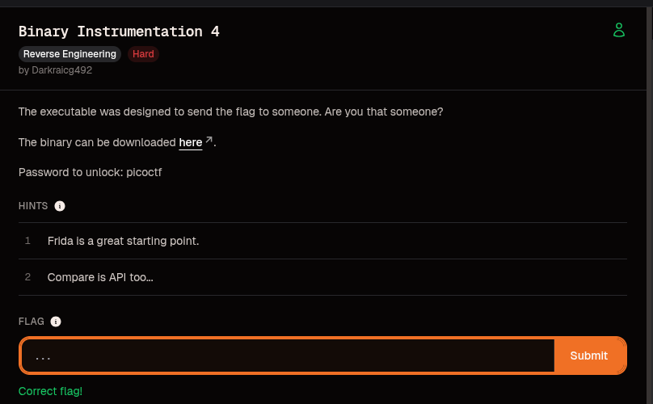
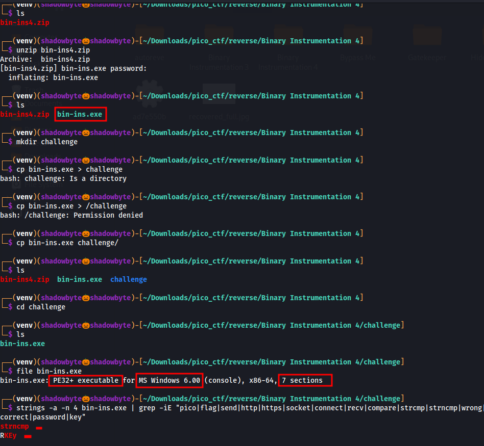
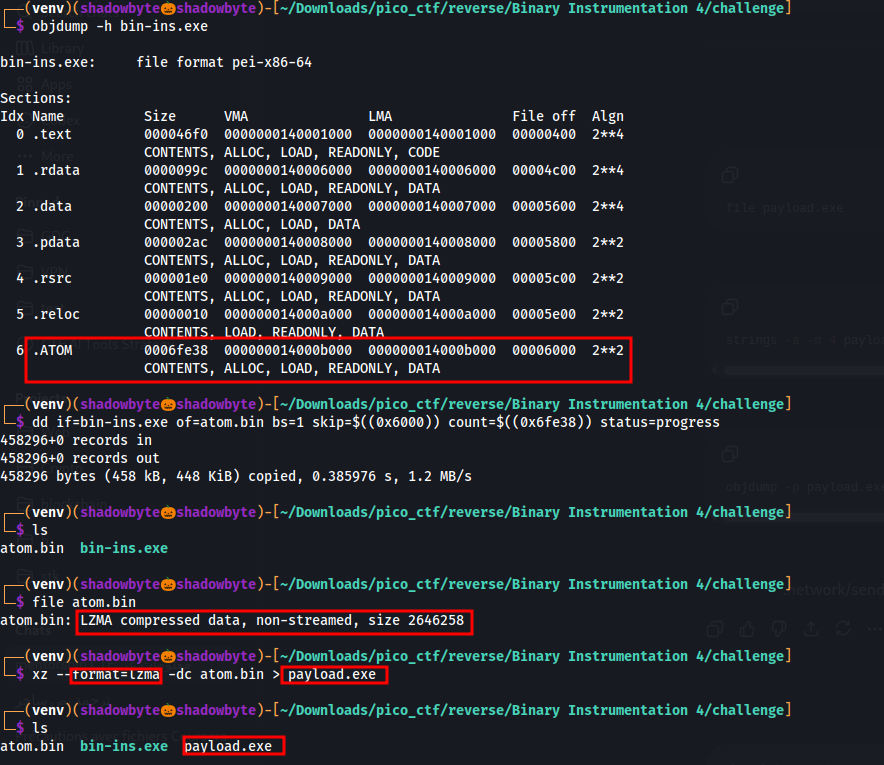
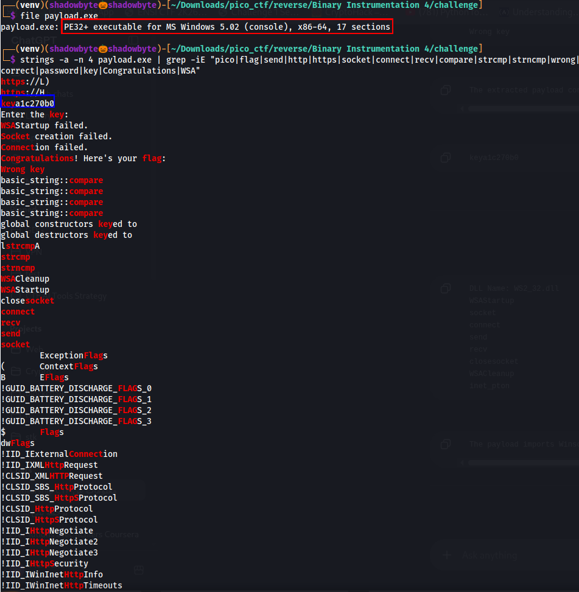
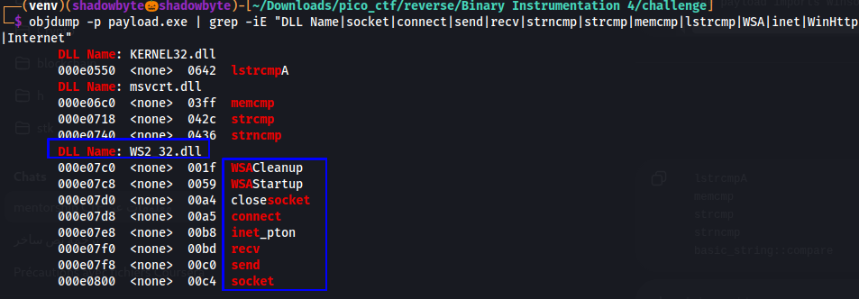
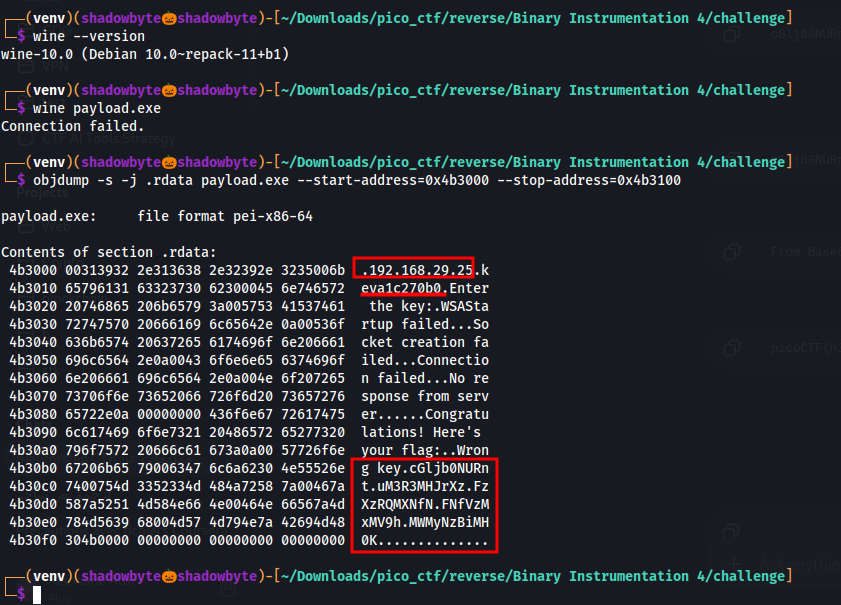
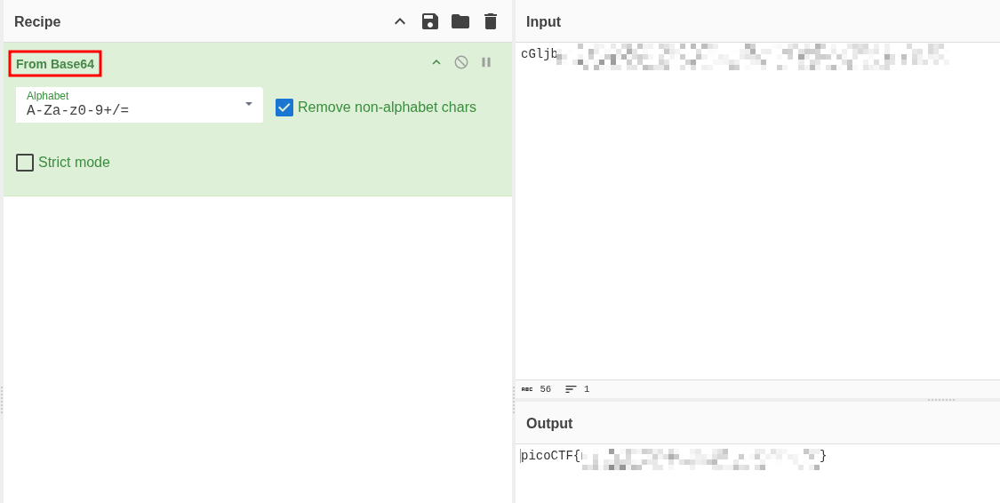

# Binary Instrumentation 4

**Category:** Reverse Engineering
**Difficulty:** Hard
**Author:** Darkraicg492

---

## Challenge Description

The challenge gives us a Windows executable and asks us to understand how it sends or reveals the flag.

> The executable was designed to send the flag to someone. Are you that someone?

The hints are important:

1. Frida is a great starting point.
2. Compare is API too...

The challenge strongly suggests that the binary uses runtime behavior, comparison APIs, and possibly network APIs. Instead of directly finding the flag in the first binary, we need to inspect how the program is structured.

---

## Initial Setup

The downloaded archive was protected with the password:

```text
picoctf
```

I extracted it and got the executable:

```bash
unzip bin-ins4.zip
ls
```

This produced:

```text
bin-ins.exe
```

I then created a dedicated working directory for the challenge.

At first, I made a small mistake while copying the executable:

```bash
cp bin-ins.exe > challenge
```

This failed because `>` is used for output redirection, not for copying files.

The correct command was:

```bash
cp bin-ins.exe challenge/
cd challenge
```



---

## Basic Reconnaissance

I started by checking the file type:

```bash
file bin-ins.exe
```

Output:

```text
bin-ins.exe: PE32+ executable for MS Windows 6.00 (console), x86-64, 7 sections
```

So the file is a 64-bit Windows PE console executable.

Then I searched for interesting strings:

```bash
strings -a -n 4 bin-ins.exe | grep -iE "pico|flag|send|http|https|socket|connect|recv|compare|strcmp|strncmp|wrong|correct|password|key"
```

The first string search only showed:

```text
strncmp
RKEy
```

This did not reveal the flag directly, but `strncmp` is already interesting because the hint says:

```text
Compare is API too...
```

So comparison functions are likely important in this challenge.

---

## Section Analysis

Next, I listed the PE sections:

```bash
objdump -h bin-ins.exe
```



The binary contains normal PE sections:

```text
.text
.rdata
.data
.pdata
.rsrc
.reloc
```

However, there is also a suspicious custom section:

```text
.ATOM
```

The `.ATOM` section stands out because it is much larger than the other data sections.

Important values:

```text
Section name: .ATOM
Size:        0x6fe38
File offset: 0x6000
```

This suggests that `.ATOM` may contain embedded data or a compressed payload.

---

## Extracting the `.ATOM` Section

Using the section size and file offset, I extracted `.ATOM` into a separate file:

```bash
dd if=bin-ins.exe of=atom.bin bs=1 skip=$((0x6000)) count=$((0x6fe38)) status=progress
```

Output:

```text
458296+0 records in
458296+0 records out
458296 bytes copied
```

The extracted size matches the `.ATOM` section size:

```text
0x6fe38 = 458296 bytes
```

Then I checked the extracted file:

```bash
file atom.bin
```

Output:

```text
atom.bin: LZMA compressed data, non-streamed, size 2646258
```


This confirmed that the `.ATOM` section contains LZMA-compressed data.

---

## Decompressing the Embedded Payload

Since `atom.bin` was detected as LZMA-compressed data, I decompressed it using `xz`:

```bash
xz --format=lzma -dc atom.bin > payload.exe
```

Then I listed the files:

```bash
ls
```

Output:

```text
atom.bin
bin-ins.exe
payload.exe
```


A new executable named `payload.exe` was created. This means the original `bin-ins.exe` was acting as a wrapper around a hidden compressed payload.

---

## Payload Reconnaissance

I checked the new executable:



```bash
file payload.exe
```

Output:

```text
payload.exe: PE32+ executable for MS Windows 5.02 (console), x86-64, 17 sections
```

So after decompression, we obtained another 64-bit Windows PE executable.

Then I searched for interesting strings:

```bash
strings -a -n 4 payload.exe | grep -iE "pico|flag|send|http|https|socket|connect|recv|compare|strcmp|strncmp|wrong|correct|password|key|Congratulations|WSA"
```

Important strings appeared:

```text
keya1c270b0
Enter the key:
WSAStartup failed.
Socket creation failed.
Connection failed.
Congratulations! Here's your flag:
Wrong key
basic_string::compare
lstrcmpA
strcmp
strncmp
recv
send
socket
```


These strings reveal several important facts:

* The payload asks the user to enter a key.
* It contains success and failure messages.
* It uses comparison functions.
* It uses networking functions.
* The string `keya1c270b0` looks like a key candidate.

---

## Import Table Analysis

I inspected the imports:

```bash
objdump -p payload.exe | grep -iE "DLL Name|socket|connect|send|recv|strncmp|strcmp|memcmp|lstrcmp|WSA|inet|WinHttp|Internet"
```



Important comparison APIs:

```text
lstrcmpA
memcmp
strcmp
strncmp
```

Important networking APIs:

```text
WSAStartup
socket
connect
inet_pton
recv
send
closesocket
WSACleanup
```

This matches both the challenge description and the hints.

The challenge says the executable was designed to send the flag to someone, and the imports show Winsock APIs such as `socket`, `connect`, `send`, and `recv`.

The hint says:

```text
Compare is API too...
```

The imports show several comparison APIs, especially `lstrcmpA`, `strcmp`, `strncmp`, and `memcmp`.

---

## Running the Payload

I checked that Wine was installed:

```bash
wine --version
```

Output:

```text
wine-10.0
```

Then I tried to run the payload:

```bash
wine payload.exe
```

Output:

```text
Connection failed.
```



This failure is expected. The payload tries to connect to a hardcoded server before reaching the useful execution path. Since the server is not reachable from my environment, the program exits with:

```text
Connection failed.
```

This confirms that simply running the payload is not enough.

---

## Inspecting `.rdata`

Since the payload contains interesting strings, I inspected the `.rdata` section around the string area:

```bash
objdump -s -j .rdata payload.exe --start-address=0x4b3000 --stop-address=0x4b3100
```


This revealed several important values:

```text
192.168.29.25
keya1c270b0
Enter the key:
WSAStartup failed.
Socket creation failed.
Connection failed.
No response from server.
Congratulations! Here's your flag:
Wrong key
```

The hardcoded IP address explains why the payload failed when executed normally:

```text
192.168.29.25
```

This is a private IP address, so it is not reachable from my environment.

The key-like string is:

```text
keya1c270b0
```

After the messages, I found multiple Base64-looking fragments. The first fragment starts with:

```text
cGljb0NUR...
```

This is a strong indicator because Base64 strings beginning with `cGljb0NUR` usually decode to:

```text
picoCTF
```

For the public writeup, I redacted the exact fragments and final decoded flag.

---

## Reconstructing the Encoded Flag

The Base64 fragments were stored consecutively in `.rdata`.

The idea was:

1. Extract the Base64-looking fragments.
2. Concatenate them in order.
3. Decode the result from Base64.

I used CyberChef with the operation:

```text
From Base64
```



The decoded output produced the flag. For this public writeup, the flag is redacted:

```text
picoCTF{...PWNED...}
```

---

## Why This Challenge Mentions Instrumentation

The challenge hints at Frida and API comparison because another valid solving path would be to instrument the program at runtime and hook APIs such as:

```text
lstrcmpA
strcmp
strncmp
memcmp
send
recv
```

For example, a Frida script could hook comparison APIs and print the arguments being compared. This would reveal the key or encoded flag fragments during execution.

However, in this solve, static unpacking was enough:

```text
bin-ins.exe
    ↓ extract .ATOM
atom.bin
    ↓ LZMA decompress
payload.exe
    ↓ inspect .rdata
Base64 fragments
    ↓ decode
picoCTF{...PWNED...}
```

---

## Final Flag

The real flag was successfully recovered, but it is redacted in this public writeup:

```text
picoCTF{...PWNED...}
```

---

## Key Takeaways

* The original binary was a wrapper.
* A large custom `.ATOM` section contained compressed data.
* The `.ATOM` section was LZMA-compressed.
* Decompressing it revealed a hidden `payload.exe`.
* The payload imported Winsock APIs such as `socket`, `connect`, `send`, and `recv`.
* The payload also imported comparison APIs such as `lstrcmpA`, `strcmp`, `strncmp`, and `memcmp`.
* The hardcoded IP address explained the `Connection failed` message.
* The flag was stored as Base64 fragments inside `.rdata`.
* Decoding the reconstructed Base64 string revealed the flag.

---

## Summary

The main trick was realizing that the first executable was not the real target. The suspicious `.ATOM` section contained an LZMA-compressed payload. After extracting and decompressing it, the real payload exposed the key, network behavior, comparison APIs, and Base64-encoded flag fragments.

The decoded flag was:

```text
picoCTF{...PWNED...}
```
