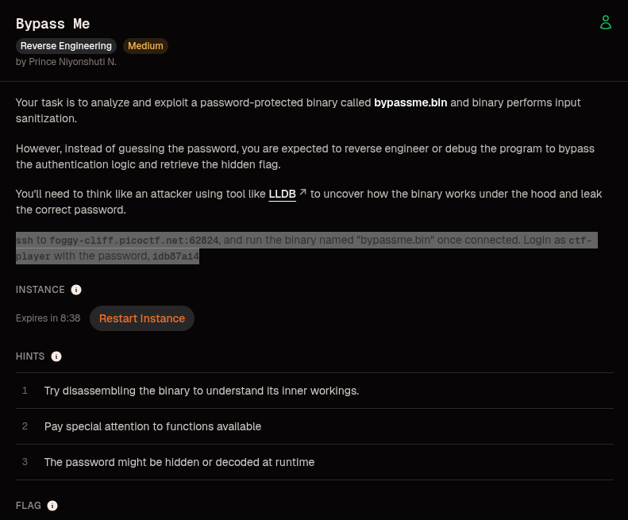
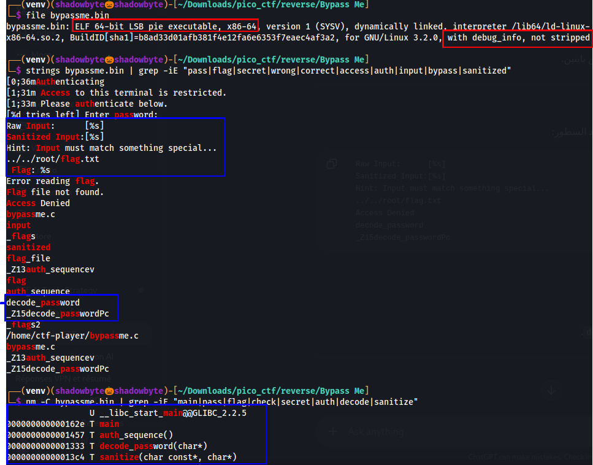
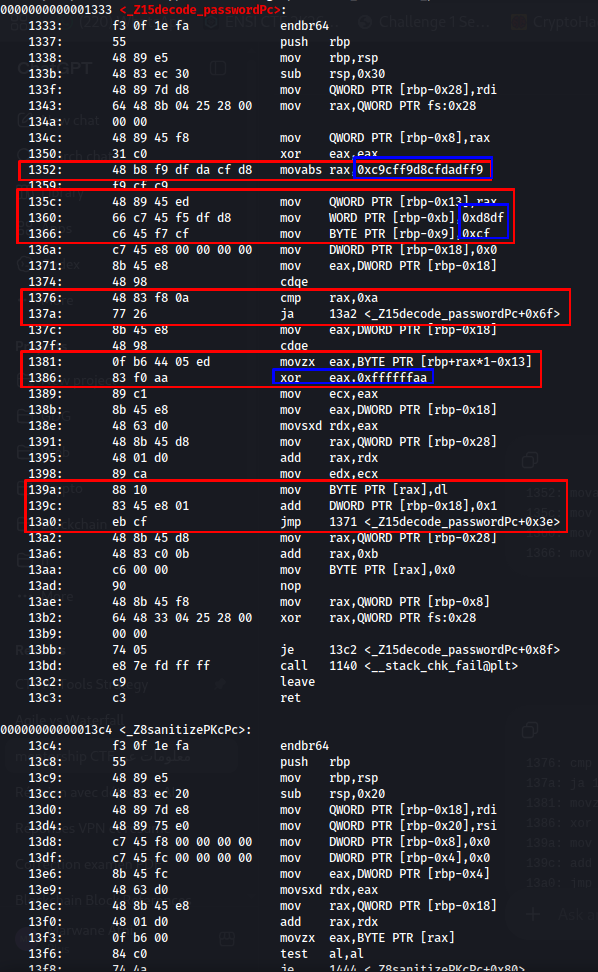
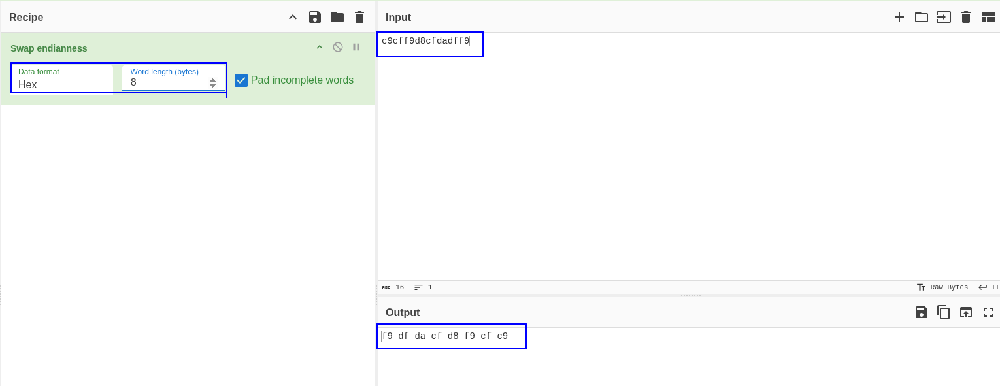
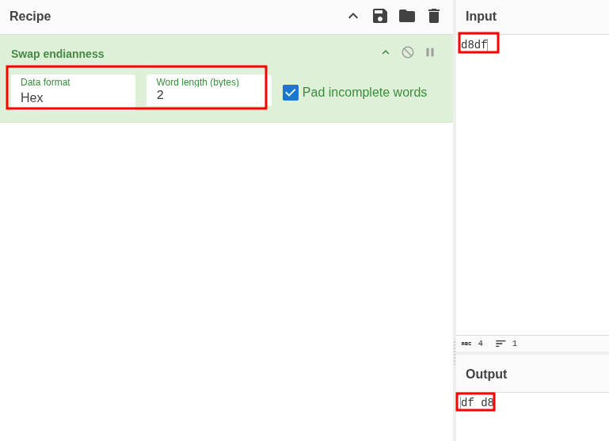
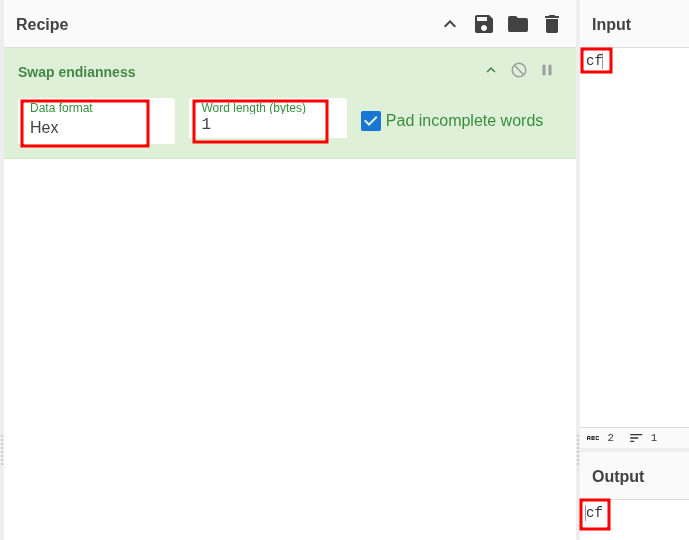
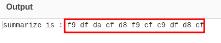
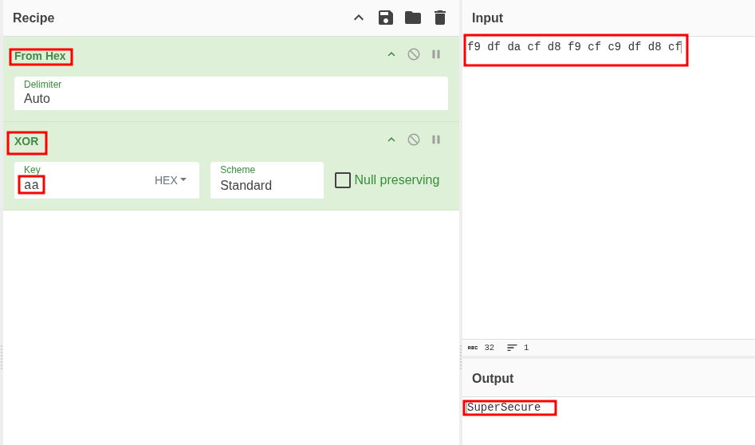
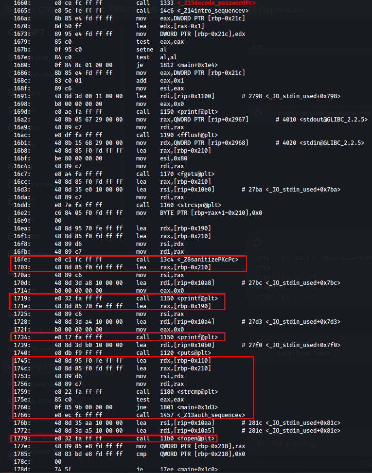
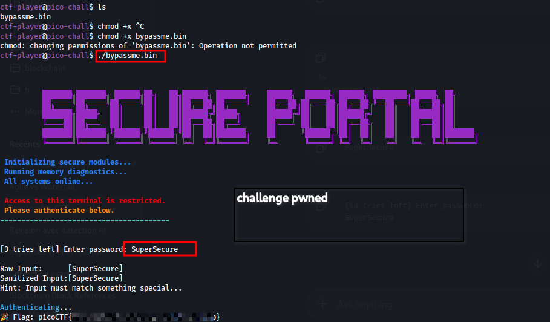

# Bypass Me

**Category:** Reverse Engineering
**Difficulty:** Medium
**Author:** Prince Niyonshuti N.

---

## Challenge Description

The challenge gives us access to a password-protected binary named `bypassme.bin`.

The goal is not to guess the password, but to reverse engineer the binary, understand how the password is generated, and bypass the authentication logic to retrieve the flag.

The challenge description also mentions that the binary performs input sanitization and suggests using a debugger such as LLDB.

---

## Initial Recon

I first copied the binary from the remote instance to my local machine so I could analyze it comfortably:

```bash
scp -P 62188 ctf-player@foggy-cliff.picoctf.net:/home/ctf-player/bypassme.bin .
```

Then I started with basic reconnaissance:

```bash
file bypassme.bin
```

The binary is a 64-bit Linux ELF:

```text
ELF 64-bit LSB pie executable, x86-64, dynamically linked, with debug_info, not stripped
```

The important part is:

```text
with debug_info, not stripped
```

That means function names are still present, which makes the reversing process much easier.

Next, I checked the interesting strings:

```bash
strings bypassme.bin | grep -iE "pass|flag|secret|wrong|correct|access|auth|input|bypass|sanitized"
```

Some useful strings appeared:

```text
[%d tries left] Enter password:
Raw Input:      [%s]
Sanitized Input:[%s]
Hint: Input must match something special...
../../root/flag.txt
Flag: %s
Access Denied
decode_password
auth_sequence
sanitize
```

Finally, I listed the symbols:

```bash
nm -C bypassme.bin | grep -iE "main|pass|flag|check|secret|auth|decode|sanitize"
```

This gave us the key functions:

```text
000000000000162e T main
0000000000001457 T auth_sequence()
0000000000001333 T decode_password(char*)
00000000000013c4 T sanitize(char const*, char*)
```



At this point, the attack path is clear: the binary has a function that decodes the password at runtime, another function that sanitizes input, and a main function that performs authentication.

---

## Disassembling `decode_password`

I inspected the password decoding function using `objdump`:

```bash
objdump -d -Mintel bypassme.bin | grep -A60 '<_Z15decode_passwordPc>'
```

Inside `decode_password`, the binary stores obfuscated bytes on the stack:

```asm
1352: movabs rax,0xc9cff9d8cfdadff9
135c: mov QWORD PTR [rbp-0x13],rax
1360: mov WORD PTR [rbp-0xb],0xd8df
1366: mov BYTE PTR [rbp-0x9],0xcf
```

A few lines later, the function decodes each byte using XOR:

```asm
1381: movzx eax,BYTE PTR [rbp+rax*1-0x13]
1386: xor eax,0xffffffaa
139a: mov BYTE PTR [rax],dl
```

The key instruction is:

```asm
xor eax,0xffffffaa
```

Since the function processes bytes, this means each obfuscated byte is XORed with:

```text
0xaa
```

So the decoding logic is:

```text
decoded_byte = encoded_byte ^ 0xaa
```



---

## Understanding the Encoded Bytes

The first encoded value is:

```text
0xc9cff9d8cfdadff9
```

Because the binary is running on x86-64, values are stored in memory using little-endian order.

So:

```text
0xc9cff9d8cfdadff9
```

becomes:

```text
f9 df da cf d8 f9 cf c9
```

I confirmed this using CyberChef with the `Swap endianness` operation.



The next value is:

```text
0xd8df
```

Because it is a 2-byte word, swapping endianness gives:

```text
df d8
```



The final byte is:

```text
0xcf
```

A single byte does not change when swapping endianness.



Combining everything gives the full encoded password bytes:

```text
f9 df da cf d8 f9 cf c9 df d8 cf
```



---

## Decoding the Password

Now that we have the encoded bytes and the XOR key, we can decode the password.

The recipe is:

```text
From Hex
XOR key: aa
```

Input:

```text
f9 df da cf d8 f9 cf c9 df d8 cf
```

Output:

```text
SuperSecure
```



So the hidden password is:

```text
SuperSecure
```

At this point, the binary is basically pwned from static analysis alone.

---

## Authentication Logic in `main`

Next, I inspected the authentication logic in `main`.

The binary first calls `decode_password`:

```asm
1660: call 1333 <_Z15decode_passwordPc>
```

Then it reads user input and sanitizes it:

```asm
16fe: call 13c4 <_Z8sanitizePKcPc>
```

After sanitization, it compares the input against the decoded password:

```asm
1759: call 1180 <strcmp@plt>
175e: test eax,eax
1760: jne 1801 <main+0x1d3>
```

This is the critical check.

`strcmp` returns `0` when both strings match.

So the logic is:

```text
if strcmp(input, decoded_password) == 0:
    authenticate
else:
    access denied
```

If the comparison succeeds, the binary calls `auth_sequence()` and then opens the flag file:

```asm
1766: call 1457 <_Z13auth_sequencev>
1779: call 11b0 <fopen@plt>
```



This confirms that entering `SuperSecure` should pass authentication.

---

## Exploitation

I connected back to the remote instance and ran the binary:

```bash
ssh ctf-player@foggy-cliff.picoctf.net -p 62824
./bypassme.bin
```

When prompted for the password, I entered:

```text
SuperSecure
```

The binary printed:

```text
Raw Input:      [SuperSecure]
Sanitized Input:[SuperSecure]
Authenticating...
Flag: picoCTF{...}
```



Challenge PWNED 🗝️

---

## Final Answer

```text
SuperSecure
```

---

## Flag

```text
picoCTF{....redacted....}
```

---

## Why This Works

The password was not meant to be guessed.

It was hidden inside the binary and decoded at runtime using a simple XOR operation.

The important observations were:

1. The binary was not stripped, so function names were visible.
2. `decode_password(char*)` contained obfuscated password bytes.
3. The instruction `xor eax,0xffffffaa` revealed the XOR key.
4. The encoded bytes were stored in little-endian format.
5. After decoding the bytes with XOR `0xaa`, the password became `SuperSecure`.
6. The `main` function used `strcmp` to compare the sanitized input with the decoded password.

Once the password was recovered, authentication was straightforward.

---

## Tools Used

* `file`
* `strings`
* `nm`
* `objdump`
* CyberChef
* SSH
* Linux terminal

Ghidra or Binary Ninja could also be used for the same analysis, but in this case `objdump` was enough because the binary contained useful symbols.

---

## Lessons Learned

* Always check whether a binary is stripped or not.
* Function names can give away the intended attack path.
* Endianness matters when extracting constants from assembly.
* XOR obfuscation is reversible and should not be treated as real protection.
* `strcmp` checks are often a good place to understand authentication logic.
* A password decoded at runtime can usually be recovered through static analysis or debugging.
* Sanitization does not matter if the secret itself can be recovered.

---

## Final Thoughts

This was a clean reverse engineering challenge.

The binary tried to hide the password by storing encoded bytes and decoding them at runtime. However, the decoding routine was visible in the disassembly, and the XOR key was directly present in the instruction stream.

After reconstructing the encoded bytes, fixing the little-endian representation, and applying XOR `0xaa`, the hidden password was recovered.

From there, entering the decoded password on the remote service was enough to pwn the challenge and retrieve the flag.
