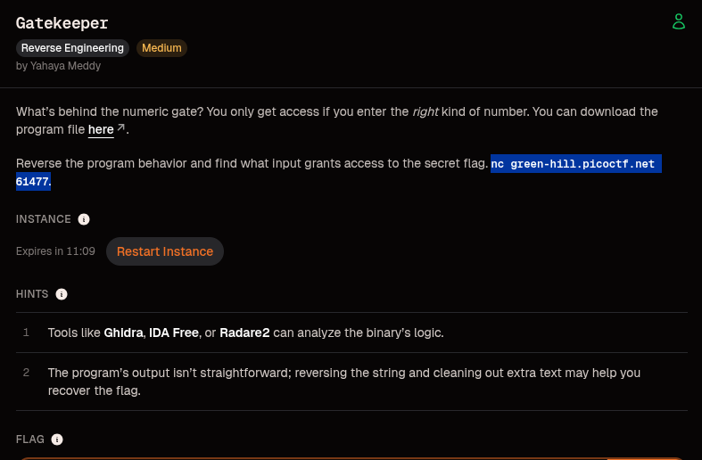
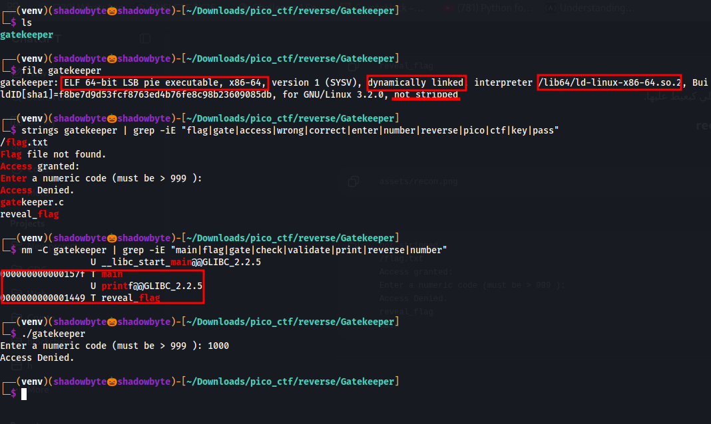
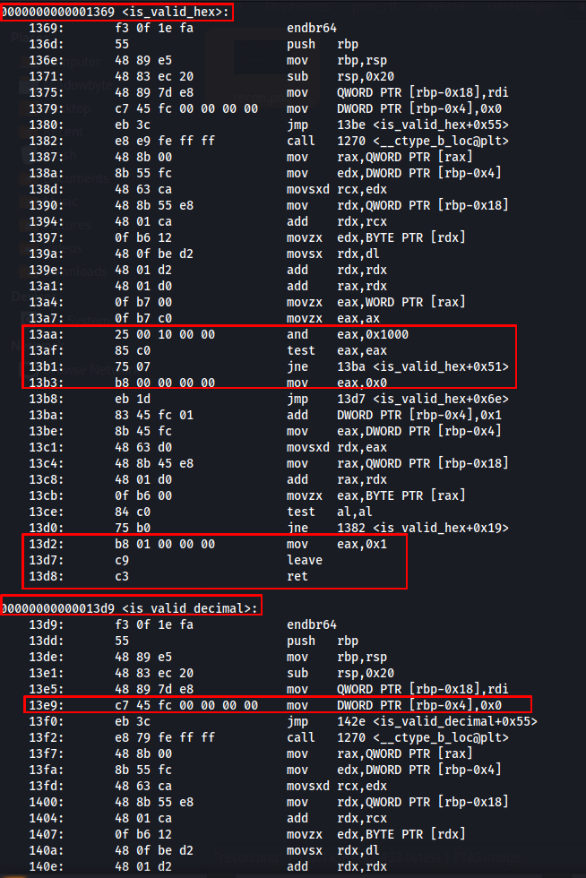
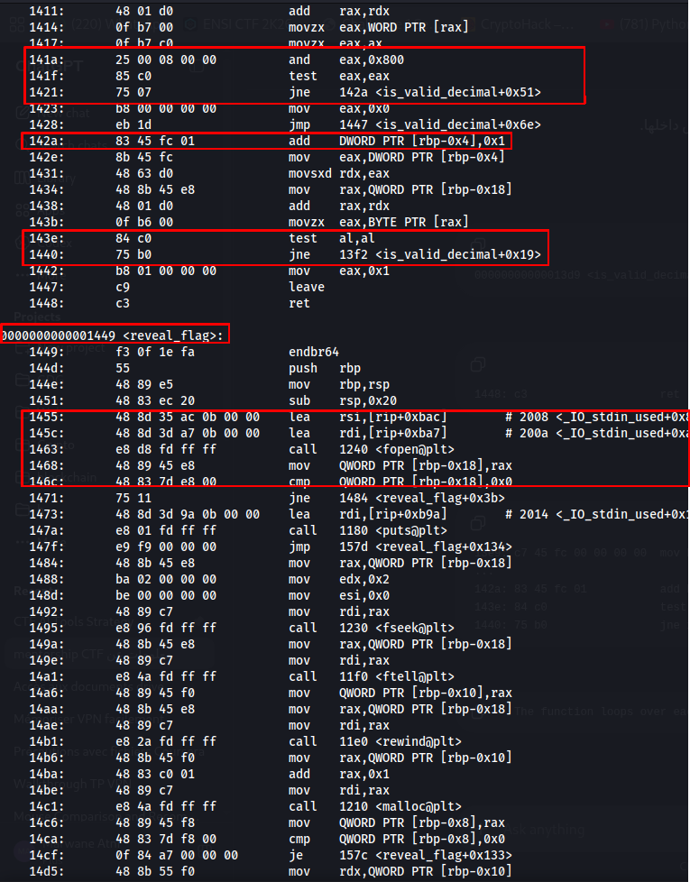
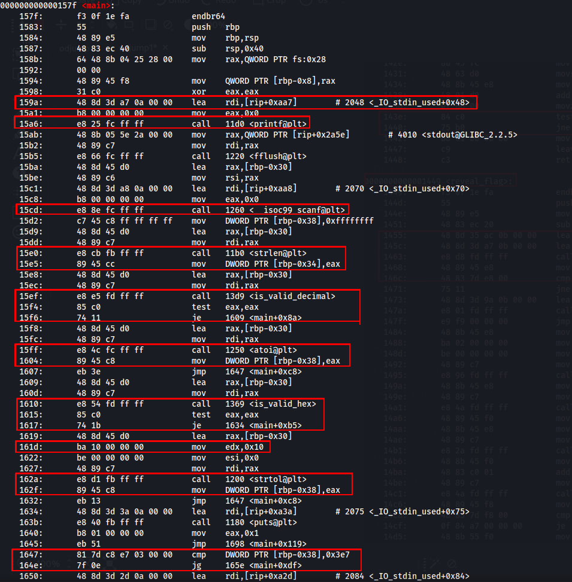
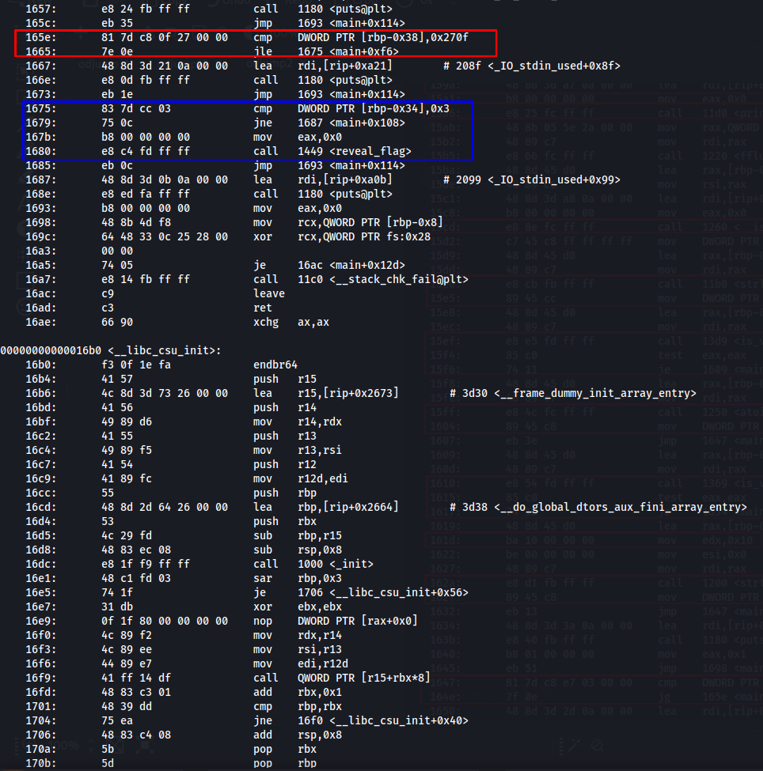
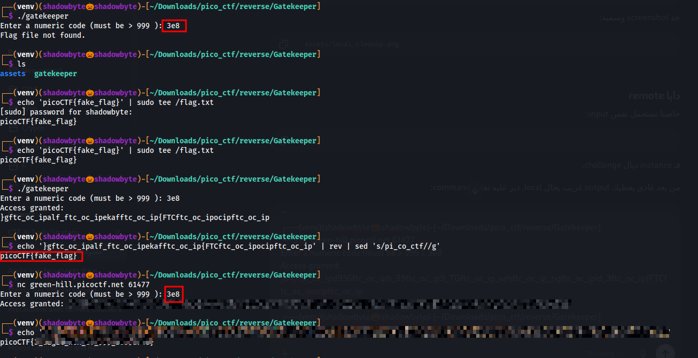

# Gatekeeper

**Category:** Reverse Engineering
**Difficulty:** Medium
**Author:** Yahaya Meddy

---

## Challenge Description

The challenge gives us a binary named `gatekeeper`.

The goal is to find what kind of numeric input can pass the gate and trigger access to the hidden flag.

The challenge description hints that the program expects the “right kind of number”, and the second hint mentions that the output is not straightforward. This means we need to reverse the binary logic, understand the input validation, and then clean the final output.



---

## Initial Recon

I started with basic reconnaissance:

```bash
file gatekeeper
strings gatekeeper | grep -iE "flag|gate|access|wrong|correct|enter|number|reverse|pico|ctf|key|pass"
nm -C gatekeeper | grep -iE "main|flag|gate|check|validate|print|reverse|number"
```

The binary is a 64-bit ELF executable:

```text
gatekeeper: ELF 64-bit LSB pie executable, x86-64, dynamically linked, not stripped
```

The important part is:

```text
not stripped
```

Since the binary is not stripped, useful function names are still visible.

From `strings`, I found these interesting strings:

```text
/flag.txt
Flag file not found.
Access granted:
Enter a numeric code (must be > 999 ):
Access Denied.
gatekeeper.c
reveal_flag
```

From `nm`, I found the important functions:

```text
000000000000157f T main
0000000000001449 T reveal_flag
```



At this point, we know that:

* The binary asks for a numeric code.
* If the code is wrong, it prints `Access Denied.`
* If the code is correct, it calls `reveal_flag`.
* The flag is read from `/flag.txt`.

---

## First Local Test

I first tried a normal decimal value:

```bash
./gatekeeper
```

Input:

```text
1000
```

Output:

```text
Access Denied.
```

This is important because `1000` is greater than `999`, but it still does not pass the gate.

So the condition is not only:

```text
number > 999
```

There must be another hidden condition.

---

## Input Validation Functions

Next, I disassembled the binary:

```bash
objdump -d -Mintel gatekeeper | grep -A180 '<main>'
```

Before `main`, the binary contains helper functions for input validation.

The first one is:

```asm
0000000000001369 <is_valid_hex>:
```

Inside it, we can see this important check:

```asm
13aa: and    eax,0x1000
13af: test   eax,eax
13b1: jne    13ba <is_valid_hex+0x51>
```

This function loops over the input string and verifies whether every character is valid hexadecimal.



The second validation function is:

```asm
00000000000013d9 <is_valid_decimal>:
```

Inside it, the important check is:

```asm
141a: and    eax,0x800
141f: test   eax,eax
1421: jne    142a <is_valid_decimal+0x51>
```

This function checks if each character is a decimal digit.



This tells us that the program does not only accept decimal input. It also has logic to validate hexadecimal input.

---

## Understanding `reveal_flag`

The binary contains a function named `reveal_flag`:

```asm
0000000000001449 <reveal_flag>:
```

The function opens the flag file:

```asm
1455: lea    rsi,[rip+0xbac]
145c: lea    rdi,[rip+0xba7]
1463: call   1240 <fopen@plt>
```

From the earlier `strings` output, we know the file path is:

```text
/flag.txt
```

Then the function checks whether the file was opened successfully:

```asm
146c: cmp    QWORD PTR [rbp-0x18],0x0
1471: jne    1484 <reveal_flag+0x3b>
```

If the file is missing, it prints:

```text
Flag file not found.
```

After that, it reads the file using calls like:

```asm
fseek
ftell
rewind
malloc
fread
fclose
```



This confirms that if we reach `reveal_flag`, the gate has been passed.

---

## Reversing `main`

The main logic is the most important part.

The program first prints the prompt and reads the input:

```asm
159a: lea    rdi,[rip+0xaa7]
15a6: call   11d0 <printf@plt>
...
15cd: call   1260 <__isoc99_scanf@plt>
```

Then it calculates the input length:

```asm
15e0: call   11b0 <strlen@plt>
15e5: mov    DWORD PTR [rbp-0x34],eax
```

This means the input is treated as a string, and its length is stored.


Then the program checks if the input is decimal:

```asm
15ef: call   13d9 <is_valid_decimal>
15f4: test   eax,eax
15f6: je     1609 <main+0x8a>
15ff: call   1250 <atoi@plt>
1604: mov    DWORD PTR [rbp-0x38],eax
```

If the input is decimal, it converts it using:

```c
atoi(input)
```

If it is not decimal, the program checks if it is valid hexadecimal:

```asm
1610: call   1369 <is_valid_hex>
1615: test   eax,eax
1617: je     1634 <main+0xb5>
161d: mov    edx,0x10
162a: call   1200 <strtol@plt>
162f: mov    DWORD PTR [rbp-0x38],eax
```

The important part is:

```asm
mov edx,0x10
call strtol
```

This means the program converts hexadecimal input using base 16:

```c
strtol(input, NULL, 16)
```

So the program supports both decimal and hexadecimal-looking input.

---

## Gate Conditions

After parsing the input, the program checks the numeric value.

First check:

```asm
1647: cmp    DWORD PTR [rbp-0x38],0x3e7
164e: jg     165e <main+0xdf>
```

`0x3e7` is `999` in decimal.

So the parsed value must be:

```text
> 999
```

Second check:

```asm
165e: cmp    DWORD PTR [rbp-0x38],0x270f
1665: jle    1675 <main+0xf6>
```

`0x270f` is `9999` in decimal.

So the parsed value must be:

```text
<= 9999
```

Finally, the program checks the original input length:

```asm
1675: cmp    DWORD PTR [rbp-0x34],0x3
1679: jne    1687 <main+0x108>
167b: mov    eax,0x0
1680: call   1449 <reveal_flag>
```



This is the key condition.

The input must satisfy all of this:

```text
parsed_value > 999
parsed_value <= 9999
input_length == 3
```

---

## Finding the Correct Input

Using decimal input creates a problem:

```text
999  -> length is 3, but value is not greater than 999
1000 -> value is greater than 999, but length is 4
```

So a normal decimal number cannot satisfy both conditions at the same time.

But the program also accepts hexadecimal input.

A good candidate is:

```text
3e8
```

Because:

```text
0x3e8 = 1000
```

And:

```text
len("3e8") = 3
```

So `3e8` satisfies all conditions:

```text
parsed_value = 1000
1000 > 999
1000 <= 9999
length = 3
```

This should reach:

```asm
call 1449 <reveal_flag>
```

---

## Local Exploit

I tested the bypass locally:

```bash
./gatekeeper
```

Input:

```text
3e8
```

At first, the program printed:

```text
Flag file not found.
```

This is actually a good sign. It means the input passed the gate and `reveal_flag` was called.

The issue is only that the program tries to open:

```text
/flag.txt
```

So I created a local fake flag at that path:

```bash
echo 'picoCTF{fake_flag}' | sudo tee /flag.txt
```

Then I ran the binary again:

```bash
./gatekeeper
```

Input:

```text
3e8
```

Output:

```text
Access granted:
}gftc_oc_ipalf_ftc_oc_ipekafftc_oc_ip{FTCftc_oc_ipocipftc_oc_ip
```


The output is not directly readable. This matches the challenge hint.

---

## Cleaning the Output

The output appears reversed and contains junk text.

The junk marker is:

```text
pi_co_ctf
```

So the cleanup process is:

1. Reverse the string.
2. Remove every occurrence of `pi_co_ctf`.

I used:

```bash
echo '}gftc_oc_ipalf_ftc_oc_ipekafftc_oc_ip{FTCftc_oc_ipocipftc_oc_ip' | rev | sed 's/pi_co_ctf//g'
```

Output:

```text
picoCTF{fake_flag}
```

This confirms the full local exploit logic.

---

## Remote Exploitation

The remote service works the same way.

I connected to the challenge instance:

```bash
nc green-hill.picoctf.net 61477
```

Then I entered the same bypass input:

```text
3e8
```

The service returned an obfuscated string after `Access granted:`.

I copied that obfuscated output and cleaned it using the same method:

```bash
echo 'REMOTE_OBFUSCATED_OUTPUT_HERE' | rev | sed 's/pi_co_ctf//g'
```

This recovered the real flag.



---

## Flag

```text
picoCTF{REPLACE_WITH_REAL_FLAG}
```

---

## Why This Works

The bug is caused by checking two different meanings of the input:

* The program checks the numeric value after parsing.
* But it checks the length of the original string.

The numeric value must be greater than `999`, but the string length must be exactly `3`.

This is hard with decimal input, but easy with hexadecimal input.

The input:

```text
3e8
```

has length `3`, but when parsed as hexadecimal, it becomes:

```text
1000
```

So it passes the numeric gate and calls `reveal_flag`.

After that, the printed flag is obfuscated by reversing it and inserting the junk marker `pi_co_ctf`. Reversing the output and removing the marker reveals the flag.

---

## Tools Used

* `file`
* `strings`
* `nm`
* `objdump`
* `rev`
* `sed`
* `nc`

---

## Key Takeaways

* A number can be represented in different bases.
* The program accepts hexadecimal input using `strtol(..., 16)`.
* The numeric value and the string length are checked separately.
* `3e8` is only 3 characters long but equals 1000 in hexadecimal.
* Reaching `reveal_flag` confirms that the gate was bypassed.
* The final output must be reversed and cleaned with `sed`.

---

## Conclusion

This challenge was based on a numeric gate with a parsing trick.

At first, a normal decimal value like `1000` fails because its length is 4. After reversing the binary, I found that the program also accepts hexadecimal input and checks the original input length separately.

The input:

```text
3e8
```

passes because it is three characters long and evaluates to `1000`.

After that, the program prints an obfuscated flag. Reversing the string and removing the repeated marker `pi_co_ctf` recovers the flag.

Challenge pwned.
