# Hidden Cipher 1

**Category:** Reverse Engineering
**Difficulty:** Medium
**Author:** Yahaya Meddy

---

## Challenge Description

The challenge gives us a binary named `hiddencipher` and a local `flag.txt`.

The goal is to understand how the binary encrypts the flag, recover the hidden key, and then use the same logic to decrypt the real encrypted flag from the remote service.

Remote service:

```bash
nc candy-mountain.picoctf.net 50326
```

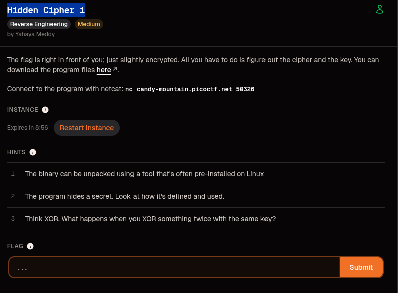

---

## Initial Recon

I started with basic reconnaissance on the provided files:

```bash
ls
file hiddencipher flag.txt
strings hiddencipher | grep -iE "upx|flag|secret|encrypted|failed|%02x"
```

The binary was detected as a 64-bit ELF:

```text
hiddencipher: ELF 64-bit LSB pie executable, x86-64, statically linked, no section header
```

The important part here is:

```text
no section header
```

This makes static analysis harder because the binary does not expose normal section information.

The `strings` output also revealed several useful clues:

```text
UPX!
flag.txt
%02x
$Info: This file is packed with the UPX executable packer
```

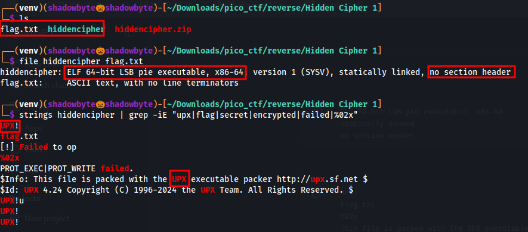

At this point, the first important discovery was that the binary is packed with UPX.

The presence of `flag.txt` suggests that the program reads the flag from a file, and `%02x` suggests that the output is printed as hexadecimal bytes.

---

## Unpacking the Binary

Since the binary is packed with UPX, I unpacked it using:

```bash
upx -d hiddencipher -o hiddencipher_unpacked
```

UPX successfully unpacked the binary:

```text
24275 <- 7196   29.64%   linux/amd64   hiddencipher_unpacked
Unpacked 1 file.
```

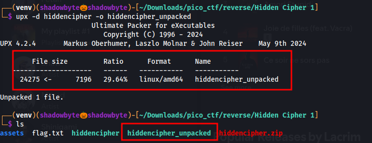

After unpacking, the binary becomes much easier to analyze.

---

## Recon After Unpacking

I checked the unpacked binary:

```bash
file hiddencipher_unpacked
strings hiddencipher_unpacked | grep -iE "flag|secret|encrypted|failed|%02x"
nm -C hiddencipher_unpacked | grep -iE "main|secret"
```

The unpacked file is now a normal dynamically linked ELF:

```text
ELF 64-bit LSB pie executable, x86-64, dynamically linked, not stripped
```

The useful strings are now clearer:

```text
flag.txt
[!] Failed to open flag.txt
Here your encrypted flag:
%02x
get_secret
```

The symbols also reveal two important functions:

```text
00000000000012a9 T get_secret
00000000000012eb T main
```

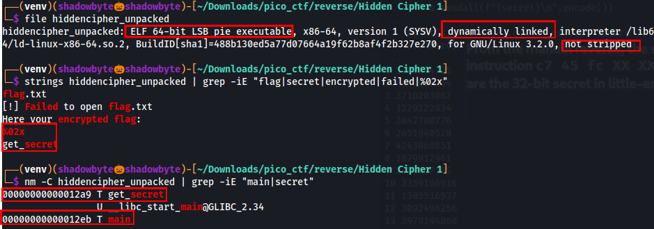

At this point, the reversing path is clear:

* `get_secret` probably builds or returns the encryption key.
* `main` probably reads `flag.txt`, encrypts it, and prints the encrypted output.

---

## Reversing `get_secret`

I disassembled the `get_secret` function:

```bash
objdump -d -Mintel hiddencipher_unpacked | grep -A70 '<get_secret>'
```

Inside `get_secret`, the program writes several hardcoded bytes into memory:

```asm
12b1: mov BYTE PTR [rip+0x2d59],0x53
12b8: mov BYTE PTR [rip+0x2d53],0x33
12bf: mov BYTE PTR [rip+0x2d4d],0x43
12c6: mov BYTE PTR [rip+0x2d47],0x72
12cd: mov BYTE PTR [rip+0x2d41],0x33
12d4: mov BYTE PTR [rip+0x2d3b],0x74
12db: mov BYTE PTR [rip+0x2d35],0x0
```

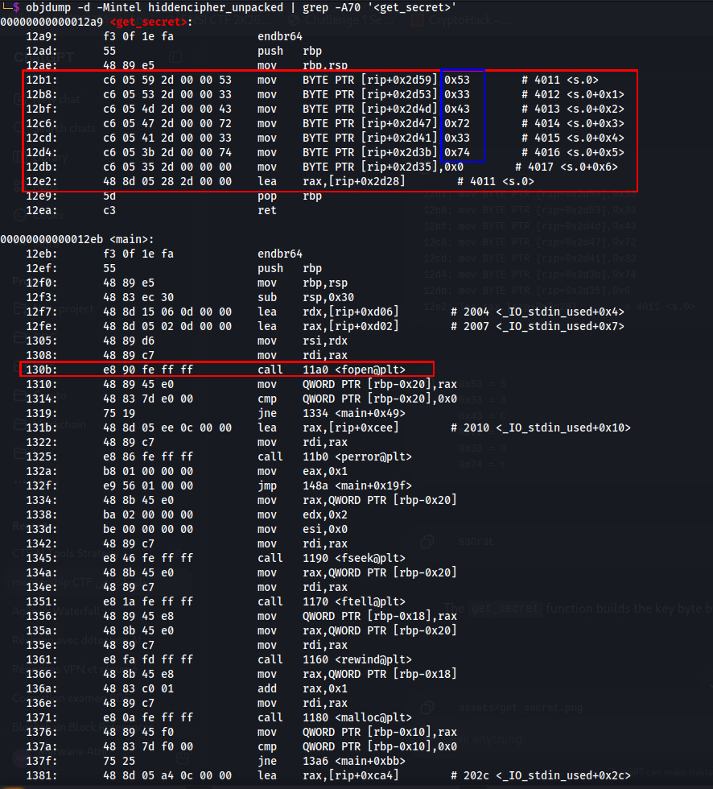

The bytes are:

```text
53 33 43 72 33 74
```

Converting these bytes from hex to ASCII gives:

```text
S3Cr3t
```

So the hidden key is:

```text
S3Cr3t
```

---

## Confirming the Key with Ghidra

I also opened the unpacked binary in Ghidra.

The decompiled `get_secret()` function confirms the same byte sequence:

```c
s.0._0_1_ = 0x53;
s.0._1_1_ = 0x33;
s.0._2_1_ = 0x43;
s.0._3_1_ = 0x72;
s.0._4_1_ = 0x33;
s.0._5_1_ = 0x74;
s.0._6_1_ = 0;
return &s.0;
```

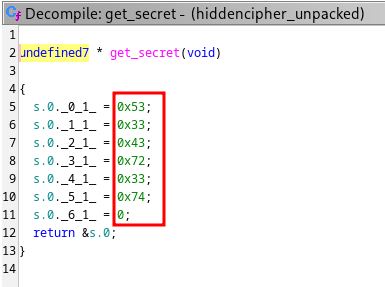

This confirms that the function builds the secret key byte by byte.

The key is:

```text
S3Cr3t
```

To make the conversion clear, I also used CyberChef:

* Input: `53 33 43 72 33 74`
* Recipe: `From Hex`
* Output: `S3Cr3t`

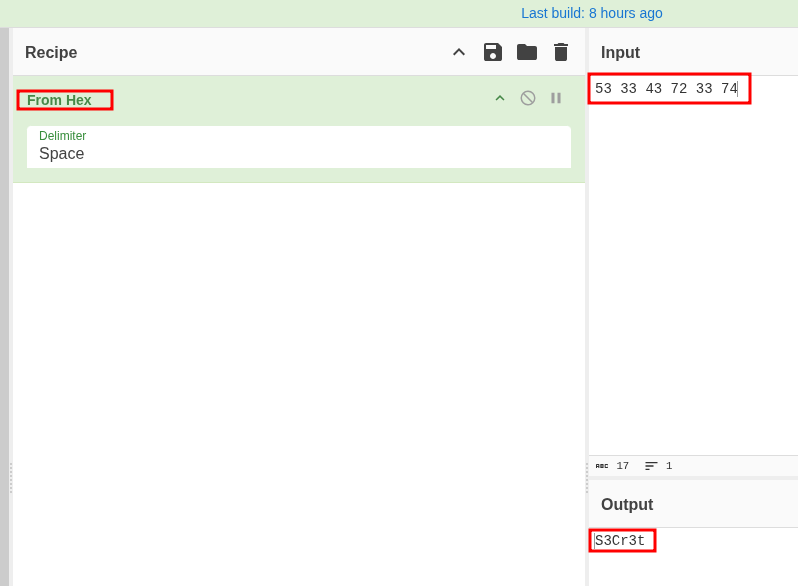

---

## Reversing `main`

After recovering the key, I moved to the `main` function to understand how the key is used.

From the disassembly, the program first opens `flag.txt`:

```asm
130b: call fopen@plt
```

Then it reads the flag content:

```asm
13ba: call fread@plt
13c6: call fclose@plt
```

After that, it calls `get_secret`:

```asm
13d9: call 12a9 <get_secret>
13de: mov QWORD PTR [rbp-0x8],rax
```

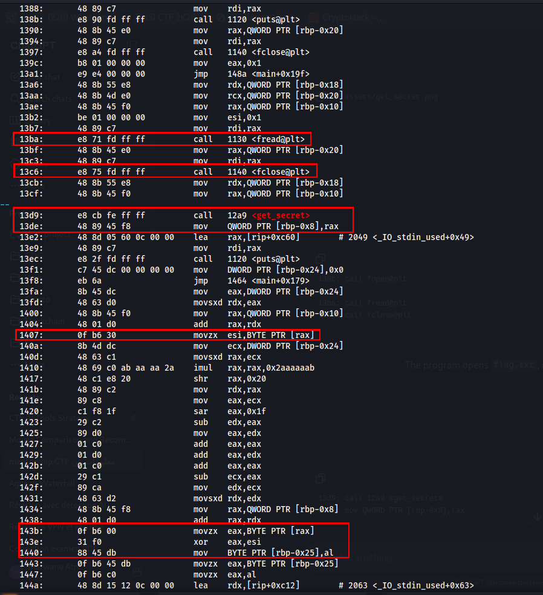

The next important part is the encryption loop.

The program loads one byte from the flag, loads one byte from the secret key, XORs them together, and then stores the encrypted byte:

```asm
1407: movzx esi,BYTE PTR [rax]
...
143b: movzx eax,BYTE PTR [rax]
143e: xor eax,esi
1440: mov BYTE PTR [rbp-0x25],al
```

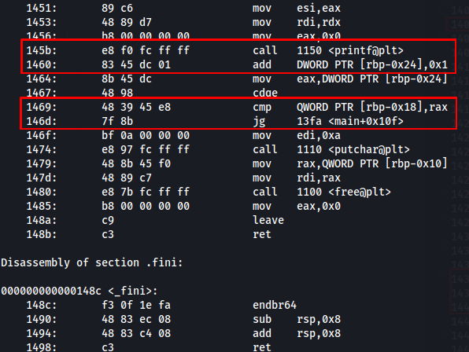

Then it prints the encrypted byte as hexadecimal using `printf`:

```asm
145b: call printf@plt
```

The loop continues until all flag bytes are processed.

---

## Understanding the Algorithm with Ghidra

Ghidra makes the logic much easier to read.

The decompiled `main()` shows that the program opens the flag file:

```c
__stream = fopen("flag.txt","rb");
```

Then it calls `get_secret()`:

```c
puVar2 = get_secret();
puts("Here your encrypted flag:");
```

The encryption loop is:

```c
for (local_2c = 0; (long)local_2c < (long)__n; local_2c = local_2c + 1) {
    printf("%02x",
        (uint)*(byte *)((long)puVar2 + (long)(local_2c % 6)) ^
        (uint)*(byte *)((long)__ptr + (long)local_2c));
}
```

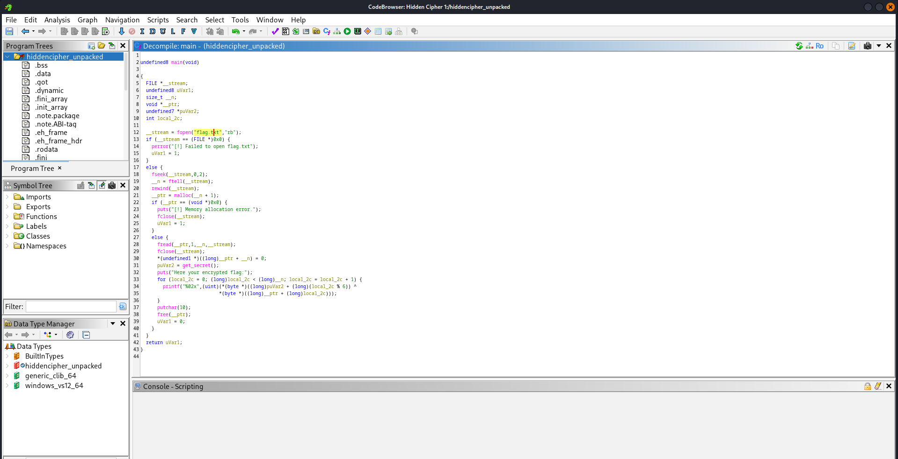

The important part is:

```c
local_2c % 6
```

This means the key is reused cyclically every 6 bytes.

Since:

```text
len("S3Cr3t") = 6
```

The encryption is repeating-key XOR:

```text
cipher[i] = flag[i] XOR key[i % 6]
```

Where:

```text
key = S3Cr3t
```

Since XOR is reversible, decryption uses the same operation:

```text
flag[i] = cipher[i] XOR key[i % 6]
```

---

## Local Verification

Before attacking the remote service, I verified the logic locally.

Running the unpacked binary with the provided local `flag.txt` gives:

```bash
./hiddencipher_unpacked
```

Output:

```text
Here your encrypted flag:
235a201d70201548251358110c552f135409
```

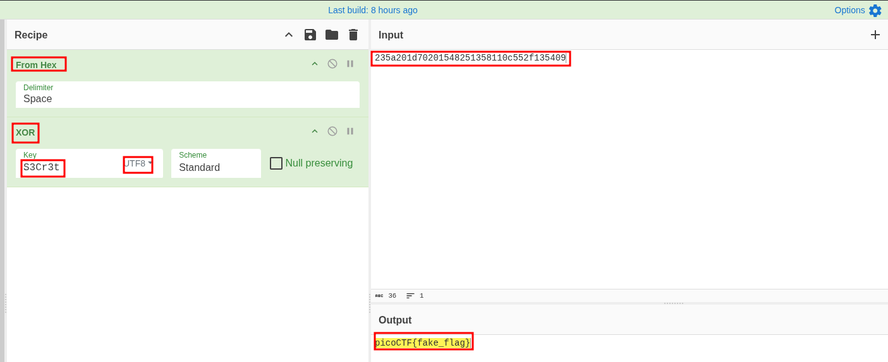

Then I decrypted this local ciphertext in CyberChef.

Recipe:

```text
From Hex
XOR
```

XOR key:

```text
S3Cr3t
```

Key format:

```text
UTF8
```

The output was:

```text
picoCTF{fake_flag}
```


This confirms that the binary encrypts the flag using repeating-key XOR with the key `S3Cr3t`.

---

## Remote Exploitation

Now that the encryption logic is fully understood, I connected to the remote service:

```bash
nc candy-mountain.picoctf.net 50326
```

The remote service returned the real encrypted flag:

```text
Here your encrypted flag:
235a201d702015483b1d412b265d3313501f0c072d135f0d2002302d0a406a0a701756102e
```

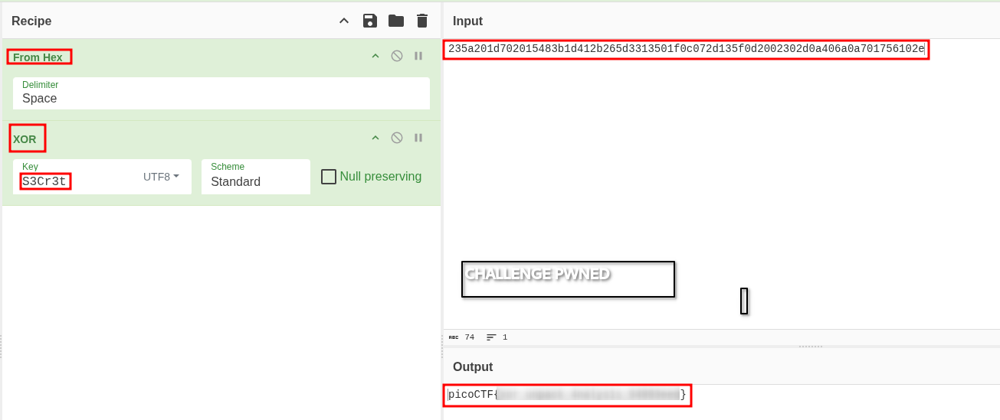

I used the same CyberChef recipe:

```text
From Hex
XOR
```

With the same key:

```text
S3Cr3t
```

The decrypted output was:

```text
picoCTF{xor_unpack_4nalys1s_94993eed}
```


Challenge pwned.

---

## Flag

```text
picoCTF{...redacted...}
```

---

## Why This Works

The binary does not print the flag directly.

Instead, it:

1. Reads `flag.txt`.
2. Builds the secret key inside `get_secret()`.
3. XORs every flag byte with the repeating key.
4. Prints each encrypted byte as hexadecimal using `%02x`.

The key is built from these bytes:

```text
53 33 43 72 33 74
```

Which decode to:

```text
S3Cr3t
```

The encryption formula is:

```text
cipher[i] = plaintext[i] XOR key[i % len(key)]
```

Because XOR is symmetric, applying the same key again decrypts the ciphertext:

```text
plaintext[i] = cipher[i] XOR key[i % len(key)]
```

---

## Tools Used

* `file`
* `strings`
* `upx`
* `nm`
* `objdump`
* Ghidra
* CyberChef
* `nc`

---

## Key Takeaways

* UPX-packed binaries should be unpacked before deeper analysis.
* `strings` can quickly reveal packers and useful clues.
* `nm` is useful when symbols are not stripped.
* `get_secret` revealed the XOR key.
* `%02x` showed that encrypted bytes are printed as hex.
* Repeating-key XOR can be reversed by applying the same key again.
* Verifying the logic locally makes the remote solve straightforward.

---

## Conclusion

This was a clean reverse engineering challenge.

The main trick was not guessing the flag, but understanding how the program transforms it.

After unpacking the binary, `get_secret` revealed the key `S3Cr3t`, and `main` showed that the flag is encrypted using repeating-key XOR.

Once the logic was verified locally, the same CyberChef recipe decrypted the remote output and revealed the real flag.

Pwned.
