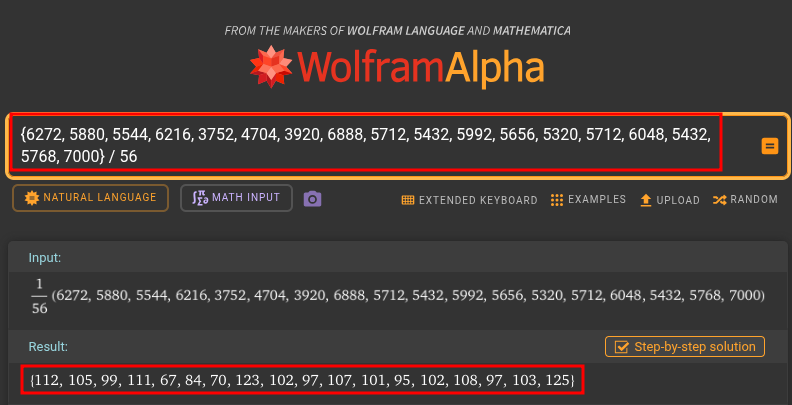
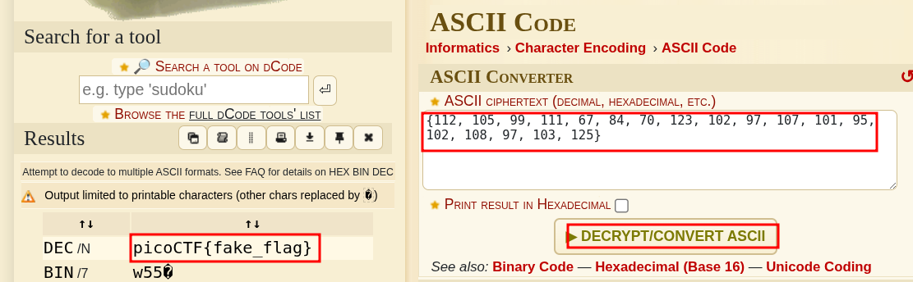

# Hidden Cipher 2

**Category:** Reverse Engineering
**Difficulty:** Medium
**Author:** Yahaya Meddy

---

## Challenge Description

The challenge gives us a binary named `hiddencipher2` and a local `flag.txt`.

The description says that the flag is right in front of us, but we need to solve a basic math problem first.
However, the real trick is not only solving the math question. We also need to understand how the correct answer is reused later by the program.

The goal is to reverse the binary, understand the encoding logic, and recover the real flag from the remote service.

---


## Initial Recon

I started with basic reconnaissance on the provided files:

```bash
file hiddencipher2 flag.txt
strings hiddencipher2 | grep -iE "flag|encoded|wrong|input|what|%d|secret"
nm -C hiddencipher2 | grep -iE "main|flag|encode|question|read"
```

The binary is a normal 64-bit ELF:

```text
hiddencipher2: ELF 64-bit LSB pie executable, x86-64, dynamically linked, not stripped
```

The important part is:

```text
not stripped
```

That means the binary still contains useful symbol names.

From `strings`, I found:

```text
Encoded flag values:
Could not open flag file
What is %d %c %d?
Invalid input. Exiting.
Wrong answer! No flag for you.
flag.txt
read_flag_file
encode_flag
```

From `nm`, the useful functions are:

```text
000000000000149c T encode_flag
0000000000001369 T generate_math_question
0000000000001636 T main
0000000000001544 T read_flag_file
```

.png)

At this point, the important functions are clear:

* `generate_math_question`
* `main`
* `read_flag_file`
* `encode_flag`

---

## Understanding `encode_flag`

I started by reversing `encode_flag`, because its name strongly suggests that it transforms the flag.

```bash
objdump -d -Mintel hiddencipher2 | grep -A100 '<encode_flag>'
```

The important part is:

```asm
14a8: mov QWORD PTR [rbp-0x18],rdi
14ac: mov DWORD PTR [rbp-0x1c],esi
```

This shows that `encode_flag` receives two arguments:

```text
rdi = pointer to the flag string
esi = integer value
```

So the function is basically:

```c
encode_flag(flag, value);
```

The key instruction is:

```asm
14d4: movzx eax,BYTE PTR [rax]
14d7: movsx eax,al
14da: imul eax,DWORD PTR [rbp-0x1c]
14ef: call printf@plt
```

.png)

The instruction:

```asm
imul eax,DWORD PTR [rbp-0x1c]
```

means that each flag character is multiplied by the second argument.

So the encoding logic is:

```text
encoded_value = ASCII(flag_character) * multiplier
```

Then the program prints the encoded value as a decimal number.

---

## `encode_flag` in Ghidra

Ghidra makes the function very clear:

```c
void encode_flag(long param_1,int param_2)
{
  int local_c;

  puts("Encoded flag values:");
  for (local_c = 0; *(char *)(param_1 + local_c) != '\0'; local_c = local_c + 1) {
    printf("%d",*(char *)(param_1 + (long)local_c) * param_2);
    if (*(char *)(param_1 + (long)local_c + 1) != '\0') {
      printf(", ");
    }
  }
  putchar(10);
  return;
}
```

.png)

This confirms the exact algorithm:

```text
encoded[i] = ord(flag[i]) * param_2
```

So to decode the values later:

```text
ord(flag[i]) = encoded[i] / param_2
```

---

## Understanding `read_flag_file`

The binary also has a function named `read_flag_file`.

The function opens the flag file, calculates its size, allocates memory, and reads the file content.

Important calls include:

```asm
call fopen@plt
call fseek@plt
call ftell@plt
call rewind@plt
call malloc@plt
```

.png)

This confirms that the program reads `flag.txt` into memory before passing it to `encode_flag`.

---

## Understanding `main`

Next, I analyzed `main`.

```bash
objdump -d -Mintel hiddencipher2 | grep -A180 '<main>'
```

The first important part is the math question generation:

```asm
1662: lea rdx,[rbp-0x1c]
1666: lea rcx,[rbp-0x20]
166a: lea rax,[rbp-0x21]
1674: call 1369 <generate_math_question>
1679: mov DWORD PTR [rbp-0x14],eax
```

The return value of `generate_math_question` is stored in:

```text
[rbp-0x14]
```

This value is the correct answer to the math question.

Then the program prints the question:

```asm
1697: call printf@plt
```

And reads user input:

```asm
16c1: call __isoc23_scanf@plt
```

Then it compares the user input with the correct answer:

```asm
16e1: mov eax,DWORD PTR [rbp-0x18]
16e4: cmp DWORD PTR [rbp-0x14],eax
16e7: je 16ff <main+0xc9>
```

If the answer is wrong, the program prints:

```text
Wrong answer! No flag for you.
```

The most important part happens after the answer is correct:

```asm
1709: call 1544 <read_flag_file>
1720: mov edx,DWORD PTR [rbp-0x14]
1723: mov rax,QWORD PTR [rbp-0x10]
1727: mov esi,edx
1729: mov rdi,rax
172c: call 149c <encode_flag>
```

.png)

This means the correct math answer is passed into `encode_flag`.

In C-like form:

```c
answer = generate_math_question(...);

if (user_input == answer) {
    flag = read_flag_file("flag.txt");
    encode_flag(flag, answer);
}
```

So the math answer is not only used for authentication.
It is reused as the multiplier that encodes the flag.

---

## `main` in Ghidra

Ghidra confirms the full logic clearly:

```c
local_1c = generate_math_question(&local_29,&local_28,&local_24);
printf("What is %d %c %d? ",local_28,local_29,local_24);
fflush(stdout);
iVar1 = __isoc23_scanf(&DAT_0010201d,&local_20);

if (iVar1 == 1) {
  if (local_1c == local_20) {
    local_18 = read_flag_file("flag.txt");
    if (local_18 != (void *)0x0) {
      encode_flag((long)local_18,local_1c);
      free(local_18);
    }
  }
  else {
    puts("Wrong answer! No flag for you.");
  }
}
```

.png)

The important line is:

```c
encode_flag((long)local_18,local_1c);
```

Here:

```text
local_18 = flag content
local_1c = correct answer
```

So the call is:

```c
encode_flag(flag, correct_answer);
```

---

## Final Algorithm

After reversing both `main` and `encode_flag`, the algorithm becomes simple:

```text
1. Generate a random math question.
2. Store the correct answer.
3. Ask the user for the answer.
4. If the answer is correct:
   - read flag.txt
   - multiply every flag character by the correct answer
   - print the numbers
```

Encoding formula:

```text
encoded_value = ord(flag_character) * correct_answer
```

Decoding formula:

```text
flag_character = chr(encoded_value / correct_answer)
```

---

## Local Test

I ran the binary locally:

```bash
./hiddencipher2
```

The program asked:

```text
What is 8 * 7?
```

The correct answer is:

```text
56
```

After entering `56`, the program printed:

```text
Encoded flag values:
6272, 5880, 5544, 6216, 3752, 4704, 3920, 6888, 5712, 5432, 5992, 5656, 5320, 5712, 6048, 5432, 5768, 7000
```

.png)

Since the answer is `56`, every encoded value must be divided by `56`.

For example:

```text
6272 / 56 = 112 = 'p'
5880 / 56 = 105 = 'i'
5544 / 56 = 99  = 'c'
6216 / 56 = 111 = 'o'
```

---

## Bulk Division with WolframAlpha

Instead of dividing every value manually, I used WolframAlpha.

Input:

```text
{6272, 5880, 5544, 6216, 3752, 4704, 3920, 6888, 5712, 5432, 5992, 5656, 5320, 5712, 6048, 5432, 5768, 7000} / 56
```

Result:

```text
{112, 105, 99, 111, 67, 84, 70, 123, 102, 97, 107, 101, 95, 102, 108, 97, 103, 125}
```



These are ASCII codes.

---

## ASCII Decoding with dCode

Then I converted the ASCII codes using dCode.

Input:

```text
{112, 105, 99, 111, 67, 84, 70, 123, 102, 97, 107, 101, 95, 102, 108, 97, 103, 125}
```

Output:

```text
picoCTF{fake_flag}
```



This confirms that the local fake flag was correctly decoded.

---

## Remote Exploitation

The remote service works the same way.

It asks a math question, and the correct answer becomes the multiplier for the encoded flag.

In my remote run, the service asked:

```text
What is 9 - 2?
```

The answer is:

```text
7
```

Then it printed encoded flag values:

```text
784, 735, 693, 777, 469, 588, 490, 861, 763, 364, 812, 728, 665, 686, 357, 728, 343, 770, 700, 665, 693, 343, 784, 728, 357, 798, 665, 714, 392, 693, 707, 385, 679, 700, 378, 875
```

Since the answer is `7`, I divided every value by `7` and converted the results to ASCII.

This recovered the real flag.

.png)

---

## Flag

```text
picoCTF{...redacted...}
```

---

## Why This Works

The program does not directly print the flag.

Instead, after the correct math answer is entered, the answer is reused as an encoding multiplier.

The encoding is:

```text
encoded_value = ASCII(character) * correct_answer
```

So the decoding is:

```text
ASCII(character) = encoded_value / correct_answer
```

After converting the resulting ASCII codes back to text, the flag is recovered.

---

## Tools Used

* `file`
* `strings`
* `nm`
* `objdump`
* Ghidra
* WolframAlpha
* dCode
* `nc`

---

## Key Takeaways

* Always check whether a value is reused later in the program.
* The correct answer to the math question is not only used for validation.
* `encode_flag` uses the correct answer as a multiplier.
* Multiplication-based encoding is easy to reverse if the multiplier is known.
* Decryption is done by dividing every encoded number by the correct answer.
* The result of the division gives ASCII values.
* ASCII values can be converted back to text to recover the flag.

---

## Conclusion

This was a clean reverse engineering challenge.

At first, it looks like a simple math challenge.
But the real trick is that the correct answer is reused later to encode the flag.

After reversing `main`, I found that the program calls:

```c
encode_flag(flag, correct_answer);
```

Then reversing `encode_flag` showed that each flag character is multiplied by the correct answer.

Once this logic was understood, solving the challenge was straightforward:

1. Answer the math question correctly.
2. Copy the encoded values.
3. Divide each value by the correct answer.
4. Convert the results from ASCII to text.

Challenge pwned.
