# JITFP

**Category:** Reverse Engineering
**Difficulty:** Hard
**Author:** syreal

---

## Challenge Description

The challenge gives access to a remote host containing a password checker binary.

```bash
ssh -p <PORT> ctf-player@dolphin-cove.picoctf.net
```

The binary only works correctly on the challenge host. This means that static analysis alone is not enough; we need to understand what happens at runtime.

The hints are important:

1. You can exfiltrate files using `scp`.
2. If your timing is not optimal, you can get a partially correct flag sometimes.
3. The extracted flag is in standard picoCTF flag format.

---
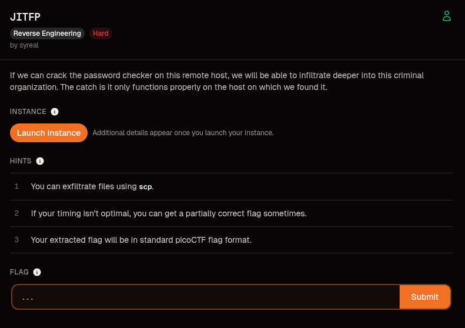
## Remote Recon

I started by connecting to the remote host and running the binary.

```bash
ssh -p <PORT> ctf-player@dolphin-cove.picoctf.net
ls
./ad7e550b
./ad7e550b picoCTF{fake_flag}
```

The program expects one argument and rejects an incorrect flag.


Then I copied the binary locally for static analysis:

```bash
scp -P <PORT> ctf-player@dolphin-cove.picoctf.net:/home/ctf-player/* .
```


---

## Basic Static Analysis

I started with basic reconnaissance:

```bash
file ad7e550b
strings -a ad7e550b | grep -iE "usage|correct|incorrect|flag|sleep|pico|ctf"
checksec --file=ad7e550b
```

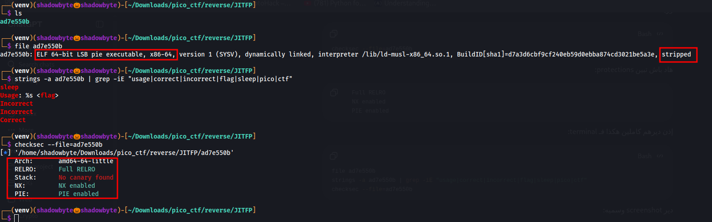

Important findings:

```text
ELF 64-bit LSB pie executable
x86-64
dynamically linked
interpreter /lib/ld-musl-x86_64.so.1
stripped
```

The binary is stripped, PIE-enabled, and dynamically linked with musl.

The visible strings include:

```text
sleep
Usage: %s <flag>
Incorrect
Incorrect
Correct
```

This already suggests that the program may use timing and does not simply store the flag as a normal string.

---

## ELF Header and Sections

I inspected the ELF header:

```bash
readelf -h ad7e550b
```

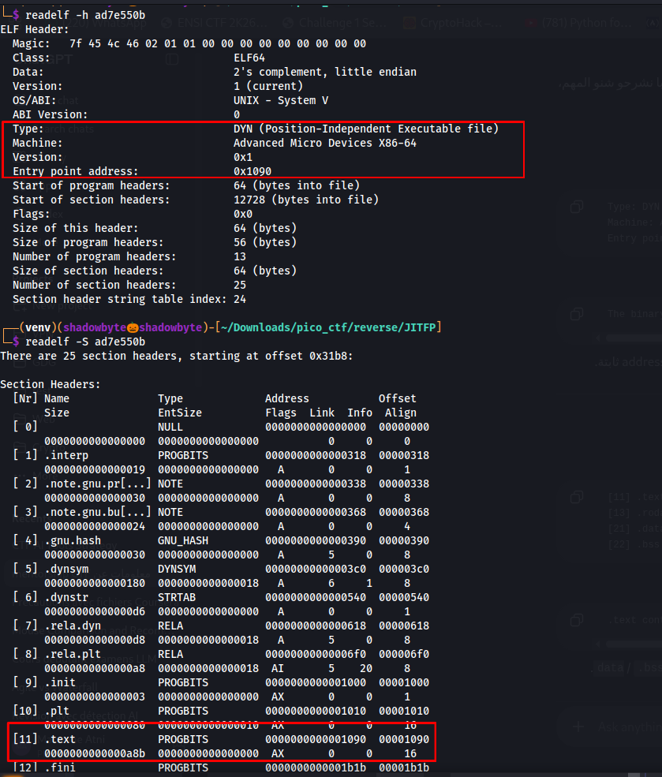

The binary type is:

```text
DYN (Position-Independent Executable file)
```

So the binary is PIE. Static addresses in the disassembly are offsets; at runtime, we need to add the PIE base address.

Then I inspected sections:

```bash
readelf -S ad7e550b
```

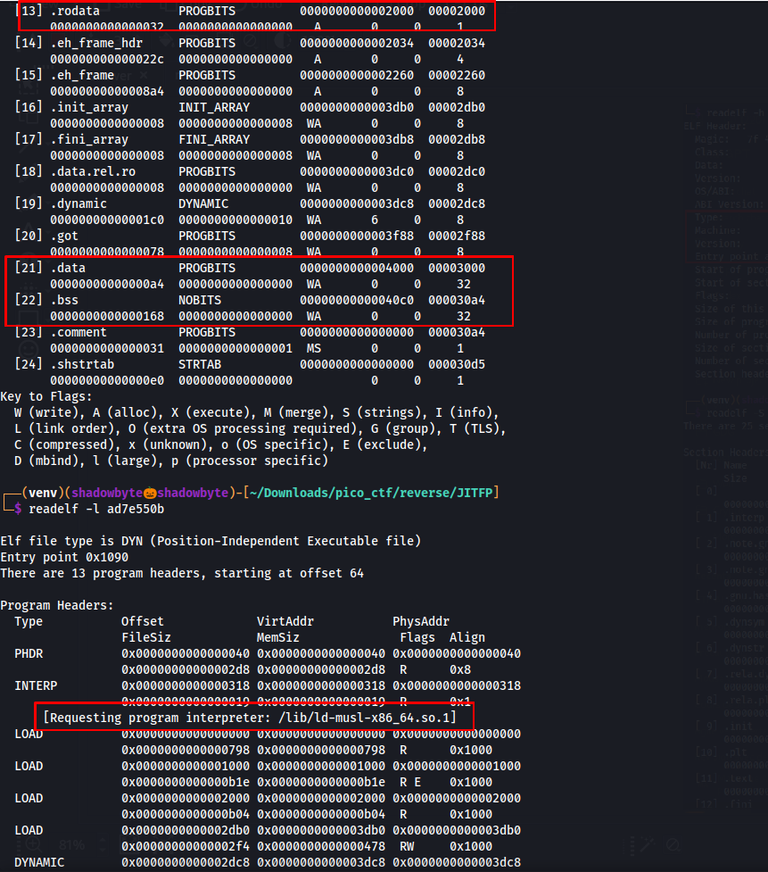

The important sections are:

```text
.text
.rodata
.data
.bss
```

I also checked program headers:

```bash
readelf -l ad7e550b
```

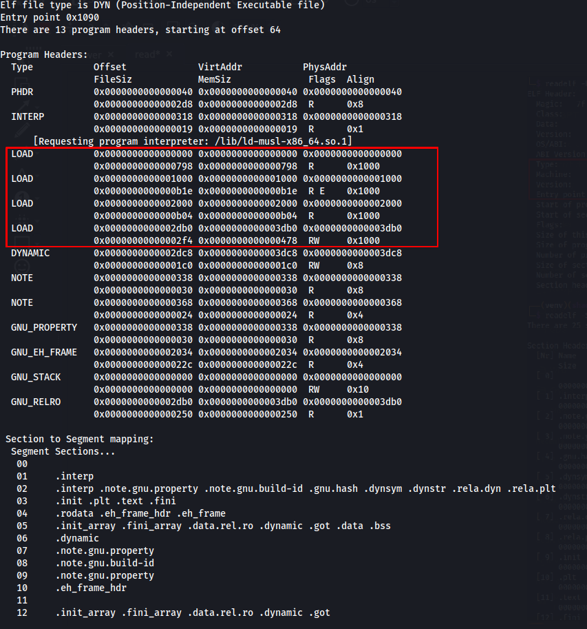

The interpreter is:

```text
/lib/ld-musl-x86_64.so.1
```

This explains why the binary may not run correctly on a local machine without the same musl loader.

---

## Imported Functions and `.rodata`

I checked the imported symbols:

```bash
readelf -s ad7e550b | grep -iE "sleep|printf|puts|strcmp|memcmp|strncmp|mprotect|mmap|malloc|free|rand|time|strlen"
```

Only a few relevant functions appeared:

```text
printf
puts
sleep
```

There was no:

```text
strcmp
strncmp
memcmp
strlen
```

This means the flag is not checked using a standard string comparison.

I dumped `.rodata`:

```bash
objdump -s -j .rodata ad7e550b
```

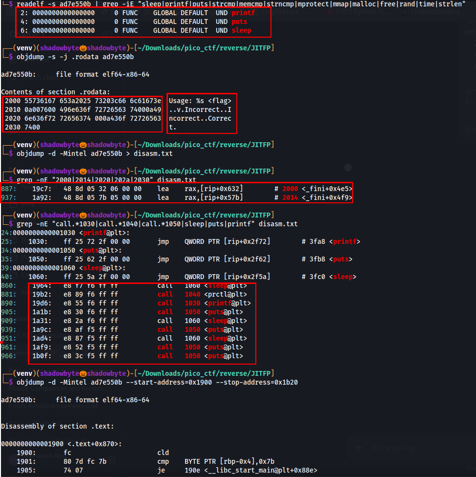

The `.rodata` section contains:

```text
Usage: %s <flag>
Incorrect
Incorrect
Correct
```

Then I generated a full disassembly:

```bash
objdump -d -Mintel ad7e550b > disasm.txt
```

I searched for references to those strings and important calls:

```bash
grep -nE "2000|2014|2020|202a|2030" disasm.txt
grep -nE "call.*1030|call.*1040|call.*1050|sleep|puts|printf" disasm.txt
```

The binary calls `sleep` several times, which matches the timing hint.

---

## Main Checking Logic

I disassembled the main checking region:

```bash
objdump -d -Mintel ad7e550b --start-address=0x1900 --stop-address=0x1b20
```

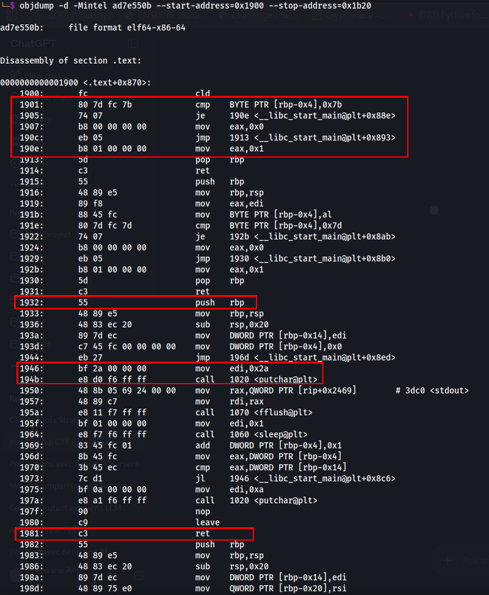

At the beginning, I found tiny checker functions. For example:

```asm
cmp BYTE PTR [rbp-0x4],0x7b
```

and:

```asm
cmp BYTE PTR [rbp-0x4],0x7d
```

These compare one input byte with a hardcoded ASCII value.

For example:

```text
0x7b = {
0x7d = }
```

There is also a helper function that prints `*`, flushes stdout, and calls `sleep(1)`. This explains the slow output.

---

## Function Pointer Based Validation

The most important part is the main checking loop.

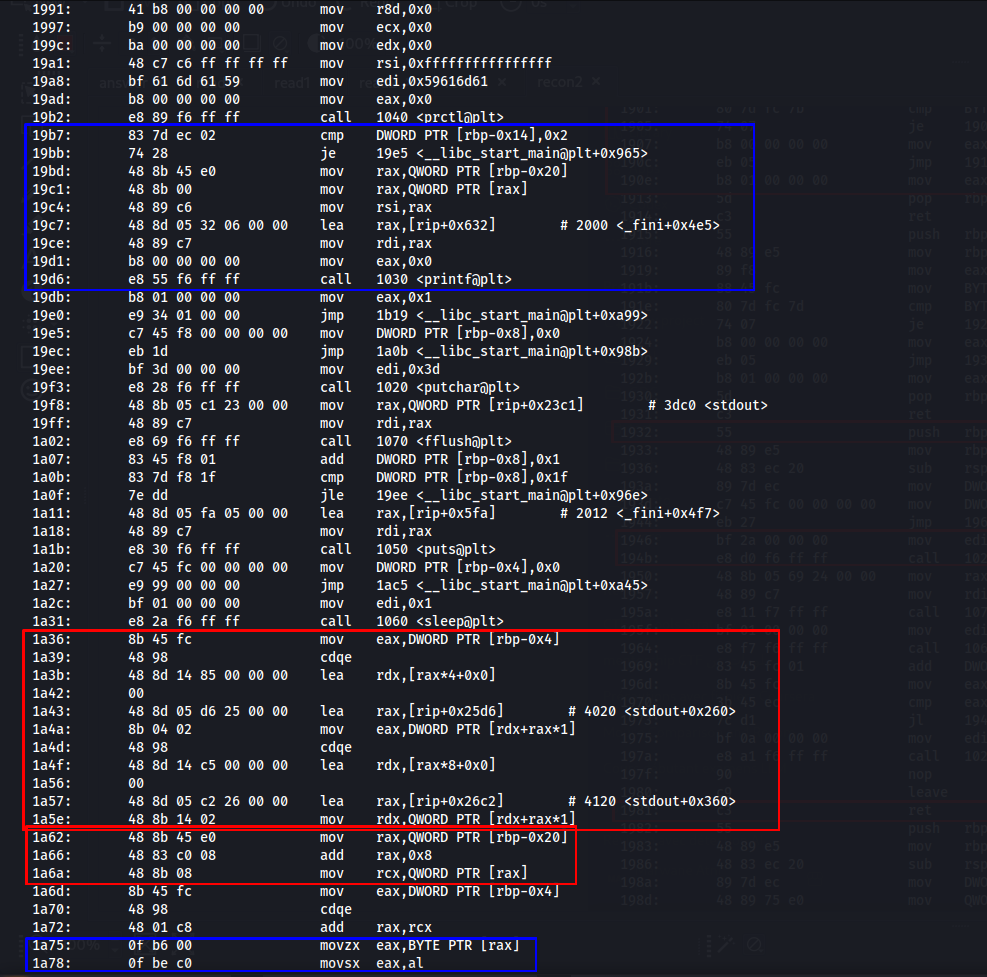

The program reads from two tables:

```asm
1a43: lea    rax,[rip+0x25d6]        # 4020
1a4a: mov    eax,DWORD PTR [rdx+rax*1]

1a57: lea    rax,[rip+0x26c2]        # 4120
1a5e: mov    rdx,QWORD PTR [rdx+rax*1]

1a75: movzx  eax,BYTE PTR [rax]
1a7b: mov    edi,eax
1a7d: call   rdx
```

This means:

1. Read an index from table `0x4020`.
2. Use that index to select a function pointer from table `0x4120`.
3. Load the current input character from `argv[1][i]`.
4. Call the selected checker function using `call rdx`.

Simplified pseudo-code:

```c
for (int i = 0; i <= 0x20; i++) {
    sleep(1);

    idx = table_4020[i];
    checker = table_4120[idx];

    if (!checker(argv[1][i])) {
        print_remaining_stars();
        puts("Incorrect");
        return 1;
    }

    putchar('*');
}
```

The loop checks from `0` to `0x20`, so it validates:

```text
33 characters
```

After the loop, it checks that `argv[1][33]` is the null terminator, meaning the flag length must be exactly 33 characters.

---

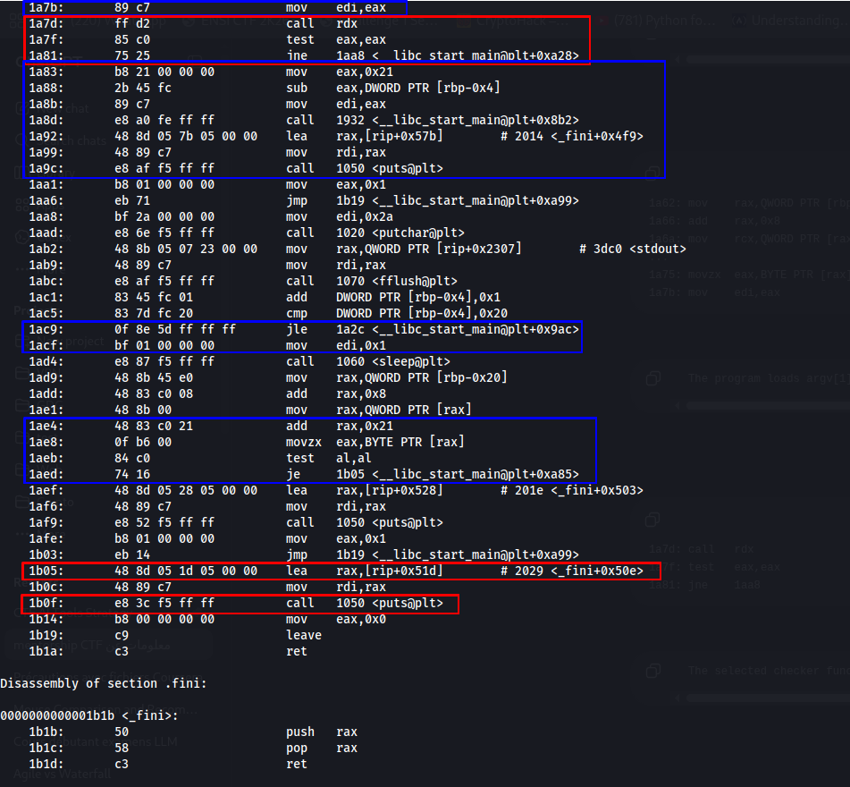

## Extracting the Permutation Table

The table at `0x4020` is stored in `.data`.

```bash
objdump -s -j .data ad7e550b
```

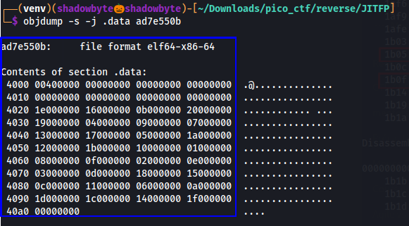

The values are 4-byte little-endian integers.

Decoded:

```python
perm = [
    30, 22, 11, 32, 25, 4, 9, 7,
    19, 23, 5, 26, 18, 27, 16, 1,
    8, 15, 2, 14, 3, 13, 24, 21,
    12, 17, 6, 10, 29, 28, 20, 31, 0
]
```

This table reorders the runtime function pointer table into a candidate flag string.

---

## Extracting Checker Characters

To list all character checks, I searched for byte comparisons:

```bash
grep -n "cmp    BYTE PTR \[rbp-0x4\]" disasm.txt
```

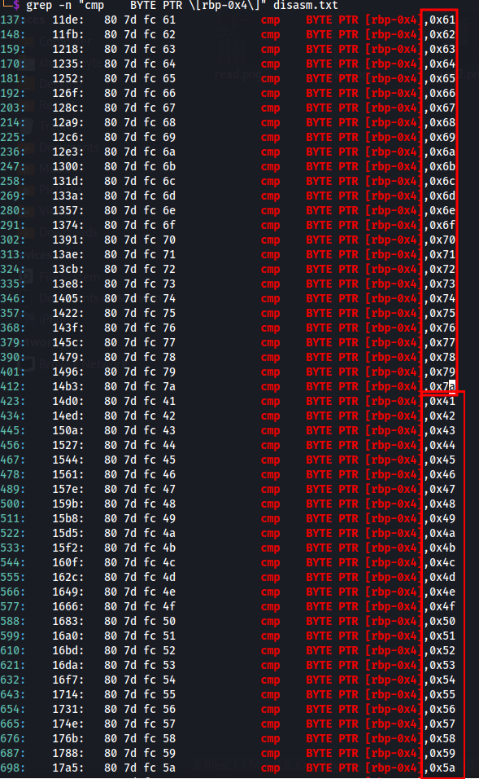

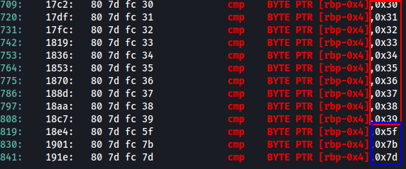

The checker functions compare input bytes against these hexadecimal ASCII values:

```text
61 62 63 64 65 66 67 68 69 6a 6b 6c 6d 6e 6f 70 71 72 73 74 75 76 77 78 79 7a
41 42 43 44 45 46 47 48 49 4a 4b 4c 4d 4e 4f 50 51 52 53 54 55 56 57 58 59 5a
30 31 32 33 34 35 36 37 38 39
5f
7b
7d
```

I confirmed the conversion using CyberChef:

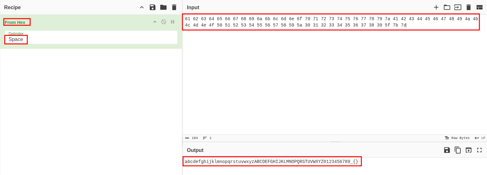

The resulting charset is:

```text
abcdefghijklmnopqrstuvwxyzABCDEFGHIJKLMNOPQRSTUVWXYZ0123456789_{}
```

So the binary has one small checker function for each possible flag character.

The checker functions follow this pattern:

```python
checker_start = 0x11d5
step = 0x1d
charset = "abcdefghijklmnopqrstuvwxyzABCDEFGHIJKLMNOPQRSTUVWXYZ0123456789_{}"
```

That means we can convert a checker function offset back into a character.

For example:

```python
idx = (offset - checker_start) // step
char = charset[idx]
```

---

## Why Runtime Analysis Is Required

I checked the relocation tables:

```bash
readelf -r ad7e550b
objdump -R ad7e550b
```

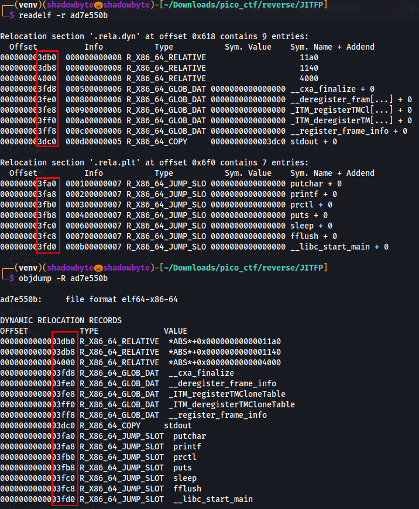

```bash
grep -nE "4020|4120|40c0|40e0" disasm.txt
```

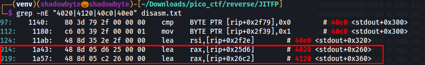

The table at `0x4020` is visible in `.data`, but the table at `0x4120` is not statically initialized through normal relocations.

The main loop references:

```text
0x4020 -> permutation table
0x4120 -> runtime function pointer table
```

So `0x4120` must be inspected at runtime.

---

## Dumping the Runtime Function Pointer Table

The remote filesystem was read-only, so I executed Python through SSH stdin and saved the output locally.

```bash
ssh -p <PORT> ctf-player@dolphin-cove.picoctf.net 'python -' > debug_runtime.txt << 'EOF'
import subprocess, time, struct

BIN = "/home/ctf-player/ad7e550b"
delay = 1.0

p = subprocess.Popen(
    [BIN, "A" * 33],
    stdout=subprocess.DEVNULL,
    stderr=subprocess.DEVNULL
)

try:
    time.sleep(delay)

    pid = p.pid
    print("PID", pid)

    maps = open(f"/proc/{pid}/maps").read().splitlines()
    base = None

    print("MAPS")
    for line in maps:
        if "ad7e550b" in line:
            print(line)
            parts = line.split()
            if parts[2] == "00000000":
                base = int(parts[0].split("-")[0], 16)

    print("BASE", hex(base))

    with open(f"/proc/{pid}/mem", "rb", 0) as mem:
        mem.seek(base + 0x4120)
        raw = mem.read(33 * 8)

    print("RAW_4120_HEX")
    print(raw.hex())

    ptrs = struct.unpack("<33Q", raw)

    print("PTR_OFFSETS")
    for i, ptr in enumerate(ptrs):
        print(i, hex(ptr), "offset", hex(ptr - base))

finally:
    p.kill()
EOF
```

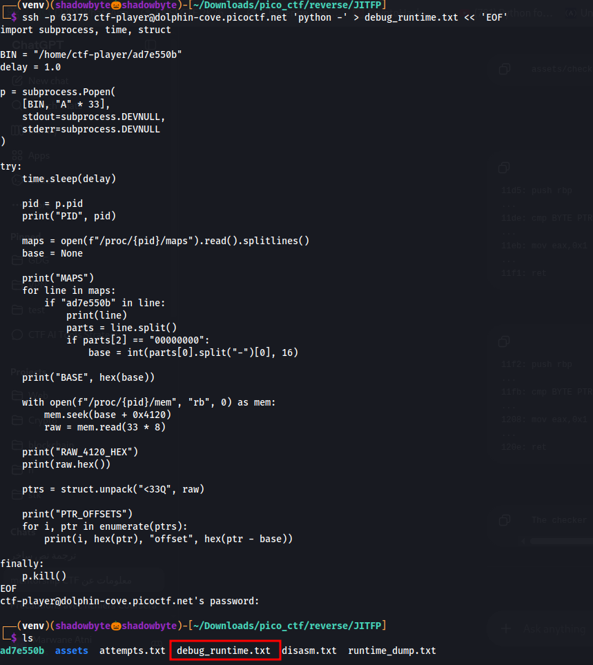

The script:

1. Starts the binary with a dummy 33-character argument.
2. Reads `/proc/<pid>/maps` to recover the PIE base.
3. Reads `/proc/<pid>/mem` at `base + 0x4120`.
4. Extracts 33 function pointers.
5. Subtracts the PIE base to recover static offsets.

The output:

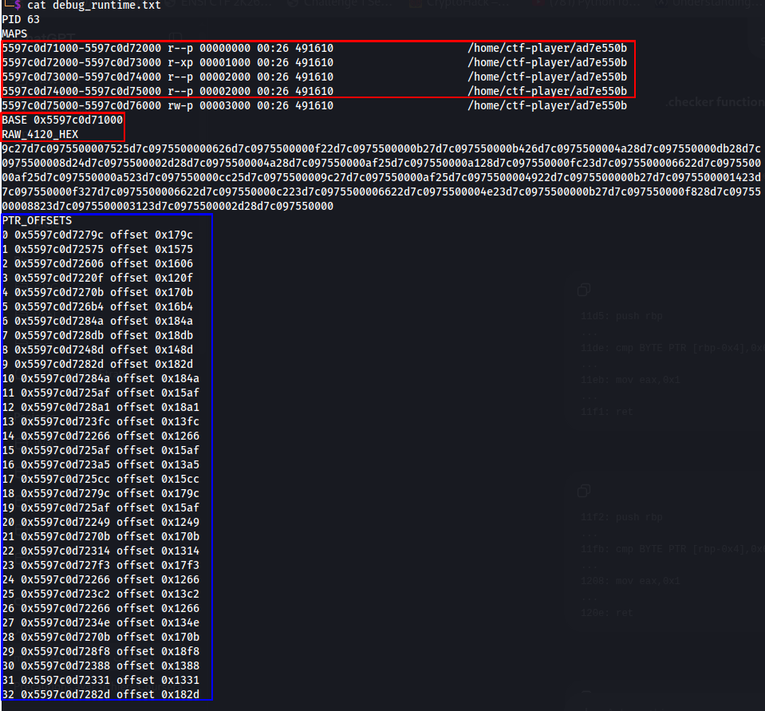

Example:

```text
BASE 0x5597c0d71000

PTR_OFFSETS
0  0x5597c0d7279c offset 0x179c
1  0x5597c0d72575 offset 0x1575
2  0x5597c0d72606 offset 0x1606
...
32 0x5597c0d7282d offset 0x182d
```

Because the binary is PIE:

```text
static_offset = runtime_pointer - PIE_base
```

---

## Calibration

At first, reading the runtime table at one moment produced random-looking candidates. I wrote a calibration script to repeatedly dump the runtime table over time.

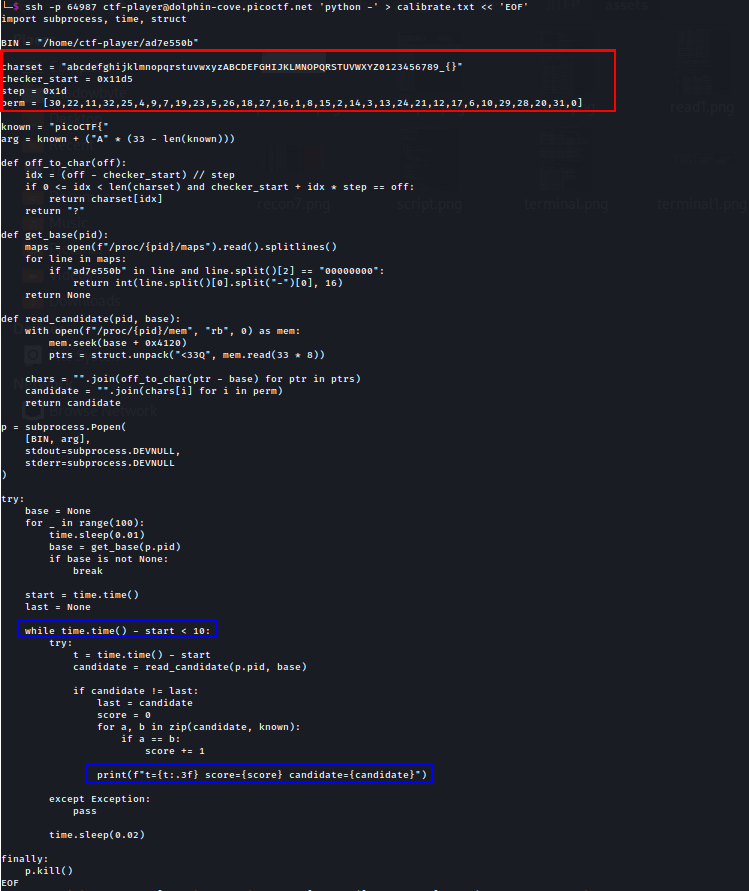

The important part:

```python
while time.time() - start < 10:
    candidate = read_candidate(p.pid, base)
    print(f"t={t:.3f} score={score} candidate={candidate}")
```

The output:

```bash
cat calibrate.txt
```

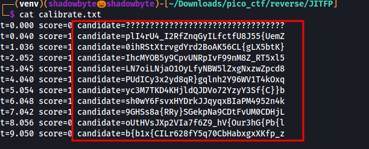

Example candidates:

```text
t=0.000 score=1 candidate=plI4rU4_I2RfZnqGyILfctfU8J55{UemZ
t=1.036 score=1 candidate=0ihRStXtrvgdYrd2BoAK56CL{gLX5btK}
t=2.052 score=1 candidate=IhcMYOB5y9CpvUNRpIvF99nM8Z_RT5xl5
t=3.045 score=1 candidate=LN7oiLNjaO1OyLfyNBW5lZxgNxzwZpcd8
```

At first, these candidates look random. However, the timing hint becomes clear here.

The correct character appears on the diagonal:

```text
candidate at t=0 -> candidate[0] = p
candidate at t=1 -> candidate[1] = i
candidate at t=2 -> candidate[2] = c
candidate at t=3 -> candidate[3] = o
...
```

So every runtime snapshot leaks one correct flag character at the matching index.

---

## Final Exploit: Diagonal Extraction

The final exploit repeatedly reads the runtime table at `base + 0x4120`, builds a candidate string, then appends `candidate[pos]` to the recovered flag.

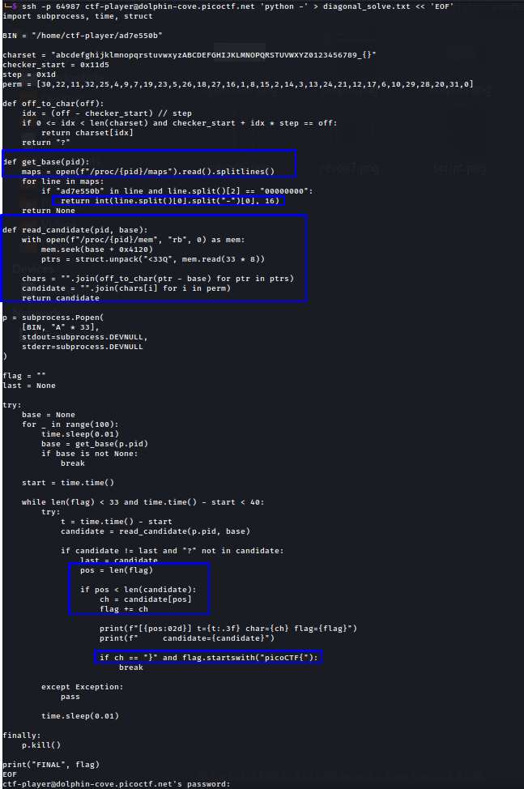

The key idea is:

```python
pos = len(flag)
ch = candidate[pos]
flag += ch
```

Complete exploit:

```python
import subprocess, time, struct

BIN = "/home/ctf-player/ad7e550b"

charset = "abcdefghijklmnopqrstuvwxyzABCDEFGHIJKLMNOPQRSTUVWXYZ0123456789_{}"
checker_start = 0x11d5
step = 0x1d
perm = [30,22,11,32,25,4,9,7,19,23,5,26,18,27,16,1,8,15,2,14,3,13,24,21,12,17,6,10,29,28,20,31,0]

def off_to_char(off):
    idx = (off - checker_start) // step
    if 0 <= idx < len(charset) and checker_start + idx * step == off:
        return charset[idx]
    return "?"

def get_base(pid):
    maps = open(f"/proc/{pid}/maps").read().splitlines()
    for line in maps:
        if "ad7e550b" in line and line.split()[2] == "00000000":
            return int(line.split()[0].split("-")[0], 16)
    return None

def read_candidate(pid, base):
    with open(f"/proc/{pid}/mem", "rb", 0) as mem:
        mem.seek(base + 0x4120)
        ptrs = struct.unpack("<33Q", mem.read(33 * 8))

    chars = "".join(off_to_char(ptr - base) for ptr in ptrs)
    candidate = "".join(chars[i] for i in perm)
    return candidate

p = subprocess.Popen(
    [BIN, "A" * 33],
    stdout=subprocess.DEVNULL,
    stderr=subprocess.DEVNULL
)

flag = ""
last = None

try:
    base = None
    for _ in range(100):
        time.sleep(0.01)
        base = get_base(p.pid)
        if base is not None:
            break

    start = time.time()

    while len(flag) < 33 and time.time() - start < 40:
        try:
            t = time.time() - start
            candidate = read_candidate(p.pid, base)

            if candidate != last and "?" not in candidate:
                last = candidate
                pos = len(flag)

                if pos < len(candidate):
                    ch = candidate[pos]
                    flag += ch

                    print(f"[{pos:02d}] t={t:.3f} char={ch} flag={flag}")
                    print(f"     candidate={candidate}")

                    if ch == "}" and flag.startswith("picoCTF{"):
                        break

        except Exception:
            pass

        time.sleep(0.01)

finally:
    p.kill()

print("FINAL", flag)
```

I executed it remotely and saved the output locally:

```bash
ssh -p <PORT> ctf-player@dolphin-cove.picoctf.net 'python -' > diagonal_solve.txt << 'EOF'
# exploit code here
EOF
```

---

## Exploit Output

```bash
cat diagonal_solve.txt
```

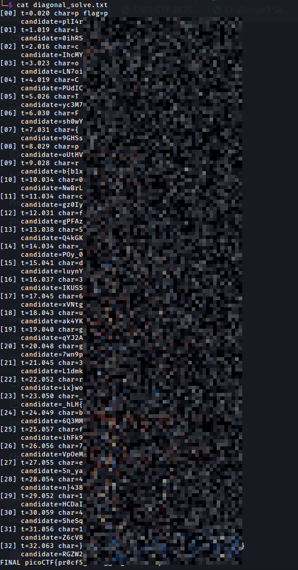

The flag was recovered character by character:

```text
[00] char=p flag=p
[01] char=i flag=pi
[02] char=c flag=pic
[03] char=o flag=pico
[04] char=C flag=picoC
[05] char=T flag=picoCT
[06] char=F flag=picoCTF
[07] char={ flag=picoCTF{
...
[32] char=} flag=picoCTF{Unkown}

FINAL picoCTF{Unknown}
```

---

## Flag

```text
picoCTF{Unknown}
```

---
PWNED 
## Key Takeaways

* The binary is stripped and PIE-enabled.
* The binary does not use `strcmp`, `strncmp`, or `memcmp`.
* Each checker function validates one possible flag character.
* The `.data` table at `0x4020` is a permutation table.
* The table at `0x4120` is a runtime function pointer table.
* The runtime table must be dumped from process memory.
* `/proc/<pid>/maps` gives the PIE base.
* `/proc/<pid>/mem` allows reading the runtime function pointer table.
* The timing hint is essential: each snapshot leaks one correct character.
* The final solution uses diagonal extraction over time.

---

## Summary

Static analysis revealed the checker functions and the permutation table, but the real function pointer table was only available at runtime.

By dumping the runtime table repeatedly and observing the timing pattern, each snapshot leaked one correct flag character on the diagonal.

The final reconstructed flag is:

```text
picoCTF{redacted}


PWNED
