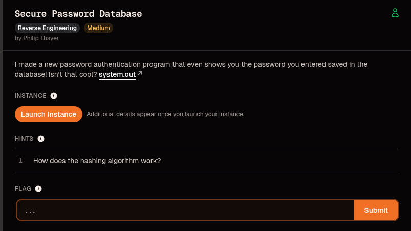
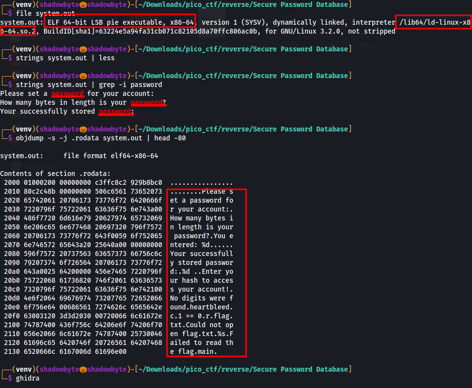
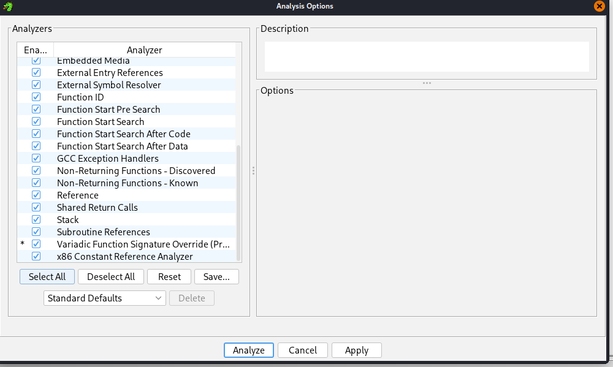
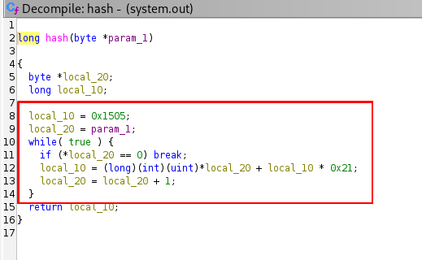
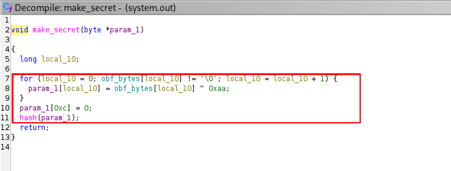
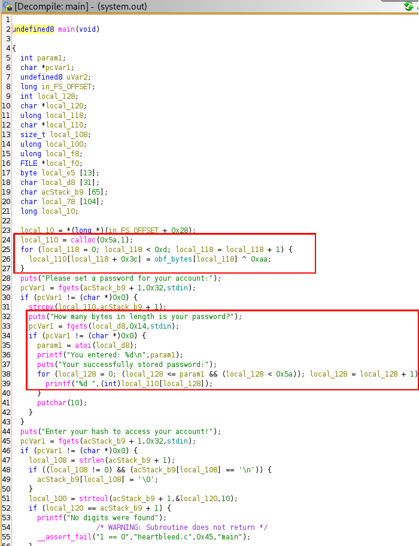
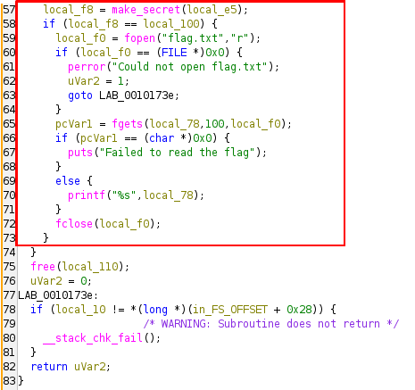
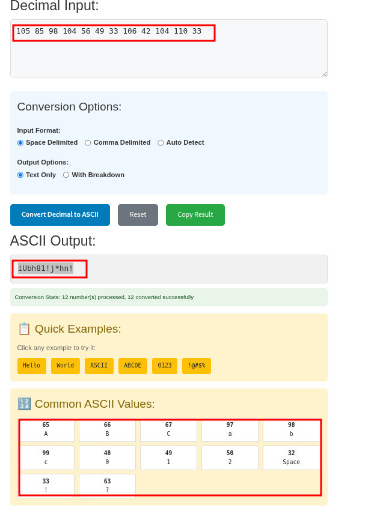
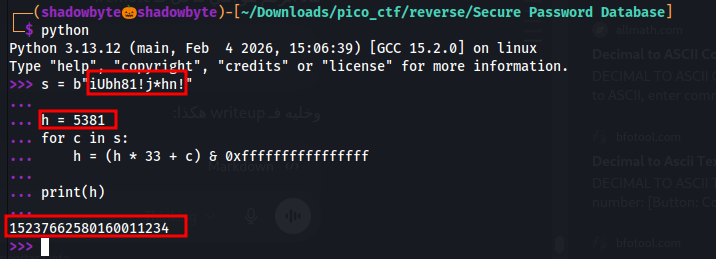
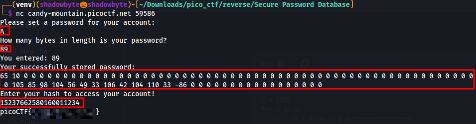

# Secure Password Database

**Category:** Reverse Engineering
**Difficulty:** Medium
**Author:** Philip Thayer

---

## Challenge Description

> I made a new password authentication program that even shows you the password you entered saved in the database! Isn't that cool?

The challenge provides a Linux executable named `system.out` and a remote service.



The hint says:

> How does the hashing algorithm work?

From the description and the hint, the objective is to reverse the binary, understand the authentication logic, recover the correct hash, and use it to access the flag.

---

## Initial Reconnaissance

I started by identifying the binary:

```bash
file system.out
```

The output shows that the file is a 64-bit ELF executable:

```text
system.out: ELF 64-bit LSB pie executable, x86-64, dynamically linked, not stripped
```

The fact that the binary is **not stripped** is important because function names are preserved, making reverse engineering easier.

Then I searched for password-related strings:

```bash
strings system.out | grep -i password
```

This revealed interesting prompts:

```text
Please set a password for your account:
How many bytes in length is your password?
Your successfully stored password:
```

I also inspected the `.rodata` section to confirm the static strings and data stored inside the binary:

```bash
objdump -s -j .rodata system.out | head -80
```



At this point, the binary clearly contains password-handling logic and a custom authentication flow.

---

## Loading the Binary in Ghidra

I opened the binary in Ghidra and ran the default analysis.



Because the binary is not stripped, Ghidra directly shows meaningful function names such as:

```text
main
hash
make_secret
```

These three functions contain the core logic of the challenge.

---

## Analyzing the Hash Function

The `hash` function is the first important part of the binary.



The decompiled function is:

```c
long hash(byte *param_1)
{
  byte *local_20;
  long local_10;
  
  local_10 = 0x1505;
  local_20 = param_1;

  while (true) {
    if (*local_20 == 0) break;
    local_10 = (long)(int)(uint)*local_20 + local_10 * 0x21;
    local_20 = local_20 + 1;
  }

  return local_10;
}
```

The constants are very recognizable:

```text
0x1505 = 5381
0x21   = 33
```

This is the classic **DJB2 hash algorithm**:

```text
hash = 5381
hash = hash * 33 + character
```

However, the implementation uses a C `long`, meaning the value is limited by the machine integer size. On this 64-bit binary, the hash calculation wraps around with **64-bit overflow**.

This detail matters later because Python integers do not overflow by default.

---

## Analyzing the Secret Generation

Next, I looked at the `make_secret` function.



The function decodes a hidden secret password:

```c
for (local_10 = 0; obf_bytes[local_10] != '\0'; local_10 = local_10 + 1) {
    param_1[local_10] = obf_bytes[local_10] ^ 0xaa;
}

param_1[0xc] = 0;
hash(param_1);
```

The secret password is stored in the binary as obfuscated bytes.

Each byte is decoded using XOR:

```text
secret_byte = obfuscated_byte ^ 0xaa
```

So the binary does not store the secret password directly. Instead, it stores `obf_bytes`, and the program reconstructs the real secret at runtime.

---

## Understanding the Main Function

The main function reveals the main vulnerability.



The program first allocates a buffer:

```c
local_110 = calloc(0x5a,1);
```

Then it stores the decoded secret at offset `0x3c`:

```c
for (local_118 = 0; local_118 < 0xd; local_118 = local_118 + 1) {
    local_110[local_118 + 0x3c] = obf_bytes[local_118] ^ 0xaa;
}
```

The important offset is:

```text
0x3c = 60
```

So the decoded secret begins at index `60` inside the buffer.

After that, the program asks the user to set a password:

```text
Please set a password for your account:
```

Then it asks:

```text
How many bytes in length is your password?
```

The bug appears here:

```c
for (local_128 = 0; (local_128 <= param1 && (local_128 < 0x5a)); local_128 = local_128 + 1) {
    printf("%d ", (int)local_110[local_128]);
}
```

The program prints bytes from the buffer based on a user-controlled length.

This means if we enter a very short password but claim that it is much longer, the program prints memory beyond our password.

Since the decoded secret is stored later in the same buffer at offset `60`, we can leak it.

This is a **memory disclosure vulnerability**.

---

## Hash Check and Flag Access

The second important part of `main` is the authentication check.



The program asks for a hash:

```text
Enter your hash to access your account!
```

Then it compares the user-provided number with the hash of the decoded secret:

```c
local_f8 = make_secret(local_e5);

if (local_f8 == local_100) {
    local_f0 = fopen("flag.txt","r");
    ...
    printf("%s", local_78);
}
```

So the program does not require us to enter the secret password directly.

Instead, it requires the correct hash of the secret password.

Therefore, the exploitation plan is:

1. Leak the hidden secret password from memory.
2. Compute its DJB2 hash with 64-bit overflow.
3. Submit that hash.
4. Receive the flag.

---

## Leaking the Secret Password

I connected to the remote service:

```bash
nc candy-mountain.picoctf.net 59586
```

When prompted for a password, I entered a single character:

```text
A
```

Then when the program asked for the password length, I entered:

```text
89
```

Why `89`?

Because the decoded secret starts at offset `60`, and the program prints bytes until the length we provide. By asking for 89 bytes, we force the program to print far enough to leak the hidden secret.

The leaked output contained:

```text
65 10 0 0 0 0 0 0 0 0 0 0 0 0 0 0 0 0 0 0 0 0 0 0 0 0 0 0 0 0 0 0 0 0 0 0 0 0 0 0 0 0 0 0 0 0 0 0 0 0 0 0 0 0 0 0 0 0 0 0 105 85 98 104 56 49 33 106 42 104 110 33 -86 0 0 0 0 0 0 0 0 0 0 0 0 0 0 0 0 0
```

The interesting part starts at offset 60:

```text
105 85 98 104 56 49 33 106 42 104 110 33
```

---

## Converting Decimal Bytes to ASCII

I converted the leaked decimal bytes to ASCII.



Input:

```text
105 85 98 104 56 49 33 106 42 104 110 33
```

Output:

```text
iUbh81!j*hn!
```

So the leaked secret password is:

```text
iUbh81!j*hn!
```

---

## Computing the Correct Hash

At first, I computed the DJB2 hash using normal Python integers:

```python
s = b"iUbh81!j*hn!"

h = 5381
for c in s:
    h = h * 33 + c

print(h)
```

This gives:

```text
8980355282403002096610
```

However, this value does not work against the remote service.

The reason is that Python integers are arbitrary precision, while the binary uses a 64-bit C `long`.

So the correct hash must simulate 64-bit overflow:

```python
s = b"iUbh81!j*hn!"

h = 5381
for c in s:
    h = (h * 33 + c) & 0xffffffffffffffff

print(h)
```



The correct hash is:

```text
15237662580160011234
```

---

## Exploitation

The final exploitation steps are:

```text
Please set a password for your account:
A

How many bytes in length is your password?
89

Enter your hash to access your account!
15237662580160011234
```

The service then prints the flag.



---

## Flag

```text
picoCTF{....redacted....}
```

---

## Why the Exploit Works

The exploit works because of two main weaknesses.

### 1. User-Controlled Length Leak

The program asks the user how long the password is and then prints that many bytes from memory.

It does not verify that the requested length matches the actual password length.

Because the secret password is stored later in the same buffer, requesting a large length leaks it.

### 2. Weak Hashing Algorithm

The hash function is DJB2, which is not suitable for password authentication.

Once the secret password is leaked, computing the required hash is trivial.

The only tricky part is handling the 64-bit overflow correctly.

---

## Lessons Learned

* Always validate user-controlled lengths.
* Never print memory based on untrusted size values.
* XOR obfuscation does not protect secrets.
* DJB2 is not a secure password hashing algorithm.
* Reverse engineering requires understanding both code logic and memory layout.
* Python integer behavior is different from C integer overflow.
* Ghidra is very useful for quickly identifying custom algorithms and program flow.

---

## Final Thoughts

This was a clean reverse engineering challenge with a practical memory disclosure bug.

The binary hides a password using XOR obfuscation and verifies authentication using a DJB2 hash.

By reversing the binary in Ghidra, I found that the decoded secret is stored at offset `0x3c` inside a buffer. The program then leaks bytes from this buffer based on a user-controlled length.

After leaking the secret, I computed its DJB2 hash while simulating 64-bit overflow and used it to authenticate successfully.

The bug is simple but realistic: trusting user-provided lengths can expose sensitive memory.
