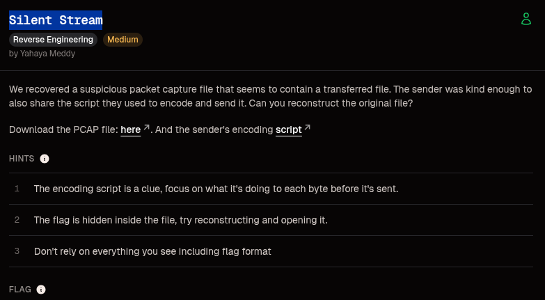
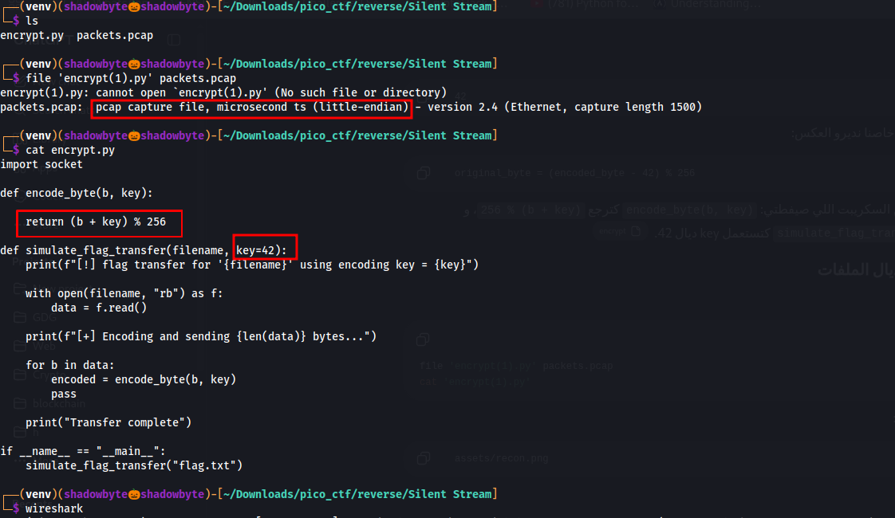
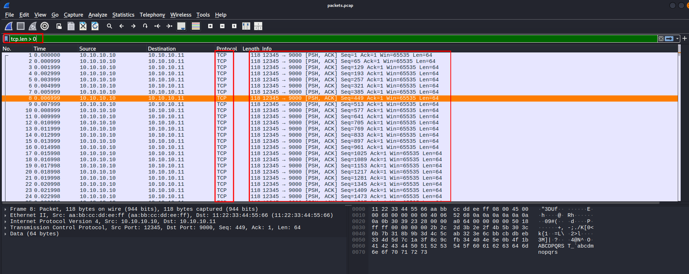
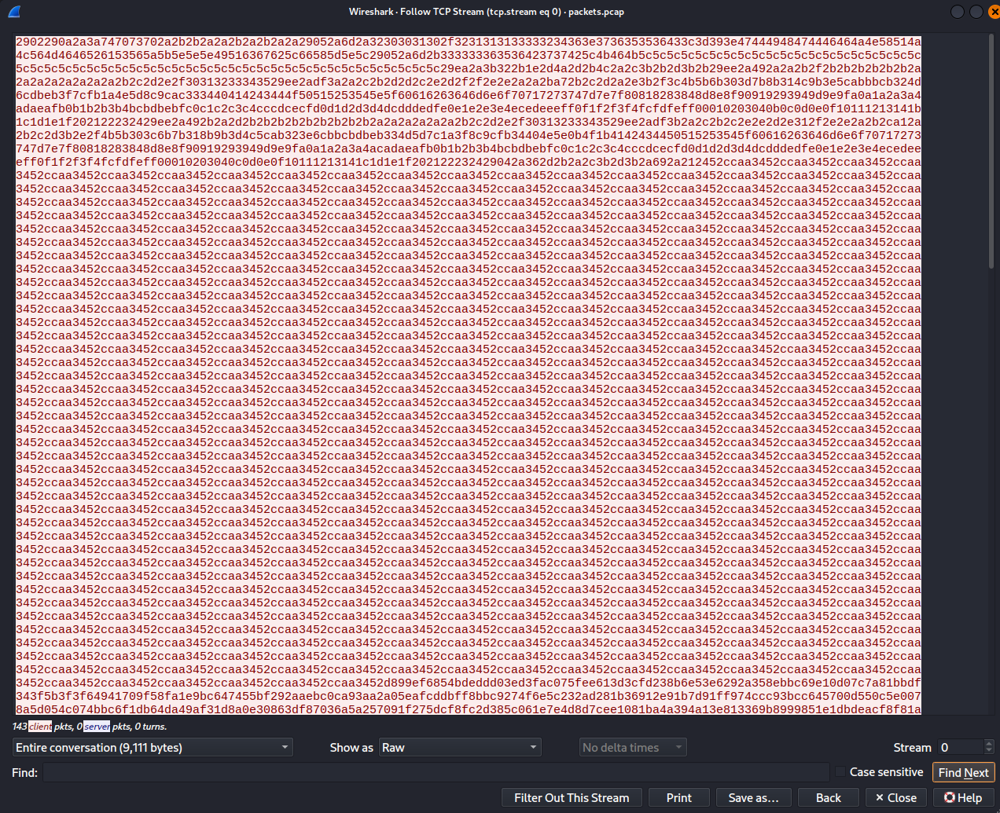
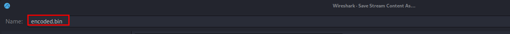
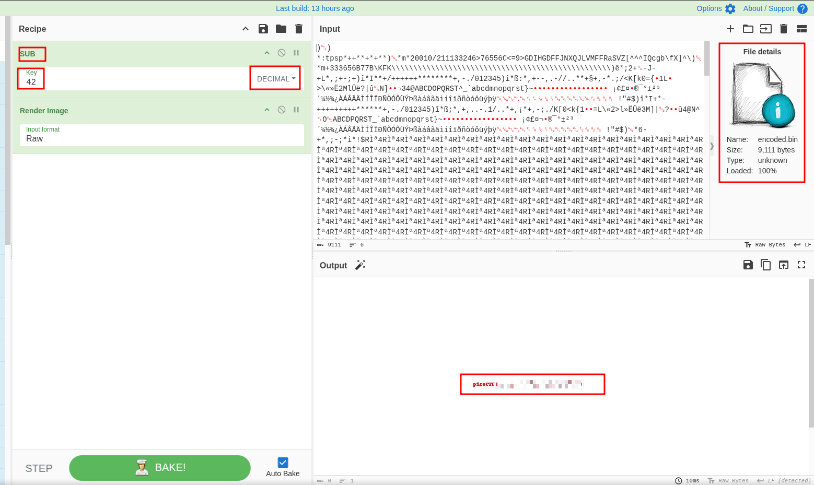

# Silent Stream

**Category:** Reverse Engineering
**Difficulty:** Medium
**Author:** Yahaya Meddy

---

## Challenge Description

We are given a suspicious packet capture file and the sender's encoding script.

The goal is to reconstruct the original transferred file from the PCAP, then open it to recover the hidden flag.

The challenge hints tell us that the encoding script is important, and that we should focus on what happens to each byte before it is sent.

---

## Files Provided

The challenge provides two files:

```text
packets.pcap
encrypt.py
```

The PCAP contains the transferred data, while the Python script explains how the data was encoded before being sent.

---

## Initial Recon

I started by checking the files:

```bash
file encrypt.py packets.pcap
cat encrypt.py
```

The PCAP is a normal packet capture file:

```text
packets.pcap: pcap capture file, microsecond ts (little-endian)
```

The encoding script contains the important logic:

```python
def encode_byte(b, key):
    return (b + key) % 256

def simulate_flag_transfer(filename, key=42):
    ...
    encoded = encode_byte(b, key)
```



The script shows that each byte is encoded using:

```text
encoded_byte = (original_byte + 42) % 256
```

So to recover the original file, we need to reverse the operation:

```text
original_byte = (encoded_byte - 42) % 256
```

---

## Inspecting the PCAP in Wireshark

I opened the packet capture in Wireshark:

```bash
wireshark packets.pcap
```

Then I used the following display filter:

```text
tcp.len > 0
```

This filter shows only TCP packets that contain payload data.



The filtered packets show data being sent from:

```text
10.10.10.10 -> 10.10.10.11
```

The packets contain TCP payloads, which means the transferred file data is inside the TCP stream.

---

## Following the TCP Stream

To reconstruct the transferred data, I selected one of the TCP packets and used:

```text
Right click → Follow → TCP Stream
```

In the TCP stream window, I changed the display format to:

```text
Raw
```

This shows the raw stream data.



The stream contains the encoded bytes that were sent over the network.

---

## Saving the Encoded Stream

From the TCP stream window, I saved the raw stream data as:

```text
encoded.bin
```



At this point, `encoded.bin` contains the encoded transferred file.

---

## Understanding the Encoding

The sender script encodes each byte like this:

```python
return (b + key) % 256
```

The default key is:

```text
42
```

So the encoding formula is:

```text
encoded_byte = (original_byte + 42) % 256
```

To decode the file, I need to apply the inverse operation:

```text
original_byte = (encoded_byte - 42) % 256
```

This means every byte in `encoded.bin` must be decreased by `42`.

---

## Decoding with CyberChef

Instead of writing a script, I used CyberChef to decode the file.

I loaded `encoded.bin` into CyberChef and used the following recipe:

```text
SUB
Key: 42
Format: DECIMAL
```

Then I added:

```text
Render Image
```

This subtracts `42` from every byte and renders the recovered file as an image.



After applying the recipe, the output became a valid image and the hidden flag was visible inside it.

---

## Why This Works

The file was not encrypted with a complex algorithm.
Each byte was only shifted by adding `42`.

Because byte values are modulo 256, the inverse operation is simply subtracting `42` modulo 256.

So:

```text
encoded = original + 42
```

becomes:

```text
original = encoded - 42
```

After applying this operation to every byte in the TCP stream, the original image file is reconstructed.

---

## Flag

```text
picoCTF{REPLACE_WITH_REAL_FLAG}
```

---

## Tools Used

* Wireshark
* CyberChef
* `file`
* `cat`

---

## Key Takeaways

* The encoding script is the main clue.
* The PCAP contains the transferred file data inside TCP payloads.
* `tcp.len > 0` helps filter packets that actually contain data.
* Following the TCP stream allows us to extract the transferred bytes.
* The sender encoded every byte using `(byte + 42) % 256`.
* The inverse operation is `(byte - 42) % 256`.
* CyberChef can decode the binary stream and render the recovered image.

---

## Conclusion

This challenge combines packet analysis and reverse engineering.

The PCAP alone gives us the transferred data, but the encoding script explains how the bytes were modified before transmission.

By extracting the raw TCP stream from Wireshark and subtracting `42` from every byte using CyberChef, I reconstructed the original image file.

The flag was hidden inside the recovered image.

Challenge pwned.
